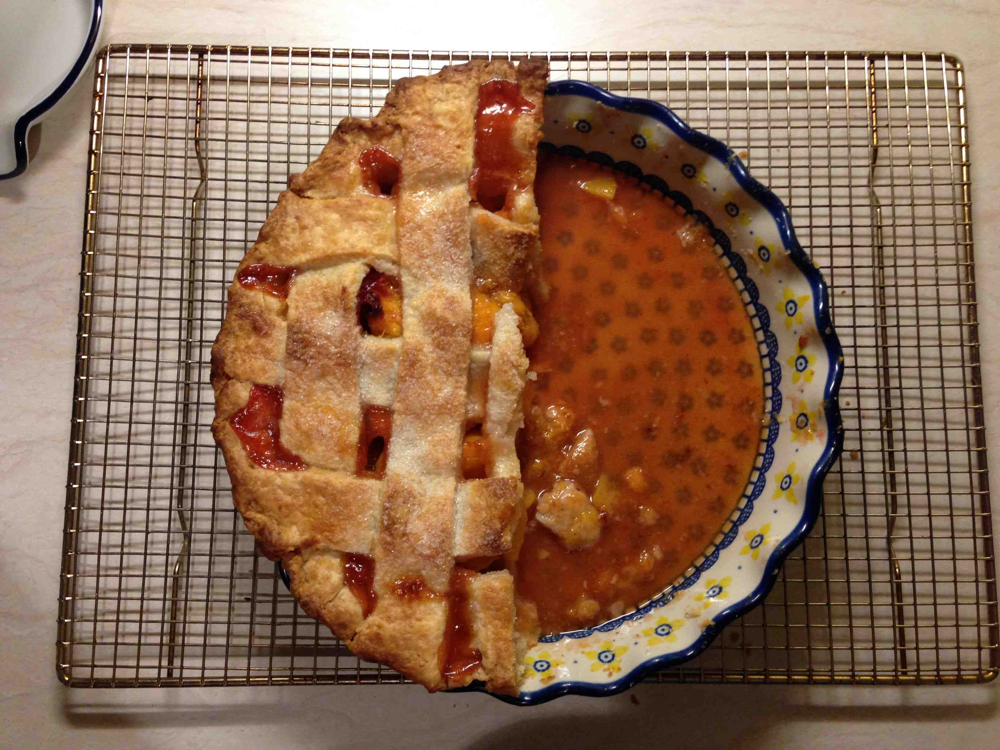
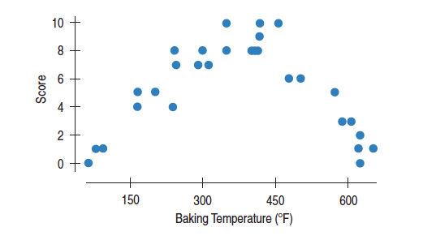

```{r setup2, include=FALSE}
library(broom)
library(dplyr)
library(ggplot2)
library(stringr)
library(rvest)
library(mosaicData)
library(ggmosaic)
library(NHANES)
library(mosaic)
knitr::opts_chunk$set(echo = TRUE)
```

# Visualizing Data

The first step in any data analysis is to visually explore your data. 

There is a saying that "a picture is worth a 1000 words." In making visualizations, our goal is to quickly and easily get a better understanding of the variability and relationships that exist in the data. 

Here we will cover the standard appropriate graphics for univariate variation and bivariate relationships. We will also cover techniques for multivariate relationships (3 or more variables). The choice of the graphic depends on the type(s) of variable(s): quantitative or categorical. So the first step is to think about the variables you are interested in visualizing and determining whether they are quantitative or categorical.

For each type of variable, we will use a real data set to illustrate the visualizations.

## Good Visualization Principles

Before we discuss the standard graphics, let's lay out the basic design principles for good data visualizations.

1. **Show the data** This may be self-explanatory, but make sure that the data is the focus and driver of the visualization. 

2. **Avoid Distoring the Data** Avoid 3D charts as the added dimension distorts the comparison. The area of a graph should equal the magnitude of the data it is representing.

3. **Simplify** In 1983, Edward Tufte said that "A large share of ink on a graphic should present data-information, the ink changing as the data change. Data-ink is the non-erasable core of a graphic, the non-redundant ink arranged in response to variation in the numbers represented." Remove any unnecessary ink that doesn't present the data.

4. **Facilitate Comparisons** In order to explain variation, we want the graphics to facilitate comparisons between groups. The design show make it easier to compare between groups rather than harder. 

5. **Use Contrast** Humans have developed to seek out visual contrast. When choosing colors and annotation, strive to more contrast in luminance (white to dark) to make it easier for other to perceive. 

6. **Use Color Appropriately** Keep in mind a small proportion of the population is color-blind. Also, every culture has different color associations. Neuroscience research has shown that humans are more sensitive to red and yellow, so those are good colors to use for highlighting. 

7. **Annotate Appropriately** Informative text is crucial for providing data context. Make sure to use informative axis labels and titles. It may be worth adding text to explain extreme outliers.


## One Categorical Variable

First, we consider survey data of the electoral registrar in Whickham in the UK (Source: Appleton et al 1996). 

- Survey was conducted in 1972-1974 to study heart disease and thyroid disease (baseline characteristics: age and smoking status)
- A follow-up on those in the survey was conducted twenty years later (followup characteristics: mortality after 20 years)

Let's first consider the age distribution. Age, depending on how it is measured, could act as a quantitative variable or categorical variable. In this case, age is a quantitative variable because it is recorded to the nearest year. But, for illustrative purposes, I'm going to create a categorical variable by separating age into intervals.

```{block, type="reflect"}
What do I lose when I convert a quantitative variable to a categorical variable? What do I gain?
```

### Bar Plot

- The **height** of the bars is the only part that encodes the data (width is meaningless). 
- The height can either represent the **frequency** (count of cases) or the **relative frequency** (proportion of cases).


```{r}
data(Whickham) #load data set from package

Whickham <- Whickham %>%
  mutate(ageCat = cut(age, 4)) #Create a new categorical variable with 4 categories based on age (equal length of age intervals)

Whickham %>%
  count(ageCat) %>%
  mutate(relfreq = n / sum(n)) 

Whickham %>%
  ggplot(aes(x = ageCat)) + 
  geom_bar(fill="steelblue") + 
  xlab('Age Categories in Years') + 
  ylab('Counts') + 
  theme_minimal()
```

What do you notice? What do you wonder?

### Pie Chart

Pie charts are only useful if you have 2 to 3 possible categories and you want to show relative group sizes. 

This is the best use for a pie chart:

```{r, out.width = '.25\\textwidth', echo=FALSE}

```

We are intentionally not showing you how to make a pie chart because a bar chart is a better choice. Here is a good summary of why many people strongly dislike pie charts: http://www.businessinsider.com/pie-charts-are-the-worst-2013-6. Keep in mind Visualization Principle #4: Facilitate Comparisons.


## Two Categorical Variables

Now, let's consider two other variables in the same data set. What is the relationship between the 20-year mortality outcome and smoking status at the beginning of the study?

### Side by Side Bar Plot

- The **height** of the bars shows the frequency of the categories within subsets.

```{r}
Whickham %>%
  count(outcome, smoker) %>%
  mutate(relfreq = n / sum(n)) #Overall Relative Frequency


Whickham %>%
  ggplot(aes(x = smoker, fill = outcome)) + 
  geom_bar(position = position_dodge()) + 
  xlab('Smoker Status') + 
  ylab('Counts') + 
  scale_fill_manual('20 Year Mortality', values = c("steelblue", "lightblue")) + 
  theme_minimal()
```

What do you notice? What do you wonder?

### Stacked Bar Plot

- The **height** of the entire bar shows the **marginal distribution** (frequency of the X variable, ignoring the other variable).
- The **relative heights** show **conditional distributions** (frequencies within subsets), but it is hard to compare distributions between bars because the overall heights differ. 

**Distribution:** the way something is spread out (aka the way in which values vary).

```{r}
Whickham %>%
  count(outcome, smoker) %>%
  group_by(outcome) %>%
  mutate(relfreq = n / sum(n)) 

Whickham %>%
  ggplot(aes(x = smoker, fill = outcome)) + 
  geom_bar() + 
  xlab('Smoker Status') + 
  ylab('Counts') + 
  scale_fill_manual('20 Year Mortality',values=c("steelblue", "lightblue")) + 
  theme_minimal()
```

What do you notice? What do you wonder?


### Mosaic Plot

- The **relative height** of the bars shows the **conditional distribution** (relative frequency within subsets).
- The **width** of the bars shows the **marginal distribution** (relative frequency of the X variable, ignoring the other variable).

```{r}
Whickham %>%
  ggplot() +
  geom_mosaic(aes(x = product(outcome, smoker), fill = outcome)) +
  xlab('Smoker Status') + 
  ylab('Counts') + 
  scale_fill_manual('20 Year Mortality',values=c("steelblue", "lightblue")) + 
  theme_minimal()
```

What do you notice? What do you wonder?

```{block, type="reflect"}
Does our data suggest that smoking *is associated* with a lower mortality rate?  Does our data suggest that smoking *reduces* mortality? Note the difference in these two questions - the second implies a cause and effect relationship.
```

```{r}
Whickham %>%
  ggplot() +
  geom_mosaic(aes(x = product(outcome, smoker), fill = outcome)) + 
  facet_grid( . ~ ageCat) + 
  xlab('Smoker Status') + 
  ylab('Counts') + 
  scale_fill_manual('20 Year Mortality', values = c("steelblue", "lightblue")) + 
  theme_minimal()
```

What do you notice? What do you wonder?

```{block, type="reflect"}
How is it that our conclusions are exactly the opposite if we consider the relationship between smoking and mortality within age subsets? What might be going on?
```

This is called **Simpson's Paradox,** which is a situation in which you come to two different conclusions if you look at results overall versus within subsets (e.g. age groups).

Let's look at the marginal distribution of smoking status within each age group. For groups of people that were 68 years of age or younger, it was about 50-50 in terms of smoker vs. non smoker. But, the oldest age group were primarily nonsmokers. 

Now look at the mortality rates within each age category. The 20-year mortality rate among young people (35 or less) was very low, but mortality increases with increased age. So the oldest age group had the highest mortality rate, due primarily to their age, and also had the highest rate of non-smokers. So when we look at everyone together (not subsetting by age), it looks like smoking is associated with a lower mortality rate, when in fact age was just confounding the relationship between smoking status and mortality. 


## One Quantitative Variable

Next, we will use data from one of the largest ongoing health studies in the USA, named NHANES. In particular, we will focus on data from the NHANES between 2009-2012 (Source: CDC).

Since sleep is vitally important to daily functioning, let's look at the number of hours of sleep respondants reported. 

### Histogram

- The **height** of the bars shows either the **frequency within intervals** or the **density** (relative frequency per unit of measure, e.g. proportion of people per hour sleep)
- The x-axis is a number line and bars do not have to be of equal width (R chooses a default bin width, but you can change how many intervals and how large they are)

```{r}
#For more info about NHANES: https://www.cdc.gov/nchs/nhanes/index.htm

NHANES %>%
  ggplot(aes(x = SleepHrsNight)) +
  geom_histogram(fill = "steelblue") + #Gaps are meaningful
  xlab('Hours of Sleep (hours)') + 
  ylab('Counts') + 
  theme_minimal() 

NHANES %>%
  ggplot(aes(x = SleepHrsNight)) +
  geom_histogram(binwidth = 1, fill = "steelblue") + #Gaps are meaningful
  xlab('Hours of Sleep (hours)') + 
  ylab('Counts') + 
  theme_minimal() 


NHANES %>%
  ggplot(aes(x = SleepHrsNight)) +
  geom_histogram(aes(y = ..density..), binwidth = 1, fill = "steelblue") + 
  geom_density(alpha = 0.2, fill = "steelblue", adjust = 3) + 
  xlab('Hours of Sleep (hours)') + 
  ylab('Counts') + 
  theme_minimal() 
```

We focus on three aspects of the histogram/distribution:

- **Shape:** Is it **symmetric**? or is it **skewed to the right or left**? (A distribution is **left-skewed** if there is a long left tail and **right-skewed** if it has a long right tail.) How many **modes** ("peaks"/"bumps" in the distribution) do you see?
- **Center:** Where is a typical value located?
- **Spread** (or variation): How spread out are the values? (Concentrated around one or more values or spread out?)

Also, we ask: Are there any unusual features such as outliers or gaps? Why?

Here is another data set for comparison: CEO salaries for the highest paid CEOs in 2016 (Source: NYTimes).

```{r}
nyturl <- 'https://www.nytimes.com/interactive/2017/05/26/business/highest-paid-ceos.html?mcubz=0'
dat <- read_html(nyturl)
ceo <- dat %>% 
  html_nodes(".nytg-compensation , .nytg-year") %>% 
  html_text() %>% 
  str_replace('\\$|-','') #webscraping data 
ceo <- data.frame(matrix(ceo,ncol = 2,byrow = TRUE))
names(ceo) <- c('year','salary')
ceo$salary <- as.numeric(ceo$salary) 
ceo <- ceo %>% 
  filter(year == '2016')
```

```{r}
#Highest Paid CEO's in the U.S. in 2016 (Source: NYTimes)
ceo %>%
  ggplot(aes(x = salary)) +
  geom_histogram(aes(y = ..density..), binwidth = 15, fill = "steelblue") + 
  geom_density(alpha = 0.2, fill = "steelblue") + 
  xlab('Salary ($M)') + 
  ylab('Counts') + 
  theme_minimal() 
```

### Center

For center, we have some choices for numerically summarizing it:

- **Mean**: The sum of the values divided by the number of values (sample size), $\bar{y} = \frac{\sum^n_{i=1}y_i}{n}$
    + Sensitive to outliers, but efficiently uses all the data
- **Median**: The "middle" value. The number for which half of the values are below and half are above.
    + Insensitive to outliers, but doesn’t use all the actual values
- **Trimmed means**:  Drop the lowest and highest k% and take the mean of the rest.
    + A good compromise, but not widely used.
    
```{block, type="math"}    
The greek capital letter sigma, $\sum$, is used in mathematics to denote a sum. We let $y_i$ represent the value of the ith person for a variable called $y$. So $\sum^n_{i=1}y_i$ is the sum of all the $n$ values of a variable $y$, all the way from the 1st person to the nth person. 
```

```{r}
summary(NHANES$SleepHrsNight)
mean(NHANES$SleepHrsNight, na.rm=TRUE) #na.rm = TRUE removes missing values
median(NHANES$SleepHrsNight, na.rm=TRUE)
mean(NHANES$SleepHrsNight, trim = 0.05, na.rm=TRUE) #Trim 5% from both tails before taking mean


summary(ceo$salary) #Note the differences between mean and median
mean(ceo$salary) #Arthimetic average
median(ceo$salary) #Middle number
mean(ceo$salary,trim = 0.05)  #Trimmed mean falls in between
```

### Boxplot

A simplification of the histogram:

- Box: 25th Percentile (Q1) to 75th Percentile (Q3)
- Line in Box: 50th Percentile (Median)
- Tails: Extend to most extreme observed values within 1.5*(Q3-Q1) from Q1 (left) or Q3 (right)
- Points: If any points are beyond 1.5*(Q3-Q1) from the box, plot separately

```{r}
NHANES %>%
  ggplot(aes(y = SleepHrsNight)) +
  geom_boxplot() + 
  ylab('Hours of Sleep (hours)') + 
  theme_minimal() 
```

```{r echo=TRUE}
#Highest Paid CEO's in the U.S. in 2016 (Source: NYTimes)
ceo %>%
  ggplot(aes(y = salary)) +
  geom_boxplot() + 
  ylab('Salary ($M)') + 
  theme_minimal() 
```

Let's put the boxplots next to the histograms so we can better compare. Also, let's add the mean (red dashed), median (blue dotted), and 5% trimmed mean (purple dash-dot).

```{r echo=FALSE}
layout(matrix(c(1,2),2,1),heights = c(10,5))
par(mar = c(0,5,4,2))
hist(NHANES$SleepHrsNight, col="lightblue",main="",ylab="# of people",xlab='Hours of Sleep (hrs)',xaxt='n')
abline(v = mean(NHANES$SleepHrsNight,na.rm=TRUE),col='red',lty=2) #na.rm = TRUE removes missing values
abline(v = median(NHANES$SleepHrsNight,na.rm=TRUE), col = 'blue',lty=3)
abline(v = mean(NHANES$SleepHrsNight,trim = 0.05,na.rm=TRUE), col='purple',lty=4)
par(mar = c(5,5,0,2),bty='n')
boxplot(NHANES$SleepHrsNight,horizontal = TRUE,xlab='Hours of Sleep at Night')
abline(v = mean(NHANES$SleepHrsNight,na.rm=TRUE),col='red',lty=2)
abline(v = median(NHANES$SleepHrsNight,na.rm=TRUE), col = 'blue',lty=3)

layout(matrix(c(1,2),2,1),heights = c(10,5))
par(mar = c(0,5,4,2))
hist(ceo$salary, col="lightgreen",main="",ylab="# of people",xaxt='n',xlim=c(0,200))
abline(v = mean(ceo$salary),col='red',lty=2) #na.rm = TRUE removes missing values
abline(v = median(ceo$salary), col = 'blue',lty=3)
abline(v = mean(ceo$salary,trim = 0.05,na.rm=TRUE), col='purple',lty=4)
par(mar = c(5,5,0,2),bty='n')
boxplot(ceo$salary,horizontal = TRUE,xlab='Salary ($N)',ylim=c(0,200))
abline(v = mean(ceo$salary,na.rm=TRUE),col='red',lty=2)
abline(v = median(ceo$salary,na.rm=TRUE), col = 'blue',lty=3)
```

```{block, type="reflect"}    
What would the boxplot look like if all of the values were exactly the same?
```


### Spread

For spread we have several choices to numerically describe it:

- **Range**: the maximum value - the minimum value
    + Sensitive to the outliers since it’s the difference of the extremes
- **IQR**: the interquartile range : Q3 - Q1 (75th percentile - 25th percentile).
    + Length of the box in a boxplot
    + Spread of middle 50% of data
    + Like the median. Less sensitive because it doesn't use all of the data
- **Standard deviation**: Root mean squared deviations from mean, $s_y = \sqrt{\frac{\sum^n_{i=1}(y_i-\bar{y})^2}{n-1}}$
    + Roughly the average size of deviation from the mean ($n-1$ instead of $n$)
    + Uses all the data but very sensitive to outliers and skewed data (large values are first squared).


```{r tidy=TRUE, echo=TRUE}
diff(range(NHANES$SleepHrsNight,na.rm = TRUE)) #range gives max and min; take difference
IQR(NHANES$SleepHrsNight,na.rm = TRUE) #Q3-Q1
sd(NHANES$SleepHrsNight,na.rm=TRUE) #standard deviation

diff(range(ceo$salary))
IQR(ceo$salary)
sd(ceo$salary) 
```

```{r tidy=TRUE, echo=TRUE}
x = rnorm(1500)
boxplot(x,horizontal = TRUE,xlab='Generated Data')
abline(v = range(x), col='blue',lty=3) 
abline(v = quantile(x,c(.25,.75)),col='purple',lty=1)
abline(v = c(mean(x) - sd(x), mean(x) - sd(x)),col='green',lty=2)
```

```{block, type="reflect"}  
What percentage of the data is between the blue dotted lines (length of interval is range)?

What percentage of the data is between the purple solid lines (length of interval is IQR)?

What percentage of the data is between the green dashed lines (length of interval is 2*SD)?
```

Below is code to check whether a value is between the lower bound of 1 SD below the mean and the upper bound of 1 SD above the mean. 

```{r}
sum(x > mean(x) - sd(x) & x < mean(x) + sd(x))/length(x)
```

### Z-scores

How do you decide when an outlier is really unusual (think: athletic victory being very impressive or a data point that may be an error)?

If the observation is far from the rest of the measurements in the data, we tend to say that the value is more unusual. We want to quantify this idea of "unusual."

To do this, we often calculate a **z-score**, a standardized data value.

- Calculate how far the observation was below (or above) the mean of the sample. 
- Then divide the difference by the standard deviation (measure of spread).

\[ z = \frac{y - \bar{y}}{s_y} \]

The z-score just tells you how many standard deviations the observation is above or below the mean. 

```{block, type='reflect'}
Say that you got a z = 1 on an exam with mean = 80 and sd = 5. That means that you got an 85 on the exam ($mean + z*sd = 80 + 1*5$).

If you got a z = -2 on an exam with mean = 80 and sd = 5, that means you got a 70 on the exam (80 + -2*5).
```

In general, it is quite common to have z-scores between -3 and 3, but very unusual to have them greater than 3 or less than -3. 

If you have a **unimodal, symmetric distribution,** z-score values will be 
- between -1 and 1 about 68% of the time, 
- between -2 and 2 about 95% of the time, and 
- between -3 and 3 about 99.7% of the time. 


```{block, type='math'}
Chebyshev's inequality gives bounds for the percentages no matter the shape of the distribution. It states that for any real number $k$ > 0,

$$P\left(\frac{|X - \mu|}{\sigma} \geq k\right) \leq \frac{1}{k^2}$$
where $\mu$ is the mean and $\sigma$ is the standard deviation. 

If we plug in values we see that the chance of getting a z-score 

- at least 3 in magnitude (> 3 or < -3) is less than $(1/3^2) = 0.11$.
- at least 4 in magnitude (> 4 or < -4) is less than $(1/4^2) = 0.06$.
- at least 5 in magnitude (> 5 or < -5) is less than $(1/5^2) = 0.04$.

This is true for any shaped distribution (skewed, bimodal, etc.).
```


In summary, for a quantitative variable,

- Use a histogram to display the distribution of one variable and describe the shape and any unusual features.
- For "well behaved" distributions (symmetric, unimodal, no outliers), use the mean and standard deviation to describe the center and spread. Then z-scores will roughly follow the 68-95-99.7 rule stated above. 
- For others, use the IQR and median. You can report both mean and median, but it’s usually a good idea to state why.


## One Quantitive Variable and One Categorical Variable

Why do some people sleep more than others?

Let's look at the distribution of hours of sleep at night within subsets of the NHANES data. 

### Multiple Histograms


Does the recorded binary gender explain the variability in the hours of sleep? 

```{block, type='reflect'}
What are the implications of collecting binary gender if individuals don't fit neatly into the categories?
```

```{r}
NHANES %>%
  ggplot(aes(x = SleepHrsNight)) +
  geom_histogram(binwidth = 1, fill = "steelblue") + 
  xlab('Hours of Sleep (hours)') + 
  facet_grid(~Gender) + 
  theme_minimal() 
```

Does the number of child a parents has explain the variability in the hours of sleep? 

```{block, type='reflect'}
Who have we excluded from our analysis?
```

```{r}
NHANES %>%
  filter(!is.na(nBabies)) %>% 
  ggplot(aes(x = SleepHrsNight)) +
  geom_histogram(binwidth = 1, fill = "steelblue") + 
  xlab('Hours of Sleep (hours)') + 
  facet_grid(~factor(nBabies)) + 
  theme_minimal() 
```


Does the number of days someone has felt depressed explain the variability in the hours of sleep?

```{r}
NHANES %>%
  ggplot(aes(x = SleepHrsNight)) +
  geom_histogram(binwidth = 1, fill = "steelblue") + 
  xlab('Hours of Sleep (hours)') + 
  facet_grid(~Depressed) + 
  theme_minimal() 
```

What do you notice? What do you wonder?

### Multiple Boxplots

Let's try that again but with boxplots and see if we can glean any more information.

```{r}
NHANES %>%
  ggplot(aes(x = Gender, y = SleepHrsNight)) +
  geom_boxplot() + 
  ylab('Hours of Sleep (hours)') + 
  xlab('Binary Gender') + 
  theme_minimal() 
```


```{r}
NHANES %>%
  ggplot(aes(x = factor(nBabies), y = SleepHrsNight)) +
  geom_boxplot() + 
  ylab('Hours of Sleep (hours)') + 
  xlab('Number of Babies') + 
  theme_minimal() 
```

```{r}
NHANES %>%
  ggplot(aes(x = factor(Depressed), y = SleepHrsNight)) +
  geom_boxplot() + 
  ylab('Hours of Sleep (hours)') + 
  xlab('Days Depressed') + 
  theme_minimal() 
```


What do you notice? What do you wonder?


#### Is this a Real Difference?

If we notice differences in the center of these distributions, is it a REAL difference? Is there a difference in the general U.S. population? Remember, we just have a random sample of the population *NHANES is supposed to be a representative sample of the U.S. population collected using a random sampling procedure.* 

What if there were no REAL difference? Then the Depressed group labels wouldn't be related to the hours of sleep.

**Investigation Plan:**

1. Take all of the observed data on sleep and randomly shuffle into new groups (of the same size as before).
2. Calculate the difference in mean hours of sleep between the groups. Record it.
3. Repeat 1 and 2 many times (say 1000 times).
4. Look at the differences based on random shuffles & compare to the observed difference.

```{r echo=TRUE}
NHANES <- NHANES %>%
  mutate(DepressedMost = (Depressed == 'Most')) #TRUE or FALSE (converted to a 2 category variable)

obsdiff <- data.frame(d = diff(mean(SleepHrsNight ~ DepressedMost, data = NHANES, na.rm = TRUE)))

sim <- do(1000)*diff(mean(SleepHrsNight ~ shuffle(DepressedMost), data = NHANES, na.rm = TRUE)) #Randomly shuffle the DepressedMost labels (assuming no real difference in sleep, depressed feelings shouldn't impact sleep)

sim %>%
  ggplot(aes(x = TRUE.)) + 
  geom_histogram(fill = 'steelblue') +
  geom_vline(aes(xintercept = d), obsdiff, color = 'red') + 
  xlab('Difference in Mean Hours of Sleep') + 
  ylab('Counts') + 
  theme_minimal() 
```

What do you notice? What do you wonder?

## Two Quantitative Variables

Now, let's switch to another data set that includes a variety of body measurements. Imagine that you are an entrepreneur selling dress shirts. Clothing sizing can be quite confusing, so let's use this dataset to try to come up with our own data-driven sizes. Two of the key measurements are the neck size and chest size. There are others, but let's focus on these for the moment.

### Scatterplot

When you have two quantitative variables, a **scatterplot** is one appropriate graphical display of the relationship.

```{r echo=TRUE}
bodyfat <- read.delim("http://sites.williams.edu/rdeveaux/files/2014/09/bodyfat.txt")

bodyfat %>%
  ggplot(aes(x = Neck, y = Chest)) +
  geom_point(color = 'steelblue') + 
  xlab('Neck size (cm)') + 
  ylab('Chest size (cm)') +
  theme_minimal()
```

What do you notice about:

1. Direction of Relationship (positive, negative, neutral)
2. Form of Relationship (linear, curved, none, other)
3. Strength of Relationship (compactness around the relationship)
4. Unusual Features (outliers, differences in variability across x)

**How could you use this information to determine shirt sizes for your new business venutre?** We'll come back to this.

Suppose instead of *Chest* in cm and *Neck size* in cm, we switched to inches and plotted *Chest* and *Neck size* in inches. 

**Does the strength change?**

```{r}
bodyfat %>%
  ggplot(aes(x = Neck/2.54, y = Chest/2.54)) +
  geom_point(color = 'steelblue') + 
  xlab('Neck size (in)') + 
  ylab('Chest size (in)') +
  theme_minimal()
```


### Correlation Coefficient

Since shifting (adding or subtracting) and scaling (multiplying or dividing) make no difference, let's standardize both variables into z-scores and replot (and add some color):

```{r, echo=FALSE}
bodyfat <- bodyfat %>%
  mutate(zNeck = scale(Neck), zChest = scale(Chest), Product = sign(zChest*zNeck))

bodyfat %>%
  ggplot(aes(x = zNeck, y = zChest, color = factor(Product))) +
  geom_point() +
  geom_hline(yintercept = 0) +
  geom_vline(xintercept = 0) +
  xlab('Z-scores of Neck size') + 
  ylab('Z-scores of Chest size') +
  theme_minimal()
```

**If we were to have a weaker positive relationship, how would this plot change?**

**If we were to have a negative relationship, how would this plot change?**


We want one number to represent **strength** and **direction** of a linear relationship.

- Points in the $1^{st}$ and $3^{rd}$ quadrants (blue) have the **same sign**.
- Points in the $2^{nd}$ and $4^{th}$ (red) have **opposite signs.**

**What if we took the product of the $z$-scores? What would the values look like?**


The almost *average* of products of the $z$-scores is the **correlation coefficient,** 

$$ r = \frac{\sum z_x z_y}{n-1} $$

**Which points contribute the most to this average?**

```{r, echo=TRUE}
cor(bodyfat$Neck,bodyfat$Chest)
```

### Properties

* $-1 \leq r \leq 1$

* Sign of $r$ goes with the direction of the relationship.

* $r_{x,y} = r_{y,x}$, it doesn't matter which is $x$ and which is $y$.

* $r_{ax+b, cy+d} = r_{x,y}$,   Linear change of scale doesn't affect $r$. Why?

* $r$ measures strength of *linear* relationship -- not curved

* one outlier can completely change $r$

**Other expressions for r (for the mathematically intrigued)**

$$ r = \frac{\sum z_x z_y}{n-1}  $$
$$ = \frac{\sum{\frac{(x_i-\bar{x})}{s_x}\frac{(y_i-\bar{y})}{s_y}}}{n-1}$$
$$= \frac{\sum{(x_i-\bar{x})(y_i-\bar{y})}}{(n-1) s_x s_y}$$
$$= \frac{\sum{(x_i-\bar{x})(y_i-\bar{y})}}{{(n-1)\sqrt{\sum{\frac{(x_i-\bar{x})^2}{n-1}}}}{\sqrt{\sum{\frac{(y_i-\bar{y})^2}{n-1}}}}}$$
$$=\frac{\sum{(x_i-\bar{x})(y_i-\bar{y})}}{{\sqrt{\sum{(x_i-\bar{x})^2}}}{\sqrt{\sum{(y_i-\bar{y})^2}}}}$$
$$=\frac{\sum{(x_i-\bar{x})(y_i-\bar{y})}}{{\sqrt{\sum{(x_i-\bar{x})^2\sum{(y_i-\bar{y})^2}}}}}$$

### Is correlation always the right way to judge strength?

Here is the plot of brownie quality by temperature.
The correlation is near 0, but it doesn't mean that there's no relationship -- there's no **linear** relationship.



## Three or more variables

In complex data sets that measure many variables, it is necessary to get a fuller understanding of the relationships in the data than we can see with plots that look at only one or two variables.

The following visual features can help us turn bivariate plots into multivariate plots:

- Color of points and lines
- Shape of points
- Size of points
- Panels (facets)

Let's look at another data set from the 1985 Current Population Survey. This is a smaller scale survey adminstered by the United States government between the decennial census.

### A bivariate plot

Our primary interest is the `wage` variable which gives the hourly wage for each individual in the data set in US dollars. What is the relationship between years of education and hourly wage?

```{r}
data(CPS85) ## Load the data

CPS85 %>%
    ggplot(aes(x = educ, y = wage)) +
    geom_point() +
    xlab("Years of education") +
    ylab("Hourly wage (US dollars)")
```

We can see that years of education and hourly wage are positively correlated but what about the impact of other variables?

### Enriching with color

We can enrich this bivariate plot by showing information via color.

```{r}
data(CPS85) ## Load the data

CPS85 %>%
    ggplot(aes(x = educ, y = wage, color = age)) +
    geom_point() +
    xlab("Years of education") +
    ylab("Hourly wage (US dollars)")
```

Adding color does not reveal any obvious patterns by age; that is, we don't see obvious clustering by color. Perhaps this is because there are too many colors (remember Visualization Principle #6: Use Color Appropriately). Are any patterns revealed if we make 4 age categories instead?

```{r}
CPS85 %>%
    mutate(age_cat = cut(age, 4)) %>%
    ggplot(aes(x = educ, y = wage, color = age_cat)) +
    geom_point() +
    xlab("Years of education") +
    ylab("Hourly wage (US dollars)") +
    guides(color = guide_legend(title = "Age category")) ## Legend title
```

With 4 age categories, no age patterns are evident, but this does help us see that the least educated people in this data set are mostly in the youngest and oldest age categories.

### Enriching with shape

We can also encode information via point shape. Here we let shape encode marriage information.

```{r}
CPS85 %>%
    ggplot(aes(x = educ, y = wage, shape = married)) +
    geom_point() +
    xlab("Years of education") +
    ylab("Hourly wage (US dollars)") +
    guides(shape = guide_legend(title = "Marital status")) ## Legend title
```

Often encoding information with color is preferable to encoding it with shapes because differences in shapes are not as easily discernible. Remember that statistical visualizations are meant to help you better understand your data. If you are having trouble easily picking out patterns when using a certain visual feature (e.g. shape, color), try another one to see if the clarity of the plot increases for you.

### Enriching with size

The size of a point is useful for conveying the magnitude of a quantitative variable. For example, we may wish to see non-categorized age information with point size.

```{r}
CPS85 %>%
    ggplot(aes(x = educ, y = wage, size = age)) +
    geom_point() +
    xlab("Years of education") +
    ylab("Hourly wage (US dollars)") +
    guides(size = guide_legend(title = "Age")) ## Legend title
```

### Enriching with panels

Panels (or facets) are a great way to see how relationships differ between levels of a single categorical variable or between combinations of two categorical variables.

Let's look at the relationship between hourly wage and years of education across job sectors. The following creates a row of plots of this relationship over job sectors.

```{r}
CPS85 %>%
    ggplot(aes(x = educ, y = wage)) +
    geom_point() +
    xlab("Years of education") +
    ylab("Hourly wage (US dollars)") +
    facet_grid(. ~ sector)
```

With a small change in notation (`sector ~ .` versus `. ~ sector`), we can create a column of plots.

```{r}
CPS85 %>%
    ggplot(aes(x = educ, y = wage)) +
    geom_point() +
    xlab("Years of education") +
    ylab("Hourly wage (US dollars)") +
    facet_grid(sector ~ .)
```

We can also create panels according to two categorical variables. How do the relationships additionally differ by union status?

```{r}
CPS85 %>%
    ggplot(aes(x = educ, y = wage)) +
    geom_point() +
    xlab("Years of education") +
    ylab("Hourly wage (US dollars)") +
    facet_grid(sector ~ union)
```

### Putting everything together

The combination of these different visual features can result in powerful visual understanding. Let's combine paneling with color information to explore if there are marital status patterns in these union-job sector subgroups.

```{r}
CPS85 %>%
    ggplot(aes(x = educ, y = wage, color = married)) +
    geom_point() +
    xlab("Years of education") +
    ylab("Hourly wage (US dollars)") +
    facet_grid(sector ~ union) + 
    guides(color = guide_legend(title = "Marital status")) ## Legend title
```
