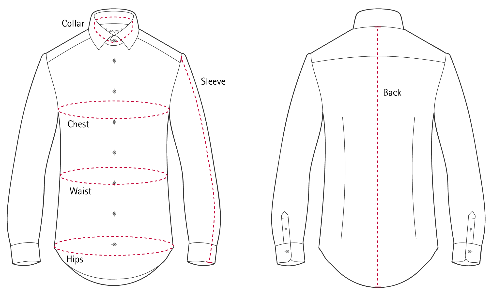
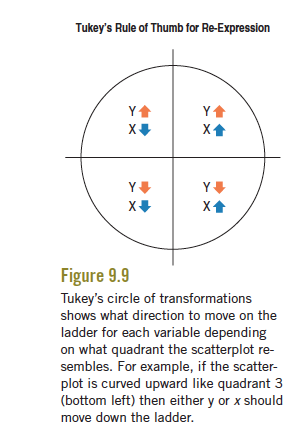

```{r setup3, include=FALSE}
library(broom)
library(dplyr)
library(ggplot2)
library(stringr)
library(rvest)
library(mosaicData) 
library(ggmosaic)
library(NHANES)
library(mosaic)
library(ggdag)
library(readr)
knitr::opts_chunk$set(echo = TRUE, warnings=FALSE, message=FALSE)
```

# Linear Regression Models

In our visualizations of data, we've seen trends, patterns, and variation. Let's now endeavor to describe those trends, patterns, and variation more *precisely* and *quantitatively* by building statistical *models*. In this chapter, we will focus on a class of models for describing quantitative outcome variables: linear regression models.

## Modeling Goals

Broadly, a model is a simplified representation of the world. When we build models, we may have different goals.

One goal when building models is **prediction**. Given data on a **response** or **outcome variable**, $Y$, and one or more **predictor or explanatory variables**, $X$, the goal is to find a mathematical function, $f$, of $X$ that gives good predictions of $Y$.  For example, we might want to be able to predict a customer's chest size knowing their neck size. This $X$ may be a single variable, but it is most often a set of variables. We'll be building up to multivariate modeling over the course of this chapter. 

```{block, type="reflect"}
Can you think of some other concrete examples in which we'd want a model to do prediction? Consider what predictions might be made about you every day.
```

What are the qualities of a good model and function, $f$? We want to find an $f(X)$ such that if we plug in a value of $X$ such as $X=x$, we'll get a good predictor of the observed outcome values $y$. In other words, we want the model prediction $\hat{y}=f(x)$ (read, "y hat") to be close to the observed outcome value. We want $y-\hat{y}$ to be small. This difference between the observed value and the prediction, $y-\hat{y}$, is called a **residual**. We'll discuss residuals more later.

Another goal when building models is **description**. We want a model to "explain" the relationship between the $X$ and $Y$ variables. Note that an overly complicated model may not be that useful here because it can't help us *understand* the relationship. A more complex model may, however, produce better predictions. [George Box](https://en.wikipedia.org/wiki/George_E._P._Box) is often quoted "All models are wrong but some are useful." Depending on our goal, one model may be more useful than another.

```{block, type="reflect"}
Can you think of some concrete examples in which we'd want a model to do explain a phenomenon? Consider how policy decisions get made.
```

To begin, we will consider a simple, but powerful model in which we limit this function, $f(X)$, to be a straight line with a y-intercept, $\beta_0$, and slope, $\beta_1$. ($\beta$ is the Greek letter beta.) The $E[Y | X]$ below stands for the **expected value** of the response variable $Y$ for a *given* value of $X$. 

$$E[Y | X] = \beta_0 + \beta_1\,X$$

This is a **simple linear regression model**. We model the expected value (the average value) of the response variable given an explanatory variable $X$ as a line. It is the foundation of many statistical models used in modern statistics and is more flexible than you may think.

We'll need to find the values of the slope and intercept that give us a line that gets close to the averages in order to explain the general relationship between $X$ and $Y$. We'll get to this soon.

Once we have values the intercept and slope, we are going to call them estimates and put a hat on them, so $\hat{\beta}_0$ is our **estimated intercept** and our **estimated slope** is $\hat{\beta}_1$. We can use those to make predictions by plugging in a value of x: 

$$\hat{y} = \hat{\beta}_0 +\hat{\beta}_1 x$$

The little hat on top of $\hat{y}$ means that we're talking about a predicted or estimated value of $y$, so our model says that the predicted or estimated value of $y$ is equal to an estimated intercept ($\hat{\beta}_0$), plus an estimated slope ($\hat{\beta}_1$), times the value $x$. 

```{block, type='mathbox'}
In the past, you may have seen the equation of a line as 

$$y = mx + b$$

where $m$ is the slope and $b$ is the y-intercept. We will be using different notation so that it can generalize to multiple linear regression. 

The y-intercept is the value when $x=0$ and the slope is change in $y$ for each 1 unit increase of $x$ ("rise over run"). 
```


## Lines

Let's return to the thought experiment in which you were a manufacturer of button-down dress shirts.

```{r echo=TRUE}
body <- read.delim("Data/bodyfat.txt")

body %>%
    ggplot(aes(x = Neck, y = Chest)) +
    geom_point(color = 'steelblue') + 
    xlab('Neck size (cm)') + 
    ylab('Chest size (cm)') +
    theme_minimal()
```

```{block type='reflect'}
If you were to add one or multiple lines to the plot above to help you make business decisions, where would you want it (or them)?
```

Let's say you were only going to make one size of shirt. You might want to add a horizontal line at the mean Chest size and a vertical line at the mean Neck size. 

```{r echo=TRUE}
body %>%
    ggplot(aes(x = Neck, y = Chest)) +
    geom_point(color = 'steelblue') + 
    geom_hline(yintercept = mean(body$Chest)) +
    geom_vline(xintercept = mean(body$Neck)) +
    xlab('Neck size (cm)') + 
    ylab('Chest size (cm)') +
    theme_minimal()
```

We can see that a shirt made to these specifications would fit the "average person." However, this might not serve your market very well. For many people, the shirt would be too tight because their chest and/or neck sizes would be larger than average. For many people, the shirt would be too large because they chest and/or neck sizes would be smaller than average. 

Let's try something else. Let's allow ourselves 5 different sizes (XS, S, M, L, XL). Then, we can cut the neck size variable into 5 groups of equal length and estimate the mean chest sizes within each of these groups. 

```{r echo=FALSE}
bfmeans <- body %>%
    mutate(NeckGroups = cut(Neck, 5)) %>%
    group_by(NeckGroups) %>%
    summarize(Means = mean(Chest))

labs <- levels(bfmeans$NeckGroups)
bfmeans <- cbind(
    bfmeans,
    lower = as.numeric( sub("\\((.+),.*", "\\1", labs) ),
    upper = as.numeric( sub("[^,]*,([^]]*)\\]", "\\1", labs) )
)

body %>%
    ggplot(aes(x = Neck, y = Chest)) +
    geom_point(color = 'steelblue') + 
    geom_segment(aes(x = lower, xend = upper, y = Means, yend = Means),bfmeans)+
    geom_vline(aes(xintercept = upper), data = bfmeans) +
    geom_vline(aes(xintercept = lower), data = bfmeans) +
    xlab('Neck size (cm)') + 
    ylab('Chest size (cm)') +
    theme_minimal()
```

```{block, type="reflect"}
What do these lines tell us for our business venture?
```

What if we wanted to be able to make more sizes? Could we get a pretty good sense of what the chest sizes should be for a given neck size? Let's try allowing for 8 different sizes. 

```{r echo=FALSE}
bfmeans <- body %>%
    mutate(NeckGroups = cut(Neck, 8)) %>%
    group_by(NeckGroups) %>%
    summarize(Means = mean(Chest))

labs <- levels(bfmeans$NeckGroups)
bfmeans <- cbind(
    bfmeans,
    lower = as.numeric( sub("\\((.+),.*", "\\1", labs) ),
    upper = as.numeric( sub("[^,]*,([^]]*)\\]", "\\1", labs) )
)

body %>%
    ggplot(aes(x = Neck, y = Chest)) +
    geom_point(color = 'steelblue') + 
    geom_segment(aes(x = lower, xend = upper, y = Means, yend = Means),bfmeans)+
    geom_vline(aes(xintercept = upper), data = bfmeans) +
    geom_vline(aes(xintercept = lower), data = bfmeans) +
    xlab('Neck size (cm)') + 
    ylab('Chest size (cm)') +
    theme_minimal()
```

```{block, type="reflect"}
What are the pros and cons of having a larger number of sizes?
```

```{block, type="reflect"}
Stop and think about the data collection process. If you were measuring your own neck size, how precise do you think you could get? What factors might impact that precision?
```

We can see from this scatterplot that there is generally a linear relationship between neck and chest size. Perhaps we can find one line to describe the relationship between neck size and chest size and use that line to decide on sizes later.

```{r echo=FALSE}
body %>%
    ggplot(aes(x = Neck, y = Chest)) +
    geom_point(color = 'steelblue') + 
    geom_smooth(method = 'lm', se = FALSE) +
    geom_segment(aes(x = lower, xend = upper, y = Means, yend = Means),bfmeans)+
    geom_vline(aes(xintercept = upper), data = bfmeans) +
    geom_vline(aes(xintercept = lower), data = bfmeans) +
    xlab('Neck size (cm)') + 
    ylab('Chest size (cm)') +
    theme_minimal()
```

```{block, type='reflect'}
What does line tell us for our business venture?
```

If the scatterplot between two quantitative variables **resembles a straight line**,

- a straight line could roughly **describe** the mean or average value of $y$ for each value of $x$.
- a straight line could **describe** how much we'd *expect* $y$ to change based on a 1 unit change in $x$.
- a straight line could help us **predict** the $y$ based on a new value of $x$.


## "Best" fitting line

To choose the "best" fitting line, we need to find estimates of the intercept ($\beta_0$) and slope ($\beta_1$),

$$ E[Y | X] =  \beta_0 + \beta_1\,X $$

that gives us the "best" fit to the $n$ points on a scatterplot, $(x_i,y_i)$ where $i=1,...,n$. 

```{block, type='reflect'}
What do we mean by "best"? In general, we'd like good predictions and a model that describes the average relationship. But we need to be more precise about what we mean by "best". 
```

### First idea

One idea of "best" is that we want the line that minimizes the sum of the **residuals**, $e_i = y_i - \hat{y}_i = y_i - ( \hat{\beta}_0 + \hat{\beta}_1x_i)$. The residual is the error in our prediction, the difference between what you observe and what you predict based on the line.

- **Problem**: We will have positive and negative residuals; they will cancel each other out if we add them together. While a good idea, this definition of "best" won't give us what we want. We'll want an idea that deals with the negative signs. 


### Second idea

Another idea of "best" is that we want the line that minimizes the sum of the absolute value of the residuals, $\sum_{i=1}^n |y_i - \hat{y}_i| = \sum_{i=1}^n |y_i - ( \hat{\beta}_0 + \hat{\beta}_1x_i)| =  \sum_{i=1}^n |e_i|$.

- **Problem**: This definition of "best" results in a procedure referred to as **Least Absolute Deviations**, but there isn't always one unique line that satisfies this. So, while this is a valid definition of "best," this isn't stable as there isn't always one "best" line. 

### Third idea

Lastly, another idea of "best" is that we want the line that minimizes the sum of squared residuals, $\sum_{i=1}^n (y_i - \hat{y}_i)^2= \sum_{i=1}^n(y_i-( \hat{\beta}_0 + \hat{\beta}_1x_i))^2=\sum_{i=1}^n e_i^2$.

- This is referred to as **Least Squares** and has a unique solution. We'll will focus on this definition of "best" in this class. It also has some really nice mathematical properties and [connections to linear algebra](https://medium.com/@andrew.chamberlain/the-linear-algebra-view-of-least-squares-regression-f67044b7f39b). 

## Least Squares

Let's try to find the line that **minimizes the Sum of Squared Residuals** by searching over a grid of values for (intercept, slope).

Below is a visual of the sum of squared residuals for a variety of values of the intercept and slope. The surface height is sum of squared residuals for each combination of slope and intercept.

```{r echo=FALSE}
f <- function(b){
  sum((body$Chest - (b[1] + b[2] * body$Neck))^2)
} 
beta0 <- seq(-20, 20, by = 0.5)
beta1 <- seq(-10, 20, by = 1)
b <- expand.grid(beta0, beta1)
ss <- apply(b,1,f)

persp(beta0, beta1, matrix(ss,length(beta0),length(beta1)), theta = 65, zlab = "Sum of Squares")
```

We can see there is valley where the minimum must be. Let's visualize this in a slightly different way. We'll encode the surface height as color (white is lowest).

```{r echo=FALSE}
image(beta0, beta1, matrix(ss,length(beta0),length(beta1)), col = c("white",topo.colors(100)[100:1]))
```

The large values of the sum of squared residuals are dominating this image, so let's change the color scheme to see more variation in smaller values (white is lowest).

```{r echo=FALSE}
beta0 <- seq(-10, 10, by = 0.1)
beta1 <- seq(0, 5, by = 0.1)
b <- expand.grid(beta0, beta1)
ss <- apply(b,1,f)

image(beta0, beta1, matrix(log(ss),length(beta0),length(beta1)), col = c("white",topo.colors(100)[100:1])) # Use the log of Sum of Squares to see variation in lower end
```

We can limit our search to $\beta_0 \in (-10,10)$ and $\beta_1 \in (2,3)$.

```{r echo=TRUE}
beta0 <- seq(-10, 10, by = 0.05)
beta1 <- seq(2, 3, by = 0.05)
b <- expand.grid(beta0,beta1)
ss <- apply(b,1,f)

b[ss == min(ss),]
```

We have the minimum point. Over the grid of pairs of values, the minimum sum of squared residuals happens when the intercept is -3.7 and the slope is 2.75.

```{block, type="mathbox"}
(Optional) Alternative ways (faster than exhaustive search) to find the minimum sum of squared residuals:

- We could try a numerical optimization algorithm such as steepest descent.
- We could use multivariable calculus (find partial derivatives, set equal to 0, and solve).

To get started on the calculus, solve the following two equations for the two unknowns ($\beta_0$ and $\beta_1$):

$$\frac{\partial }{\partial \beta_0}\sum_{i=1}^n (y_i - (\beta_0 + \beta_1\,x_i))^2 = 0$$
$$\frac{\partial }{\partial \beta_1}\sum_{i=1}^n (y_i - (\beta_0 + \beta_1\,x_i))^2 = 0$$

If you are a math/stat/physics/cs major, you should try this by hand and see if you can get the solutions below. 
```

If you find the minimum using calculus (super useful class!), you'll find that we can write the Least Squares solution in an equation format as functions of summary statistics (!), the estimated slope is

$$ \hat{\beta}_1  = r\frac{s_y}{s_x}$$

and the estimated intercept is

$$ \hat{\beta}_0 = \bar{y} - \hat{\beta}_1\bar{x} $$

where $\bar{x}$ is the mean of the variable on the x-axis, $\bar{y}$ is the mean of the variable on the y-axis, $s_x$ is the standard deviation of the variable on the x-axis, $s_y$ is the standard deviation of the variable on the y-axis, and $r$ is the correlation coefficient between the two variables.

Let's do that calculation "by hand" first in R.

```{r echo=TRUE}
body %>%
    summarize(sy = sd(Chest), sx = sd(Neck), r = cor(Chest,Neck), ybar = mean(Chest), xbar = mean(Neck)) %>%
    mutate(beta1 = r*sy/sx, beta0 = ybar - beta1*xbar) %>%
    select(beta0, beta1)
```

Wow. That was quite a bit of coding. From now on, we'll take the shortcut and use the `lm()` function which stands for **l**inear **m**odel. This function gives us the least squares solution to the "best" fitting line, as defined by minimizing the sum of squared residuals.

```{r echo=TRUE}
body %>% with(lm(Chest ~ Neck)) # When you see ~, think "as a function of"
#or you can use the following code:
#lm(Chest ~ Neck, data = body)
```


## Properties of Least Squares Line

- $(\bar{x},\bar{y})$ is ALWAYS on the least squares line. 

- The residuals from the least squares line ALWAYS sum to 0.

- The mean of the residuals from the least squares line is ALWAYS 0.

- The **standard deviation of the residuals,** $s_e$, gives us a sense of how bad our predictions (based on the line) could be. In other words, it gives us a sense of the size of our prediction errors:

$$s_e = \sqrt{\frac{\sum^n_{i=1} (y_i-\hat{y}_i)^2}{n-2}}  = \sqrt{\frac{\sum^n_{i=1} (e_i-0)^2}{n-2}} $$

In R: the standard deviation of the residuals, $s_e$, is referred to as the "residual standard error". Don't confuse this with "Std. Error," which is something else that we'll get to later in the semester.

```{r echo=TRUE}
body %>%
    with(lm(Chest ~ Neck)) %>% 
    summary()
```

This fit simple linear regression line is

$$ \widehat{\hbox{Chest}} = -3.18 + 2.73\,\hbox{Neck}$$

If you have a neck size of 38 cm, then we predict the chest size of an ideal shirt is about 100.5 cm:

```{r}
# The intercept and slope are rounded here first (not great):
-3.18 + 2.73*38

# The intercept and slope are not rounded before prediction (better!)
body %>%
    with(lm(Chest ~ Neck)) %>% 
    predict(newdata = data.frame(Neck = 38))
```


Given your neck size, we can probably predict your chest size within 5 to 10 cm since $s_e = 5.22$ (1 to 2 SD's -- recall Section \@ref(intro-zscore)). 

```{block, type="reflect"}
If you were a shirt manufacturer, is this a good enough prediction? What is the impact on the customer? Think of if the prediction were an overestimate (loose) or an underestimate (too tight).
```

### Real companies

Let's see how some real companies create shirts. In the plots below, the red boxes represent the advertised range (in cm) for Neck and Chest sizes for each brand.

```{r, out.width = '.25\\textwidth', echo=FALSE}

```

For Calvin Klein, we see that the red boxes are below the least squares line (black line). So for a given neck size, Calvin Klein makes shirts that are a little bit too small at the chest.


```{r echo=FALSE}
with(body,plot(Chest~Neck,main='Calvin Klein'))
abline(with(body,lm(Chest~Neck)))
rect(14*2.54,36*2.54,14.5*2.54,37*2.54,col='red')
rect(15*2.54,38*2.54,15.5*2.54,39*2.54,col='red')
rect(16*2.54,40*2.54,16.5*2.54,41*2.54,col='red')
rect(17*2.54,42*2.54,17.5*2.54,43*2.54,col='red')
```

For Express, we see that the red boxes are generally on the least squares line, except for the smallest size. This means that Express shirts are generally a good fit at the chest and neck for the 4 largest sizes, but the smallest shirt size is a bit too small at the chest for the neck size.

```{r echo=FALSE}
with(body,plot(Chest~Neck,main = 'Express'))
abline(with(body,lm(Chest~Neck)))
rect(13*2.54,33*2.54,13.5*2.54,33.5*2.54,col='red')
rect(14*2.54,36.5*2.54,14.5*2.54,38.5*2.54,col='red')
rect(15*2.54,39*2.54,15.5*2.54,41.5*2.54,col='red')
rect(16*2.54,42*2.54,16.5*2.54,44.5*2.54,col='red')
rect(17*2.54,45*2.54,17.5*2.54,47.5*2.54,col='red')
rect(18*2.54,48*2.54,18.5*2.54,50.5*2.54,col='red')
```

For Brooks Brothers, the red boxes are a bit below the least squares line for the 3 smallest sizes and a little above the line for the largest size. This means that the 3 smallest sizes are a bit too small in the chest for our customers (in our data set) with those neck sizes and that the largest shirt is a bit big at the chest for that neck size.


```{r echo=FALSE}
with(body,plot(Chest~Neck,main='Brooks Brothers'))
abline(with(body,lm(Chest~Neck)))
rect(13*2.54,32*2.54,13.5*2.54,34*2.54,col='red')
rect(14*2.54,34*2.54,14.5*2.54,36*2.54,col='red')
rect(15*2.54,38*2.54,15.5*2.54,40*2.54,col='red')
rect(16*2.54,42*2.54,16.5*2.54,44*2.54,col='red')
rect(17*2.54,46*2.54,17.5*2.54,48*2.54,col='red')
```


```{block, type="reflect"}
We haven't told you how the customer data we've been using was collected. As you compared the brand sizes to this sample data, what assumptions were you making about the population that the sample was drawn from? 

What questions do you have about the sampling procedure?
```

## Model Interpretation

Let's look at the summary output of the `lm()` function in R again. We'll highlight some of the most important pieces of this output and discuss how you interpret them.

```{r echo=TRUE}
tshirt_mod <- lm(Chest ~ Neck, data = body)
summary(tshirt_mod)
```

### Intercept ($\hat{\beta}_0$)

- **Where to find:** In the table called "Coefficients", look for the number under "Estimate" for "(Intercept)". It is -3.1885 for this model. 
- **Definition:** The intercept gives the average value of $y$ when $x=0$ (**think about context**)
- **Interpretation:** If Neck size = 0, then the person doesn't exist. In this context, the intercept doesn't make much sense to interpret. 
- **Discussion:** If the intercept doesn't make sense in the context, we might refit the model with the $x$ variable once it is **centered**. That is, the mean of $x$ for all individuals in the sample is computed, and this mean is subtracted from each person's $x$ value. In this case, the intercept is interpreted as the average value of $y$ when $x$ is at its (sample) mean value. See the example below -- we get an intercept of 100.66, which is the average Chest size for customers with average Neck size. We could also choose to center Neck size at a value other than the mean. For example, we could center it at 30 cm by subtracting 30 from the Neck size of all cases.

```{r echo=TRUE}
body <- body %>% mutate(CNeck = Neck - mean(Neck))
tshirt_mod2 <- lm(Chest ~ CNeck, data = body)
summary(tshirt_mod2)
```


### Slope ($\hat{\beta}_1$)

- **Where to find:** In the table called "Coefficients", look for the number under "Estimate" for the name of the variable, "Neck" or "CNeck". It is 2.7369 for this model. (Note: the slopes for both `tshirt_mod` and `tshirt_mod2` are the same. Why?) 
- **Definition:** The slope gives the change in average $y$ per 1 unit increase in $x$ (**not for individuals and not a causal statement**)
- **One Interpretation:** If we compare two groups of individuals with a 1 cm difference in the neck size (e.g., 38 cm and 39 cm OR 40 cm and 41 cm), then we'd expect the average chest sizes to be different by about 2.7 cm.
- **Another Interpretation:** We'd expect the average chest size to increase by about 2.7 cm for each centimeter increase in neck size.
- **A Third Interpretation:** We estimate that a one centimeter increase in neck size is associated with an increase, on average, of 2.7 cm in chest size.
- **Discussion:** Note that the interpretations are not written about an individual because the least squares line (our fit model) is a description of the **general trend** in the population. The slope describes the change in the average, not the change for one person. 

### Least Squares Regression Line ($\hat{y} = \hat{\beta}_0 + \hat{\beta}_1x$)

- **Where to find:** In the table called "Coefficients", all of the values that you need to write down the formula of the line are in the "Estimate" column.
- **Definition:** The line gives the estimated average of $y$ for each value of $x$ (**within the observed range of x**)
- **Interpretation:** The fit regression line of (Predicted Chest = -3.18 + 2.73*Neck) gives the estimated average Chest size for a given Neck size, based on our sample of data.
- **Discussion:** The "within the observed range of $x$" phrase is very important. We can't predict values of $y$ for values of $x$ that are very different from what we have in our data. Trying to do so is a big no-no called **extrapolation**. We'll discuss this more in a bit.

### Correlation vs. Causation

<center>
](Photos/correlation.png)
Source: [xkcd](https://xkcd.com/552/)
</center>

What is causation? What is a causal effect? Are there criteria for defining a cause?

These are deep questions that have been debated by scientists of all domains for a long time. We are at a point now where there is some consensus on the definition of a causal effect. The causal effect of a variable $X$ on another variable $Y$ is the amount that we expect $Y$ to change if we **intervene on or manipulate** $X$ by changing it by one unit.

When can we interpret an estimated slope, $\hat{\beta}_1$, from a simple linear regression as a causal effect of $X$ on $Y$? Well, in the simple linear regression case, almost never. To interpret the slope as a causal effect, there would have to be **no confounding variables** (no variables that cause **both** $X$ **and** $Y$). If we performed an experiment, it might be possible to have no confounding variables, but in most situations, this is not feasible.

Then what are we to do? 

1. Think about the possible causal pathways and try and create a DAG (coming up - see Section \@ref(dag)).
2. Try to **adjust or control for** possible confounders using multiple linear regression by including them in the model (coming up - see Section \@ref(multiple)). 
3. After fitting a model, we should step back and consider other criteria such as [Hill's Criteria](https://en.wikipedia.org/wiki/Bradford_Hill_criteria) before concluding there is a cause and effect relationship. Think about whether there is a large effect, whether it can be reproduced in another sample, whether the the effect happens before the cause in time, etc. 


## Model Evaluation

In this section, we consider model evaluation. We seek to develop tools that allow us to answer: is this a "good" model?

Aligning with our goals, we'd like to the model to:

- have small prediction errors
- accurately capture the relationship that explains variation in the outcome

### Prediction

Let's consider another data example. Can we predict your college grade point average (GPA) based on your high school GPA? (Disclaimer: this is not Macalester data)


```{r echo=TRUE}
sat <- read_csv("Data/sat.csv")
```

```{r echo=TRUE}
sat %>%
    ggplot(aes(x = high_GPA, y = univ_GPA)) +
    geom_point(color = 'steelblue') +
    geom_smooth(method = 'lm', se = FALSE) +
    xlab('High School GPA') +
    ylab('College GPA') + 
    theme_minimal()
```

First things first. Let's describe the scatterplot. 

- **Direction**: Positive relationship (higher high school GPA is associated with higher college GPA)
- **Form**: Roughly linear
- **Strength**: There is a weak relationship when high school GPA < 3.0 ($r = 0.32$) and a fairly strong relationship when high school GPA > 3.0 ($r = 0.68$).
- **Unusual**: As seen with the strength, there is greater variability in college GPA among individuals with lower high school GPA. That variability decreases with increased high school GPA. We call this pattern of unequal variation as **"thickening"** or **heteroscedasticity** (this term is used quite a bit in Econometrics). 

The code below computes the correlation coefficients separately for students with high school GPAs above 3 and for students with high school GPAs less than or equal to 3. We see that the correlation is higher for the high GPA group.

```{r echo=TRUE}
sat %>%
    mutate(HighHSGPA = high_GPA > 3) %>%
    group_by(HighHSGPA) %>%
    summarize(Cor = cor(high_GPA,univ_GPA))
```

Let's build a model to predict college GPA based on high school GPA based on this sample data. Since we noted that there was a linear relationship, let's fit a linear model by finding the least squares regression line.

```{r echo=TRUE}
sat %>%
  with(lm(univ_GPA ~ high_GPA)) %>%
  summary()
```


The best fitting line is

$$ \hbox{Predicted College GPA} = 1.09 + 0.675 \times \hbox{High School GPA} $$


Let's plug in a few values for the High School GPA to get predicted College GPA's.

- If High School GPA = 2:    
$$ \hbox{Predicted College GPA} = 1.09 + 0.675 \times 2 = 2.44 $$

```{r echo=TRUE}
## Calculation by hand; rounded before prediction
1.09 + 0.675*2

## Calcuation using R's predict() function
sat %>%
  with(lm(univ_GPA ~ high_GPA)) %>%
  predict(newdata = data.frame(high_GPA = 2))
```

- If High School GPA = 3.5:    
$$ \hbox{Predicted College GPA} = 1.09 + 0.675 \times 3.5 = 3.45 $$

```{r echo=TRUE}
1.09 + 0.675*3.5 #rounded before prediction
sat %>%
  with(lm(univ_GPA ~ high_GPA)) %>%
  predict(newdata = data.frame(high_GPA = 3.5)) #rounded after prediction
```

- If High School GPA = 4.5:    
$$ \hbox{Predicted College GPA} = 1.09 + 0.675 \times 4.5 = 4.13 $$

```{r echo=TRUE}
1.09 + 0.675*4.5 #rounded before prediction
sat %>%
  with(lm(univ_GPA ~ high_GPA)) %>%
  predict(newdata = data.frame(high_GPA = 4.5)) #rounded after prediction 
```

```{block, type='reflect'}
Does it make sense to use this model for high school GPA's > 4?  Some high schools have a max GPA of 5.0 due to the weighting of advanced courses. 
```

- What is the maximum high school GPA in this data set? 
- What if your college doesn't allow for GPA's above 4.0? 


```{r echo=TRUE}
sat %>%
    summarize(max(high_GPA)) # Max high school GPA in this data set
```

Making predictions beyond the observed range of values is called **extrapolation** and is a risky thing to do. If you make prediction for values of $X$ beyond the minimum or maximum of the observed values of $X$, then you are assuming that the relationship you observe can be extended into the new prediction range. This is the main issue of **forecasting**, making predictions in the future. You have to assume that the trend that you observe now will continue in the future and that the current state of affairs will stay the same. For an infamous case of extrapolation, check out [this article](https://www.ncbi.nlm.nih.gov/pmc/articles/PMC3173856/) that appeared in the journal Nature.

### Prediction Errors

Recall that a residual, $e_i$, for the $i$th data point is the difference between the actual observed value and predicted value from the model: $e_i = y_i - \hat{y}_i$.

If the residuals were approximately unimodal and symmetric, we expect about 95% of the residuals to be within 2 standard deviations of 0 (the mean residual). (Recall Section \@ref(intro-zscore).) Let's check: the distribution of residuals is unimodal and roughly symmetric, but we see more large residuals that we might usually expect. Let's keep that in mind. 

```{r echo=TRUE}
sat %>%
  with(lm(univ_GPA ~ high_GPA)) %>%
  augment() %>%
  ggplot(aes(x = .resid)) +
  geom_histogram(bins = 20) +
  labs(x='Residuals', title= "Distribution of residuals in the GPA model") +
  theme_minimal()
```

Below we calculate $SSE$ (the sum of squared errors/residuals), and the standard deviation of the residuals ($s_e$).

```{r echo=TRUE}
lm.gpa <- sat %>%
  lm(univ_GPA ~ high_GPA, data = .)
SSE <- sum(residuals(lm.gpa)^2)
n <- length(residuals(lm.gpa)) # Sample size
s <- sqrt(SSE/(n-2)) #sd of residuals
s
2*s
```

Using this model (that is, using your high school GPA), we can predict your college GPA within about $0.56$ GPA points. Is this useful? Is predicting within a margin of $0.56$ GPA points good enough? Let's compare this model margin of error with the margin of error predicting with just the mean:

```{r echo=TRUE}
sd(sat$univ_GPA)
2*sd(sat$univ_GPA)
```

*Without* knowing your high school GPA, we could have just guessed your college GPA as the overall mean college GPA in the sample, and this guess would probably be within $\pm 0.89$ of your actual college GPA. This is a higher margin of error than the approximate $0.56$ if we did use your high school GPA (in the simple linear regression model). We are able to predict your college GPA with a smaller margin of error than if we just guessed your college GPA with the mean. Our model has *explained* some (but not all) of the variation in college GPA.

The standard deviation of college GPA is based on the sum of squared total variation, SSTO (variation around the mean),

$$ SSTO = \sum{(y_i -\bar{y})^2} $$

$SSTO$ is the numerator of the standard deviation of $Y$ (without knowing anything about $X$).

```{r echo=TRUE}
(SSTO = sum((sat$univ_GPA - mean(sat$univ_GPA))^2))
```

We define $SSTO$ here because it will help to compare $SSTO$ to $SSE$ (sum of squared residuals from the model) to obtain a measure of how well our models are **fitting** the data - how well they are predicting the outcome.

### $R^2$

Let's study how *models reduce unexplained variation*.

- Before a model is fit, the unexplained variation is given by $SSTO$. It is the overall variability in the outcome values. Think back to interpreting standard deviation and variance as measures of spread. We used these to describe broadly how much the outcome varies.
- Unexplained variation in the outcome that remains after modeling is given by $SSE$, the sum of squared residuals.

So to study how models reduce unexplained variation, we compare the magnitude of the residuals from a linear regression model (which uses the predictor $X$) with the original deviations from the mean (which do not use the predictor $X$).

```{r echo=FALSE}
gpavar <- data.frame(resids = c(residuals(lm.gpa), sat$univ_GPA-mean(sat$univ_GPA)), type = rep(c('Linear Model Residuals','Original Deviations from Mean'), each = nrow(sat)))

gpavar %>%
  ggplot(aes(x = type, y = resids)) +
  geom_boxplot() +
  ylab('Residuals') +
  xlab('Type of Residuals')
```


We started with the sum of the deviations from the mean $SSTO = \sum{(y_i - \bar{y})^2}$ before we had info about high school GPA ($X$).

- Now, with our knowledge of $X$, we have $SSE = \sum{(y_i - \hat{y_i})^2}$

- $SSE$ should be smaller than $SSTO$ (!)

Two extreme cases: 

- If the error $SSE$ goes to zero, we'd have a "perfect fit". 
- If $SSE = SSTO$, $X$ has told us nothing about $Y$.

- So we define a measure called **R-squared**, which is the *fraction* or *proportion* of the total variation in $Y$ values "accounted for" or "explained" by the model with $X$. 


```{block type='mathbox'}
$$ R^2 = 1 - \frac{SSE}{SSTO} = 1 - \frac{ \sum{(y_i - \hat{y_i})^2}}{ \sum{(y_i - \bar{y})^2}}$$
```

In R, `lm()` will calculate R-Squared ($R^2$) for us, but we can also see that it equals the value from the formula above. 


```{r echo=TRUE}
1 - SSE/SSTO
glance(lm.gpa) #r.squared = R^2, sigma = s_e (ignore the rest)
```

- Is there a "good" value of $R^2$? Same answer as correlation -- no.

- $R^2$ doesn't tell you the direction or the form of the relationship.

- Note: $R^2 = r^2$ for simple linear models with one $X$ variable (where $r$ is the correlation coefficient).

## Conditions for Linear Regression Models

We have talked about ways to measure if the model is a good fit to the data. But we should also back up and talk about whether it even makes sense to fit a linear model. In order for a linear regression model to make sense, 

1. Relationships between each pair of quantitative $X$'s and $Y$ are **straight enough** (check scatterplots and residual plot)
2. There is about **equal spread** of residuals across fitted values (check residual plot)
3. There are no extreme outliers (points with extreme values in $X$'s can have **leverage** to change the line)


### Residual Plot

To check the first two conditions, we look at the original scatterplot as well as a plot of the *residuals* against *fitted or predicted values*,

```{r echo=TRUE}
augment(lm.gpa, data = sat) %>%
    ggplot(aes(x = .fitted, y = .resid)) +
    geom_point() +
    geom_smooth(se = FALSE) +
    geom_hline(yintercept = 0) +
    labs(x = "Fitted values (predicted values)", y = "Residuals") +
    theme_minimal()
```

What do you think?

  * Is there any pattern in the residuals? (Is the original scatterplot straight enough?)
  * Is there equal spread in residuals across prediction values?
  
Studying the residuals can highlight subtle non-linear patterns and thickening in the original scatterplot. Think the residual plot as a magnifying glass that helps you see these patterns.


```{block, type='reflect'}
If there is a pattern in the residuals, then we are systematically over or underpredicting our outcomes. What if we are systematically overpredicting the outcome for a group? What if we are systematically underpredicting the outcome for a different group? Consider a model for predicting home values for Zillow or consider an admissions model predicting college GPA. What are the real human consequences if there is a pattern in the residuals?
```

### Sensitivity Analysis

Additionally, we want to avoid extreme outliers because points that are both far from the mean of $X$ and do not fit the overall relationship have **leverage** or the ability to change the line. We can fit the model with and without the outliers to see how sensitive the model is to those points (this is called **sensitivity analysis**).

See the example below. See how the relationship changes with the addition of one point, one extreme outlier.  

```{r echo=FALSE}
x = runif(50,0,10)
y = rnorm(50)
dat = data.frame(x,y)
dat %>%
  ggplot(aes(x,y)) + 
  geom_point() + 
  geom_smooth(method='lm', se = FALSE) + 
  xlim(0,20) + 
  ylim(-5,10) + 
  theme_minimal() 

x = c(x,20)
y = c(y,10)
dat = data.frame(x,y)

dat %>%
  ggplot(aes(x,y)) + 
  geom_point() + 
  geom_smooth(method='lm', se = FALSE) + 
  xlim(0,20) + 
  ylim(-5,10) + 
  theme_minimal() 
```

Check out this interactive visualization to get a feel for outlier points and their potential leverage: http://omaymas.github.io/InfluenceAnalysis/

### Issues and Solutions

If the observed data do not satisfy the conditions above, what can we do? Should we give up using a statistical model? No, not necessarily!

- Issue: Both variables are NOT **Quantitative**
    - If your x-variable is categorical, we'll turn it into a quantitative variable using [**indicator variables**][Indicator Variables] (coming up) 
    - If you have a binary variable (exactly 2 categories) that you want to predict as your y variable, we'll use [**logistic regression models**](#logistic) (coming up)

- Issue: Relationship is NOT **Straight Enough**
    - We can try to use the [Solutions for Curvature].

- Problem: **Spread** is NOT the same throughout
    - You may be able to transform the y-variable using mathematical functions ($log(y)$, $y^2$, etc.) to make the spread more consistent (one approach is to use [**Box-Cox Transformation**](https://en.wikipedia.org/wiki/Power_transform#Box%E2%80%93Cox_transformation) -- take more statistics classes to learn more)
    - Be careful in interpreting the standard deviation of the residuals; be aware of the units. (For example, if you take a log transformation of the outcome, the units of the standard deviation of the residuals will be on the log scale.)

- Problem: You have **extreme outliers**
    - Look into the outliers. Determine if they could be due to human error or explain their unusual nature using the context. Think carefully about them, dig deep.
    - Do a **sensitivity analysis**: Fit a model with and without the outlier and see if your conclusions drastically change (see if those points had leverage to change the model).


### Solutions for Curvature

If we notice a curved relationship between two quantitative variables, it doesn't make sense to use a straight line to approximate the relationship. 

What can we do?

##### Transform Variables

One solution to deal with curved relationships is to **transform** the predictor ($X$) variables or transform the outcome variable ($Y$).

**Guideline #1:** If there is unequal spread around the curved relationship, focus first on transforming $Y$. If the spread is roughly the same around the curved relationship, focus on transforming $X$. 

When we say transform a variable, we are referring to taking the values of a variable and plugging them into a mathematical function such as $\sqrt{x}$, $\log(x)$ (which represents natural log, not log base 10), $x^2$, $1/x$, etc. 

**Guideline #2:** To choose the mathematical function, we focus on power functions and organize them in a **Ladder of Powers** of $y$ (or $x$):


\begin{align}
\vdots\\
y^3\\
y^2\\
\mathbf{y = y^1}\\
\sqrt{y}\\
y^{1/3}\\
y^{0} ~~~  (\hbox{we~use}~\log(y)~\hbox{here; natural log with base e)}\\
y^{-1/3}\\
1/\sqrt{y}\\
1/y\\
1/y^2\\
\vdots
\end{align}


To choose a transformation, we start at $y$ (power  = 1) and think about going up or down the ladder. 

But which way?

Our friend [J.W. Tukey](https://en.wikipedia.org/wiki/John_Tukey) (the same guy who invented the boxplot) came up with an approach to help us decide. You must ask yourself: Which part of the circle does the scatterplot most resemble (in terms of concavity and direction)? Which quadrant?

*Common misunderstanding: When using the circle above to help you decide to go up or down the ladder of power, you are comparing the direction and concavity of your scatterplot to the direction and concavity of the circle in the four quadrants. You are NOT looking at the sign of the observed values of x and y.*

**Guideline #3:** The sign of $x$ and $y$ in the chosen quadrant tells you the direction to move on the ladder (positive = up, negative = down).



Practice: Which quadrant of the circle does this relationship below resemble? 

```{r}
require(gapminder)

gapminder %>% 
  filter(year > 2005) %>%
  ggplot(aes(y = lifeExp, x =  gdpPercap)) + 
  geom_point()
```

Based on this plot, we see that the spread is roughly equal around the curved relationship (-> focus on transforming $X$) and that it is concave down and positive (quadrant 2: top left). This suggests that we focus on going down the ladder with $X$. 

Try these transformations until you find a relationship that is roughly straight. If you go too far, the relationship will become more curved again.

Let's try going down the ladder.

```{r}
gapminder %>% 
  filter(year > 2005) %>%
  mutate(TgdpPercap = sqrt(gdpPercap)) %>% #power = 1/2
  ggplot(aes(y = lifeExp, x =  TgdpPercap)) + 
  geom_point()
```

Not quite straight. Let's keep going.

```{r}
gapminder %>% 
  filter(year > 2005) %>%
  mutate(TgdpPercap = gdpPercap^(1/3)) %>% #power = 1/3
  ggplot(aes(y = lifeExp, x =  TgdpPercap)) + 
  geom_point()
```

Not quite straight. Let's keep going.

```{r}
gapminder %>% 
  filter(year > 2005) %>%
  mutate(TgdpPercap = log(gdpPercap)) %>% #power = 0
  ggplot(aes(y = lifeExp, x =  TgdpPercap)) + 
  geom_point()
```

Getting better. Let's try to keep going.

```{r}
gapminder %>% 
  filter(year > 2005) %>%
  mutate(TgdpPercap = -1/gdpPercap) %>%  #power = -1 (added a negative sign to maintain positive relationship)
  ggplot(aes(y = lifeExp, x =  TgdpPercap)) + 
  geom_point()
```

TOO FAR! Back up. Let's stick with log(gdpPercap).

Now we see some unequal spread so let's also try transforming $Y$.

```{r}
gapminder %>% 
  filter(year > 2005) %>%
  mutate(TgdpPercap = log(gdpPercap)) %>% 
  mutate(TlifeExp = lifeExp^2) %>% 
  ggplot(aes(y = TlifeExp, x =  TgdpPercap)) + 
  geom_point()
```

That doesn't change it much. Maybe this is as good as we are going to get. 

Transformations can't make relationships look exactly linear with equal spread, but sometimes we can make it closer to that ideal.

Let's try and fit a model with these two variables.

```{r}
lm.gap <- gapminder %>% 
  filter(year > 2005) %>%
  mutate(TgdpPercap = log(gdpPercap)) %>% 
  with(lm(lifeExp ~ TgdpPercap))

summary(lm.gap)
```

**Interpretations**

What does the estimated slope of this model, $\hat{\beta}_1 = 7.2028$, mean in this data context? Let's write out the model.

$$E[\hbox{Life Expectancy} | \hbox{GDP} ] = \beta_0 + \beta_1 log(\hbox{GDP})$$


- The slope, $\beta_1$ is the the additive increase in the expected $\hbox{Life Expectancy}$ when $log(\hbox{GDP})$ increases by 1 unit to $log(\hbox{GDP}) + 1$.

- Let's think about $log(\hbox{GDP}) + 1$. Using some rules of logarithms:

$$log(\hbox{GDP}) + 1 = log(\hbox{GDP}) + log(e^1) = log(e*\hbox{GDP}) = log(2.71*\hbox{GDP})$$
So adding 1 to $log(\hbox{GDP})$ is equivalent to multiplying GDP by $e=2.71$.


In our model, we note that if a country's income measured by GDP increased by a multiplicative factor of 2.71, the *estimated* expected life expectancy of a country increases by about 7.2 years. 

For the sake of illustration, imagine we fit a model where we had transformed life expectancy with a log transformation. What would the slope, $\beta_1$, mean in this context?

$$E[log(\hbox{Life Expectancy}) | \hbox{GDP} ] = \beta_0 + \beta_1 \hbox{GDP}$$


- The slope is the the additive increase in $E[log(\hbox{Life Expectancy}) | \hbox{GDP} ]$ when $\hbox{GDP}$ increases to $\hbox{GDP} + 1$.


- Let's think about the expected $log(\hbox{Life Expectancy})$ changing by $\beta_1$. Using rules of logarithms, the expected value changes: 
$$log(\hbox{Life Expectancy}) + \beta_1 = log(\hbox{Life Expectancy}) + log(e^{\beta_1}) = log(\hbox{Life Expectancy} * e^{\beta_1}) $$
The additive increase of $\beta_1$ units in the expected value of $log(\hbox{Life Expectancy})$ is equivalent to a multiplicative increase of $\hbox{Life Expectancy}$ by a factor of $e^{\beta_1}$.

##### Alternative Solutions

We could also model curved relationships by including higher power terms in a [multiple linear regression model][Multiple Linear Regression] like the example below. By using `poly()` (short for polynomial), we now include $X$ and $X^2$ as variables in the model.

```{r}
x <- rnorm(100, 5, 1)
y <- 200 + 20*x - 5*x^2 + rnorm(100,sd = 10)
dat <- data.frame(x,y)
dat %>%
    ggplot(aes(x = x, y = y)) +
    geom_point() + 
    geom_smooth(se = FALSE)
lm(y ~ poly(x, degree = 2, raw = TRUE), data = dat)
```

A more advanced solution (which is not going to be covered in class) is a **generalized additive model** (GAM), which allows you to specify which variables have non-linear relationships with $Y$ and estimates that relationship for you using spline functions (super cool stuff!). We won't talk about how this model is fit or how to interpret the output, but there are other cool solutions out there that you can learn about in future Statistics classes!

```{r}
require(gam)
plot(gam(y ~ s(x), data = dat))
```


## Multiple Linear Regression  {#multiple}


As we've alluded to, we can generalize the idea of a simple linear regression model by including many predictor variables ($X$'s). A **multiple linear regression model** can be written as:

$$ E[Y |X_1,...,X_k ] = \beta_0 + \beta_1\,X_{1} + \cdots + \beta_k\,X_{k}  $$

- Each "slope" coefficient $\beta_j$ can be interpreted as the increase in the expected or average $Y$ associated with a 1 unit increase in $X_j$, **keeping all other variables fixed or constant**. (\*There are some exceptions - we'll get there.)

- These explanatory variables can be:
    - Quantitative variables (or transformations of them)
    - [Indicator variables][Indicator Variables] for categorical variables (only need $L-1$ indicators for a variable with $L$ categories)
    - [Interaction terms][Interaction Variables] (product of two variables, which allows for *effect modification*)
    
Let's talk about a new data example: home prices. We want to build a model to predict the price of a home based on its many characteristics. We have a dataset of homes recently sold in New England with many variables such as the age of the home, the land value, whether or not it has central air conditioning, the number of fireplaces, the sale price, and more...

```{r echo=TRUE}
homes <- read.delim('Data/Saratoga.txt')
head(homes)
```

\*The exception to the interpretation comment above is if some of our $X$ variables are strongly correlated (called **multicollinearity**). In this case, we cannot hold all other variables constant (at least not well) because if we increase the value of one variable, then variables highly correlated with it will also likely change in value.


### Indicator Variables

In New England, fireplaces are often used as a way to provide supplementary heat to the house. Let's study the impact a fireplace has on the sale price of a home. In particular, we only care if the home has 1 or more fireplaces or no fireplaces. So we make a new variable, `AnyFireplace`, that is `TRUE` if there is at least one fireplace in a home and `FALSE` otherwise.

```{r echo=TRUE}
homes <- homes %>%
    mutate(AnyFireplace = Fireplaces > 0)
```

In order to include this information in our linear regression model, we need to turn that categorical variable (`AnyFireplace` with values of `TRUE` or `FALSE`) into a quantitative variable using an **indicator variable**, which has a numeric value of 0 or 1:

$$ \hbox{AnyFireplaceTRUE} = \begin{cases}1 \quad \text{ if a home has at least one fireplace}\\ 0\quad \text{ if a home does not have a fireplace} \end{cases}$$
Our model is written as

$$E[\hbox{Price} | \hbox{AnyFireplace}] = \beta_0 + \beta_1 \hbox{AnyFireplaceTRUE}$$

**What does this mean?**

Let's think about two types of homes: a home with one or more fireplaces and a home without a fireplace. Let's write out the model equations for those two types of homes. 

- Home with fireplace (indicator variable = 1):    
$$E[\hbox{Price} | \hbox{AnyFireplace} = TRUE] = \beta_0 + \beta_1*1 = \beta_0+\beta_1$$


- Home without fireplace (indicator variable = 0):  
$$E[\hbox{Price} | \hbox{AnyFireplace} = FALSE] = \beta_0 + \beta_1*0 = \beta_0$$
The difference between the expected price is $\beta_1$, the value of the "slope" coefficient for the indicator variable (also referred to as the `AnyFireplaceTRUE` coefficient).

To get an estimate of $\beta_1$, we need to fit our model to the data. In fact, R creates this indicator variable for you when you include a categorical variable as an $X$ variable the `lm()` function.

```{r echo=TRUE}
lm.home <- lm(Price ~ AnyFireplace, data = homes)
summary(lm.home)
```

Our best fitting "line" is

$$ \hbox{Predicted Price} = 174653 + 65261\,\hbox{AnyFireplaceTRUE} $$
and our predicted price for a house with a fireplace (indicator variable = 1) is

$$ \hbox{Predicted Price} = 174653 + 65261 \times 1 = \$ 239,914 $$

```{r echo=TRUE}
174653 + 65261*1
```

and the predicted price for a house without a fireplace (indicator variable = 0) is

$$\hbox{Predicted Price} = 174653 + 65261 \times 0 = \$ 174,653$$

The difference between these predicted prices is $\hat{\beta}_1$ = \$65,261, the estimated value of the "slope" for the indicator variable.

```{block, type='reflect'}
So is this how much a fireplace is worth? If I installed a fireplace in my house, should the value of my house go up \$65,260?

**No**, because we should not make causal statements based on observational data without thinking deeply about the context. What could be confounding this relationship? What third variable may be related to both the price and whether or not a house has a fireplace?
```

### Confounder Adjustment

Let's consider the size of the house. Is price related to the area of living space (square footage)?

```{r echo=TRUE}
homes %>%
    ggplot(aes(x = Living.Area, y = Price)) + 
    geom_point(color = 'steelblue') +
    theme_minimal()
```

Is the presence of a fireplace related to area of living space?

```{r echo=TRUE}
homes %>%
    ggplot(aes(x = AnyFireplace, y = Living.Area)) + 
    geom_boxplot() +
    theme_minimal()
```

We see that the amount of living area differs between homes with fireplaces and homes without fireplaces. Thus, `Living.Area` could confound the relationship between `AnyFireplace` and `Price` because it is related to both variables. That is, it is possible that Living Area is a cause of having a fireplace (if you have a bigger house, you have more space to put in a fireplace) and Living Area also clearly is a cause of Price (the bigger the house, the more it costs).

Let's put `Living.Area` in the model along with `AnyFireplace` to account for it (to control or adjust for it),

$$E[\hbox{Price} | \hbox{AnyFireplace, Living.Area}] = \beta_0 + \beta_1\,\hbox{AnyFireplaceTRUE} + \beta_2\,\hbox{Living.Area}$$

**What does this mean?** 

Let's think about two types of homes: a home with one or more fireplaces and a home without a fireplace.

- Home with fireplace (indicator = 1):    

\begin{align*}
E[\hbox{Price}| \hbox{AnyFireplace = TRUE, Living.Area}] &= \beta_0 + \beta_1 \times 1 + \beta_2 \times \hbox{Living.Area} \\
&= (\beta_0 + \beta_1 ) + \beta_2 \times \hbox{Living.Area}
\end{align*}


*Among homes with a fireplace, we have one linear relationship between living area and price. The intercept is $\beta_0+\beta_1$ and the slope is $\beta_2$.*

- Home without fireplace (indicator = 0):    

\begin{align*}
E[\hbox{Price}| \hbox{AnyFireplace = FALSE, Living.Area}] &= \beta_0 + \beta_1 \times 0 + \beta_2 \times \hbox{Living.Area} \\
&= \beta_0 + \beta_2 \times \hbox{Living.Area}
\end{align*}


*Among homes without a fireplace, we have a different linear relationship between living area and price. The intercept is $\beta_0$ and the slope is $\beta_2$.*

- For either type of home, $\beta_2$ is the increase in the expected or average Price associated with a 1 square footage increase in Living.Area, **holding the number of fireplaces constant**.


Now let's compare homes that are the same size. 

*If we keep Living.Area constant by considering two equally sized homes, then we'd expect the home with the fireplace to be worth $\beta_1$ more than a home without a fireplace.*

We see this by taking the difference between the two equations, fixing the Living Area:

$$E[\hbox{Price}| \hbox{AnyFireplace = TRUE, Living.Area = A}] - E[\hbox{Price}| \hbox{AnyFireplace = FALSE, Living.Area = A}]$$

$$
\begin{align*}
\,&= (\beta_0+\beta_1 + \beta_2 \times \hbox{A}) - ( \beta_0 + \beta_2 \times \hbox{A})\\
\,&= \beta_1
\end{align*}
$$

Another way to describe $\beta_1$ is that it is the difference between the intercepts.


To get the estimates of $\beta_0,\beta_1,$ and $\beta_2$, we fit the model in R,

```{r echo=TRUE}
lm.home2 <- lm(Price ~ AnyFireplace + Living.Area, data = homes)
summary(lm.home2)
```

Our best fitting "line" is

$$\hbox{Predicted Price} = 13599.16 + 5567.37\,\hbox{AnyFireplaceTRUE} + 111.21\,\hbox{Living.Area}$$

- \$111.21 is the estimated increase in the expected or average Price associated with a 1 square foot increase in Living.Area, **holding all other variables (AnyFireplace) constant**.

- \$5567.37 is the estimated increase in the expected or average Price associated with a 1 unit increase in AnyFireplace (going from FALSE to TRUE), **holding all other variables (Living.Area) constant**.


Note that the "slope" for the indicator variable is very different with the addition of Living.Area. This suggests that `Living.Area` was confounding the relationship between `Price` and `AnyFireplace`.

Let's look back at the relationship between Living.Area and Price and color the scatterplot by AnyFireplace. So we are now looking at three variables at a time. The above model with AnyFireplace and Living.Area results in two lines for Living.Area v. Price, with different intercepts but the same slope (parallel lines).

```{r echo=TRUE}
homes %>%
    ggplot(aes(x = Living.Area, y = Price, color = AnyFireplace)) + 
    geom_point() +
    geom_abline(intercept = 13599.164 , slope = 111.218, color = scales::hue_pal()(2)[1]) +
    geom_abline(intercept = 13599.164 + 5567.377, slope = 111.218 , color = scales::hue_pal()(2)[2]) +
    theme_minimal()
```

Let's try and fit two separate lines to these two groups of homes, home with any fireplaces and home with no fireplaces. Do these lines have the same intercepts? Same slopes?

```{r echo=TRUE}
homes %>%
    ggplot(aes(x = Living.Area, y = Price, color = AnyFireplace)) + 
    geom_point() +
    geom_smooth(method = 'lm', se = FALSE) +
    theme_minimal()
```

In this case, it looks as though having a fireplace in your house slightly changes the relationship between Living.Area and Price. In fact, the increase in your average price for every 1 square foot is greater for a home with a fireplace than that for homes without fireplaces (slopes are different).


### Interaction Variables

We can allow for different slopes within one regression model (!), rather than fitting two separate models. 

```{block, type='reflect'}
When should we fit only one model; when should we fit separate models? 

If we fit separate models, we are **stratifying** and then modeling. But what if some of the strata are small?

Fitting one model allows us to "borrow information across groups."

There is no one right answer. Researchers struggle with this decision [to stratify or not to stratify](https://www.ncbi.nlm.nih.gov/pubmed/22125224).
```

- If we add a variable in the model (without an interaction), it only changes the intercept.

- We can achieve different slopes by allowing a variable $X_1$ to affect the slope for another variable $X_2$. That is, $X_1$ impacts the effect of $X_2$ on the outcome $Y$. (Fireplace presence impacts the effect of living area on house price.)

$$\beta_2 = a + bX_1$$
This is called **effect modification** (when one variable can modify the effect of another variable on the outcome).

- A model with effect modification looks like this:
$$E[Y | X_1, X_2] = \beta_0 + \beta_1X_{1} + \beta_2X_{2}= \beta_0 + \beta_1X_{1} + (a+bX_1)X_{2}= \beta_0 + \beta_1X_{1} +aX_2+bX_1X_{2}$$
The model above has an **interaction term,** which is the product of two variables. Here we have $X_1*X_2$.

Let's build a model with effect modification for our housing data. Let's include an interaction term between AnyFireplace and Living.Area to allow for different slopes.

$$E[\hbox{Price}| \hbox{AnyFireplace, Living.Area}] = \beta_0+ \beta_1\,\hbox{AnyFireplaceTRUE} + \beta_2\,\hbox{Living.Area}+ \beta_3\,\hbox{AnyFireplaceTRUE}*\hbox{Living.Area}$$

**What does this mean?** 

Let's think about two types of homes: a home with one or more fireplaces and a home without a fireplace.

- Home with fireplace (indicator = 1):    

$$
\begin{align*}
E[\hbox{Price}| \hbox{AnyFireplace = TRUE, Living.Area}] &= \beta_0 + \beta_1*\,1 + \beta_2\,\hbox{Living.Area}+ \beta_3*\,1*\hbox{Living.Area}\\
&= (\beta_0 + \beta_1) + (\beta_2+\beta_3)\,\hbox{Living.Area}\\
\end{align*}
$$


- Home without fireplace (indicator = 0):    

$$
\begin{align*}
E[\hbox{Price}| \hbox{AnyFireplace = FALSE, Living.Area}] &= \beta_0 + \beta_1*\,0 + \beta_2\,\hbox{Living.Area}+ \beta_3*\,0*\hbox{Living.Area}\\
&= \beta_0  + \beta_2\,\hbox{Living.Area}\\
\end{align*}
$$

Note that there are different intercepts **and** different slopes for these two groups of homes. Thus, including an interaction term between a categorical and a quantitative predictor variable allows us to describe **effect modification**. How does the effect of one variable on the response variable differ according to another variable? How is the effect modified by another variable?

- $\beta_1$ is the difference in the intercepts between homes with and without a fireplace
- $\beta_3$ is the difference in the slopes between homes with and without a fireplace

What this means in the context of this model of price as a function of living area and fireplaces: different slopes means that the average rate of price increase for every additional square foot is **different between homes with and without fireplaces**.


If we fit this model with interaction terms, we get the following estimates:

```{r echo=TRUE}
lm.home3 <- lm(Price ~ AnyFireplace*Living.Area, data = homes)
summary(lm.home3)
```

- Homes with fireplace (indicator = 1):    

$$
\begin{align*}
\hbox{Predicted Price} &= 40901.29 + -37610.41 \times 1 + 92.36391 \times \hbox{Living.Area} + 26.85 \times \hbox{Living.Area} \times 1 \\
& = \$3,290.88 + \$119.21 \times \hbox{Living.Area}
\end{align*}
$$

```{r echo=TRUE}
40901.29 + -37610.41*1
92.36391 + 26.85*1
```

- Homes without fireplace (indicator = 0):    

$$
\begin{align*}
\hbox{Predicted Price} &= 40901.29 + -37610.41 \times 0 + 92.36391 \times \hbox{Living.Area} + 26.85 \times \hbox{Living.Area} \times 0 \\
&= \$40,901.29 + \$92.36 \times \hbox{Living.Area}
\end{align*}
$$

- $\$-37610.41$ is the difference in the estimated intercepts between homes with and without a fireplace (or, put another way, $\$-37610.41$ is the difference in the estimated average price between homes with and without a fireplace that are 0 square feet)
- $\$26.85$ is the difference in the estimated slopes between homes with and without a fireplace (or, put another way, $\$26.85$ is the difference in the estimated "effect" of living area on price between homes with and without a fireplace, where the "effect" of living area on price is the change in average price associated with a 1 square foot increase in living area)


### Is the Difference Real?

We could ask: is there *really* a difference in the slopes for Living Area and Price between homes with and without a fireplace?

```{r echo=TRUE}
summary(lm.home3)
```

If we ask ourselves this question, we are assuming a few things:

1. We would like to make a general statement about a **target population of interest**.

2. We don't have data for everyone in our population (we don't have a **census**).

3. Depending on who **randomly** ends up in our **sample**, the relationship may change a bit.

4. We want to know how much the relationship may change based on **sampling variation.**  

- Let's treat our sample (of size $n$) as a 'fake' population (we don't have the full population but if the sample is representative, then it will be a good proxy).
    - Randomly resample from our sample (with replacement) a new sample of size $n$
- Estimate the least squares regression line.
- Repeat.

```{r echo=TRUE}
set.seed(333) ## Setting the seed ensures that our results are reproducible
## Repeat the sampling and regression modeling 1000 times
boot <- do(1000)*lm(Price ~ Living.Area*AnyFireplace, data = resample(homes))

## Plot the distribution of the 1000 slope differences
boot %>%
    ggplot(aes(x = Living.Area.AnyFireplaceTRUE)) +
    geom_histogram() +
    xlab('Bootstrap Difference in Slopes') +
    theme_minimal()
```

We see that if we were to have a slightly different sample (drawn from our "fake" population), then the difference in the slope could be as long as 0 and as large as 50.

This process of resampling from the sample is called **Bootstrapping** and it is used to:

1. Measure the variability in the estimates (here we are interested in the difference in slopes) between random samples and
2. Provide an interval of plausible values for the estimate (the difference in slopes here).

Let's first look at the variability of the difference in slopes across the bootstrap samples. The standard deviation of the bootstrap estimates will be similar to the `Std. Error` from the linear model output.

```{r echo=TRUE}
boot %>%
  summarize(sd(Living.Area.AnyFireplaceTRUE)) #this is going to be of similar magnitude (not exactly the same) to the Std. Error for the Living.Area.AnyFireplaceTRUE coefficient in output
summary(lm.home3)
```

This standard deviation is somewhat close to the $6.459$ for Living.Area.AnyFireplaceTRUE coefficient in the Std. Error column of the `summary(lm.home3)` output above.

To get an interval of plausible values for the difference in the slopes, we look at the histogram and take the middle 95%. The lower end will be the 2.5th percentile and the upper end will be the 97.5th percentile.

```{r echo=TRUE}
boot %>%
  summarize(lower = quantile(Living.Area.AnyFireplaceTRUE, 0.025), upper = quantile(Living.Area.AnyFireplaceTRUE, 0.975))
```

```{block, type="reflect"}
Based on this evidence, do you think it is possible that the slopes are the same for the two types of homes (with and without fireplaces)? How would you justify your answer? Consider the plausible values of the difference in slopes given by the interval above. 
```

### Redundancy and Multicollinearity {#redundant}

Beyond fireplaces and living area, there are other characteristics that may impact the price of a home. Typically, homes for sale are advertised with the square footage, the number of bedrooms, and the number of bathrooms in addition to the total number of rooms in the house. In general, we'd expect a positive relationship between each of these and the home price. Let's fit a model with those four explanatory variables.

```{r}
lm.home4 <- homes %>% with( lm(Price ~ Living.Area + Bedrooms + Bathrooms + Rooms))
summary(lm.home4)
```

If we look at the estimates of the slope coefficients, are you surprised to see that `Bedrooms` has a negative slope estimate?

Remember, the coefficients are the change in the expected price for a 1 unit change in that variable, keeping all other variables fixed. Is it *possible* to keep `Rooms` fixed while adding an additional `Bedroom`? In practice, that would mean you need to convert an existing room to a `Bedroom`. Let's look at a scatterplot between these two variables. If it is not realistic or possible to fix one variable while increasing the other, we cannot interpret the slope coefficients in the standard way. 


```{r}
homes %>%
  ggplot(aes(x = Rooms, y = Bedrooms)) + 
  geom_point() +
  theme_minimal()

homes %>%
  summarize(cor(Rooms,Bedrooms))
```

These two characteristics are positively correlated because the count of `Rooms` is defined as the number of `Bedrooms` plus the number of other rooms in the house. So they contain some similar information about a home. Knowing how many rooms a house has, you can could have a pretty good guess at how many bedrooms it has. Maybe one of these variables is a bit redundant.

Let's take another view at this model with an **Added Variable Plot**. Here are a few characteristics of an added variable plot.

1. We have one scatterplot per $X$ explanatory variable in the model. 
2. For each scatterplot, the values on the x and y axes are residuals from two different models, both of which we have not directly fit. 

*What are these models?*

- For the y-axes, the model that is fit is a multiple linear regression model for $E[Y |\hbox{ all other }X\hbox{ variables except }X_j]$. The residuals from this model encode the variation and information about $Y$ that is left unexplained by other $X$ variables. 
- For the x-axes, the model that is fit is a multiple linear regression model for $E[X_j | \hbox{ all other }X\hbox{ variables except }X_j]$. The residuals from this model encode the variation and information about $X_j$ that is left unexplained by other $X$ variables. In other words, the unique information the $X_j$ has that is not contained in the other $X$ variables. 

3. The slope of the line in each scatterplot is equal to the estimated slope coefficient for that variable in the model you fit. 

If we look at the example below, we see a fairly strong positive relationship in the first (upper left) scatterplot. What we can conclude is that living area has quite a bit of unique information not contained in `Bedrooms`, `Rooms`, and `Bathrooms` that can explain variation in home price. Another way to phrase this is that after adjusting for or accounting for the number of `Bedrooms`, `Rooms`, and `Bathrooms`, we see a moderately strong positive linear relationship between `Living.Area` and `Price`. 

In the second (upper right) scatterplot, we see a weak negative relationship between `Bedrooms` and `Price` after accounting for the square footage of the living area, the number of bathrooms, and the number of rooms. So there isn't much unique information about bedrooms that can help explain the variation in price that isn't already contained in `Rooms`, `Bathrooms`, and `Living.Area`. Since the slope is negative, we might conclude that converting an existing room (keeping square footage and number of rooms fixed) to a bedroom slightly decreases the estimated expected home price. 

With `Rooms` and `Bathrooms`, we see positive but weak relationships after accounting for the other explanatory variables. In fact, the slope of these lines are equal to the estimated coefficients from the summary. 

```{r}
source('Data/ggavplot.R')
ggAVPLOTS(lm.home4)
```

If we were to remove `Rooms` as it seems to be redundant, containing similar information as `Bedrooms`, we get a bit different estimated slope coefficients.

```{r}
lm.home5 <- homes %>% with( lm(Price ~ Living.Area + Bedrooms + Bathrooms ))
summary(lm.home5)
```

*So should Rooms stay in the model or come out?*

Does adding `Rooms` help explain more variation in home `Price`? 

We can see that WITH `Rooms`, we explained 53.2% of the variation in home `Price`.

We can see that WITHOUT `Rooms`, we explained 52.9% of the variation in home `Price`.

So `Rooms` doesn't add a lot to the explanatory power of the model. 

```{r}
glance(lm.home4)
glance(lm.home5)
```

**Fun Fact**: Adding an explanatory variable $X$ to the model will always increase R-squared or keep it the same. 

In general, we'd like the most simple model (with the fewest $X$ variables) that does a good job for our goals. If R-squared never goes down when you add an explanatory variable, we need a different tool to help us decide whether to add a variable. 

Remember that 
$$R^2 = 1 - \frac{SSE}{SSTO} = \%\hbox{ of variation in Y explained by model}$$

**Adjusted R-Squared** is a slightly adjusted version of R-squared that takes into account the number of $X$ variables in the model, denoted as $k$. It is calculated as

$$R^2_{adj} = 1 - \frac{SSE/(n-k-1)}{SSTO/(n-1)}$$

It does NOT have the interpretation of "% of variation explained..." but it can be used to help us decide whether a variable is redundant or whether we should keep it in the model. The adjusted R-squared for these two models are 0.531 (with Rooms) and 0.529 (without Rooms). This is a judgment call that you as the data analyst makes and this is one tool to help you make the decision. See the next section for more tools to help you decide. 


## Selecting a Model

With a multiple linear regression model, we have many decisions to make. We need to decide which explanatory variables should be in the model and what form (indicators, interactions, transformed) they should take. To help guide your decision making, we provide a list of helpful tools.

### Satisfying conditions

Choose $X$ variables (& their form) that:

- have a fairly strong linear relationship with equal spread with $Y$ (for quantitative $X$)
- that don't have a pattern in a residual plot against $X$ (for quantitative $X$)
- can explain large differences in average $Y$ (for categorical $X$)
- capture modifying effects or different slopes (use visualizations to justify interaction terms)

### Provide useful model

Choose $X$ variables (& their form) that:

- can explain a lot of variation in $Y$ (higher R-squared)
- provide small prediction errors (smaller standard deviation of residual)
- have coefficients that are really different from 0 ([Is the Difference Real?])
- adjust for confounding variables to help you estimate direct causal relationships (not mediators or colliders; see Section \@ref(dag))
- have unique information that is not redundant (higher adjusted R-squared; see Section \@ref(redundant)


## Causal Inference {#dag}

A full overview of causal inference is beyond the scope of this course, but a first good step in this direction is to consider a **causal model**, which is a representation of the causal mechanism by which data were generated. We typically visualize these models with a graphical structure called a **directed acyclic graph or DAG** for short. 

In a DAG, we have circles or **nodes** that represented variables and arrow or **directed edges** that indicate the causal pathway (arrows point in the direction of the hypothesized casual effect). 

```{r echo=FALSE}
devtools::unload("mosaic")
smoking_ca_dag <- ggdag::dagify(cardiac ~ cholesterol,
                         cholesterol ~ smoke + wght,
                         smoke ~ unhealthy,
                         wght ~ unhealthy,
                         labels = c("cardiac" = "Cardiac\n Arrest",
                                    "smoke" = "Smoking",
                                    "cholesterol" = "Cholesterol",
                                    "unhealthy" = "Unhealthy\n Lifestyle",
                                    "wght" = "Weight"),
                         latent = "unhealthy",
                         exposure = "smoke",
                         outcome = "cardiac") 

ggdag::ggdag(smoking_ca_dag, text = FALSE, use_labels = "label") +
  ggdag::theme_dag()
```


Below we discuss the three basic DAG structures.

- **Chain**: *A chain includes three nodes and two edges, with one directed into and one edge directed out of the middle variable.* In the above example, we see a few chains. There is a chain that suggests an unhealthy lifestyle leads to smoking which directly impacts cholesterol levels. Another chain suggests an unhealthy lifestyle direclty impacts human weight which impacts cholesterol levels. By our DAG, there are two causal pathways that directly impact cholesterol levels. 

- **Fork**: *A fork includes three nodes with two arrows emanating from the middle variable*. The only fork in the example above involves unhealthy lifestyle (middle variable), weight, and smoking. In this case, we are assuming that an unhealthy lifestyle is a **common cause** of both weight and smoking. Thus, the lifestyle might confound the relationship between smoking and weight, in that smoking and weight may appear to be associated with each other because they have a common cause. 

- **Colliders**: *A collider occurs when one node receives edges from two other nodes.* In the example above, smoking and weight have a **common effect**, cholesterol.

These structures are important to understand because they can help guide our analysis and modeling. Assuming the causal model is correct (which might not be...), we have a better sense of how smoking might be related to cardiac arrest. 

- There is a **direct path** from smoking through cholesterol to cardiac arrest. Smokers may have a higher cholesterol level and thus a higher risk of cardiac arrest.
- There is an **indirect (backdoor) path** from smoking to cardiac arrest through weight. Smokers also have an unhealty lifestyle which means they are likely to have a higher weight leading to a higher cholesterol level and thus a higher risk of cardiac arrest. 

If we only want to estimate the direct relationship between smoking and cardiac arrest, we need to block the impact of the indirect path. We alluded earlier that multiple linear regression could provide estimates of causal effects in the right circumstances. What are those circumstances? When we include **all** confounding variables in the model. 

Remember, a confounder is a **common cause** of both the causal variable of interest and the outcome (e.g. living area could be a confounder of fireplace presence and house price).

However, we should not just throw every variable we have into a multiple regression model. Why? Imagine a scenario for understanding how smoking affects lung cancer development. It is very important to consider whether a variable is a **mediator** of the relationship between the cause and the outcome. A mediator  is a variable in a chain or along the path between the cause and the outcome. In the smoking and lung cancer example, one mediator could be tar in the lungs. Suppose that smoking only affects lung cancer risk by creating tar on the lungs. If we adjust for tar (by holding it constant), then we also effectively hold smoking constant too! If smoking is held constant, then we cannot estimate its effect on cancer risk because it is not varying!
  
Wait - we could never possibly know of or measure all confounding variables, could we!? This is true, but that doesn't mean that our endeavor to understand causation is fruitless. As long as we can describe the relationship between known confounders as precisely as possible with writing down a DAG (causal model), we have a starting ground for moving forward. 

We collect data, analyze how well our model predicts that data, and collect more data based on that, perhaps measuring more potential confounders as our scientific knowledge grows. We can also conduct sensitivity analyses by asking: how strongly must a confounder affect the variable of causal interest and the outcome to completely negate or reverse the association we see? Such endeavors and more are the subject of the field of *causal inference*.

**Multiple linear regression** offers us a way to estimate causal effects of variables *if we use it carefully*. It will be tempting to say: include every variable we can! But we will see that this is not the correct thing to do, as there are very real dangers of over-controlling for variables (known as throwing everything in the model). For now, let it suffice to say that multiple linear regression is as useful as the corn kerneler below. Immensely useful in the right circumstances - but only those circumstances.

<center>
](Photos/corn.jpeg)
</center>

*If you want a "gentle" but mathematical introduction to Causal Inference, we suggest taking the class at Macalester and/or reading "Causal Inference in Statistics: A Primer" by Judea Pearl, Madelyn Glymour, Nicholas P. Jewell). Fun Fact: Nicholas Jewell was Prof. Heggeseth's PhD advisor!*
  
  
## Chapter 3 Major Takeaways
  
1. All models are wrong, but some are useful and fair for our goals (prediction or description). 

2. We want a model with small residuals or a low number of prediction errors.

3. To determine if a model is useful and fair, we study what is left over (the residuals). 

4. We use models to describe phenomena by interpreting estimated coefficients. But make sure you are talking about the average or predicted outcome! If you have multiple variables, you are keeping all others fixed (if possible).

5. We also use models to make predictions, but be careful about **extrapolating**: predicting outside the observed range of our predictor ($X$) variables.