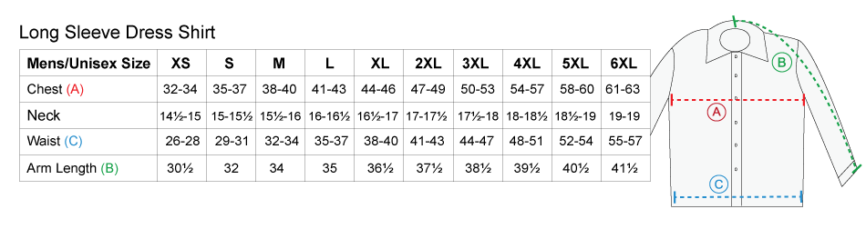

```{r setup3, include=FALSE}
library(broom)
library(dplyr)
library(ggplot2)
library(stringr)
library(rvest)
library(mosaicData) 
library(ggmosaic)
library(NHANES)
library(mosaic)
knitr::opts_chunk$set(echo = FALSE)
```

# Regression Models

Now that we've visualize our data, we can attempt to build models to explain the variation we observe.

Given data on a **response or outcome variable** $y$ and a **predictor or explanatory variable(s)** $x$, find a function that will model and predict $y$ from $x$ (where $x$ may be a single variable, but more typically a set of variables -- we'll get there). We want to figure out $f$ such that $\hat{y} = f(x)$ is a good predictor of $y$ or in other words, we want the model prediction to be close to the observed response (we want $y-\hat{y}$ to be small). 

```{block type='reflect'} 
Can you think of some examples in which we'd want a model to do prediction?
```

Other times, we want a **model**, $f$, to "explain" the relationship between the $x$ and $y$ variables. Note that an overly complicated model may not be that useful it can't help us understand the relationship, but it may produce better predictions. George Box is often quoted "All models are wrong but some are useful." 

```{block type='reflect'} 
Can you think of some examples in which we'd want a model to do explain a phenomena?
```

We are going to consider a simple, but powerful model in which we limit this function $f$ to be a straight line with a y-intercept, $b_0$, and slope, $b_1$.

$$\hat{y} = f(x) = b_0 + b_1x$$
This is a **simple linear regression model**. It is the foundation of many statistical models used today and more flexible than you may think. 

##Lines

Let's return to the thought experiment where you were a manufacturer of dress shirts. 

```{r,echo=TRUE}
bodyfat <- read.delim("http://sites.williams.edu/rdeveaux/files/2014/09/bodyfat.txt")

bodyfat %>%
  ggplot(aes(x = Neck, y = Chest)) +
  geom_point(color = 'steelblue') + 
  xlab('Neck size (cm)') + 
  ylab('Chest size (cm)') +
  theme_minimal()
```


If you were to add one or multiple lines to the plot above to help you make business decisions, where would you want it (or them)?

Let's say you were only going to make one size of shirt.  You might want to add a horizontal line at the mean Chest size and a vertical line at the mean Neck size. 

```{r, echo=TRUE}
bodyfat %>%
  ggplot(aes(x = Neck, y = Chest)) +
  geom_point(color = 'steelblue') + 
  geom_hline(yintercept = 100.662) +
  geom_vline(xintercept = 37.9448) +
  xlab('Neck size (cm)') + 
  ylab('Chest size (cm)') +
  theme_minimal()
```

We can see that a shirt made to these specifications would fit the "average person." However, this might not serve your market very well. For many people, the shirt would be too tight because their chest and/or neck sizes would be larger than average. For many people, the shirt would be too large because they chest and/or neck sizes would be smaller than average. 

Let's try something else. Let's allow ourselves 5 different sizes (XS, S, M, L, XL). Then, we can cut the Neck sizes variable into 5 groups of equal length and estimate the mean Chest sizes within each of these groups. 

```{r, echo=FALSE}
bfmeans <- bodyfat %>%
  mutate(NeckGroups = cut(Neck, 5)) %>%
  group_by(NeckGroups) %>%
  summarize(Means = mean(Chest))

labs <- levels(bfmeans$NeckGroups)
bfmeans <- cbind(bfmeans, lower = as.numeric( sub("\\((.+),.*", "\\1", labs) ),
      upper = as.numeric( sub("[^,]*,([^]]*)\\]", "\\1", labs) ))

bodyfat %>%
  ggplot(aes(x = Neck, y = Chest)) +
  geom_point(color = 'steelblue') + 
  geom_segment(aes(x = lower, xend = upper, y = Means, yend = Means),bfmeans)+
  geom_vline(aes(xintercept = upper), data = bfmeans) +
  geom_vline(aes(xintercept = lower), data = bfmeans) +
  xlab('Neck size (cm)') + 
  ylab('Chest size (cm)') +
  theme_minimal()
```

```{block type='reflect'}
What do these lines tell us for our business venture?
```

What if we wanted to be able to make more sizes? Could we get a pretty good sense of what the chest sizes should be for a given neck size?

Could we find one line to describe the relationship between Neck size and Chest size?

```{r, echo=FALSE}
bodyfat %>%
  ggplot(aes(x = Neck, y = Chest)) +
  geom_point(color = 'steelblue') + 
  geom_smooth(method = 'lm', se = FALSE) +
  geom_segment(aes(x = lower, xend = upper, y = Means, yend = Means),bfmeans)+
  geom_vline(aes(xintercept = upper), data = bfmeans) +
  geom_vline(aes(xintercept = lower), data = bfmeans) +
  xlab('Neck size (cm)') + 
  ylab('Chest size (cm)') +
  theme_minimal()
```

```{block type='reflect'}
What does line tell us for our business venture?
```

If the scatterplot between two quantitative variables **resembles a straight line**,

- a straight line could roughly **describe** the mean of y for each value of x.
- a straight line could **describe** how much we'd *expect* y to change based on a 1 unit change in x.
- a straight line could help us **predict** the y based on a new value of x.


## Choosing the best fitting line

To choose the best fitting line, we need to choose the right intercept ($b_0$) and slope ($b_1$),

$$ \hat{y} = f(x) = b_0 + b_1x $$

We have $n$ points on a scatterplot, $(x_i,y_i)$ where $i=1,...,n$. 

### First idea
Minimize the sum of the **residuals**, $e_i = y_i - \hat{y}_i = y_i - ( b_0 + b_1x_i)$. The residual is the prediction error, the difference between what you observe and what you predict.

- Problem: We will have positive and negative residuals; they will cancel each other out. This won't give us what we want.


### Second idea
Minimize the sum of the absolute value of the residuals, $\sum_{i=1}^n |y_i - \hat{y}_i| = \sum_{i=1}^n |e_i|$.

- Problem: This is referred to as **Least Absolute Deviations**, but there isn't always one unique line that satisfies this. So, this won't give us what we want.

### Third idea
Minimize the sum of squared residuals, $\sum_{i=1}^n (y_i - \hat{y}_i)^2= \sum_{i=1}^n e_i^2$.

- This is referred to as **Least Squares** and has a unique solution. Yeah!!!

--------

##Least Squares

Let's try to find the **minimum of the Sum of Squares Residuals** by searching over a grid of values for (intercept, slope).

Below is a visual of the sum of squared residuals for a variety of values on a grid. The surface height is sum of squared residuals for each combination of slope and intercept.

```{r, echo=FALSE}
f <- function(b){
  sum((bodyfat$Chest - (b[1] + b[2] * bodyfat$Neck))^2)
} 
b0 = seq(-20,20,by=.5)
b1 = seq(-10,20,by=1)
b <- expand.grid(b0,b1)
ss <- apply(b,1,f)

persp(b0,b1,matrix(ss,length(b0),length(b1)),theta=65,zlab='Sum of Squares')
```

We can see there is valley where the minimum must be. Let's visualiz this in a slightly different way. We'll encode the surface height as color (white is lowest). 

```{r, echo=FALSE}
image(b0,b1,matrix(ss,length(b0),length(b1)),col=c('white',topo.colors(100)[100:1]))
```

The large Sum of Square values are dominating this image, so let's change the color scheme to see more variation in smaller values (white is lowest).

```{r, echo=FALSE}
b0 = seq(-10,10,by=.1)
b1 = seq(0,5,by=.1)
b <- expand.grid(b0,b1)
ss <- apply(b,1,f)
image(b0,b1,matrix(log(ss),length(b0),length(b1)),col=c('white',topo.colors(100)[100:1])) #Log Sum of Squares to see variation in lower end
```

We can limit our search to $b_0 \in (-10,10)$ and $b_1 \in (2,3)$
```{r echo=TRUE}
b0 = seq(-10,10,by=.05)
b1 = seq(2,3,by=.05)
b <- expand.grid(b0,b1)
ss <- apply(b,1,f)

b[ss == min(ss),]
```

We have the minimum point. Over the grid of values, the minimum sum of squared residuals happens when the intercept is -3.7 and the slope is 2.75. 
```{block type='math'}
(Optional) 

**Alternative ways to find the minimum**

- We could try a numerical optimization algorithm such as steepest descent.
- We could use multivariable calculus (find partial derivatives, set equal to 0, and solve).
```

If you find the minimum via calculus, you'll find that we can write the Least Squares solution in an equation format as functions of summary statistics!,

$$ b_1  = r\frac{s_y}{s_x}$$

and

$$ b_0 = \bar{y} - b_1\bar{x} $$

where $\bar{x}$ is the mean of the variable on the x-axis, $\bar{y}$ is the mean of the variable on the y-axis, $s_x$ is the standard deviation of the variable on the x-axis, $s_y$ is the standard deviation of the variable on the y-axis, and $r$ is the correlation coefficient between the two variables.

Let's do that calculation "by hand" first in R.

```{r echo=TRUE}
sy = sd(bodyfat$Chest)
sx = sd(bodyfat$Neck)
r = cor(bodyfat$Chest,bodyfat$Neck)
ybar = mean(bodyfat$Chest)
xbar = mean(bodyfat$Neck)

(b1 = r*sy/sx)
(b0 = ybar - b1*xbar)
```

Now, from now on, we'll use the `lm()` function which stands for linear model. This gives us the Least Squares solution to the "best fitting line."

```{r}
lm(Chest ~ Neck, data = bodyfat) #When you see ~, think 'as a function of'
```


--------

##Properties of Least Squares Line

- $(\bar{x},\bar{y})$ is on the line. 

- Least squares residuals add to 0.

- The standard deviation of the residuals gives us a sense of how bad our predictions (based on the line) could be. 

$$s_e = \sqrt{\frac{\sum^n_{i=1} (y_i-\hat{y}_i)^2}{n-2}}  = \sqrt{\frac{\sum^n_{i=1} e_i^2}{n-2}} $$

In R: $s_e$ is called the "residual standard error"

```{r echo=TRUE}
lm.fit = lm(Chest ~ Neck, data = bodyfat)
summary(lm.fit)
tidy(lm.fit)
```

This simple linear regression line is

$$\widehat{Chest} = -3.18 + 2.73Neck$$

Given your neck size, we can predict your chest size within 5 to 10 inches since $s_e = 5.22$. 

```{block type='reflect'}
If you were a shirt manufacturer, what would you do with this information?
```

Let's see how some real companies create shirts. I've added boxes to represent the advertised range for Neck and Chest sizes for each brand.




```{r}
with(bodyfat,plot(Chest~Neck,main='Calvin Klein'))
abline(with(bodyfat,lm(Chest~Neck)))
rect(14*2.54,36*2.54,14.5*2.54,37*2.54,col='red')
rect(15*2.54,38*2.54,15.5*2.54,39*2.54,col='red')
rect(16*2.54,40*2.54,16.5*2.54,41*2.54,col='red')
rect(17*2.54,42*2.54,17.5*2.54,43*2.54,col='red')
```


```{r}
with(bodyfat,plot(Chest~Neck,main = 'Express'))
abline(with(bodyfat,lm(Chest~Neck)))
rect(13*2.54,33*2.54,13.5*2.54,33.5*2.54,col='red')
rect(14*2.54,36.5*2.54,14.5*2.54,38.5*2.54,col='red')
rect(15*2.54,39*2.54,15.5*2.54,41.5*2.54,col='red')
rect(16*2.54,42*2.54,16.5*2.54,44.5*2.54,col='red')
rect(17*2.54,45*2.54,17.5*2.54,47.5*2.54,col='red')
rect(18*2.54,48*2.54,18.5*2.54,50.5*2.54,col='red')
```


```{r}
with(bodyfat,plot(Chest~Neck,main='Brooks Borthers'))
abline(with(bodyfat,lm(Chest~Neck)))
rect(13*2.54,32*2.54,13.5*2.54,34*2.54,col='red')
rect(14*2.54,34*2.54,14.5*2.54,36*2.54,col='red')
rect(15*2.54,38*2.54,15.5*2.54,40*2.54,col='red')
rect(16*2.54,42*2.54,16.5*2.54,44*2.54,col='red')
rect(17*2.54,46*2.54,17.5*2.54,48*2.54,col='red')
```

```{block type='reflect'}
We haven't told you how the sample data we've been using was collected. As you compared the brands to this sample data, what assumptions were you making about the population that the sample was drawn from? What questions do you have about the sample data? 
```

##Interpretation

Let's look at the summary of the `lm()` function in R again.

```{r echo=TRUE}
summary(lm.fit)
```

**Least Squares/Regerssion Line** ($\hat{y} = b_0 + b_1x$)

- The line gives the estimated average of y for each value of x (**within observed range of x**)
- Example: The regression line of (Predicted Chest = -3.18 + 2.73Neck) gives the estimated average Chest size for a given Neck size, based on our sample of data. 

**Intercept** ($b_0$)

- The intercept gives the average value of y when x is zero (**think about context**)
- Example: If Neck size = 0, then the person doesn't exist. In this context, the intercept doesn't make much sense to interpret. 


**Slope** ($b_1$)

- The slope gives the change in average y for 1 unit increase in x (**not for individuals and not causal**)
- Example: If we consider all individuals with a neck size 1 cm larger, then we'd expect the average chest size to be by about 2.7cm larger.


###Correlation or Association v. Casuation

In order to say that an increase in X **will lead** to an increase in Y (causal effect), we need to control for all other possible variables that could impact both X and Y (**confounding variables**).

- In order to prove a causal relationship (X causes Y), you need to keep everything *(and we mean everything)* the same or as similar as possible except the difference in X. 


##Evaluation

Let's consider another data example. Can we predict your college GPA based on your high school GPA? (Disclaimer: this is not Macalester data)


```{r echo=TRUE}
sat <- read.csv("Data/sat.csv")
```

```{r echo=TRUE}
sat %>%
  ggplot(aes(x = high_GPA, y = univ_GPA)) +
  geom_point(color = 'steelblue') +
  geom_smooth(method = 'lm', se = FALSE) +
  xlab('HS GPA') +
  ylab('College GPA') + 
  theme_minimal()
```

First things first. Describe the scatterplot. 

- **Direction**: positive relationship (higher high school GPA is associated with higher college GPA)
- **Form**: generally linear
- **Strength**: There is a weak relationship when high school GPA < 3.0 (r = .32) and a fairly strong relationship when high school GPA > 3.0 (r = .68).
- **Unusual**: As seen with the strength, there is increased variability in college GPA among individuals with lower high school GPA. That variability decreases with increased high school GPA. We call this pattern of unequal variation as **"thickening."**


```{r echo=TRUE}
sat %>%
  mutate(HighHSGPA = high_GPA > 3) %>%
  group_by(HighHSGPA) %>%
  summarize(Cor = cor(high_GPA,univ_GPA))
```

Let's build a model to predict college GPA based on high school GPA based on this sample data. Since we noted that there was a linear relationship, let's find the least squares regression line.

```{r echo=TRUE}
lm.gpa <- lm(univ_GPA ~ high_GPA, data = sat)
summary(lm.gpa)
```

The best fitting line is (Predicted College GPA = 1.09 + 0.675High School GPA). 

Let's plug in a few values.

- If High School GPA = 2: Predicted College GPA = 1.09 + 0.675*2 = 2.44

```{r echo=TRUE}
1.09 + 0.675*2
predict(lm.gpa, newdata = data.frame(high_GPA = 2))
```

- If High School GPA = 3.5: Predicted College GPA = 1.09 + 0.675*3.5 = 3.45

```{r echo=TRUE}
1.09 + 0.675*3.5
predict(lm.gpa, newdata = data.frame(high_GPA = 3.5))
```

- If High School GPA = 4.5: Predicted College GPA = 1.09 + 0.675*4.5 = 4.13

```{r echo=TRUE}
1.09 + 0.675*4.5
predict(lm.gpa, newdata = data.frame(high_GPA = 4.5))
```

Does it make sense to use this model for high school GPA's > 4.5?  Some high schools have a max GPA of 5.0 due to weighting of advanced courses. 

- What is the maximum high school GPA in this data set? 
- What if your college doesn't allow for GPA's above 4.0? 


```{r echo=TRUE}
sat %>%
  summarize(max(high_GPA))
```

Making predictions beyond the observed range of values is called **extrapolation** and is generally a risky thing to do. If you extrapolate beyond the minimum or maximum of the observed values, then you are assuming that the relationship you observe can be extended into the new prediction range. This is the main issue of **forecasting**, making predictions in the future. You have to assume that the trend that you observe now will continue in the future and that the current state of affairs will stay the same.

###Prediction Errors

If the residuals were approximately unimodal and symmetric, we expect about 95% of the residuals to be within 2 standard deviations of 0 (the mean residual). 

```{r echo=TRUE}
hist(residuals(lm.gpa))
```

```{r echo=TRUE}
SSE = sum(residuals(lm.gpa)^2)
n = (length(residuals(lm.gpa)))
s = sqrt(SSE/(n-2))
s
2*s
```

Using this model, we can predict your GPA within about $0.5$ GPA points. Is this useful? 


```{r echo=TRUE}
sd(sat$univ_GPA)
2*sd(sat$univ_GPA)
```

Without knowing your high school GPA, we could have guessed within $\pm 0.9$.  That was based on the sum of squared total variation (variation around the mean),

$$ SSTO = \sum{(y_i -\bar{y})^2} $$

SSTO is the numerator of the standard deviation of $y$ (without knowing anything about $x$).

```{r echo=TRUE}
(SSTO = sum((sat$univ_GPA - mean(sat$univ_GPA))^2))
```


###$R^2$

Let's study the reduction in the unexplained variation (residuals from a linear regression model -- with $x$ v. the original deviations from the mean -- without $x$). 

```{r, echo=FALSE}
gpavar = data.frame(resids = c(residuals(lm.gpa), sat$univ_GPA-mean(sat$univ_GPA)), type = rep(c('Linear Model Residuals','Original Deviations from Mean'), each = nrow(sat)))

gpavar %>%
  ggplot(aes(x = type, y = resids)) +
  geom_boxplot() +
  ylab('Residuals') +
  xlab('Type of Residuals')
```


We started with the sum of the deviations from the mean $SSTO = \sum{(y_i - \bar{y})^2}$ before we had info about high school GPA ($x$).

- Now, with our knowledge of $x$, we have $SSE = \sum{(y_i - \hat{y_i})^2}$

- $SSE$ should be smaller than $SSTO$ (!)

Two extreme cases: 

  * If the error (SSE) goes to zero, we'd have a "perfect fit". 
  
  * If $SSE = SSTO$, $x$ has told us nothing about $y$.

- So we define a measure called **R Squared**,

$$ R^2 = 1 - \frac{SSE}{SST} = 1 - \frac{ \sum{(y_i - \hat{y_i})^2}}{ \sum{(y_i - \bar{y})^2}}$$

```{r echo=TRUE}
1 - SSE/SSTO
glance(lm.gpa) #r.squared = R^2, sigma = s_e (ignore the rest)
```

- $R^2$ can be interpreted as the *fraction* or *percent* of the total variation in $y$ "accounted for" by the model in $x$. 

- Is there a "good" value of $R^2$? Same answer as correlation -- no.

- $R^2$ doesn't tell you the direction or the form of the relationship.

- Note: $R^2 = r^2$ for simple linear models with one x variable.

---


##Diagnostics

Residuals are what's left over from a linear fit. We can actually learn a lot by studying what is left over, what is left unexplained by the model. INSERT SCATOLOGY JOKE. 

What do we need for a simple linear model to make sense?

  * Variables are both **Quantitative**
  
  * Relationship is **Straight Enough**
  
  * There are no extreme **Outliers** 
  
  * Spread is roughly same throughout -- **No Thickening**
  
To check these, we look at the original scatterplot and a plot of *residuals* vs. *fitted or predicted values*,

```{r echo=TRUE}
augment(lm.gpa, data = sat) %>%
  ggplot(aes(x = .fitted, y = .resid)) +
  geom_point() +
  geom_hline(yintercept = 0) +
  theme_minimal()
```

What do you think?

  * Is there any pattern? (Is the original scatterplot straight enough?)
  * Is there equal spread across prediction values?

We want to avoid extreme outliers because points that are both far from the mean of x and do not fit the overall relationship have **leverage** to change the line.

See the example below. See how the relationship changes with the addition of one point, one extreme outlier.  

```{r}
x = runif(50,0,10)
y = rnorm(50)
dat = data.frame(x,y)
dat %>%
  ggplot(aes(x,y)) + 
  geom_point() + 
  geom_smooth(method='lm') + 
  xlim(0,20) + 
  ylim(-5,10) + 
  theme_minimal() 

x = c(x,20)
y = c(y,10)
dat = data.frame(x,y)

dat %>%
  ggplot(aes(x,y)) + 
  geom_point() + 
  geom_smooth(method='lm') + 
  xlim(0,20) + 
  ylim(-5,10) + 
  theme_minimal() 
```

Check out this interactive visualization to get a feel for leverage: http://omaymas.github.io/InfluenceAnalysis/


###Solutions to Issues

If the observed data don't satisfy the conditions above, what can we do? Should we give up using a statistical model? No!

* Problem: Both variables are NOT **Quantitative**
- If your x-variable is categorical, we'll turn it into a quantitative variable using **indicator variables** (coming up) 
- If you have a binary variable (exactly 2 categories) that you want to predict as your y variable, we'll use **logistic regression** (coming up)

* Problem: Relationship is NOT **Straight Enough**
- If the plot does not thicken, we can add higher degree terms to the model (**multiple linear regression** - coming up)
- If the plot does thicken, see solutions below.

* Problem: Spread is NOT the same throughout
- You may be able to transform the y-variable using mathematical functions ($log(y)$, $y^2$, etc.) to make the spread more consistent (one approach is to use **Box-Cox Transformation** -- take more statistics classes to learn more)
- Be careful in interpreting the standard deviation of the residuals

* Problem: You have **extreme outliers**
- Look into the outliers. Determine if they could be due to human error. Think carefully about them, dig deep.
- Do a **sensitivity analysis**: Fit a model with and without the outlier and see if your conclusions drastically change (see if those points had leverage to change the model).

##Multiple Linear Regression

We can generalize the idea of a simple linear model by including many explanatory variables (X's). A **multiple linear regression model** can be written as:

$$\hat{y}_i = b_0 + b_1x_{i1} + \cdots + b_kx_{ik}$$

- Each coefficient $b_j$ can be interpreted as the increase in the predicted/average y associated with a 1 unit increase in $x_j$, **keeping all other variables constant**. (\*There are some exceptions - we'll get there)

- These X variables's can be 
    - Quantitative variables (or transformations of them)
    - Indicator variables for categorical variables (only need $k-1$ indicators for variable with $k$ categories)
    - Interaction terms (product of two variables, which allows for *effect modification*)
    
Let's talk about home prices. We want to build a model to predict the price of a home based on its many characteristics. Here we have a data set of homes recently sold in New England with many variables such as the age of the home, the land value, whether or not it has central air conditioning, the number of fireplaces, the sale price, and more...

```{r echo=TRUE}
homes <- read.delim('http://sites.williams.edu/rdeveaux/files/2014/09/Saratoga.txt')
head(homes)
```

\*The exception to the interpretation comment above is if our variables are strongly correlated. In this case, we cannot keep all other variables constant because if you increase the value of one, then a variable with high correlation will also likely change in value. 


###Indicator Variables

In New England, fireplaces are often used as a way to heat the house. Let's study the impact of a fireplace has on the sale price of a home. In particular, we only care if the home has 1 or more fireplaces or no fireplaces. So we make a new variable that is TRUE if there are more than 0 fireplaces in a home and FALSE otherwise. 

```{r echo=TRUE}
homes <- homes %>%
  mutate(AnyFireplace = Fireplaces > 0)
```

In order to include this information in our linear regression model, we need to turn that categorical variable (`AnyFireplace`, TRUE or FALSE) into an **indicator variable**,

$$ 1_{AnyFireplaceTRUE} = \begin{cases}1 \quad \text{ if a home has at least one fireplace}\\ 0\quad \text{ if a home does not have a fireplace} \end{cases}$$

In fact, R creates this indicator for you when you put a categorical variable as an X variable in the model.

```{r echo=TRUE}
lm.home <- lm(Price ~ AnyFireplace, data = homes)
tidy(lm.home)
```

Our "best fitting line" is

$$Predicted\;Price = 174653.35 + 65260.61*1_{AnyFireplaceTRUE}$$

What does this mean?

Let's think about two types of homes: a home with one or more fireplaces and a home without a fireplace. Let's write out the equations for those two types of homes. 

- Home with fireplace: Predicted Price = 174653.35 + 65260.61*1 = $239,914

```{r echo=TRUE}
174653.35 + 65260.61*1
```

- Home without fireplace: Predicted Price = 174653.35 + 65260.61*0 = $174,653.35


The difference between these predicted prices is \$65,260.61. So is this how much a fireplace is worth? If I installed a fireplace in my house, should the value of my house go up \$65,260?

- No, because we are not making causal statements based on observational data. What could be confounding this relationship? What third variable may be related to both the price and whether or not a house has a fireplace?

Let's look at the size of the house. Is price related to the area of living space (square footage)?

```{r echo=TRUE}
homes %>%
  ggplot(aes(x = Living.Area, y = Price)) + 
  geom_point(color = 'steelblue') +
  theme_minimal()
```

Is the presence of a fireplace related to area of living space?

```{r echo=TRUE}
homes %>%
  ggplot(aes(x = AnyFireplace, y = Living.Area)) + 
  geom_boxplot() +
  theme_minimal()
```

So Living Area could be a confounding variable between AnyFireplace and Price. 

Let's put Living.Area in the model along with AnyFireplace to account for it.

```{r echo=TRUE}
lm.home2 <- lm(Price ~ AnyFireplace + Living.Area, data = homes)
tidy(lm.home2)
```

Our "best fitting line" is

$$Predicted\; Price = 13599.16 + 5567.37*1_{AnyFireplaceTRUE} + 111.21*Living.Area$$

What does this mean? 

Let's think about two types of homes: a home with one or more fireplaces and a home without a fireplace.

- Home with fireplace: Predicted Price = 13599.16 + 5567.37\*1 + 111.21\*Living.Area = \$19166.53 + \$111.21\*Living.Area

```{r echo=TRUE}
13599.16 + 5567.37*1
```

- Home without fireplace: Predicted Price = 13599.16 + 5567.37\*0 + 111.21\*Living.Area = \$13599.16 + \$111.21\*Living.Area


If we keep Living.Area constant by considering two equally sized homes, then we'd expect the home with the fireplace to be worth \$5567.37 more than a home without a fireplace. We see this by taking the difference between the two equations, Predicted Price (with Fireplace) - Predicted Price (without Fireplace) = (\$19166.53 + \$111.21\*Living.Area) - ( \$13599.16 + \$111.21\*Living.Area) = \$19166.53 - \$13599.16 = \$5567.37, the difference in the intercepts.

- Note this was the estimated coefficient for AnyFireplaceTRUE. 

- So the \$5567.37 is the increase in the predicted or average Price associated with a 1 unit change in AnyFireplace (TRUE or FALSE), **keeping all other variables (Living.Area) constant**.

- Similarly, we could reason that \$111.21 is the increase in the predicted or average Price associated with a 1 square footage increase in Living.Area, **keeping all other variables (AnyFireplace) constant**.

Let's look back at the relationship between Living.Area and Price and color the scatterplot by AnyFireplace. So we are now looking at three variables at a time. The model with AnyFireplace and Living.Area results in two lines, with different intercepts but the same slope (parallel lines). 

```{r echo=TRUE}
homes %>%
  ggplot(aes(x = Living.Area, y = Price, color = AnyFireplace)) + 
  geom_point() +
  theme_minimal()
```

Let's try and fit two separate lines to these two groups of homes, home with any fireplaces and home with no fireplaces. Do these lines have the same intercepts? Same slopes?

```{r echo=TRUE}
homes %>%
  ggplot(aes(x = Living.Area, y = Price, color = AnyFireplace)) + 
  geom_point() +
  geom_smooth(method = 'lm', se = FALSE) +
  theme_minimal()
```

In this case, it look as though having a fireplace in your house slightly changes the relationship between Living.Area and Price. In fact, having a fireplace in your house, the increase in your price for every 1 square foot is greater than that for homes without fireplaces (slopes are different).


###Interaction Variables

We can actually allow for different slopes within one regression model, rather than fitting two separate models. 

- If we add a variable in the model as is, it changes the intercept.

- If we want different slopes such that the value of a variable, $x_1$, impacts the effect of another, $x_2$, on Y such that the slope for $x_2$ is a function of $x_1$, 
$$b_2 = a + bx_1$$ 
then we allow for **effect modification**,
$$\hat{y} = b_0 + b_1x_{1} + b_2x_{2}= b_0 + b_1x_{1} + (a+bx_1)x_{2}= b_0 + b_1x_{1} +ax_2+bx_1x_{2}$$
using an **interaction term,** which is the product of two variables. In the case above, we have $x_1*x_2$. 

Let's do that with our housing data. Let's include an interaction term between AnyFireplace and Living.Area to allow for different slopes.


```{r echo=TRUE}
lm.home3 <- lm(Price ~ AnyFireplace*Living.Area, data = homes)
tidy(lm.home3)
```

What does this mean? Let's think about two types of homes: a home with one or more fireplaces and a home without a fireplace.

- Home with fireplace: Predicted Price = 40901.29 + -37610.41\*1 + 92.36391\*Living.Area + 26.85\*Living.Area\*1 = \$3,290.88 + \$119.21\*Living.Area

```{r echo=TRUE}
40901.29 + -37610.41*1
92.36391 + 26.85*1
```

- Home without fireplace: Predicted Price = 40901.29 + -37610.41\*0 + 92.36391\*Living.Area + 26.85\*Living.Area\*0 = \$40,901.29 + \$92.36\*Living.Area

We see a different slopes and different intercepts for these two groups. 


###Conditions for Multiple Linear Regression

In order for a multiple linear regression model to make sense, 

- Relationships between each quantitative $X$'s and $Y$ are **straight enough** (check scatterplot's and residual plot)
- About **equal spread** of residuals across fitted values (check residual plot)
- No extreme outliers (points far away in X's can have **leverage** to change the line)


###Is the Difference Real?

We could also ask, is there really a difference in the slopes for Living Area and Price between homes with and without a fireplace?

```{r echo=TRUE}
lm.home4 <- lm(Price ~ Living.Area*AnyFireplace, data = homes) 
summary(lm.home4)
```

If we ask ourself this question, we are assuming a few things:

1. We would like to make a general statement about a **target population of interest**.

2. We don't have data for everyone in our population (we don't have a **census**).

3. Depending on who ends up in our **sample**, the relationship/difference/estimate may change a bit.

4. We want to know how much the relationship/difference/estimate may change based on **sampling variation.**  

- Let's treat our sample (of size $n$) as our 'fake' population (since we don't have the full population).
    - Randomly sample from our sample (with replacement) a new sample of size $n$
- Calculate the least squares regression line.
- Repeat.

```{r echo=TRUE}
boot <- do(1000)*lm(Price ~ Living.Area*AnyFireplace, data = resample(homes))

boot %>%
  ggplot(aes(x = Living.Area.AnyFireplaceTRUE)) +
  geom_histogram() +
  xlab('Bootstrap Difference in Slopes')
```

This is called **Bootstrapping** and it is used to 1) measure the variability in estimates (difference in slopes in this case) between random samples and 2) provide an interval of plausible values for the estimate (difference in slopes in this case).  

Let's first look at the variability of the difference in slopes across the bootstrap samples. The standard deviation of the slopes will be similar to the std.error from the linear model output.

```{r}
boot %>%
  summarize(sd(Living.Area.AnyFireplaceTRUE))#this is going to be of similar magnitude to the Std Error in output
tidy(lm.home4)
```

To get an interval of plausible values, we look at the histogram and take the middle 95%. The lower end will be the 2.5th percentile and the upper end will be the 97.5th percentile.

```{r}
boot %>%
  summarize(lower = quantile(Living.Area.AnyFireplaceTRUE, 0.025), upper = quantile(Living.Area.AnyFireplaceTRUE, 0.975))
```

```{block type='reflect'}
Based on this evidence, do you think it is possible that the slopes are the same for the two types of homes, with and without fireplaces?
```

##Logistic Regression

If you are interested in predicting a binary categorical variable (only 2 possible outcomes), the standard linear regression models don't apply. If you let the two outcomes be 0 and 1, you'll never get a straight line relationship with an x variable. 

Throughout this section, we will refer to one outcome as 'success' (denoted 1) and 'failure' (denoted 0). Depending on the context of the data, the success could be a negative thing such as 'heart attack' or '20 year mortality'. 

We will let $\pi$ be the chance of success and $1-\pi$ be the chance of failure. We want to build a model to explain why the chance of success may be higher for one group of people in comparison to another. 

###Logistic and Logit

###Fitting the Model

###Interpretation

###Diagnostics


