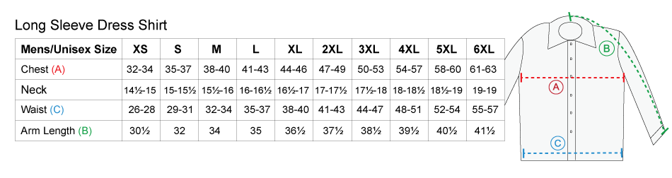

--- 
title: "Math 155 Notes"
author: "Brianna Heggeseth & Leslie Myint"
date: "Updated: `r Sys.Date()`"
site: bookdown::bookdown_site
output: 
  bookdown::gitbook:
    split_by: section
    config:
      toc: 
        collapse: section
        scroll_highlight: yes
documentclass: book
link-citations: yes
github-repo: bcheggeseth/Math155Notes
description: "This includes notes for Math 155 at Macalester College."
---

# Preface {-}

This book contains notes for MATH 155 at Macalester College. It contains definitions, data examples, and R code explanations that provide a foundation for the activities we will do in class.

This is a living document, which will get updated throughout the semester.

*When* you find typos or have clarifying questions, please email bheggese@macalester.edu or lmyint@macalester.edu.

<!--chapter:end:index.Rmd-->

```{r setup1, include=FALSE}
library(broom)
library(dplyr)
library(ggplot2)
library(stringr)
library(rvest)
library(mosaicData) 
library(ggmosaic)
library(NHANES)
knitr::opts_chunk$set(echo = TRUE)
```

# Data Collection and Quality

We live in a world where data touch nearly every aspect of our lives: health care, online shopping, transportation, entertainment. From search engines to satellite images, from cell phones to credit cards, current technology can produce data faster than we can analyze them. 
 
This course is the beginning of your journey into the field of Statistics, a discipline whose main goal is to extract information and meaning from data. We do this is by visually exploring the data and building models to try to explain observed variability. First, we will take some time to think about where data come from and what factors might make data more or less reliable.

## What is Data?

Data is *anything* that contains information. We typically think of data being stored in spreadsheets, but it can come in many other formats such as images or collections of text (whether 280 character tweets or fictional novels). 

For example, we can take the pixels of digital images or text from all State of the Union addresses and transform them into a tidy, rectangular format. **Tidy data** is a table in which

- Each row of a rectangular table corresponds to an **observation** or **case** (e.g. person, classroom, country, image,  speech at a particular time) 
- Each column correspond to a characteristic or feature or **variable** that summarize those cases (e.g. age, average grade, average income, intensity of red pixels, number of times the word "Together" is used)

Variables can be either **categorical** or **quantitative** variables.

- **Categorical variable:** *A characteristic with values that are names of categories; the names of categories could be numbers such as with zipcodes. If the categories have a natural ordering, it could be called an ordinal variable, but we won't be distinguishing between different types of categorical variables in this class.* 

- **Quantitative variable:** *A characteristic with measured numerical values with units.*

*Note: Any quantitative variable can be converted into a categorical variable by creating categories defined by intervals or bins of values.* 

The following graphic from the book [R for Data Science](http://r4ds.had.co.nz/), by Garrett Grolemund and Hadley Wickham illustrates the features of tidy data.

 of R for Data Science](Photos/tidy.png)

The transformation process from raw data to a tidy data format is often called **feature extraction** and is not a short or easy task. In this introductory course, we will work with data that are already tidy.

Cases are often referred to as the **units of analysis**. As analysts, it is important for us to consider what to use as the unit of analysis when we have information, say, on both individuals and their classrooms. Do we want to understand matters at the individual or the classroom level? Answers to these questions will depend on the context and our research questions.


## Data Context

For any data set, you should always ask yourself a few questions to provide vital **context** about that data set. 

- **Who is in the data set?** What is the observational unit or **case**? How did they end up in the data set? Were they selected randomly or were they in a particular location a particular time?
- **What is being measured or recorded on each case?** What are the characteristics, features, or **variables** that were collected?
- **Where were they collected?** In one location? Multiple locations?
- **When was the data collected?** One point in time? Over time? If data quality degrades over time (e.g. lab specimens), is this a concern?
- **How were they collected?** What instruments and methods used for measurement? What questions were asked and how? Questionnaire? By phone? In person?
- **Why were they collected?** For profit? For academic research? Are there conflicts of interest?
- **Who collected this data?** An agency, an individual researcher?

Thinking about this data context informs us how we analyze the data, what conclusions we can draw, and whether we can generalize our conclusions to a larger population.

Many of these data context questions also hint at general considerations for threats to data quality. Threats to data quality generally arise through **sampling bias**, **information bias**, and **study design.**

## Sampling

When we study a phenomenon, we generally care about making a conclusion that applies to some **target population of interest**. However, we cannot feasibly collect data on that entire population (called a census), so we collect a **sample** of individuals. We want our sample to be **representative** of the target population in that we want our sample to resemble the target population in key ways.

```{block, type="reflect"}
How is representativeness affected by our research question? Can a sample be representative for one goal but not another?
```

When our method of selecting a sample is flawed, **sampling bias** results, and our sample is unrepresentative of the target population. How does this tend to happen, and how can we avoid it?

It is first helpful to define the term **sampling frame**. A sampling frame is the complete list of individuals/units in the target population. For example, it could be a spreadsheet listing every individual that lives in Minnesota.

### Sampling Bias

The following are common ways that sampling bias can arise, and they all share the feature that a sampling frame is not used:

- **Convenience Sampling:** *Individuals that make up the sample are easy to contact or to reach (e.g. standing on a street corner and asking passerbys to answer a few questions). The people sampled will likely be systematically different than the target population.*

- **Self-Selection and Volunteer Sampling:** *Individuals that make up the same self-select or volunteer to be in a sample. They are likely to be systematically different than the target population (e.g. reviews on Amazon, individuals that call in for radio shows).*

One result of using these sampling techniques is that we can get **undercoverage** in the sample. This happens when some members of the population are inadequately represented in the sample due to the sampling procedure (often from convenience samples). A famous example in United States history is the 1936 Literary Digest poll that completely mispredicted the presidental election. The magazine predicted a strong victory for Alfred Landon, but Franklin Delano Roosevelt ended up winning the election by a substantial margin. The survey relied on a convenience sample, drawn from telephone directories and car registration lists. In 1936, people who owned cars and telephones tended to be more affluent.

Without a complete sampling frame, we have no control over what units enter the sample because we do not even have a complete list of the units that could be sampled. Imagine that our target population is like a bowl of soup, these forms of sampling are similar to scooping only the bits of soup that float to the top.

### Random Sampling

With a sampling frame, we can do better and hopefully avoid sampling bias by using randomization. In our soup analogy, this amounts to mixing the soup thoroughly and dipping our spoon in random locations. These strategies are called **probability sampling** strategies or, more colloquially, **random sampling** strategies. In probability sampling, each unit in the sampling frame has a known, nonzero probability of being selected, and the sampling is performed with some chance device (e.g. coin flipping, random number generation). Some probability sampling techniques include:

**Simple Random Sampling:** *Each unit in the sampling frame has the same chance of being chosen and individuals are selected without replacement. In doing so, every sample of a given size are equally likely to arise.*

**Stratified Sampling:** *The units in the sampling frame are first divided into categories/strata (e.g. age categories). Simple random sampling is performed in each category/stratum. Why do this? Just by chance, simple random sampling might oversample young individuals. Stratifying by age first, then performing simple random sampling in these strata ensures the desired age distribution in the sample.* 

**Cluster Sampling:** *Sometimes a sampling frame is more readily available for clusters of units rather than the units themselves. For example, a sampling frame of all hospitals in Minnesota might be more readily available than a sampling frame of all Minnesota hospital patients in a given time frame. In cluster sampling, the intial clusters are sampled with a probability sampling method (like simple random sampling or stratified sampling). All units in the sampled clusters may be chosen, or if sampling frames can be obtained for the sampled clusters, probability sampling is performed within the cluster. This might happen if it is more feasible to obtain patient lists for a small subset, but not all, hospitals.* 

**Systematic Sampling:** *Systematic sampling involves selecting individuals from the list of units in the population, the sampling frame, by first chooing a random starting point  and then selecting all kth individuals in the list. The interval must be fixed ahead of time. Before you choose your starting point, everyone has the same chance of being selected.* 


### Nonresponse bias

Even with a great random sampling method, our sample can still be unrepresentative if units in our sample do not respond to our questions. For example, if our communication method is via e-mail, units who do not read our e-mail are nonresponders. This type of nonresponse is called **unit nonresponse bias**.

Let’s say that an individual opens up our e-mail survey. They may answer the first few questions but grow weary and skip the last questions. This type of nonresponse bias is called **item nonresponse bias**.

## Information bias

Lastly, independent of sampling, bias can arise in how we collect the data. 

- **Response bias/Self-report bias/social desirability bias:** *When the recorded response does not accurately represent the true value for the individual due to wording of the question or to increase social desirability. Most people like to present themselves in a favorable light, so they will be reluctant to admit to unsavory attitudes or characteristics (e.g. weight, income) or illegal activities in a survey, particularly if survey results are not confidential.* 
- **Recall bias:** *People often unintentionally make mistakes in remembering details about the past.* 
- **Measurement error:** *Technologies that measure variables of interest may not always be accurate and human calibration of those instruments may be off as well.* 

## Study Design: Observational Study vs. Experiments

Data can be collected in one of two scenerios:

1. **Observational Study:** *Data is collected in such a way such that the researcher **does not** manipulate or intervene in characteristics of the individuals. Researchers simply observe or record characteristics of the sample through direct measurement or through a questionnaire or survey.*

2. **Experiment:** *Data is collected in such a way such that the researcher **does** manipulate or intervene in characteristics of the individuals by randomly assigning individuals to treatment and control groups. Researchers then record characteristics of the individuals in the sample within the treatment and control groups.*

The main reason for doing an experiment is to estimate a relationship between a treatment and a response.

For example, imagine that we want to know if taking a daily multivitamin reduces systolic blood pressure. If we performed an observational study, we would select a sample (hopefully a representative one) from a population of interest and then ask whether an individual takes a daily multivitamin and measure their blood pressure. Would this data provide enough evidence to conclude that vitamin use causes a reduction in blood pressure?

No, it wouldn't. Individuals that take daily multivitamins may also be more health-conscious, eating more fruits and vegetables and exercising more, which may be related to blood pressure. The diet and exercise would be acting as **confounding variables**, making it impossible to say for certain if vitamin use has a direct impact on blood pressure.

**Confounding Variables:** *Third variables that are related to both a "treatment" (e.g. multivitamin) and a "response" (e.g. blood pressure).*

```{block, type="reflect"}
For example, say we note that higher ice creams sales are related to a higher number of pool drownings. What could be a confounding variable in this circumstance?
```

In an experiment, we "manipulate" the characteristics for an individual by randomly assigning them to a treatment group. This random assignment is intended to break the relationship between any third variable and the treatment so as to try to reduce the impact of confounding. It is impossible to entirely remove the possibility of confounding, but the random assignment to a treatment helps. (Note: things can get complicated if individuals don't comply with the treatment such as take the multivitamin every single day...)

**Causal Inference:** *Causal inference is the process of making a conclusion about direct cause and effect between a "treatment" and a "response". It is very difficult to make causal inferences/statements based on data from an observational study due to the possible presence of confounding variables. There is a whole area of statistics dedicated to methods that attempt to overcome the confounding, but that is beyond the scope of this course. (If you want a "gentle" but mathematical introduction to this area of Statistics, I'd suggest reading "Causal Inference in Statistics: A Primer" by Judea Pearl, Madelyn Glymour, Nicholas P. Jewell)*

Note that ethics play a very important role in study design, especially when humans and animals are the observational units. In the U.S., the Belmont Report (https://www.hhs.gov/ohrp/regulations-and-policy/belmont-report/index.html) is the main federal document that provides the "Ethical Principles and Guidelines for the Protection of Human Subjects of Research". It discusses Informed Consent and other principles to follow for the protection of human rights and privacy. 

For a brief history of ethics in human research, see https://www.ncbi.nlm.nih.gov/pmc/articles/PMC3593469/.


## Ethical Considerations

Throughout this class, we are going to stop and think about the ethical considerations of the many parts of statistical practice, ranging from data collection to model prediction. Ethics are the norms or standards for conduct that distinguish between right and wrong. In particular, we are going to consider the ethics of 

- How the data were collected
- Random assignment to treatments 
- Data storage
- Data privacy
- Data use
- Choice of sample data used for predictive modeling

We are going to pay extra attention to negative consequences of the above that may disproportionately impact marginalized groups of people. 

Throughout the semester, you will be asked to think about answers to the question: "What are the ethical considerations for this data set/analysis?" Like in other discplines, the choices we make will be biased by our life experiences. Throughout this class, let us be mindful in increasing our awareness of the real consequences caused by choices we make in Statistics.

<!--chapter:end:01-data.Rmd-->

```{r setup2, include=FALSE}
library(broom)
library(dplyr)
library(ggplot2)
library(stringr)
library(rvest)
library(mosaicData)
library(ggmosaic)
library(NHANES)
library(mosaic)
knitr::opts_chunk$set(echo = TRUE)
```

# Visualizing Data

The first step in any data analysis is to visually explore your data. 

There is a saying that "a picture is worth a 1000 words." In making visualizations, our goal is to quickly and easily get a better understanding of the variability and relationships that exist in the data. 

Here we will cover the standard appropriate graphics for univariate variation and bivariate relationships. We will also cover techniques for multivariate relationships (3 or more variables). The choice of the graphic depends on the type(s) of variable(s): quantitative or categorical. So the first step is to think about the variables you are interested in visualizing and determining whether they are quantitative or categorical.

For each type of variable, we will use a real data set to illustrate the visualizations.

## Good Visualization Principles

Before we discuss the standard graphics, let's lay out the basic design principles for good data visualizations.

1. **Show the data** This may be self-explanatory, but make sure that the data is the focus and driver of the visualization. 

2. **Avoid Distoring the Data** Avoid 3D charts as the added dimension distorts the comparison. The area of a graph should equal the magnitude of the data it is representing.

3. **Simplify** In 1983, Edward Tufte said that "A large share of ink on a graphic should present data-information, the ink changing as the data change. Data-ink is the non-erasable core of a graphic, the non-redundant ink arranged in response to variation in the numbers represented." Remove any unnecessary ink that doesn't present the data.

4. **Facilitate Comparisons** In order to explain variation, we want the graphics to facilitate comparisons between groups. The design show make it easier to compare between groups rather than harder. 

5. **Use Contrast** Humans have developed to seek out visual contrast. When choosing colors and annotation, strive to more contrast in luminance (white to dark) to make it easier for other to perceive. 

6. **Use Color Appropriately** Keep in mind a small proportion of the population is color-blind. Also, every culture has different color associations. Neuroscience research has shown that humans are more sensitive to red and yellow, so those are good colors to use for highlighting. 

7. **Annotate Appropriately** Informative text is crucial for providing data context. Make sure to use informative axis labels and titles. It may be worth adding text to explain extreme outliers.


## One Categorical Variable

First, we consider survey data of the electoral registrar in Whickham in the UK (Source: Appleton et al 1996). 

- Survey was conducted in 1972-1974 to study heart disease and thyroid disease (baseline characteristics: age and smoking status)
- A follow-up on those in the survey was conducted twenty years later (followup characteristics: mortality after 20 years)

Let's first consider the age distribution. Age, depending on how it is measured, could act as a quantitative variable or categorical variable. In this case, age is a quantitative variable because it is recorded to the nearest year. But, for illustrative purposes, I'm going to create a categorical variable by separating age into intervals.

```{block, type="reflect"}
What do I lose when I convert a quantitative variable to a categorical variable? What do I gain?
```

### Bar Plot

- The **height** of the bars is the only part that encodes the data (width is meaningless). 
- The height can either represent the **frequency** (count of cases) or the **relative frequency** (proportion of cases).


```{r}
data(Whickham) #load data set from package

Whickham <- Whickham %>%
  mutate(ageCat = cut(age, 4)) #Create a new categorical variable with 4 categories based on age (equal length of age intervals)

Whickham %>%
  count(ageCat) %>%
  mutate(relfreq = n / sum(n)) 

Whickham %>%
  ggplot(aes(x = ageCat)) + 
  geom_bar(fill="steelblue") + 
  xlab('Age Categories in Years') + 
  ylab('Counts') + 
  theme_minimal()
```

What do you notice? What do you wonder?

### Pie Chart

Pie charts are only useful if you have 2 to 3 possible categories and you want to show relative group sizes. 

This is the best use for a pie chart:

```{r, out.width = '.25\\textwidth', echo=FALSE}
knitr::include_graphics("Photos/pie.jpg")
```

We are intentionally not showing you how to make a pie chart because a bar chart is a better choice. Here is a good summary of why many people strongly dislike pie charts: http://www.businessinsider.com/pie-charts-are-the-worst-2013-6. Keep in mind Visualization Principle #4: Facilitate Comparisons.


## Two Categorical Variables

Now, let's consider two other variables in the same data set. What is the relationship between the 20-year mortality outcome and smoking status at the beginning of the study?

### Side by Side Bar Plot

- The **height** of the bars shows the frequency of the categories within subsets.

```{r}
Whickham %>%
  count(outcome, smoker) %>%
  mutate(relfreq = n / sum(n)) #Overall Relative Frequency


Whickham %>%
  ggplot(aes(x = smoker, fill = outcome)) + 
  geom_bar(position = position_dodge()) + 
  xlab('Smoker Status') + 
  ylab('Counts') + 
  scale_fill_manual('20 Year Mortality', values = c("steelblue", "lightblue")) + 
  theme_minimal()
```

What do you notice? What do you wonder?

### Stacked Bar Plot

- The **height** of the entire bar shows the **marginal distribution** (frequency of the X variable, ignoring the other variable).
- The **relative heights** show **conditional distributions** (frequencies within subsets), but it is hard to compare distributions between bars because the overall heights differ. 

**Distribution:** the way something is spread out (aka the way in which values vary).

```{r}
Whickham %>%
  count(outcome, smoker) %>%
  group_by(outcome) %>%
  mutate(relfreq = n / sum(n)) 

Whickham %>%
  ggplot(aes(x = smoker, fill = outcome)) + 
  geom_bar() + 
  xlab('Smoker Status') + 
  ylab('Counts') + 
  scale_fill_manual('20 Year Mortality',values=c("steelblue", "lightblue")) + 
  theme_minimal()
```

What do you notice? What do you wonder?


### Mosaic Plot

- The **relative height** of the bars shows the **conditional distribution** (relative frequency within subsets).
- The **width** of the bars shows the **marginal distribution** (relative frequency of the X variable, ignoring the other variable).

```{r}
Whickham %>%
  ggplot() +
  geom_mosaic(aes(x = product(outcome, smoker), fill = outcome)) +
  xlab('Smoker Status') + 
  ylab('Counts') + 
  scale_fill_manual('20 Year Mortality',values=c("steelblue", "lightblue")) + 
  theme_minimal()
```

What do you notice? What do you wonder?

```{block, type="reflect"}
Does our data suggest that smoking *is associated* with a lower mortality rate?  Does our data suggest that smoking *reduces* mortality? Note the difference in these two questions - the second implies a cause and effect relationship.
```

```{r}
Whickham %>%
  ggplot() +
  geom_mosaic(aes(x = product(outcome, smoker), fill = outcome)) + 
  facet_grid( . ~ ageCat) + 
  xlab('Smoker Status') + 
  ylab('Counts') + 
  scale_fill_manual('20 Year Mortality', values = c("steelblue", "lightblue")) + 
  theme_minimal()
```

What do you notice? What do you wonder?

```{block, type="reflect"}
How is it that our conclusions are exactly the opposite if we consider the relationship between smoking and mortality within age subsets? What might be going on?
```

This is called **Simpson's Paradox,** which is a situation in which you come to two different conclusions if you look at results overall versus within subsets (e.g. age groups).

Let's look at the marginal distribution of smoking status within each age group. For groups of people that were 68 years of age or younger, it was about 50-50 in terms of smoker vs. non smoker. But, the oldest age group were primarily nonsmokers. 

Now look at the mortality rates within each age category. The 20-year mortality rate among young people (35 or less) was very low, but mortality increases with increased age. So the oldest age group had the highest mortality rate, due primarily to their age, and also had the highest rate of non-smokers. So when we look at everyone together (not subsetting by age), it looks like smoking is associated with a lower mortality rate, when in fact age was just confounding the relationship between smoking status and mortality. 


## One Quantitative Variable

Next, we will use data from one of the largest ongoing health studies in the USA, named NHANES. In particular, we will focus on data from the NHANES between 2009-2012 (Source: CDC).

Since sleep is vitally important to daily functioning, let's look at the number of hours of sleep respondants reported. 

### Histogram

- The **height** of the bars shows either the **frequency within intervals** or the **density** (relative frequency per unit of measure, e.g. proportion of people per hour sleep)
- The x-axis is a number line and bars do not have to be of equal width (R chooses a default bin width, but you can change how many intervals and how large they are)

```{r}
#For more info about NHANES: https://www.cdc.gov/nchs/nhanes/index.htm

NHANES %>%
  ggplot(aes(x = SleepHrsNight)) +
  geom_histogram(fill = "steelblue") + #Gaps are meaningful
  xlab('Hours of Sleep (hours)') + 
  ylab('Counts') + 
  theme_minimal() 

NHANES %>%
  ggplot(aes(x = SleepHrsNight)) +
  geom_histogram(binwidth = 1, fill = "steelblue") + #Gaps are meaningful
  xlab('Hours of Sleep (hours)') + 
  ylab('Counts') + 
  theme_minimal() 


NHANES %>%
  ggplot(aes(x = SleepHrsNight)) +
  geom_histogram(aes(y = ..density..), binwidth = 1, fill = "steelblue") + 
  geom_density(alpha = 0.2, fill = "steelblue", adjust = 3) + 
  xlab('Hours of Sleep (hours)') + 
  ylab('Counts') + 
  theme_minimal() 
```

The smooth line on this plot is called a **density plot**. It is essentially a smoother version of the histogram. Both the area under a density plot and the area of all the rectangles in a density histogram equal 1.

We focus on three aspects of the histogram/distribution:

- **Shape:** Is it **symmetric**? or is it **skewed to the right or left**? (A distribution is **left-skewed** if there is a long left tail and **right-skewed** if it has a long right tail.) How many **modes** ("peaks"/"bumps" in the distribution) do you see?
- **Center:** Where is a typical value located?
- **Spread** (or variation): How spread out are the values? (Concentrated around one or more values or spread out?)

Also, we ask: Are there any unusual features such as outliers or gaps? Why?

Here is another data set for comparison: CEO salaries for the highest paid CEOs in 2016 (Source: NYTimes).

```{r}
nyturl <- 'https://www.nytimes.com/interactive/2017/05/26/business/highest-paid-ceos.html?mcubz=0'
dat <- read_html(nyturl)
ceo <- dat %>% 
  html_nodes(".nytg-compensation , .nytg-year") %>% 
  html_text() %>% 
  str_replace('\\$|-','') #webscraping data 
ceo <- data.frame(matrix(ceo,ncol = 2,byrow = TRUE))
names(ceo) <- c('year','salary')
ceo$salary <- as.numeric(ceo$salary) 
ceo <- ceo %>% 
  filter(year == '2016')
```

```{r}
#Highest Paid CEO's in the U.S. in 2016 (Source: NYTimes)
ceo %>%
  ggplot(aes(x = salary)) +
  geom_histogram(aes(y = ..density..), binwidth = 15, fill = "steelblue") + 
  geom_density(alpha = 0.2, fill = "steelblue") + 
  xlab('Salary ($M)') + 
  ylab('Counts') + 
  theme_minimal() 
```

```{block, type="reflect"}
Is the distribution of salaries left-skewed or right-skewed? In what populations do you think salaries would be left-skewed? Right-skewed?
```

### Center

There are some choices for numerically summarizing the center of a distribution:

- **Mean**: The sum of the values divided by the number of values (sample size), $\bar{y} = \frac{\sum^n_{i=1}y_i}{n}$
    + Sensitive to outliers, but efficiently uses all the data
- **Median**: The "middle" value. The number for which half of the values are below and half are above.
    + Insensitive to outliers, but doesn't use all the actual values
- **Trimmed means**:  Drop the lowest and highest k% and take the mean of the rest.
    + A good compromise, but not widely used.
    
```{block, type="math"}    
The greek capital letter sigma, $\sum$, is used in mathematics to denote a sum. We let $y_i$ represent the value of the $i$th person for a variable called $y$. So $\sum^n_{i=1}y_i$ is the sum of all the $n$ values of a variable $y$, all the way from the 1st person to the $n$th person.
```

```{r}
summary(NHANES$SleepHrsNight) # The $ extracts a certain column of the data set
mean(NHANES$SleepHrsNight, na.rm=TRUE) # na.rm = TRUE removes missing values
median(NHANES$SleepHrsNight, na.rm=TRUE)
mean(NHANES$SleepHrsNight, trim = 0.05, na.rm=TRUE) # Trim 5% from both tails before taking mean


summary(ceo$salary) # Note the differences between mean and median
mean(ceo$salary) # Arthimetic average
median(ceo$salary) # Middle number
mean(ceo$salary,trim = 0.05)  # Trimmed mean falls in between
```

### Boxplot

A boxplot is a simplification of the histogram:

- Box: 25th percentile ($Q1$) to 75th percentile ($Q3$)
- Line in box: 50th percentile (median)
- Tails: Extend to most extreme observed values within $1.5 \times (Q3-Q1)$ from $Q1$ (left) or $Q3$ (right)
- Points: If any points are beyond $1.5 \times (Q3-Q1)$ from the box edges, plot separately

```{r}
NHANES %>%
  ggplot(aes(y = SleepHrsNight)) +
  geom_boxplot() + 
  ylab('Hours of Sleep (hours)') + 
  theme_minimal() 
```

```{r echo=TRUE}
#Highest Paid CEO's in the U.S. in 2016 (Source: NYTimes)
ceo %>%
  ggplot(aes(y = salary)) +
  geom_boxplot() + 
  ylab('Salary ($M)') + 
  theme_minimal() 
```

Note: In these 2 plots above, the x-axis has number labels, but they don't mean anything.

Let's put the boxplots next to the histograms so we can better compare. Also, let's add the mean (red dashed), median (blue dotted), and 5% trimmed mean (purple dash-dot).

```{r echo=FALSE}
layout(matrix(c(1,2),2,1),heights = c(10,5))
par(mar = c(0,5,4,2))
hist(NHANES$SleepHrsNight, col="lightblue",main="",ylab="# of people",xlab='Hours of Sleep (hrs)',xaxt='n')
abline(v = mean(NHANES$SleepHrsNight,na.rm=TRUE),col='red',lty=2) #na.rm = TRUE removes missing values
abline(v = median(NHANES$SleepHrsNight,na.rm=TRUE), col = 'blue',lty=3)
abline(v = mean(NHANES$SleepHrsNight,trim = 0.05,na.rm=TRUE), col='purple',lty=4)
par(mar = c(5,5,0,2),bty='n')
boxplot(NHANES$SleepHrsNight,horizontal = TRUE,xlab='Hours of Sleep at Night')
abline(v = mean(NHANES$SleepHrsNight,na.rm=TRUE),col='red',lty=2)
abline(v = median(NHANES$SleepHrsNight,na.rm=TRUE), col = 'blue',lty=3)
abline(v = mean(NHANES$SleepHrsNight,trim = 0.05,na.rm=TRUE), col='purple',lty=4)
```

For hours of sleep, the mean, median, and 5% trimmed mean are all pretty much the same. Note also that the distribution looks pretty symmetric.

```{r echo=FALSE}
layout(matrix(c(1,2),2,1),heights = c(10,5))
par(mar = c(0,5,4,2))
hist(ceo$salary, col="lightgreen",main="",ylab="# of people",xaxt='n',xlim=c(0,200))
abline(v = mean(ceo$salary, na.rm = TRUE),col='red',lty=2) #na.rm = TRUE removes missing values
abline(v = median(ceo$salary, na.rm = TRUE), col = 'blue',lty=3)
abline(v = mean(ceo$salary, trim = 0.05, na.rm = TRUE), col='purple',lty=4)
par(mar = c(5,5,0,2),bty='n')
boxplot(ceo$salary,horizontal = TRUE,xlab='Salary ($N)',ylim=c(0,200))
abline(v = mean(ceo$salary, na.rm = TRUE),col='red',lty=2)
abline(v = median(ceo$salary, na.rm = TRUE), col = 'blue',lty=3)
abline(v = mean(ceo$salary, trim = 0.05, na.rm = TRUE), col='purple',lty=4)
```

For salaries, the mean and 5% trimmed mean are a bit higher than the median. Note also that this distribution looks skewed. (Left- or right-skewed?)

```{block, type="reflect"}    
What would the boxplot look like if all of the values were exactly the same?
```

### Spread

There are some choices for numerically summarizing the spread of a distribution:

- **Range**: the maximum value - the minimum value
    + Sensitive to the outliers since it's the difference of the extremes
    + Units (e.g. inches, pounds) are the same as the actual data
- **IQR**: the interquartile range : $Q3 - Q1$ (75th percentile - 25th percentile).
    + Length of the box in a boxplot
    + Spread of middle 50% of data
    + Like the median. Less sensitive because it doesn't use all of the data
    + Units are the same as the actual data
- **Standard deviation** (SD): Root mean squared deviations from mean, $s_y = \sqrt{\frac{\sum^n_{i=1}(y_i-\bar{y})^2}{n-1}}$
    + Roughly the average size of deviation from the mean ($n-1$ instead of $n$)
    + Uses all the data but very sensitive to outliers and skewed data (large values are first squared).
    + Units are the same as the actual data
- **Variance**: Square of the standard deviation
    + Units are the squared version of the actual data's units (e.g. squared inches, pounds)
    + Standard deviation is preferred for interpretability of units
    + Variance will come up when we discuss models in the next chapter

```{r tidy=TRUE, echo=TRUE}
diff(range(NHANES$SleepHrsNight,na.rm = TRUE)) # range gives max and min; take difference
IQR(NHANES$SleepHrsNight,na.rm = TRUE) # Q3-Q1
sd(NHANES$SleepHrsNight,na.rm=TRUE) # standard deviation
var(NHANES$SleepHrsNight,na.rm=TRUE) # variance

diff(range(ceo$salary))
IQR(ceo$salary)
sd(ceo$salary)
var(ceo$salary)
```

### Some data accounting

We've looked at different measures of the spread of a distribution. Do some measures of spread encompass a lot of the data? Just a little? Can we be more precise about how much of the data is encompassed by intervals created from different spread measures?

```{r tidy=TRUE, echo=TRUE}
x = rnorm(1500)
boxplot(x,horizontal = TRUE,xlab='Generated Data')
abline(v = range(x), col='blue',lty=3) 
abline(v = quantile(x,c(.25,.75)),col='purple',lty=1)
abline(v = c(mean(x) - sd(x), mean(x) - sd(x)),col='green',lty=2)
```

```{block, type="reflect"}  
What percentage of the data is between the blue dotted lines (length of interval is range)?

What percentage of the data is between the purple solid lines (length of interval is IQR)?

What percentage of the data is between the green dashed lines (length of interval is 2*SD)?
```

Below is code to check whether a value is between the lower bound of 1 SD below the mean and the upper bound of 1 SD above the mean. 

```{r}
sum(x > mean(x) - sd(x) & x < mean(x) + sd(x))/length(x)
```

### Z-scores

How do you decide when an outlier is really unusual (think: athletic victory being very impressive or a data point that may be an error)?

If the observation is far from the rest of the measurements in the data, we tend to say that the value is unusual. We want to quantify this idea of "unusual."

To do this, we often calculate a **z-score**, a standardized data value which we will denote with $z$.

- Calculate how far the observation was below (or above) the mean of the sample. 
- Then divide the difference by the standard deviation (measure of spread).

\[ z = \frac{y - \bar{y}}{s_y} \]

The z-score just tells you how many standard deviations the observation is above or below the mean. 

```{block, type='reflect'}
Say that you got a z-score of 1 on an exam with mean = 80 and SD = 5. That means that you got an 85 on the exam because your exam is one SD above the mean ($mean + z*SD = 80 + 1*5$).

If you got a z = -2 on an exam with mean = 80 and SD = 5, that means you got a 70 on the exam because your exam is two SD below the mean  ($mean + z*SD = 80 + -2*5$).
```

In general, it is quite common to have z-scores between -3 and 3, but fairly unusual to have them greater than 3 or less than -3. 

Often, if you have a **unimodal, symmetric distribution**, z-score values will be 

- between -1 and 1 about 68% of the time, 
- between -2 and 2 about 95% of the time, and 
- between -3 and 3 about 99.7% of the time. 

This will not be true always, but it will be true for a particularly special distribution that we will see in the next chapter when we cover models. (This distribution is called the **normal distribution** or **Gaussian distribution**.)

```{block, type='math'}
Chebyshev's inequality gives bounds for the percentages no matter the shape of the distribution. It states that for any real number $k$ > 0, the chance of getting a z-score greater in magnitude (ignoring the negative sign) than $k$ is less than or equal to $1/k^2$,

$$P\left(|Z| \geq k\right) \leq \frac{1}{k^2}$$
where $Z = \frac{|X - \mu|}{\sigma}$ is a z-score, $\mu$ is the mean, and $\sigma$ is the standard deviation. 

If we plug in values for $k$, we see that the chance of getting a z-score 

- at least 3 in magnitude (> 3 or < -3) is less than $(1/3^2) = 0.11 = 11\%$.
- at least 4 in magnitude (> 4 or < -4) is less than $(1/4^2) = 0.06 = 6\%$.
- at least 5 in magnitude (> 5 or < -5) is less than $(1/5^2) = 0.04 = 4\%$.

This is true for any shaped distribution (skewed, bimodal, etc.).
```


In summary, for a quantitative variable,

- Use a histogram to display the distribution of one variable and describe the shape and any unusual features.
- For "well behaved" distributions (symmetric, unimodal, no outliers), use the mean and standard deviation to describe the center and spread. Then z-scores will roughly follow the 68-95-99.7 rule stated above. 
- For others, use the IQR and median. You can report both mean and median, but it's usually a good idea to state why.


## One Quantitive Variable and One Categorical Variable

Let's return to the NHANES data. We noticed variation in the amount people sleep. Why do some people sleep more than others? Are there any other characteristics that may be able to *explain that variation*?

Let's look at the distribution of hours of sleep at night within subsets of the NHANES data. 

### Multiple Histograms


**Does the recorded binary gender explain the variability in the hours of sleep?**

```{block, type='reflect'}
What are the ethical implications of collecting binary gender if individuals don't fit neatly into the categories?
```

```{r}
NHANES %>%
  ggplot(aes(x = SleepHrsNight)) +
  geom_histogram(binwidth = 1, fill = "steelblue") + 
  xlab('Hours of Sleep (hours)') + 
  facet_grid(~ Gender) + 
  theme_minimal() 
```


**Does the number of children a mother has explain the variability in the hours of sleep?** 

```{block, type='reflect'}
Who have we excluded from our analysis by asking this question?
```

```{r}
NHANES %>%
  filter(!is.na(nBabies)) %>% 
  ggplot(aes(x = SleepHrsNight)) +
  geom_histogram(binwidth = 1, fill = "steelblue") + 
  xlab('Hours of Sleep (hours)') + 
  facet_grid(~ factor(nBabies)) + 
  theme_minimal() 
```


**Does the number of days someone has felt depressed explain the variability in the hours of sleep?**

```{r}
NHANES %>%
  ggplot(aes(x = SleepHrsNight)) +
  geom_histogram(binwidth = 1, fill = "steelblue") + 
  xlab('Hours of Sleep (hours)') + 
  facet_grid(~ Depressed) + 
  theme_minimal() 
```

```{block type='reflect'}
What do you notice? What do you wonder?
```
### Multiple Boxplots

Let's visualize the same information but with boxplots instead of histograms and see if we can glean any other information.

```{r}
NHANES %>%
  ggplot(aes(x = Gender, y = SleepHrsNight)) +
  geom_boxplot() + 
  ylab('Hours of Sleep (hours)') + 
  xlab('Binary Gender') + 
  theme_minimal() 
```


```{r}
NHANES %>%
  ggplot(aes(x = factor(nBabies), y = SleepHrsNight)) +
  geom_boxplot() + 
  ylab('Hours of Sleep (hours)') + 
  xlab('Number of Babies') + 
  theme_minimal() 
```


```{r}
NHANES %>%
  ggplot(aes(x = factor(Depressed), y = SleepHrsNight)) +
  geom_boxplot() + 
  ylab('Hours of Sleep (hours)') + 
  xlab('Days Depressed') + 
  theme_minimal() 
```

```{block type='reflect'}
What do you notice? What do you wonder?
```

#### Is this a Real Difference?

If we notice differences in the center of these distributions, is it a REAL difference? That is, is there a difference in the general U.S. population? Remember, we only have a random *sample* of the population. *NHANES is supposed to be a representative sample of the U.S. population collected using a probability sampling procedure.*

What if there were no REAL difference? Then the Depressed group labels wouldn't be related to the hours of sleep.

**Investigation Plan:**

1. Take all of the observed data on sleep and randomly shuffle into new groups (of the same size as before).
2. Calculate the difference in mean hours of sleep between the groups. Record it.
3. Repeat 1 and 2 many times (say 1000 times).
4. Look at the differences based on random shuffles & compare to the observed difference.

```{r echo=TRUE}
NHANES <- NHANES %>%
  mutate(DepressedMost = (Depressed == 'Most')) #TRUE or FALSE (converted to a 2 category variable)

obsdiff <- data.frame(d = diff(mean(SleepHrsNight ~ DepressedMost, data = NHANES, na.rm = TRUE)))

sim <- do(1000)*diff(mean(SleepHrsNight ~ shuffle(DepressedMost), data = NHANES, na.rm = TRUE)) #Randomly shuffle the DepressedMost labels (assuming no real difference in sleep, depressed feelings shouldn't impact sleep)

sim %>%
  ggplot(aes(x = TRUE.)) + 
  geom_histogram(fill = 'steelblue') +
  geom_vline(aes(xintercept = d), obsdiff, color = 'red') + 
  xlab('Difference in Mean Hours of Sleep') + 
  ylab('Counts') + 
  theme_minimal() 
```

What do you notice? What do you wonder?

## Two Quantitative Variables

Now, let's switch to another data set that includes a variety of body measurements. Imagine that you are an entrepreneur selling dress shirts. Clothing sizing can be quite confusing, so let's use this dataset to try to come up with our own data-driven sizes. Two of the key measurements are the neck size and chest size. There are others, but let's focus on these for the moment.

### Scatterplot

When you have two quantitative variables, a **scatterplot** is one appropriate graphical display of the relationship.

```{r echo=TRUE}
bodyfat <- read.delim("http://sites.williams.edu/rdeveaux/files/2014/09/bodyfat.txt")

bodyfat %>%
  ggplot(aes(x = Neck, y = Chest)) +
  geom_point(color = 'steelblue') + 
  xlab('Neck size (cm)') + 
  ylab('Chest size (cm)') +
  theme_minimal()
```

What do you notice about:

1. Direction of Relationship (positive, negative, neutral)
2. Form of Relationship (linear, curved, none, other)
3. Strength of Relationship (compactness around the relationship)
4. Unusual Features (outliers, differences in variability across x)

**How could you use this information to determine shirt sizes for your new business venutre?** We'll come back to this.

Suppose instead of *Chest* in cm and *Neck size* in cm, we switched to inches and plotted *Chest* and *Neck size* in inches. 

**Does the strength change?**

```{r}
bodyfat %>%
  ggplot(aes(x = Neck/2.54, y = Chest/2.54)) +
  geom_point(color = 'steelblue') + 
  xlab('Neck size (in)') + 
  ylab('Chest size (in)') +
  theme_minimal()
```


### Correlation Coefficient

Since shifting (adding or subtracting) and scaling (multiplying or dividing) make no difference, let's standardize both variables into z-scores and replot (and add some color):

```{r, echo=FALSE}
bodyfat <- bodyfat %>%
  mutate(zNeck = scale(Neck), zChest = scale(Chest), Product = sign(zChest*zNeck))

bodyfat %>%
  ggplot(aes(x = zNeck, y = zChest, color = factor(Product))) +
  geom_point() +
  geom_hline(yintercept = 0) +
  geom_vline(xintercept = 0) +
  xlab('Z-scores of Neck size') + 
  ylab('Z-scores of Chest size') +
  theme_minimal()
```

**If we were to have a weaker positive relationship, how would this plot change?**

**If we were to have a negative relationship, how would this plot change?**


We want one number to represent **strength** and **direction** of a linear relationship.

- Points in the $1^{st}$ and $3^{rd}$ quadrants (blue) have the **same sign**.
- Points in the $2^{nd}$ and $4^{th}$ (red) have **opposite signs.**

**What if we took the product of the $z$-scores? What would the values look like?**


The almost *average* of products of the $z$-scores is the **correlation coefficient**,

$$ r_{x,y} = \frac{\sum z_x z_y}{n-1} $$

$r_{x,y}$ is the correlation coefficient between variables $x$ and $y$.

**Which points contribute the most to this average?**

```{r, echo=FALSE}
## The scale() function adds attributes to the columns zNeck, zChest, and Product
## Makes it so that dplyr::filter doesn't work
## Reread the data
bodyfat <- read.delim("http://sites.williams.edu/rdeveaux/files/2014/09/bodyfat.txt")
```

```{r, echo=TRUE}
cor(bodyfat$Neck, bodyfat$Chest) # All data points used in calculation

subset_bodyfat <- bodyfat %>%
    filter(Neck > 35 & Neck < 40) # Keep individuals with Neck size betwee 35cm and 40cm

cor(subset_bodyfat$Neck, subset_bodyfat$Chest) # Only middle subset of data points used in calculation
```

### Properties

* $-1 \leq r \leq 1$

* Sign of $r$ goes with the direction of the relationship.

* $r_{x,y} = r_{y,x}$, it doesn't matter which is $x$ and which is $y$.

* $r_{ax+b, cy+d} = r_{x,y}$,   Linear change of scale doesn't affect $r$. Why?

* $r$ measures strength of *linear* relationship -- not curved

* one outlier can completely change $r$

```{block, type='math'}
Other expressions for r (for the mathematically intrigued):

$$ r = \frac{\sum z_x z_y}{n-1}  $$
$$ = \frac{\sum{\frac{(x_i-\bar{x})}{s_x}\frac{(y_i-\bar{y})}{s_y}}}{n-1}$$
$$= \frac{\sum{(x_i-\bar{x})(y_i-\bar{y})}}{(n-1) s_x s_y}$$
$$= \frac{\sum{(x_i-\bar{x})(y_i-\bar{y})}}{{(n-1)\sqrt{\sum{\frac{(x_i-\bar{x})^2}{n-1}}}}{\sqrt{\sum{\frac{(y_i-\bar{y})^2}{n-1}}}}}$$
$$=\frac{\sum{(x_i-\bar{x})(y_i-\bar{y})}}{{\sqrt{\sum{(x_i-\bar{x})^2}}}{\sqrt{\sum{(y_i-\bar{y})^2}}}}$$
$$=\frac{\sum{(x_i-\bar{x})(y_i-\bar{y})}}{{\sqrt{\sum{(x_i-\bar{x})^2\sum{(y_i-\bar{y})^2}}}}}$$
```


### Is correlation always the right way to judge strength?

Here is the plot of brownie quality by temperature.
The correlation is near 0, but it doesn't mean that there's no relationship -- there's no **linear** relationship.


## Three or more variables

In complex data sets that measure many variables, it is necessary to get a fuller understanding of the relationships in the data than we can see with plots that look at only one or two variables.

The following visual features can help us turn bivariate plots into multivariate plots:

- Color of points and lines
- Shape of points
- Size of points
- Panels (facets)

Let's look at another data set from the 1985 Current Population Survey. This is a smaller scale survey adminstered by the United States government between the decennial census.

### A bivariate plot

Our primary interest is the `wage` variable which gives the hourly wage for each individual in the data set in US dollars. What is the relationship between years of education and hourly wage?

```{r}
data(CPS85) # Load the data

CPS85 %>%
    ggplot(aes(x = educ, y = wage)) +
    geom_point() +
    xlab("Years of education") +
    ylab("Hourly wage (US dollars)") +
    theme_minimal()
```

We can see that years of education and hourly wage are positively correlated but what about the impact of other variables?

### Enriching with color

We can enrich this bivariate plot by showing information via color.

```{r}
data(CPS85) ## Load the data

CPS85 %>%
    ggplot(aes(x = educ, y = wage, color = age)) +
    geom_point() +
    xlab("Years of education") +
    ylab("Hourly wage (US dollars)") +
    theme_minimal()
```

Adding color does not reveal any obvious patterns by age; that is, we don't see obvious clustering by color. Perhaps this is because there are too many colors (remember Visualization Principle #6: Use Color Appropriately). Are any patterns revealed if we make 4 age categories instead?

```{r}
CPS85 %>%
    mutate(age_cat = cut(age, 4)) %>%
    ggplot(aes(x = educ, y = wage, color = age_cat)) +
    geom_point() +
    xlab("Years of education") +
    ylab("Hourly wage (US dollars)") +
    guides(color = guide_legend(title = "Age category")) + # Legend title
    theme_minimal()
```

With 4 age categories, no age patterns are evident, but this does help us see that the least educated people in this data set are mostly in the youngest and oldest age categories.

### Enriching with shape

We can also encode information via point shape. Here we let shape encode marriage information.

```{r}
CPS85 %>%
    ggplot(aes(x = educ, y = wage, shape = married)) +
    geom_point() +
    xlab("Years of education") +
    ylab("Hourly wage (US dollars)") +
    guides(shape = guide_legend(title = "Marital status")) + # Legend title
    theme_minimal()
```

Often encoding information with color is preferable to encoding it with shapes because differences in shapes are not as easily discernible. Remember that statistical visualizations are meant to help you better understand your data. If you are having trouble easily picking out patterns when using a certain visual feature (e.g. shape, color), try another one to see if the clarity of the plot increases for you.

### Enriching with size

The size of a point is useful for conveying the magnitude of a quantitative variable. For example, we may wish to see non-categorized age information with point size.

```{r}
CPS85 %>%
    ggplot(aes(x = educ, y = wage, size = age)) +
    geom_point() +
    xlab("Years of education") +
    ylab("Hourly wage (US dollars)") +
    guides(size = guide_legend(title = "Age")) + # Legend title
    theme_minimal()
```

### Enriching with panels

Panels (or facets) are a great way to see how relationships differ between levels of a single categorical variable or between combinations of two categorical variables.

Let's look at the relationship between hourly wage and years of education across job sectors. The following creates a row of plots of this relationship over job sectors.

```{r}
CPS85 %>%
    ggplot(aes(x = educ, y = wage)) +
    geom_point() +
    xlab("Years of education") +
    ylab("Hourly wage (US dollars)") +
    facet_grid(. ~ sector) +
    theme_minimal()
```

With a small change in notation (`sector ~ .` versus `. ~ sector`), we can create a column of plots.

```{r}
CPS85 %>%
    ggplot(aes(x = educ, y = wage)) +
    geom_point() +
    xlab("Years of education") +
    ylab("Hourly wage (US dollars)") +
    facet_grid(sector ~ .) +
    theme_minimal()
```

We can also create panels according to two categorical variables. How do the relationships additionally differ by union status?

```{r}
CPS85 %>%
    ggplot(aes(x = educ, y = wage)) +
    geom_point() +
    xlab("Years of education") +
    ylab("Hourly wage (US dollars)") +
    facet_grid(sector ~ union) +
    theme_minimal()
```

### Putting everything together

The combination of these different visual features can result in powerful visual understanding. Let's combine paneling with color information to explore if there are marital status patterns in these union-job sector subgroups.

```{r}
CPS85 %>%
    ggplot(aes(x = educ, y = wage, color = married)) +
    geom_point() +
    xlab("Years of education") +
    ylab("Hourly wage (US dollars)") +
    facet_grid(sector ~ union) + 
    guides(color = guide_legend(title = "Marital status")) + # Legend title
    theme_minimal()
```

Creating effective multivariate visualizations takes a lot of trial and error. Some visual elements will better highlight patterns than others, and often times, you'll have to try several iterations before you feel that you are learning something from the graphic. Be tenacious, and keep in mind the good visualization principles outlined at the beginning of this chapter!

<!--chapter:end:02-visualization.Rmd-->

```{r setup3, include=FALSE}
library(broom)
library(dplyr)
library(ggplot2)
library(stringr)
library(rvest)
library(mosaicData) 
library(ggmosaic)
library(NHANES)
library(mosaic)
knitr::opts_chunk$set(echo = FALSE)
```

# Regression Models

##Best Fitting Line(s)

Let's return to thought experiment where you were a manufacturer of shirts. 

```{r,echo=TRUE}
bodyfat <- read.delim("http://sites.williams.edu/rdeveaux/files/2014/09/bodyfat.txt")

bodyfat %>%
  ggplot(aes(x = Neck, y = Chest)) +
  geom_point(color = 'steelblue') + 
  xlab('Neck size (cm)') + 
  ylab('Chest size (cm)') +
  theme_minimal()
```


If you were to add one or multiple lines to the plot above to help you make business decisions, where would you want it (or them)?

Let's say you were only going to make one size of shirt.  You might want to add a horizontal line at the mean Chest size and a vertical line at the mean Neck size. 

```{r, echo=TRUE}
bodyfat %>%
  ggplot(aes(x = Neck, y = Chest)) +
  geom_point(color = 'steelblue') + 
  geom_hline(yintercept = 100.662) +
  geom_vline(xintercept = 37.9448) +
  xlab('Neck size (cm)') + 
  ylab('Chest size (cm)') +
  theme_minimal()
```

We can see that this shirt would fit the "average person." However, this might not serve your market very well. For many people, the shirt would be too tight because their chest and/or neck sizes would be larger. For many people, the shirt would be too large because they chest and/or neck sizes would be smaller. 

Let's try something else. Let's allow ourselves 5 different sizes (XS, S, M, L, XL). Then, we can cut the Neck sizes into 5 groups of equal length and estimate the mean Chest sizes within each of these groups. 

```{r, echo=FALSE}
bfmeans <- bodyfat %>%
  mutate(NeckGroups = cut(Neck, 5)) %>%
  group_by(NeckGroups) %>%
  summarize(Means = mean(Chest))

labs <- levels(bfmeans$NeckGroups)
bfmeans <- cbind(bfmeans, lower = as.numeric( sub("\\((.+),.*", "\\1", labs) ),
      upper = as.numeric( sub("[^,]*,([^]]*)\\]", "\\1", labs) ))

bodyfat %>%
  ggplot(aes(x = Neck, y = Chest)) +
  geom_point(color = 'steelblue') + 
  geom_segment(aes(x = lower, xend = upper, y = Means, yend = Means),bfmeans)+
  geom_vline(aes(xintercept = upper), data = bfmeans) +
  geom_vline(aes(xintercept = lower), data = bfmeans) +
  xlab('Neck size (cm)') + 
  ylab('Chest size (cm)') +
  theme_minimal()
```

**What does this tell us?**

What if we wanted to be able to make more sizes? Could we get a pretty good sense of what the chest sizes should be for a given neck size?


```{r, echo=FALSE}
bodyfat %>%
  ggplot(aes(x = Neck, y = Chest)) +
  geom_point(color = 'steelblue') + 
  geom_smooth(method = 'lm', se = FALSE) +
  geom_segment(aes(x = lower, xend = upper, y = Means, yend = Means),bfmeans)+
  geom_vline(aes(xintercept = upper), data = bfmeans) +
  geom_vline(aes(xintercept = lower), data = bfmeans) +
  xlab('Neck size (cm)') + 
  ylab('Chest size (cm)') +
  theme_minimal()
```

**What does this tell us?**

If the scatterplot between two quantitative variables **resembles a straight line**,

- a line could roughly **describe** the mean of Y for each value of X.
- a line could **describe** how much we'd *expect* Y to change based on a 1 unit change in X.
- a line could help us **predict** the Y based on a new value of X.


## Choosing a line

To choose a line, we need to choose the intercept ($b_0$) and slope ($b_1$),

$$ \hat{y} = b_0 + b_1x $$

We have $n$ points on a scatterplot, $(x_i,y_i)$. 

### First idea
Minimize the sum of the **residuals**, $e_i = y_i - \hat{y}_i = y_i - ( b_0 + b_1x_i)$.

- Problem: We will have positive and negative residuals, they will cancel each other out.


### Second idea
Minimize the $\sum_{i=1}^n |y_i - \hat{y}_i| = \sum_{i=1}^n |e_i|$.

- Problem: This is referred to as **Least Absolute Deviations**, but this can result in multiple solutions and is generally a more unstable process (no closed form solution).

### Third idea
Minimize the $\sum_{i=1}^n (y_i - \hat{y}_i)^2= \sum_{i=1}^n e_i^2$.

- This is referred to as **Least Squares** and has a unique solution.

--------

##Least Squares

- Let's find the **minimum of the Sum of Squares Residuals** by searching over a grid for (intercept, slope).
- Surface height is sum of squared residuals for each combination of slope and intercept.

```{r, echo=FALSE}
f <- function(b){
  sum((bodyfat$Chest - (b[1] + b[2] * bodyfat$Neck))^2)
} 
b0 = seq(-20,20,by=.5)
b1 = seq(-10,20,by=1)
b <- expand.grid(b0,b1)
ss <- apply(b,1,f)

persp(b0,b1,matrix(ss,length(b0),length(b1)),theta=65,zlab='Sum of Squares')
```

Imagine the surface height as color (white is lowest). 

```{r, echo=FALSE}
image(b0,b1,matrix(ss,length(b0),length(b1)),col=c('white',topo.colors(100)[100:1]))
```

The large Sum of Square values are dominating this image, so I will change the color scheme to see more variation in smaller values (white is lowest).

```{r, echo=FALSE}
b0 = seq(-10,10,by=.1)
b1 = seq(0,5,by=.1)
b <- expand.grid(b0,b1)
ss <- apply(b,1,f)
image(b0,b1,matrix(log(ss),length(b0),length(b1)),col=c('white',topo.colors(100)[100:1])) #Log Sum of Squares to see variation in lower end
```

We can limit our search to $b_0 \in (-10,10)$ and $b_1 \in (2,3)$
```{r echo=TRUE}
b0 = seq(-10,10,by=.05)
b1 = seq(2,3,by=.05)
b <- expand.grid(b0,b1)
ss <- apply(b,1,f)

b[ss == min(ss),]
```

- Or we could try a numerical optimization technique (such as steepest descent). 
- Or we could use calculus (find partial derivatives, set equal to 0, and solve).

If you find the minimum (via calculus), you'll find that we can write the Least Squares solution in a closed-form (as functions of summary statistics!),

$$ b_1  = r\frac{s_y}{s_x}$$

and

$$ b_0 = \bar{y} - b_1\bar{x} $$

where $\bar{x}$ is the mean of the variable on the x-axis, $\bar{y}$ is the mean of the variable on the y-axis, $s_x$ is the standard deviation of the variable on the x-axis, $s_y$ is the standard deviation of the variable on the y-axis, and $r$ is the correlation coefficient between the two variables.

```{r echo=TRUE}
sy = sd(bodyfat$Chest)
sx = sd(bodyfat$Neck)
r = cor(bodyfat$Chest,bodyfat$Neck)
ybar = mean(bodyfat$Chest)
xbar = mean(bodyfat$Neck)

(b1 = r*sy/sx)
(b0 = ybar - b1*xbar)

lm(Chest~Neck, data = bodyfat)
```


--------

##Properties of Least Squares Line

- $(\bar{x},\bar{y})$ is on the line. 

- Least squares residuals add to 0.

- The standard deviation of the residuals gives us a sense of how bad our predictions (based on the line) could be. 

$$s_e = \sqrt{\frac{\sum^n_{i=1} (y_i-\hat{y}_i)^2}{n-2}}  = \sqrt{\frac{\sum^n_{i=1} e_i^2}{n-2}} $$

In R: $s_e$ is called the "residual standard error"

```{r echo=TRUE}
summary(lm(Chest~Neck, data = bodyfat))
tidy(lm(Chest~Neck, data = bodyfat))
```

So, based on this line, we can predict your chest size within 5 to 10 inches. 

**If you were a shirt manufacturer, what would you do with this information?**

Let's see how some real companies create shirts,




```{r}
with(bodyfat,plot(Chest~Neck,main='Calvin Klein'))
abline(with(bodyfat,lm(Chest~Neck)))
rect(14*2.54,36*2.54,14.5*2.54,37*2.54,col='red')
rect(15*2.54,38*2.54,15.5*2.54,39*2.54,col='red')
rect(16*2.54,40*2.54,16.5*2.54,41*2.54,col='red')
rect(17*2.54,42*2.54,17.5*2.54,43*2.54,col='red')
```


```{r}
with(bodyfat,plot(Chest~Neck,main = 'Express'))
abline(with(bodyfat,lm(Chest~Neck)))
rect(13*2.54,33*2.54,13.5*2.54,33.5*2.54,col='red')
rect(14*2.54,36.5*2.54,14.5*2.54,38.5*2.54,col='red')
rect(15*2.54,39*2.54,15.5*2.54,41.5*2.54,col='red')
rect(16*2.54,42*2.54,16.5*2.54,44.5*2.54,col='red')
rect(17*2.54,45*2.54,17.5*2.54,47.5*2.54,col='red')
rect(18*2.54,48*2.54,18.5*2.54,50.5*2.54,col='red')
```


```{r}
with(bodyfat,plot(Chest~Neck,main='Brooks Borthers'))
abline(with(bodyfat,lm(Chest~Neck)))
rect(13*2.54,32*2.54,13.5*2.54,34*2.54,col='red')
rect(14*2.54,34*2.54,14.5*2.54,36*2.54,col='red')
rect(15*2.54,38*2.54,15.5*2.54,40*2.54,col='red')
rect(16*2.54,42*2.54,16.5*2.54,44*2.54,col='red')
rect(17*2.54,46*2.54,17.5*2.54,48*2.54,col='red')
```

##Interpretation

Let's look at the summary of the lm() in R again.

```{r echo=TRUE}
summary(lm(Chest~Neck, data = bodyfat))
```

Least Squares/Regerssion Line ($\hat{y} = b_0 + b_1x$)

- The line gives the estimated average of y for each value of x (**within observed range of x**)
- Example: The regression line of (Predicted Chest = -3.1 + 2.7Neck) gives the estimated average Chest size for a give Neck size, based on our sample of data. 

Intercept ($b_0$)

- The intercept gives the average value of y when x is zero (**think about context**)
- Example: If Neck size = 0, then the person doesn't exist. In this context, the intercept doesn't make much sense to interpret. 


Slope ($b_1$)

- The slope gives the change in average y for 1 unit increase in x (**not for individuals and not causal**)
- Example: If we consider a neck size 1 cm larger, then we'd expect the average chest size to increase by about 2.7cm.


###Correlation or Association v. Casuation

In order to say that an increase in X **will lead** to an increase in Y (causal effect), we need to control for all other possible variables that could impact both X and Y (**confounding variables**).

- In order to prove a causal relationship (X causes Y), you need to keep everything *(and I mean everything)* the same or as similar as possible except the difference in X. 


##Evaluation

Let's consider another data example. Can I predict your college GPA based on your high school GPA? (Disclaimer: not Macalester data)


```{r echo=TRUE}
sat <- read.csv("Data/sat.csv")
```

```{r echo=TRUE}
sat %>%
  ggplot(aes(x = high_GPA, y = univ_GPA)) +
  geom_point(color = 'steelblue') +
  geom_smooth(method = 'lm', se = FALSE) +
  xlab('HS GPA') +
  ylab('College GPA') + 
  theme_minimal()
```

First things first. Describe the scatterplot. 

- Direction: positive relationship (higher high school GPA is associated with higher college GPA)
- Form: generally linear
- Strength: There is a weak relationship when high school GPA < 3.0 (r = .32) and a fairly strong relationship when high school GPA > 3.0 (r = .68). 
- Unusual: As seen with the strength, there is increased variability in college GPA among individuals with lower high school GPA. That variability decreases with increased high school GPA. We call this pattern of unequal variation as "thickening."


```{r echo=TRUE}
sat %>%
  mutate(HighHSGPA = high_GPA > 3) %>%
  group_by(HighHSGPA) %>%
  summarize(Cor = cor(high_GPA,univ_GPA))
```

Let's build a model to predict college GPA based on high school GPA. Since we noted that there was a linear relationship, let's find the least squares/regression line.

```{r echo=TRUE}
lm.gpa <- lm(univ_GPA ~ high_GPA, data = sat)
summary(lm.gpa)
```

The best fitting line is (Predicted College GPA = 1.09 + 0.675High School GPA). 

Let's plug in a few values.

- High School GPA = 2: Predicted College GPA = 1.09 + 0.675*2 = 2.44

```{r echo=TRUE}
1.09 + 0.675*2
predict(lm.gpa, newdata = data.frame(high_GPA = 2))
```

- High School GPA = 3.5: Predicted College GPA = 1.09 + 0.675*3.5 = 3.45

```{r echo=TRUE}
1.09 + 0.675*3.5
predict(lm.gpa, newdata = data.frame(high_GPA = 3.5))
```

- High School GPA = 4.5: Predicted College GPA = 1.09 + 0.675*4.5 = 4.13

```{r echo=TRUE}
1.09 + 0.675*4.5
predict(lm.gpa, newdata = data.frame(high_GPA = 4.5))
```

Does it make sense to use this model for high school GPA's > 4.5?  Some high schools have a max GPA of 5.0 due to weighting of advanced courses. 

- What is the maximum high school GPA in this data set? 
- What if your college doesn't allow for GPA's above 4.0? 


```{r echo=TRUE}
sat %>%
  summarize(max(high_GPA))
```

Making predictions beyond the observed range of values is called **extrapolation** and is generally a risky thing to do. If you extrapolate beyond the minimum or maximum of the observed values, then you are assuming that the relationship you observe can be extended into the new prediction range. This is that main issue of **forecasting**, making predictions in the future. You have to assume that the trend that you observe now will continue in the future and that the current state of affairs will stay the same.

###Prediction Errors

If the residuals were approximately unimodal and symmetric, we expect about 95% of the residuals to be within 2 standard deviations of 0 (the mean residual). 

```{r echo=TRUE}
hist(residuals(lm.gpa))
```

```{r echo=TRUE}
SSE = sum(residuals(lm.gpa)^2)
n = (length(residuals(lm.gpa)))
s = sqrt(SSE/(n-2))
s
2*s
```

So I can predict your GPA within about $0.5$ GPA points. Is this useful? 


```{r echo=TRUE}
sd(sat$univ_GPA)
2*sd(sat$univ_GPA)
```

Without knowing your high school GPA, we could have guessed within $\pm 0.9$.  That was based on the sum of squared total variation,

$$ SSTO = \sum{(y_i -\bar{y})^2} $$

SSTO is the numerator of the standard deviation of $y$ (without knowing anything about $x$).

```{r echo=TRUE}
(SSTO = sum((sat$univ_GPA - mean(sat$univ_GPA))^2))
```


###$R^2$

Let's study the reduction in the unexplained variation (residuals from a linear regression model -- with $x$ v. the original deviations from the mean -- without $x$). 

```{r, echo=FALSE}
gpavar = data.frame(resids = c(residuals(lm.gpa), sat$univ_GPA-mean(sat$univ_GPA)), type = rep(c('Linear Model Residuals','Original Deviations from Mean'), each = nrow(sat)))

gpavar %>%
  ggplot(aes(x = type, y = resids)) +
  geom_boxplot()
```


We started with the sum of the deviations from the mean $SSTO = \sum{(y_i - \bar{y})^2}$ before we had info about high school GPA ($x$).

- Now, with our knowledge of $x$, we have $SSE = \sum{(y_i - \hat{y_i})^2}$

- $SSE$ should be smaller than $SSTO$ (!)

Two extreme cases: 

  * If the error (SSE) goes to zero, we'd have a "perfect fit". 
  
  * If $SSE = SSTO$, $x$ has told us nothing about $y$.

- So we define:
$$ R^2 = 1 - \frac{SSE}{SST} = 1 - \frac{ \sum{(y_i - \hat{y_i})^2}}{ \sum{(y_i - \bar{y})^2}}$$

```{r echo=TRUE}
1 - SSE/SSTO
glance(lm.gpa) #r.squared = R^2, sigma = s_e (ignore the rest)
```

- $R^2$ can be interpreted as the *fraction* or *percent* of the total variation in $y$ "accounted for" by the model in $x$. 

- Is there a "good" value of $R^2$? Same answer as correlation -- no.

- $R^2$ doesn't tell you the direction or the form of the relationship.

- Note: $R^2 = r^2$ for simple linear models (one x variable).

---


##Diagnostics

Residuals are what's left over from a linear fit. We can actually learn a lot by studying what is left over. INSERT SCATOLOGY JOKE. 

What do we need for a simple linear model to make sense?

  * Variables are both **Quantitative**
  
  * Relationship is **Straight Enough**
  
  * There are extreme **Outliers** 
  
  * Spread is roughly same throughout -- the **Does the Plot Thicken?** condition
  
To check these we look at the original scatterplot and a plot of *residuals* vs. *predicted values*,

```{r echo=TRUE}
augment(lm.gpa, data = sat) %>%
  ggplot(aes(x = .fitted, y = .resid)) +
  geom_point() +
  geom_hline(yintercept = 0) +
  theme_minimal()
```

What do you think?

  * Is there any pattern? (Is the original scatterplot straight enough?)
  * Is there equal spread across prediction values?

We want to avoid extreme outliers because points that are both far from the mean of x and do not fit the overall relationship have **leverage** to change the line.

```{r}
x = runif(50,0,10)
y = rnorm(50)
dat = data.frame(x,y)
dat %>%
  ggplot(aes(x,y)) + 
  geom_point() + 
  geom_smooth(method='lm') + 
  xlim(0,20) + 
  ylim(-5,10) + 
  theme_minimal() 

x = c(x,20)
y = c(y,10)
dat = data.frame(x,y)

dat %>%
  ggplot(aes(x,y)) + 
  geom_point() + 
  geom_smooth(method='lm') + 
  xlim(0,20) + 
  ylim(-5,10) + 
  theme_minimal() 
```

###Solutions to Issues

* Problem: Both variables are NOT **Quantitative**
- If you have the x-variable is categorical, we'll turn it into a quantitative variable using **indicator variables** (coming up) 
- If you have a binary variable (exactly 2 categories) that you want to predict, we'll use **logistic regression** (coming up)

* Problem: Relationship is NOT **Straight Enough**
- If the plot does not thicken, we can add higher degree terms to the model (**multiple linear regression** - coming up)
- If the plot does thicken, see solutions below.

* Problem: Spread is NOT roughly same throughout
- You may be able to transform the y-variable using mathematical functions ($log(y)$, $y^2$, etc.) to make the spread more consistent (one approach is **Box-Cox** -- take more statistics classes to learn more)
- Be careful in interpreting the standard deviation of the residuals

* Problem: You have **extreme outliers**
- Look into the outliers. Determine if they could be due to human error. Think carefully about them, dig deep.
- Do a sensitivity analysis: Fit a model with and without the outlier and see if your conclusions drastically change (see if those points had leverage).

##Multiple Linear Regression

A linear model can include many explanatory variables (X's):

$$\hat{y}_i = b_0 + b_1x_{i1} + \cdots + b_kx_{ik}$$

- Each coefficient $b_j$ can be interpreted as the increase in the predicted/average y associated with a 1 unit increase in $x_j$, **keeping all other variables constant**. (\*There are some exceptions - we'll get there)

- These X's can be 
    - Quantitative variables (or transformations of them)
    - Indicator variables for categorical variables (only need $k-1$ indicators for variable with $k$ categories)
    - Interaction terms (product of two variables, which allows for *effect modification*)
    
Let's talk about home prices. We want to build a model to predict the price of a home based on its many characteristics. Here we have a data set of homes recently sold in New England with many variables such as the age of the home, the land value, whether or not it has central air conditioning, the number of fireplaces, the sale price, and more...

```{r echo=TRUE}
homes <- read.delim('http://sites.williams.edu/rdeveaux/files/2014/09/Saratoga.txt')
head(homes)
```

\*The exception to the interpretation comment above is if our variables are strongly correlated.


###Indicator Variables

In New England, fireplaces are often used as a way to heat the house. Let's study the impact of a fireplace has on the sale price of a home. In particular, we only care if the home has 1 or more fireplaces or no fireplaces.

```{r echo=TRUE}
homes <- homes %>%
  mutate(AnyFireplace = Fireplaces > 0)
```

In order to include this information in our model, we need to turn that categorical variable ( AnyFireplace, TRUE or FALSE) into an **indicator variable**,

$$ 1_{AnyFireplaceTRUE} = \begin{cases}1 \quad \text{ if a home has at least one fireplace}\\ 0\quad \text{ if a home does not have a fireplace} \end{cases}$$
In fact, R creates this indicator for you when you put a categorical variable as an X variable in the model.

```{r echo=TRUE}
lm.home <- lm(Price ~ AnyFireplace, data = homes)
tidy(lm.home)
```

So what does this mean? Let's think about two types of homes: a home with one or more fireplaces and a home without a fireplace.

- Home with fireplace: Predicted Price = 174653.35 + 65260.61*1 = $239,914

```{r echo=TRUE}
174653.35 + 65260.61*1
```
- Home without fireplace: Predicted Price = 174653.35 + 65260.61*0 = $174,653.35


The difference between these predicted prices is \$65,260.61. So is this how much a fireplace is worth? If I installed a fireplace in my house, should the value of my house go up \$65,260?

- No, because we are not making causal statements based on observational data. What could be confounding this relationship? What third variable may be related to both the price and whether or not a house has a fireplace?

Let's look at the size of the house. Is price related to the area of living space (square footage)?

```{r echo=TRUE}
homes %>%
  ggplot(aes(x = Living.Area, y = Price)) + 
  geom_point(color = 'steelblue') +
  theme_minimal()
```

Is presence of a fireplace related to are of living space?

```{r echo=TRUE}
homes %>%
  ggplot(aes(x = AnyFireplace, y = Living.Area)) + 
  geom_boxplot() +
  theme_minimal()
```

Let's put Living.Area in the model along with AnyFireplace.

```{r echo=TRUE}
lm.home2 <- lm(Price ~ AnyFireplace + Living.Area, data = homes)
tidy(lm.home2)
```

What does this mean? Let's think about two types of homes: a home with one or more fireplaces and a home without a fireplace.

- Home with fireplace: Predicted Price = 13599.16 + 5567.37\*1 + 111.21\*Living.Area = \$19166.53 + \$111.21\*Living.Area

```{r echo=TRUE}
13599.16 + 5567.37*1
```
- Home without fireplace: Predicted Price = 13599.16 + 5567.37\*0 + 111.21\*Living.Area = \$13599.16 + \$111.21\*Living.Area


If we keep Living.Area constant by considering two equally sized homes, then we'd expect the home with the fireplace to be worth \$5567.37 more than a home without a fireplace. 

We see this by taking the difference between the two equations, Predicted Price (with Fireplace) - Predicted Price (without Fireplace) = (\$19166.53 + \$111.21\*Living.Area) - ( \$13599.16 + \$111.21\*Living.Area) = \$19166.53 - \$13599.16 = \$5567.37.

- Note this was the estimated coefficient for AnyFireplaceTRUE. 

- So the \$5567.37 is the increase in the predicted/average Price associated with a 1 unit change in AnyFireplace (TRUE or FALSE), **keeping all other variables (Living.Area) constant**.

- Similarly, we could reason out that \$111.21 is the increase in the predicted/average Price associated with a 1 square footage increase in Living.Area,**keeping all other variables (AnyFireplace) constant**.

Let's look back at the relationship between Living.Area and Price and color the scatterplot by AnyFireplace. The model with AnyFireplace and Living.Area results in two lines, with different intercepts but the same slope (parallel lines). 

```{r echo=TRUE}
homes %>%
  ggplot(aes(x = Living.Area, y = Price, color = AnyFireplace)) + 
  geom_point() +
  theme_minimal()
```

Let's try and fit two separate lines to these two groups of homes, home with any fireplaces and home with no fireplaces. Do these lines have the same intercepts? Same slopes?

```{r echo=TRUE}
homes %>%
  ggplot(aes(x = Living.Area, y = Price, color = AnyFireplace)) + 
  geom_point() +
  geom_smooth(method = 'lm', se = FALSE) +
  theme_minimal()
```

In this case, it look as though having a fireplace in your house changes the relationship between Living.Area and Price. In fact, having a fireplace in your house, the increase in your price for every 1 square foot is greater than that for homes without fireplaces (slopes are different).


###Interaction Variables

We can actually allow for different slopes within one model. 

- If we add a variable in the model as is, it only changes the intercept.


- If we want different slopes such that we believe that the value of a variable, $x_1$, impacts the effect of another, $x_2$, on Y such that
$$b_2 = a + bx_1$$ 
then we allow for **effect modification**,
$$\hat{y} = b_0 + b_1x_{1} + b_2x_{2}= b_0 + b_1x_{1} + (a+bx_1)x_{2}= b_0 + b_1x_{1} +ax_2+bx_1x_{2} $$
using an **interaction term,** which is the product of two variables.

Let's do that with our housing data.


```{r echo=TRUE}
lm.home3 <- lm(Price ~ AnyFireplace*Living.Area, data = homes)
tidy(lm.home3)
```

What does this mean? Let's think about two types of homes: a home with one or more fireplaces and a home without a fireplace.

- Home with fireplace: Predicted Price = 40901.29 + -37610.41\*1 + 92.36391\*Living.Area + 26.85\*Living.Area\*1 = \$3,290.88 + \$119.21\*Living.Area

```{r echo=TRUE}
40901.29 + -37610.41*1
92.36391 + 26.85*1
```
- Home without fireplace: Predicted Price = 40901.29 + -37610.41\*0 + 92.36391\*Living.Area + 26.85\*Living.Area\*0 = \$40,901.29 + \$92.36\*Living.Area

We see a different slopes and different intercepts for these two groups. 


###Conditions for Multiple Linear Regression

- Relationships between each quantitative $X$'s and $Y$ are **straight enough** (check scatterplot's and residual plot)
- About **equal spread** of residuals across fitted values (check residual plot)
- No extreme outliers (points far away in X's can have **leverage** to change the line)


Interactive Visualization: http://omaymas.github.io/InfluenceAnalysis/


####Is the Difference Real? Is this the True Relationship?

We could also ask, is this the true relationship between Living Area and Price?

```{r echo=TRUE}
lm.home4 <- lm(Price ~ Living.Area, data = homes) 
summary(lm.home4)
```

If we ask ourself this question, we are assuming a few things:

1. We would like to make a general statement about a **population of interest**.

2. We don't have data for everyone in our population (we don't have a **census**).

3. Depending on who ends up in our **sample**, the relationship/difference/estimate may change a bit.

4. We want to know how much the relationship/difference/estimate may change based on **sampling variation.**  

- Let's treat our sample (of size $n$) as our 'fake' population (since we don't have the full population).
    - Randomly sample from our sample (with replacement) a new sample of size $n$
- Calculate the least squares line.
- Repeat.

```{r echo=TRUE}
boot <- do(1000)*lm(Price ~ Living.Area, data = resample(homes))

boot %>%
  ggplot(aes(x = Living.Area)) +
  geom_histogram() +
  xlab('Bootstrap Slopes')
```

This is called **Bootstrapping** and it is used to 1) measure the variability in estimates (slope in this case) between random samples and 2) provide an interval of plausible values for the estimate (slope in this case).  

Let's first look at the variability of the slopes across the bootstrap samples. The standard deviation of the slopes will be similar to the std.error from the linear model output.

```{r}
boot %>%
  summarize(sd(Living.Area))#this is going to be of similar magnitude to the Std Error in output
tidy(lm.home4)
```

To get an interval of plausible values, we look at the histogram and take the middle 95%. The lower end will be the 2.5th percentile and the upper end will be the 97.5th percentile.

```{r}
boot %>%
  summarize(lower = quantile(Living.Area, 0.025), upper = quantile(Living.Area, 0.975))
```


##Logistic Regression


<!--chapter:end:03-regression.Rmd-->

