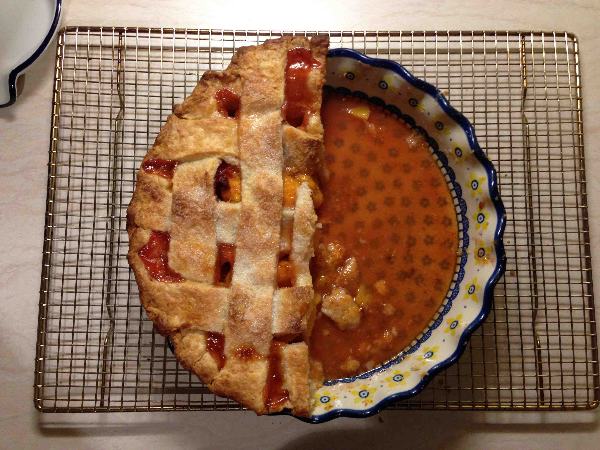
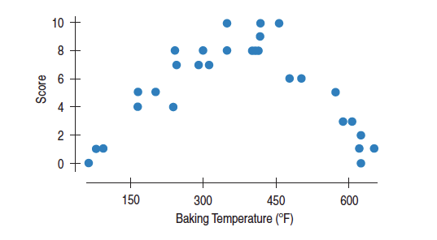

--- 
title: "Math 155 Notes"
author: "Brianna Heggeseth"
date: "`r Sys.Date()`"
site: bookdown::bookdown_site
output: 
  bookdown::gitbook:
    split_by: section
    config:
      toc: 
        collapse: subsection
        scroll_highlight: yes
documentclass: book
link-citations: yes
github-repo: bcheggeseth/Math155Notes
description: "This includes notes for Math 155 at Macalester College."
---

# Introduction to Math 155 {-}

For Math 155, we will spend our time in-class working together on real problems, asking each other questions, and expanding our understanding of the material. 

This online text is a collection of notes that includes definitions, examples, and will support our discussion in class. 

If you find any typos or have questions, please email bheggese@macalester.edu.

<!--chapter:end:index.Rmd-->

---
title: "Math 155 - Intro to Data"
author: "Prof. Heggeseth"
date: "September 6, 2018"
output: 
  html_document: default
---

```{r setup1, include=FALSE}
library(broom)
library(dplyr)
library(ggplot2)
library(stringr)
library(rvest)
library(mosaicData) 
library(ggmosaic)
library(NHANES)
knitr::opts_chunk$set(echo = TRUE)
```

# Introduction to Data

We live in a data-driven world. From search engines to satellite images, from cell phones to credit cards, current technology can produce data faster than we can analyze them. Our goal in Statistics is to get information from this data. The main way we do this is by visually exploring the data and building models to try to explain observed variability, while staying grounded in the context of the data. 


## Data Context


For any data set, you should always ask yourself (or others) a few questions to provide vital **context** about a data set. 

- Who is in the data set? (What is the observational unit or **case**? How were they selected?)
- What is being measured or recorded on each case? (What are the characteristics or **variables** that were collected?)
- Where were they collected? (One location? Multiple locations?)
- When were they collected? (One point in time? Over time?)
- How were they collected? (Measurements? Questionnaire? By phone? In person?)
- Why were they collected? (Who paid? Conflicts of interest?)

##Sampling

We hope that the **cases** in the data set are representative of a **population of interest**. In particular, we say that our data that has been collected is a **sample** from a population. 

**Population of Interest:**  *A collection of people, creatures, things, cases or others that we interested in knowing more about.*

**Sample:** *A subset of the population of interest on which we have collected data.* 

Getting information from everyone individual in a population is very difficult (it is called a **census**) and in many situations, impossible. 

We want to get a sense of the population by just collecting data on a subset. Consider the process of making a soup. We want to make sure there is enough (but not too much) salt in the soup. We don't need or want to eat the entire pot of soup to test if there is the right amount. In fact, we just need a spoonful from a well-stirred pot of soup so that the taste is **representative** of the whole pot. 

What would happen if we put the salt in but didn't stir? What if we taste just the top layer of the soup from the pot? It would be overly salty. But just below the surface, there would be too little. In order for our sample taste to be useful to us, we need to ensure that it is representative of the whole.


**Representative Sample:** *A group that closely matches the characteristics of its population as a whole. In other words, the sample is a fairly accurate reflection of the population from which the sample is drawn.*


###Sampling Bias

If we do not have a representative sample due to the way individuals were selected to be in the study, then we say that there was bias in the sampling process (this is known as sampling bias). (Think about putting your spoon only on the edge or only in the middle, while not stirring.)

**Sampling Bias:** *If the sample is unrepresentative of the population of interest in a systematic way, there is sampling bias.* 

Here are a few flavors of sampling bias:

- **Undercoverage:** *When some members of the population are inadequately represented in the sample due to the sampling procedure (often from convenience samples). An example would be the Literary Digest 1936 poll that got the presidental election wrong. The survey relied on a convenience sample, drawn from telephone directories and car registration lists. In 1936, people who owned cars and telephones tended to be more affluent.* 
- **Response bias:** *When the recorded response does not accurately represent the true value for the individual due to wording of the question or to increase social desirability. Most people like to present themselves in a favorable light, so they will be reluctant to admit to unsavory attitudes or characteristics or illegal activities in a survey, particularly if survey results are not confidential.* 
- **Nonresponse bias:** *When individuals chosen or selected for the sample are unwilling or unable to participate. An example would be an unreturned mail survey that is only sent to a random set of individuals.*
- **Voluntary response bias:** *When the individuals in the sample are self-selected volunteers (they were not chosen or selected by a researcher). An example would be call-in radio shows that solicit audience participation in surveys on controversial topics (abortion, affirmative action, gun control, etc.).* 


###Random Sampling

To avoid some of these types of sampling bias, we may want to "stir the pot before taking a taste" by taking a random sample from the population so as to make sure the sample is representative of the population. Note that randomizing the sampling procedure doesn't eliminate bias (especially nonresponse bias). We can take actions to try to maximize the response rate by repeatedly requesting a response (calling, emailing, going in person, etc).

**Random Sampling:** *A procedure for sampling from a population in which (a) the selection of a sample unit is based on chance and (b) every element of the population has a known, non-zero probability of being selected. Random sampling helps produce representative samples by eliminating voluntary response bias and guarding against undercoverage bias.*

There are many ways to do random sampling. A few flavors are:

**Simple Random Sampling:** *A simple random sample involves having a list of all of the units of a population of interest (called a sampling frame) and then randomly selecting units without replacement. In doing so, every unit has an equal chance of being selected and every sample of size $n$ has an equal chance of being selected.*

**Stratified Sampling:** *A stratified sampling allows you to control the characteristics of the sample by first taking the sampling frame and separating the units into homogenous groups based on a chosen set of characteristics (ex. gender, major of study). Then you do a simple random sample within each homogenous groups, controlling the number selected from each group.* 

**Cluster Sampling:** *A cluster sampling is often done for the sake of time and financial constraints and involves taking the sampling frame and separate the units into hetereogeneous groups, typically defined by physical locations, and then a simple random sample is completed on the groups, meaning that a heterogeneous group is randomly selected and every member in that group is in the sample.* 

**Systematic Sampling:** *Systematic sampling involves selecting individuals from the list of units in the population, the sampling frame, by first chooing a random starting point  and then selecting all kth individuals in the list. The interval must be fixed ahead of time. Before you choose your starting point, everyone has the same chance of being selected. * 

## Observational Study vs. Experiments

Data can be collected in one of two scenerios:

1. **Observational Study:** *Data is collected in such a way such that the researcher **does not** manipulate or intervene in characteristics of the individuals. Researchers simply observe or record characteristics of the sample through direct measurement or through a questionnaire or survey.*

2. **Experiment:** *Data is collected in such a way such that the researcher **does** manipulate or intervene characteristics of the individuals by randomly assigning individuals to treatment and control groups. Researchers then record characteristics of the individuals in the sample within the treatment and control groups.*

The main reason for doing an experiment is to estimate a relationship between a treatment and a response without the impact of **confounding variables.** 

For example, imagine we want to know if taking a daily multivitamin reduces systolic blood pressure. If we did an observational study, we'd select a sample (hopefully randomly) from a population of interest and then ask whether an individual takes a daily multivitamin and measure their blood pressure. Would this data provide enough evidence to conclude that vitamin use causes a reduction in blood pressure?

No, it wouldn't. Individuals that take daily multivitamins may also be more health-conscious, eating more fruits and vegetables and exercising more, which may be related to blood pressure. The diet and exercise would be acting as **confounding variables,** making it impossible to say for certain if vitamin use has a direct impact on blood pressure.

**Confounding Variables:** *Third variables that are related to both a "treatment" (e.g. multivitamin) and a "response" (e.g. blood pressure). For example, say we note that higher ice creams sales is related to a higher number of pool drownings. What could be a confounding variable in this circumstance?*

In an experiment, we "manipulate" the characteristics of an individual by randomly assigning them to a treatment group. This random assignment is intended to break the relationship between any third variable and the treatment so as to try to reduce the impact of confounding. It is impossible to entirely remove the possibility of confounding, but the random assignment to a treatment helps. (Note: things can get complicated if individuals don't comply with the treatment such as take the multivitamin every single day...)

**Causal Inference:** *Causal inference is the process of making a conclusion about direct cause and effect between a "treatment" and a "response". It is very difficult to make causal inferences/statements based on data from an observational study due to the possible presence of confounding variables. There is a whole area of statistics dedicated to methods that attempt to overcome the confounding, but that is beyond the scope of this course. (If you want a "gentle" but mathematical introduction to this area of Statistics, I'd suggest reading "Causal Inference in Statistics: A Primer" by Judea Pearl, Madelyn Glymour, Nicholas P. Jewell)*


##Tidy Data

Raw data can come in a variety of formats (text, images, data streams, etc). In order to analyze the data, we need to get data into a tidy format, in which

- Rows represent **cases** (one row per observational unit -- this could be an individual or an individual at a particular time)
- Columns represent **variables** (one column per characteristic)

Variables can be either **categorical** or **quantitative** variables.

- **Categorical variable:** *A characteristic with values that are names of categories; the names of categories could be numbers such as with zipcodes. If the categories have a natural ordering, it could be called an ordinal variable, but we won't be distinguishing between different types of categorical variables in this class.* 

- **Quantitative variable:** *A characteristic with measured numerical values with units.*

*Note: Any quantitative variable can be converted into a categorical variable by creating categories defined by intervals or bins of values.* 


## Ethical Considerations

Through this class, we are going to stop and think about the ethical considerations of what we are doing. In particular, we are going to consider the ethics of 

- How the data were collected

- Random assignment to treatments 

- Data storage

- Data privacy

- Data use

- Choice of sample data used for predictive modelling

There will be readings to expose you to issues as well as questions during class and on homeworks that ask you to consider the ethical issues with a real data set and statistical analysis. 


<!--chapter:end:01-data.Rmd-->

---
title: "Math 155 - Intro to Data Visualization"
author: "Prof. Heggeseth"
date: "September 6, 2018"
output: 
  html_document: default
---

```{r setup2, include=FALSE}
library(broom)
library(dplyr)
library(ggplot2)
library(stringr)
library(rvest)
library(mosaicData) 
library(ggmosaic)
library(NHANES)
library(mosaic)
knitr::opts_chunk$set(echo = TRUE)
```

#Visualizing Data

The first step in any data analysis is to visually explore your data. 

There is a saying that "a picture is worth a 1000 words." In making visualizations, our goal is to quickly and easily get a better understanding of the variability and relationships that exist in the data. 

Here we will cover the standard appropriate graphics for univariate variation and bivariate relationships. The choice of the graphic depends on the type(s) of variable(s): quantitative or categorical. So the first step is to think about the variables you are interested in visualizing and determining whether they are quantitative or categorical. 

For each type of variable, we will use a real data set to illustrate the visualizations. 


##One Categorical Variable

First, we consider survey data of the electoral registrar in Whickham in the UK (Source: Appleton et al 1996). 

- Survey was conducted in 1972-1974 to study heart disease and thyroid disease (baseline characteristics: age and smoking status)
- A follow-up on those in the survey was conducted twenty years later (followup characteristics: mortality after 20 years)

Let's first consider the age distribution. Age, depending on how it is measured, could act as a quantitative variable or categorical variable. In this case, age is a quantitative variable because it is recorded to the nearest year. But, for illustrative purposes, I'm going to create a categorical variable by separating age into intervals. 

What do I lose when I convert a quantitative variable to a categorical variable?

What do I gain?

###Bar Plot

- The **height** of the bars is the only part that encodes the data (width is meaningless). 
- The height can either represent the **frequency** (count of cases) or the **relative frequency** (proportion of cases).


```{r}
data(Whickham) #load data set from package

Whickham <- Whickham %>%
  mutate(ageCat = cut(age, 4)) #Create a new categorical variable with 4 categories based on age (equal length of age intervals)

Whickham %>%
  count(ageCat) %>%
  mutate(relfreq = n / sum(n)) 

Whickham %>%
  ggplot(aes(x = ageCat)) + 
  geom_bar(fill="steelblue") + 
  xlab('Age Categories in Years') + 
  ylab('Counts') + 
  theme_minimal()
```

What do you notice? What do you wonder?

###Pie Chart

Pie charts are only useful if you have 2 to 3 possible categories and you want to show relative group sizes. 

This is the best use for a pie chart:

```{r, out.width = "300px",echo=FALSE}

```

I'm purposefully not showing you how to make a pie chart because a bar chart is a better choice. Here is a good summary of why **I hate pie charts**: http://www.businessinsider.com/pie-charts-are-the-worst-2013-6 (make sure to read if you like pie charts!)


##Two Categorical Variables


Now, let's consider two other variables in the same data set. What is the relationship between 20-year mortality outcome and smoking status at the beginning of the study.

###Side by Side Bar Plot

- The **height** of the bars shows the frequency of the categories within subsets.

```{r}

Whickham %>%
  count(outcome, smoker) %>%
  mutate(relfreq = n / sum(n)) #Overall Relative Frequency

Whickham %>%
  ggplot(aes(x = smoker, fill = outcome)) + 
  geom_bar(position = position_dodge()) + 
  xlab('Smoker Status') + 
  ylab('Counts') + 
  scale_fill_manual('20 Year Mortality', values=c("steelblue", "lightblue")) + 
  theme_minimal()
```

What do you notice? What do you wonder?

###Stacked Bar Plot

- The **height** of the entire bar shows the **marginal distribution** (frequency of the X variable, ignoring the other variable).
- The **relative heights** show **conditional distributions** (frequencies within subsets), but it is hard to compare distributions between bars because the overall heights differ. 

**Distribution:** the way something is spread out (aka the way in which values vary).

```{r}
Whickham %>%
  ggplot(aes(x = smoker, fill = outcome)) + 
  geom_bar() + 
  xlab('Smoker Status') + 
  ylab('Counts') + 
  scale_fill_manual('20 Year Mortality',values=c("steelblue", "lightblue")) + 
  theme_minimal()
```

What do you notice? What do you wonder?


###Mosaic Plot

- The **relative height** of the bars shows the **conditional distribution** (relative frequency within subsets).
- The **width** of the bars shows the **marginal distribution** (relative frequency of the X variable, ignoring the other variable).


```{r}
Whickham %>%
  ggplot() +
  geom_mosaic(aes(x = product(outcome, smoker), fill = outcome)) +
  xlab('Smoker Status') + 
  ylab('Counts') + 
  scale_fill_manual('20 Year Mortality',values=c("steelblue", "lightblue")) + 
  theme_minimal()
```

What do you notice? What do you wonder?

**Gut Check:** Does our data suggest that smoking *is associated* with a lower mortality rate?  Does our data suggest that smoking *reduces* mortality? (Note the difference in these two questions - the second implies cause and effect)


```{r}
Whickham %>%
  ggplot() +
  geom_mosaic(aes(x = product(outcome, smoker), fill = outcome)) + 
  facet_grid( . ~ ageCat) + 
  xlab('Smoker Status') + 
  ylab('Counts') + 
  scale_fill_manual('20 Year Mortality',values=c("steelblue", "lightblue")) + 
  theme_minimal()
```

What do you notice? What do you wonder?


**Gut Check:** How is it that our conclusions are exactly the opposite if we consider the relationship between smoking and mortality within age subsets?

This is called **Simpson's Paradox,** which is a situation in which you come to two different conclusions if you look at results overall versus within subsets (e.g. age groups).

Let's look at the marginal distribution of smoking status within each age group. For groups of people that were 68 years of age or younger, it was about 50-50 in terms of smoker vs. non smoker. But, the oldest age group were primarily nonsmokers. 

Now look at the mortality rates within each age category. The 20-year mortality rate among young people (35 or less) was very low but that increases with increased age. So the oldest age group had the highest mortality rate, due primarily to their age, and also had the highest rate of non-smokers. So when we look at everyone together (not subsetting by age), it looks like smoking is associated with a lower mortality rate, when in fact age was just confounding the relationship between smoking status and mortality. 


##One Quantitative Variable

Next, we will use data from one of the largest ongoing health studies in the USA, named NHANES. In particular, we will focus on data from the NHANES between 2009-2012 (Source: CDC).

Since sleep is vitally important to daily functioning, let's look at the number of hours of sleep respondants reported. 

###Histogram

- The **height** of the bars shows either the **frequency within intervals** or the **density** (relative frequency per unit of measure, e.g. proportion of people per hour sleep)
- The x-axis is a number line and bars do not have to be of equal width (R chooses a default bin width, but you can change how many intervals and how large they are)

```{r}
#For more info about NHANES: https://www.cdc.gov/nchs/nhanes/index.htm

NHANES %>%
  ggplot(aes(x = SleepHrsNight)) +
  geom_histogram(fill = "steelblue") + #Gaps are meaningful
  xlab('Hours of Sleep (hours)') + 
  ylab('Counts') + 
  theme_minimal() 

NHANES %>%
  ggplot(aes(x = SleepHrsNight)) +
  geom_histogram(binwidth = 1, fill = "steelblue") + #Gaps are meaningful
  xlab('Hours of Sleep (hours)') + 
  ylab('Counts') + 
  theme_minimal() 


NHANES %>%
  ggplot(aes(x = SleepHrsNight)) +
  geom_histogram(aes(y = ..density..), binwidth = 1, fill = "steelblue") + 
  geom_density(alpha = 0.2, fill = "steelblue", adjust = 3) + 
  xlab('Hours of Sleep (hours)') + 
  ylab('Counts') + 
  theme_minimal() 
```

We focus on three aspects of the histogram/distribution:

- **Shape:** Is it **symmetric**? or is it**skewed to the right or left** (Distributions are skewed to the long **tail** - which side has a long tail)? How many **modes** do you see?
- **Center:** Where is a typical value located?
- **Spread** (or variation): How spread out are the values? (Concentrated around one or more values or spread out?)

Also, we ask: Are there any unusual features such as outliers or gaps? Why?


Here is another data set for comparison: CEO salaries for the highest paid CEOs in 2016 (Source: NYTimes).

```{r}
nyturl <- 'https://www.nytimes.com/interactive/2017/05/26/business/highest-paid-ceos.html?mcubz=0'
dat <- read_html(nyturl)
ceo <- dat %>% 
  html_nodes(".nytg-compensation , .nytg-year") %>% 
  html_text() %>% 
  str_replace('\\$|-','') #webscraping data 
ceo <- data.frame(matrix(ceo,ncol = 2,byrow = TRUE))
names(ceo) <- c('year','salary')
ceo$salary <- as.numeric(ceo$salary) 
ceo <- ceo %>% 
  filter(year == '2016')
```

```{r}
#Highest Paid CEO's in the U.S. in 2016 (Source: NYTimes)
ceo %>%
  ggplot(aes(x = salary)) +
  geom_histogram(aes(y = ..density..), binwidth = 15, fill = "steelblue") + 
  geom_density(alpha = 0.2, fill = "steelblue") + 
  xlab('Salary ($M)') + 
  ylab('Counts') + 
  theme_minimal() 
```

###Center

For center, we have some choices for numerically summarizing it:

- **Mean**: The sum of the values divided by the number of values (sample size), $\bar{y} = \frac{\sum^n_{i=1}y_i}{n}$
    + Sensitive to outliers, but efficiently uses all the data
- **Median**: The "middle" value. The number for which half of the values are below and half are above.
    + Insensitive to outliers, but doesn’t use all the actual values
- **Trimmed means**:  Drop the lowest and highest k% and take the mean of the rest.
    + A good compromise, but not widely used.

```{r}
summary(NHANES$SleepHrsNight)
mean(NHANES$SleepHrsNight, na.rm=TRUE) #na.rm = TRUE removes missing values
median(NHANES$SleepHrsNight, na.rm=TRUE)
mean(NHANES$SleepHrsNight, trim = 0.05, na.rm=TRUE) #Trim 5% from both tails before taking mean


summary(ceo$salary) #Note the differences between mean and median
mean(ceo$salary) #Arthimetic average
median(ceo$salary) #Middle number
mean(ceo$salary,trim = 0.05)  #Trimmed mean falls in between
```

###Boxplot

A simplification of the histogram:

- Box: 25th Percentile (Q1) to 75th Percentile (Q3)
- Line in Box: 50th Percentile (Median)
- Tails: Extend to most extreme observed values within 1.5*(Q3-Q1) from Q1 (left) or Q3 (right)
- Points: If any points are beyond 1.5*(Q3-Q1) from the box, plot separately

```{r}
NHANES %>%
  ggplot(aes(y = SleepHrsNight)) +
  geom_boxplot() + 
  ylab('Hours of Sleep (hours)') + 
  theme_minimal() 
```

```{r echo=TRUE}
#Highest Paid CEO's in the U.S. in 2016 (Source: NYTimes)
ceo %>%
  ggplot(aes(y = salary)) +
  geom_boxplot() + 
  ylab('Salary ($M)') + 
  theme_minimal() 
```

Let's put the boxplots next to the histograms so we can better compare. Also, let's add the mean (red dashed), median (blue dotted), and 5% trimmed mean (purple dash-dot).

```{r echo=FALSE}
layout(matrix(c(1,2),2,1),heights = c(10,5))
par(mar = c(0,5,4,2))
hist(NHANES$SleepHrsNight, col="lightblue",main="",ylab="# of people",xlab='Hours of Sleep (hrs)',xaxt='n')
abline(v = mean(NHANES$SleepHrsNight,na.rm=TRUE),col='red',lty=2) #na.rm = TRUE removes missing values
abline(v = median(NHANES$SleepHrsNight,na.rm=TRUE), col = 'blue',lty=3)
abline(v = mean(NHANES$SleepHrsNight,trim = 0.05,na.rm=TRUE), col='purple',lty=4)
par(mar = c(5,5,0,2),bty='n')
boxplot(NHANES$SleepHrsNight,horizontal = TRUE,xlab='Hours of Sleep at Night')
abline(v = mean(NHANES$SleepHrsNight,na.rm=TRUE),col='red',lty=2)
abline(v = median(NHANES$SleepHrsNight,na.rm=TRUE), col = 'blue',lty=3)

layout(matrix(c(1,2),2,1),heights = c(10,5))
par(mar = c(0,5,4,2))
hist(ceo$salary, col="lightgreen",main="",ylab="# of people",xaxt='n',xlim=c(0,200))
abline(v = mean(ceo$salary),col='red',lty=2) #na.rm = TRUE removes missing values
abline(v = median(ceo$salary), col = 'blue',lty=3)
abline(v = mean(ceo$salary,trim = 0.05,na.rm=TRUE), col='purple',lty=4)
par(mar = c(5,5,0,2),bty='n')
boxplot(ceo$salary,horizontal = TRUE,xlab='Salary ($N)',ylim=c(0,200))
abline(v = mean(ceo$salary,na.rm=TRUE),col='red',lty=2)
abline(v = median(ceo$salary,na.rm=TRUE), col = 'blue',lty=3)
```

What would the boxplot look like if all of the values were exactly the same?


###Spread

For spread we have several choices to numerically describe it:

- **Range**: the maximum value - the minimum value
    + Sensitive to the outliers since it’s the difference of the extremes
- **IQR**: the interquartile range : Q3 - Q1 (75th percentile - 25th percentile).
    + Length of the box in a boxplot
    + Spread of middle 50% of data
    + Like the median. Less sensitive because it doesn't use all of the data
- **Standard deviation**: Root mean squared deviations from mean, $s_y = \sqrt{\frac{\sum^n_{i=1}(y_i-\bar{y})^2}{n-1}}$
    + Roughly the average size of deviation from the mean ($n-1$ instead of $n$)
    + Uses all the data but very sensitive to outliers and skewed data (large values are first squared).


```{r tidy=TRUE, echo=TRUE}
diff(range(NHANES$SleepHrsNight,na.rm = TRUE)) #range gives max and min; take difference
IQR(NHANES$SleepHrsNight,na.rm = TRUE) #Q3-Q1
sd(NHANES$SleepHrsNight,na.rm=TRUE) #standard deviation

diff(range(ceo$salary))
IQR(ceo$salary)
sd(ceo$salary) 
```

```{r tidy=TRUE, echo=TRUE}
x = rnorm(1500)
boxplot(x,horizontal = TRUE,xlab='Generated Data')
abline(v = range(x), col='blue',lty=3) 
abline(v = quantile(x,c(.25,.75)),col='purple',lty=1)
abline(v = c(-sd(x),sd(x)),col='green',lty=2)
```

What percentage of the data is between the blue dotted lines (length of interval is range)?

What percentage of the data is between the purple solid lines (length of interval is IQR)?

What percentage of the data is between the green dashed lines (length of interval is 2*SD)?

```{r}
sum(x > -sd(x) & x < sd(x))/length(x)
```

###Z-scores

How do you decide when an outlier is really unusual (think: athletic victory being very impressive or a data point that may be an error)?

If the observation is far from the rest of the measurements in the data, we tend to say that the value is more unusual. We want to quantify this idea of "unusual."

To do this, we often calculate a **z-score**, a standardized data value.

- Calculate how far the observation was below (or above) the mean of the sample. 
- Then divide the difference by the standard deviation (measure of spread).

\[ z = \frac{y - \bar{y}}{s_y}\]

The z-score just tells you how many standard deviations the observation is above or below the mean. 

Say that you got a z = 1 on an exam with mean = 80 and sd = 5. That means that you got an 85 on the exam ($mean + z*sd = 80 + 1*5$).

If you got a z = -2 on an exam with mean = 80 and sd = 5, that means you got a 70 on the exam (80 + -2*5).

In general, it is quite common to have z-scores between -3 and 3, but very unusual to have them greater than 3 or less than -3. In particular, if you have a unimodal, symmetric distribution z-score values will be between -1 and 1 about 68% of the time, between -2 and 2 about 95% of the time, and between -3 and 3 about 99.7% of the time. 

For those of you who like mathematical theorems, go check out Chebyshev's inequality. It gives a mathematical reasoning for why z-scores of magnitude 3 or greater are very unusual. Then take probability to get an even better understanding of it! 


In summary, for a quantitative variable,

- Use a histogram to display the distribution of one variable and describe the shape and any unusual features.
- For "well behaved" distributions (symmetric, unimodal, no outliers), use the mean and standard deviation to describe the center and spread. Then z-scores will roughly follow the 68-95-99.7 rule stated above. 
- For others, use the IQR and median. You can report both mean and median, but it’s usually a good idea to state why.


##One Quantitive Variable and One Categorical Variable

Why do some people sleep more than others?

Let's look at the distribution of hours of sleep at night within subsets of the NHANES data. 

###Multiple Histograms


Does the recorded binary gender explain the variability in the hours of sleep? (Quick ethics consideration: what are the implications of collecting binary gender as a variable even if gender is not considered binary?)

```{r}
NHANES %>%
  ggplot(aes(x = SleepHrsNight)) +
  geom_histogram(binwidth = 1, fill = "steelblue") + 
  xlab('Hours of Sleep (hours)') + 
  facet_grid(~Gender) + 
  theme_minimal() 
```

Does the number of child a parents has explain the variability in the hours of sleep? (Quick ethics consideration: who have we excluded from our analysis?)

```{r}
NHANES %>%
  filter(!is.na(nBabies)) %>% 
  ggplot(aes(x = SleepHrsNight)) +
  geom_histogram(binwidth = 1, fill = "steelblue") + 
  xlab('Hours of Sleep (hours)') + 
  facet_grid(~factor(nBabies)) + 
  theme_minimal() 
```


Does the number of days someone has felt depressed explain the variability in the hours of sleep?

```{r}
NHANES %>%
  ggplot(aes(x = SleepHrsNight)) +
  geom_histogram(binwidth = 1, fill = "steelblue") + 
  xlab('Hours of Sleep (hours)') + 
  facet_grid(~Depressed) + 
  theme_minimal() 
```

What do you notice? What do you wonder?

###Multiple Boxplots

Let's try that again but with boxplots and see if we can glean any more information.

```{r}
NHANES %>%
  ggplot(aes(x = Gender, y = SleepHrsNight)) +
  geom_boxplot() + 
  ylab('Hours of Sleep (hours)') + 
  xlab('Binary Gender') + 
  theme_minimal() 
```


```{r}
NHANES %>%
  ggplot(aes(x = factor(nBabies), y = SleepHrsNight)) +
  geom_boxplot() + 
  ylab('Hours of Sleep (hours)') + 
  xlab('Number of Babies') + 
  theme_minimal() 
```

```{r}
NHANES %>%
  ggplot(aes(x = factor(Depressed), y = SleepHrsNight)) +
  geom_boxplot() + 
  ylab('Hours of Sleep (hours)') + 
  xlab('Days Depressed') + 
  theme_minimal() 
```


What do you notice? What do you wonder?


#### Is this a Real Difference?
If we notice differences in the center of these distributions, is it a REAL difference? Is there a difference in the general U.S. population? Remember, we just have a random sample of the population *NHANES is supposed to be a representative sample of the U.S. population collected using a random sampling procedure.* 

What if there were no REAL difference? Then the Depressed group labels wouldn't be related to the hours of sleep.

**Investigation Plan:**

1. Take all of the observed data on sleep and randomly shuffle into new groups (of the same size as before).
2. Calculate the difference in mean hours of sleep between the groups. Record it.
3. Repeat 1 and 2 many times (say 1000 times).
4. Look at the differences based on random shuffles & compare to the observed difference.

```{r echo=TRUE}
NHANES <- NHANES %>%
  mutate(DepressedMost = (Depressed == 'Most')) #TRUE or FALSE (converted to a 2 category variable)

obsdiff <- data.frame(d = diff(mean(SleepHrsNight ~ DepressedMost, data = NHANES, na.rm = TRUE)))

sim <- do(1000)*diff(mean(SleepHrsNight ~ shuffle(DepressedMost), data = NHANES, na.rm = TRUE)) #Randomly shuffle the DepressedMost labels (assuming no real difference in sleep, depressed feelings shouldn't impact sleep)

sim %>%
  ggplot(aes(x = TRUE.)) + 
  geom_histogram(fill = 'steelblue') +
  geom_vline(aes(xintercept = d), obsdiff, color = 'red') + 
  xlab('Difference in Mean Hours of Sleep') + 
  ylab('Counts') + 
  theme_minimal() 
```

What do you notice? What do you wonder?

##Two Quantitative Variables

Now, let's switch to another data set that includes a variety of body measurements. Imagine that you are an entreprenure and you are going to sell dress shirts. Clothing sizing is just weird (don't get me started...) so let's use this dataset to try to come up with our own data driven sizes. Two of the key measurements are the neck size and chest size. There are others, but let's focus on these for the moment.

###Scatterplot

When you have two quantitative variables, a **scatterplot** is one appropriate graphical display of the relationship.

```{r echo=TRUE}
bodyfat <- read.delim("http://sites.williams.edu/rdeveaux/files/2014/09/bodyfat.txt")

bodyfat %>%
  ggplot(aes(x = Neck, y = Chest)) +
  geom_point(color = 'steelblue') + 
  xlab('Neck size (cm)') + 
  ylab('Chest size (cm)') +
  theme_minimal()
```

What do you notice about:

1. Direction of Relationship (positive, negative, neutral)
2. Form of Relationship (linear, curved, none, other)
3. Strength of Relationship (compactness around the relationship)
4. Unusual Features (outliers, differences in variability across x)

**How could you use this information to determine shirt sizes for your new business venutre? ** We'll come back to this.

Suppose instead of *Chest* in cm and *Neck size* in cm, we switched to inches and plotted *Chest* and *Neck size* in inches. 

**Does the strength change?**

```{r}
bodyfat %>%
  ggplot(aes(x = Neck/2.54, y = Chest/2.54)) +
  geom_point(color = 'steelblue') + 
  xlab('Neck size (in)') + 
  ylab('Chest size (in)') +
  theme_minimal()
```


###Correlation Coefficient

Since shifting (adding or subtracting) and scaling (multiplying or dividing) make no difference, let's standardize both variables into z-scores and replot (and add some color):

```{r, echo=FALSE}
bodyfat <- bodyfat %>%
  mutate(zNeck = scale(Neck), zChest = scale(Chest), Product = sign(zChest*zNeck))

bodyfat %>%
  ggplot(aes(x = zNeck, y = zChest, color = factor(Product))) +
  geom_point() +
  geom_hline(yintercept = 0) +
  geom_vline(xintercept = 0) +
  xlab('Z-scores of Neck size') + 
  ylab('Z-scores of Chest size') +
  theme_minimal()
```

**If we were to have a weaker positive relationship, how would this plot change?**

**If we were to have a negative relationship, how would this plot change?**


We want one number to represent **strength** and **direction** of a linear relationship.

- Points in the $1^{st}$ and $3^{rd}$ quadrants (blue) have the **same sign**.
- Points in the $2^{nd}$ and $4^{th}$ (red) have **opposite signs.**

**What if we took the product of the $z$-scores? What would the values look like?**


The almost *average* of products of the $z$-scores is the **correlation coefficient,** 

$$ r = \frac{\sum z_x z_y}{n-1} $$

**Which points contribute the most to this average?**

```{r, echo=TRUE}
cor(bodyfat$Neck,bodyfat$Chest)
```

###Properties

* $-1 \leq r \leq 1$

* Sign of $r$ goes with the direction of the relationship.

* $r_{x,y} = r_{y,x}$, it doesn't matter which is $x$ and which is $y$.

* $r_{ax+b, cy+d} = r_{x,y}$,   Linear change of scale doesn't affect $r$. Why?

* $r$ measures strength of *linear* relationship -- not curved

* one outlier can completely change $r$

**Other expressions for r (for the mathematically intrigued)**

$$ r = \frac{\sum z_x z_y}{n-1}  $$
$$ = \frac{\sum{\frac{(x_i-\bar{x})}{s_x}\frac{(y_i-\bar{y})}{s_y}}}{n-1}$$
$$= \frac{\sum{(x_i-\bar{x})(y_i-\bar{y})}}{(n-1) s_x s_y}$$
$$= \frac{\sum{(x_i-\bar{x})(y_i-\bar{y})}}{{(n-1)\sqrt{\sum{\frac{(x_i-\bar{x})^2}{n-1}}}}{\sqrt{\sum{\frac{(y_i-\bar{y})^2}{n-1}}}}}$$
$$=\frac{\sum{(x_i-\bar{x})(y_i-\bar{y})}}{{\sqrt{\sum{(x_i-\bar{x})^2}}}{\sqrt{\sum{(y_i-\bar{y})^2}}}}$$
$$=\frac{\sum{(x_i-\bar{x})(y_i-\bar{y})}}{{\sqrt{\sum{(x_i-\bar{x})^2\sum{(y_i-\bar{y})^2}}}}}$$

###Is correlation always the right way to judge strength?

Here is the plot of brownie quality by temperature.
The correlation is near 0, but it doesn't mean that there's no relationship -- there's no **linear** relationship.




<!--chapter:end:02-visualization.Rmd-->

---
title: "Math 155 - Intro to Regression Models"
author: "Prof. Heggeseth"
date: "September 6, 2018"
output: 
  html_document: default
---

```{r setup3, include=FALSE}
library(broom)
library(dplyr)
library(ggplot2)
library(stringr)
library(rvest)
library(mosaicData) 
library(ggmosaic)
library(NHANES)
library(mosaic)
knitr::opts_chunk$set(echo = FALSE)
```

# Regression Models

##Best Fitting Line(s)

Let's return to thought experiment where you were a manufacturer of shirts. 

```{r,echo=TRUE}
bodyfat <- read.delim("http://sites.williams.edu/rdeveaux/files/2014/09/bodyfat.txt")

bodyfat %>%
  ggplot(aes(x = Neck, y = Chest)) +
  geom_point(color = 'steelblue') + 
  xlab('Neck size (cm)') + 
  ylab('Chest size (cm)') +
  theme_minimal()
```


If you were to add one or multiple lines to the plot above to help you make business decisions, where would you want it (or them)?

Let's say you were only going to make one size of shirt.  You might want to add a horizontal line at the mean Chest size and a vertical line at the mean Neck size. 

```{r, echo=TRUE}
bodyfat %>%
  ggplot(aes(x = Neck, y = Chest)) +
  geom_point(color = 'steelblue') + 
  geom_hline(yintercept = 100.662) +
  geom_vline(xintercept = 37.9448) +
  xlab('Neck size (cm)') + 
  ylab('Chest size (cm)') +
  theme_minimal()
```

We can see that this shirt would fit the "average person." However, this might not serve your market very well. For many people, the shirt would be too tight because their chest and/or neck sizes would be larger. For many people, the shirt would be too large because they chest and/or neck sizes would be smaller. 

Let's try something else. Let's allow ourselves 5 different sizes (XS, S, M, L, XL). Then, we can cut the Neck sizes into 5 groups of equal length and estimate the mean Chest sizes within each of these groups. 

```{r, echo=FALSE}
bfmeans <- bodyfat %>%
  mutate(NeckGroups = cut(Neck, 5)) %>%
  group_by(NeckGroups) %>%
  summarize(Means = mean(Chest))

labs <- levels(bfmeans$NeckGroups)
bfmeans <- cbind(bfmeans, lower = as.numeric( sub("\\((.+),.*", "\\1", labs) ),
      upper = as.numeric( sub("[^,]*,([^]]*)\\]", "\\1", labs) ))

bodyfat %>%
  ggplot(aes(x = Neck, y = Chest)) +
  geom_point(color = 'steelblue') + 
  geom_segment(aes(x = lower, xend = upper, y = Means, yend = Means),bfmeans)+
  geom_vline(aes(xintercept = upper), data = bfmeans) +
  geom_vline(aes(xintercept = lower), data = bfmeans) +
  xlab('Neck size (cm)') + 
  ylab('Chest size (cm)') +
  theme_minimal()
```

**What does this tell us?**

What if we wanted to be able to make more sizes? Could we get a pretty good sense of what the chest sizes should be for a given neck size?


```{r, echo=FALSE}
bodyfat %>%
  ggplot(aes(x = Neck, y = Chest)) +
  geom_point(color = 'steelblue') + 
  geom_smooth(method = 'lm', se = FALSE) +
  geom_segment(aes(x = lower, xend = upper, y = Means, yend = Means),bfmeans)+
  geom_vline(aes(xintercept = upper), data = bfmeans) +
  geom_vline(aes(xintercept = lower), data = bfmeans) +
  xlab('Neck size (cm)') + 
  ylab('Chest size (cm)') +
  theme_minimal()
```

**What does this tell us?**

If the scatterplot between two quantitative variables **resembles a straight line**,

- a line could roughly **describe** the mean of Y for each value of X.
- a line could **describe** how much we'd *expect* Y to change based on a 1 unit change in X.
- a line could help us **predict** the Y based on a new value of X.


## Choosing a line

To choose a line, we need to choose the intercept ($b_0$) and slope ($b_1$),

$$ \hat{y} = b_0 + b_1x $$

We have $n$ points on a scatterplot, $(x_i,y_i)$. 

### First idea
Minimize the sum of the **residuals**, $e_i = y_i - \hat{y}_i = y_i - ( b_0 + b_1x_i)$.

- Problem: We will have positive and negative residuals, they will cancel each other out.


### Second idea
Minimize the $\sum_{i=1}^n |y_i - \hat{y}_i| = \sum_{i=1}^n |e_i|$.

- Problem: This is referred to as **Least Absolute Deviations**, but this can result in multiple solutions and is generally a more unstable process (no closed form solution).

### Third idea
Minimize the $\sum_{i=1}^n (y_i - \hat{y}_i)^2= \sum_{i=1}^n e_i^2$.

- This is referred to as **Least Squares** and has a unique solution.

--------

##Least Squares

- Let's find the **minimum of the Sum of Squares Residuals** by searching over a grid for (intercept, slope).
- Surface height is sum of squared residuals for each combination of slope and intercept.

```{r, echo=FALSE}
f <- function(b){
  sum((bodyfat$Chest - (b[1] + b[2] * bodyfat$Neck))^2)
} 
b0 = seq(-20,20,by=.5)
b1 = seq(-10,20,by=1)
b <- expand.grid(b0,b1)
ss <- apply(b,1,f)

persp(b0,b1,matrix(ss,length(b0),length(b1)),theta=65,zlab='Sum of Squares')
```

Imagine the surface height as color (white is lowest). 

```{r, echo=FALSE}
image(b0,b1,matrix(ss,length(b0),length(b1)),col=c('white',topo.colors(100)[100:1]))
```

The large Sum of Square values are dominating this image, so I will change the color scheme to see more variation in smaller values (white is lowest).

```{r, echo=FALSE}
b0 = seq(-10,10,by=.1)
b1 = seq(0,5,by=.1)
b <- expand.grid(b0,b1)
ss <- apply(b,1,f)
image(b0,b1,matrix(log(ss),length(b0),length(b1)),col=c('white',topo.colors(100)[100:1])) #Log Sum of Squares to see variation in lower end
```

We can limit our search to $b_0 \in (-10,10)$ and $b_1 \in (2,3)$
```{r echo=TRUE}
b0 = seq(-10,10,by=.05)
b1 = seq(2,3,by=.05)
b <- expand.grid(b0,b1)
ss <- apply(b,1,f)

b[ss == min(ss),]
```

- Or we could try a numerical optimization technique (such as steepest descent). 
- Or we could use calculus (find partial derivatives, set equal to 0, and solve).

If you find the minimum (via calculus), you'll find that we can write the Least Squares solution in a closed-form (as functions of summary statistics!),

$$ b_1  = r\frac{s_y}{s_x}$$

and

$$ b_0 = \bar{y} - b_1\bar{x} $$

where $\bar{x}$ is the mean of the variable on the x-axis, $\bar{y}$ is the mean of the variable on the y-axis, $s_x$ is the standard deviation of the variable on the x-axis, $s_y$ is the standard deviation of the variable on the y-axis, and $r$ is the correlation coefficient between the two variables.

```{r echo=TRUE}
sy = sd(bodyfat$Chest)
sx = sd(bodyfat$Neck)
r = cor(bodyfat$Chest,bodyfat$Neck)
ybar = mean(bodyfat$Chest)
xbar = mean(bodyfat$Neck)

(b1 = r*sy/sx)
(b0 = ybar - b1*xbar)

lm(Chest~Neck, data = bodyfat)
```


--------

##Properties of Least Squares Line

- $(\bar{x},\bar{y})$ is on the line. 

- Least squares residuals add to 0.

- The standard deviation of the residuals gives us a sense of how bad our predictions (based on the line) could be. 

$$s_e = \sqrt{\frac{\sum^n_{i=1} (y_i-\hat{y}_i)^2}{n-2}}  = \sqrt{\frac{\sum^n_{i=1} e_i^2}{n-2}} $$

In R: $s_e$ is called the "residual standard error"

```{r echo=TRUE}
summary(lm(Chest~Neck, data = bodyfat))
tidy(lm(Chest~Neck, data = bodyfat))
```

So, based on this line, we can predict your chest size within 5 to 10 inches. 

**If you were a shirt manufacturer, what would you do with this information?**

Let's see how some real companies create shirts,


```{r}
with(bodyfat,plot(Chest~Neck,main='Calvin Klein'))
abline(with(bodyfat,lm(Chest~Neck)))
rect(14*2.54,36*2.54,14.5*2.54,37*2.54,col='red')
rect(15*2.54,38*2.54,15.5*2.54,39*2.54,col='red')
rect(16*2.54,40*2.54,16.5*2.54,41*2.54,col='red')
rect(17*2.54,42*2.54,17.5*2.54,43*2.54,col='red')
```


```{r}
with(bodyfat,plot(Chest~Neck,main = 'Express'))
abline(with(bodyfat,lm(Chest~Neck)))
rect(13*2.54,33*2.54,13.5*2.54,33.5*2.54,col='red')
rect(14*2.54,36.5*2.54,14.5*2.54,38.5*2.54,col='red')
rect(15*2.54,39*2.54,15.5*2.54,41.5*2.54,col='red')
rect(16*2.54,42*2.54,16.5*2.54,44.5*2.54,col='red')
rect(17*2.54,45*2.54,17.5*2.54,47.5*2.54,col='red')
rect(18*2.54,48*2.54,18.5*2.54,50.5*2.54,col='red')
```


```{r}
with(bodyfat,plot(Chest~Neck,main='Brooks Borthers'))
abline(with(bodyfat,lm(Chest~Neck)))
rect(13*2.54,32*2.54,13.5*2.54,34*2.54,col='red')
rect(14*2.54,34*2.54,14.5*2.54,36*2.54,col='red')
rect(15*2.54,38*2.54,15.5*2.54,40*2.54,col='red')
rect(16*2.54,42*2.54,16.5*2.54,44*2.54,col='red')
rect(17*2.54,46*2.54,17.5*2.54,48*2.54,col='red')
```

##Interpretation

Let's look at the summary of the lm() in R again.

```{r echo=TRUE}
summary(lm(Chest~Neck, data = bodyfat))
```

Least Squares/Regerssion Line ($\hat{y} = b_0 + b_1x$)

- The line gives the estimated average of y for each value of x (**within observed range of x**)
- Example: The regression line of (Predicted Chest = -3.1 + 2.7Neck) gives the estimated average Chest size for a give Neck size, based on our sample of data. 

Intercept ($b_0$)

- The intercept gives the average value of y when x is zero (**think about context**)
- Example: If Neck size = 0, then the person doesn't exist. In this context, the intercept doesn't make much sense to interpret. 


Slope ($b_1$)

- The slope gives the change in average y for 1 unit increase in x (**not for individuals and not causal**)
- Example: If we consider a neck size 1 cm larger, then we'd expect the average chest size to increase by about 2.7cm.


###Correlation or Association v. Casuation

In order to say that an increase in X **will lead** to an increase in Y (causal effect), we need to control for all other possible variables that could impact both X and Y (**confounding variables**).

- In order to prove a causal relationship (X causes Y), you need to keep everything *(and I mean everything)* the same or as similar as possible except the difference in X. 


##Evaluation

Let's consider another data example. Can I predict your college GPA based on your high school GPA? (Disclaimer: not Macalester data)


```{r echo=TRUE}
sat <- read.csv("Data/sat.csv")
```

```{r echo=TRUE}
sat %>%
  ggplot(aes(x = high_GPA, y = univ_GPA)) +
  geom_point(color = 'steelblue') +
  geom_smooth(method = 'lm', se = FALSE) +
  xlab('HS GPA') +
  ylab('College GPA') + 
  theme_minimal()
```

First things first. Describe the scatterplot. 

- Direction: positive relationship (higher high school GPA is associated with higher college GPA)
- Form: generally linear
- Strength: There is a weak relationship when high school GPA < 3.0 (r = .32) and a fairly strong relationship when high school GPA > 3.0 (r = .68). 
- Unusual: As seen with the strength, there is increased variability in college GPA among individuals with lower high school GPA. That variability decreases with increased high school GPA. We call this pattern of unequal variation as "thickening."


```{r echo=TRUE}
sat %>%
  mutate(HighHSGPA = high_GPA > 3) %>%
  group_by(HighHSGPA) %>%
  summarize(Cor = cor(high_GPA,univ_GPA))
```

Let's build a model to predict college GPA based on high school GPA. Since we noted that there was a linear relationship, let's find the least squares/regression line.

```{r echo=TRUE}
lm.gpa <- lm(univ_GPA ~ high_GPA, data = sat)
summary(lm.gpa)
```

The best fitting line is (Predicted College GPA = 1.09 + 0.675High School GPA). 

Let's plug in a few values.

- High School GPA = 2: Predicted College GPA = 1.09 + 0.675*2 = 2.44

```{r echo=TRUE}
1.09 + 0.675*2
predict(lm.gpa, newdata = data.frame(high_GPA = 2))
```

- High School GPA = 3.5: Predicted College GPA = 1.09 + 0.675*3.5 = 3.45

```{r echo=TRUE}
1.09 + 0.675*3.5
predict(lm.gpa, newdata = data.frame(high_GPA = 3.5))
```

- High School GPA = 4.5: Predicted College GPA = 1.09 + 0.675*4.5 = 4.13

```{r echo=TRUE}
1.09 + 0.675*4.5
predict(lm.gpa, newdata = data.frame(high_GPA = 4.5))
```

Does it make sense to use this model for high school GPA's > 4.5?  Some high schools have a max GPA of 5.0 due to weighting of advanced courses. 

- What is the maximum high school GPA in this data set? 
- What if your college doesn't allow for GPA's above 4.0? 


```{r echo=TRUE}
sat %>%
  summarize(max(high_GPA))
```

Making predictions beyond the observed range of values is called **extrapolation** and is generally a risky thing to do. If you extrapolate beyond the minimum or maximum of the observed values, then you are assuming that the relationship you observe can be extended into the new prediction range. This is that main issue of **forecasting**, making predictions in the future. You have to assume that the trend that you observe now will continue in the future and that the current state of affairs will stay the same.

###Prediction Errors

If the residuals were approximately unimodal and symmetric, we expect about 95% of the residuals to be within 2 standard deviations of 0 (the mean residual). 

```{r echo=TRUE}
hist(residuals(lm.gpa))
```

```{r echo=TRUE}
SSE = sum(residuals(lm.gpa)^2)
n = (length(residuals(lm.gpa)))
s = sqrt(SSE/(n-2))
s
2*s
```

So I can predict your GPA within about $0.5$ GPA points. Is this useful? 


```{r echo=TRUE}
sd(sat$univ_GPA)
2*sd(sat$univ_GPA)
```

Without knowing your high school GPA, we could have guessed within $\pm 0.9$.  That was based on the sum of squared total variation,

$$ SSTO = \sum{(y_i -\bar{y})^2} $$

SSTO is the numerator of the standard deviation of $y$ (without knowing anything about $x$).

```{r echo=TRUE}
(SSTO = sum((sat$univ_GPA - mean(sat$univ_GPA))^2))
```


###$R^2$

Let's study the reduction in the unexplained variation (residuals from a linear regression model -- with $x$ v. the original deviations from the mean -- without $x$). 

```{r, echo=FALSE}
gpavar = data.frame(resids = c(residuals(lm.gpa), sat$univ_GPA-mean(sat$univ_GPA)), type = rep(c('Linear Model Residuals','Original Deviations from Mean'), each = nrow(sat)))

gpavar %>%
  ggplot(aes(x = type, y = resids)) +
  geom_boxplot()
```


We started with the sum of the deviations from the mean $SSTO = \sum{(y_i - \bar{y})^2}$ before we had info about high school GPA ($x$).

- Now, with our knowledge of $x$, we have $SSE = \sum{(y_i - \hat{y_i})^2}$

- $SSE$ should be smaller than $SSTO$ (!)

Two extreme cases: 

  * If the error (SSE) goes to zero, we'd have a "perfect fit". 
  
  * If $SSE = SSTO$, $x$ has told us nothing about $y$.

- So we define:
$$ R^2 = 1 - \frac{SSE}{SST} = 1 - \frac{ \sum{(y_i - \hat{y_i})^2}}{ \sum{(y_i - \bar{y})^2}}$$

```{r echo=TRUE}
1 - SSE/SSTO
glance(lm.gpa) #r.squared = R^2, sigma = s_e (ignore the rest)
```

- $R^2$ can be interpreted as the *fraction* or *percent* of the total variation in $y$ "accounted for" by the model in $x$. 

- Is there a "good" value of $R^2$? Same answer as correlation -- no.

- $R^2$ doesn't tell you the direction or the form of the relationship.

- Note: $R^2 = r^2$ for simple linear models (one x variable).

---


##Diagnostics

Residuals are what's left over from a linear fit. We can actually learn a lot by studying what is left over. INSERT SCATOLOGY JOKE. 

What do we need for a simple linear model to make sense?

  * Variables are both **Quantitative**
  
  * Relationship is **Straight Enough**
  
  * There are extreme **Outliers** 
  
  * Spread is roughly same throughout -- the **Does the Plot Thicken?** condition
  
To check these we look at the original scatterplot and a plot of *residuals* vs. *predicted values*,

```{r echo=TRUE}
augment(lm.gpa, data = sat) %>%
  ggplot(aes(x = .fitted, y = .resid)) +
  geom_point() +
  geom_hline(yintercept = 0) +
  theme_minimal()
```

What do you think?

  * Is there any pattern? (Is the original scatterplot straight enough?)
  * Is there equal spread across prediction values?

We want to avoid extreme outliers because points that are both far from the mean of x and do not fit the overall relationship have **leverage** to change the line.

```{r}
x = runif(50,0,10)
y = rnorm(50)
dat = data.frame(x,y)
dat %>%
  ggplot(aes(x,y)) + 
  geom_point() + 
  geom_smooth(method='lm') + 
  xlim(0,20) + 
  ylim(-5,10) + 
  theme_minimal() 

x = c(x,20)
y = c(y,10)
dat = data.frame(x,y)

dat %>%
  ggplot(aes(x,y)) + 
  geom_point() + 
  geom_smooth(method='lm') + 
  xlim(0,20) + 
  ylim(-5,10) + 
  theme_minimal() 
```

###Solutions to Issues

* Problem: Both variables are NOT **Quantitative**
- If you have the x-variable is categorical, we'll turn it into a quantitative variable using **indicator variables** (coming up) 
- If you have a binary variable (exactly 2 categories) that you want to predict, we'll use **logistic regression** (coming up)

* Problem: Relationship is NOT **Straight Enough**
- If the plot does not thicken, we can add higher degree terms to the model (**multiple linear regression** - coming up)
- If the plot does thicken, see solutions below.

* Problem: Spread is NOT roughly same throughout
- You may be able to transform the y-variable using mathematical functions ($log(y)$, $y^2$, etc.) to make the spread more consistent (one approach is **Box-Cox** -- take more statistics classes to learn more)
- Be careful in interpreting the standard deviation of the residuals

* Problem: You have **extreme outliers**
- Look into the outliers. Determine if they could be due to human error. Think carefully about them, dig deep.
- Do a sensitivity analysis: Fit a model with and without the outlier and see if your conclusions drastically change (see if those points had leverage).

##Multiple Linear Regression

A linear model can include many explanatory variables (X's):

$$\hat{y}_i = b_0 + b_1x_{i1} + \cdots + b_kx_{ik}$$

- Each coefficient $b_j$ can be interpreted as the increase in the predicted/average y associated with a 1 unit increase in $x_j$, **keeping all other variables constant**. (\*There are some exceptions - we'll get there)

- These X's can be 
    - Quantitative variables (or transformations of them)
    - Indicator variables for categorical variables (only need $k-1$ indicators for variable with $k$ categories)
    - Interaction terms (product of two variables, which allows for *effect modification*)
    
Let's talk about home prices. We want to build a model to predict the price of a home based on its many characteristics. Here we have a data set of homes recently sold in New England with many variables such as the age of the home, the land value, whether or not it has central air conditioning, the number of fireplaces, the sale price, and more...

```{r echo=TRUE}
homes <- read.delim('http://sites.williams.edu/rdeveaux/files/2014/09/Saratoga.txt')
head(homes)
```

\*The exception to the interpretation comment above is if our variables are strongly correlated.


###Indicator Variables

In New England, fireplaces are often used as a way to heat the house. Let's study the impact of a fireplace has on the sale price of a home. In particular, we only care if the home has 1 or more fireplaces or no fireplaces.

```{r echo=TRUE}
homes <- homes %>%
  mutate(AnyFireplace = Fireplaces > 0)
```

In order to include this information in our model, we need to turn that categorical variable ( AnyFireplace, TRUE or FALSE) into an **indicator variable**,

$$ 1_{AnyFireplaceTRUE} = \begin{cases}1 \quad \text{ if a home has at least one fireplace}\\ 0\quad \text{ if a home does not have a fireplace} \end{cases}$$
In fact, R creates this indicator for you when you put a categorical variable as an X variable in the model.

```{r echo=TRUE}
lm.home <- lm(Price ~ AnyFireplace, data = homes)
tidy(lm.home)
```

So what does this mean? Let's think about two types of homes: a home with one or more fireplaces and a home without a fireplace.

- Home with fireplace: Predicted Price = 174653.35 + 65260.61*1 = $239,914

```{r echo=TRUE}
174653.35 + 65260.61*1
```
- Home without fireplace: Predicted Price = 174653.35 + 65260.61*0 = $174,653.35


The difference between these predicted prices is \$65,260.61. So is this how much a fireplace is worth? If I installed a fireplace in my house, should the value of my house go up \$65,260?

- No, because we are not making causal statements based on observational data. What could be confounding this relationship? What third variable may be related to both the price and whether or not a house has a fireplace?

Let's look at the size of the house. Is price related to the area of living space (square footage)?

```{r echo=TRUE}
homes %>%
  ggplot(aes(x = Living.Area, y = Price)) + 
  geom_point(color = 'steelblue') +
  theme_minimal()
```

Is presence of a fireplace related to are of living space?

```{r echo=TRUE}
homes %>%
  ggplot(aes(x = AnyFireplace, y = Living.Area)) + 
  geom_boxplot() +
  theme_minimal()
```

Let's put Living.Area in the model along with AnyFireplace.

```{r echo=TRUE}
lm.home2 <- lm(Price ~ AnyFireplace + Living.Area, data = homes)
tidy(lm.home2)
```

What does this mean? Let's think about two types of homes: a home with one or more fireplaces and a home without a fireplace.

- Home with fireplace: Predicted Price = 13599.16 + 5567.37\*1 + 111.21\*Living.Area = \$19166.53 + \$111.21\*Living.Area

```{r echo=TRUE}
13599.16 + 5567.37*1
```
- Home without fireplace: Predicted Price = 13599.16 + 5567.37\*0 + 111.21\*Living.Area = \$13599.16 + \$111.21\*Living.Area


If we keep Living.Area constant by considering two equally sized homes, then we'd expect the home with the fireplace to be worth \$5567.37 more than a home without a fireplace. 

We see this by taking the difference between the two equations, Predicted Price (with Fireplace) - Predicted Price (without Fireplace) = (\$19166.53 + \$111.21\*Living.Area) - ( \$13599.16 + \$111.21\*Living.Area) = \$19166.53 - \$13599.16 = \$5567.37.

- Note this was the estimated coefficient for AnyFireplaceTRUE. 

- So the \$5567.37 is the increase in the predicted/average Price associated with a 1 unit change in AnyFireplace (TRUE or FALSE), **keeping all other variables (Living.Area) constant**.

- Similarly, we could reason out that \$111.21 is the increase in the predicted/average Price associated with a 1 square footage increase in Living.Area,**keeping all other variables (AnyFireplace) constant**.

Let's look back at the relationship between Living.Area and Price and color the scatterplot by AnyFireplace. The model with AnyFireplace and Living.Area results in two lines, with different intercepts but the same slope (parallel lines). 

```{r echo=TRUE}
homes %>%
  ggplot(aes(x = Living.Area, y = Price, color = AnyFireplace)) + 
  geom_point() +
  theme_minimal()
```

Let's try and fit two separate lines to these two groups of homes, home with any fireplaces and home with no fireplaces. Do these lines have the same intercepts? Same slopes?

```{r echo=TRUE}
homes %>%
  ggplot(aes(x = Living.Area, y = Price, color = AnyFireplace)) + 
  geom_point() +
  geom_smooth(method = 'lm', se = FALSE) +
  theme_minimal()
```

In this case, it look as though having a fireplace in your house changes the relationship between Living.Area and Price. In fact, having a fireplace in your house, the increase in your price for every 1 square foot is greater than that for homes without fireplaces (slopes are different).


###Interaction Variables

We can actually allow for different slopes within one model. 

- If we add a variable in the model as is, it only changes the intercept.


- If we want different slopes such that we believe that the value of a variable, $x_1$, impacts the effect of another, $x_2$, on Y such that
$$b_2 = a + bx_1$$ 
then we allow for **effect modification**,
$$\hat{y} = b_0 + b_1x_{1} + b_2x_{2}= b_0 + b_1x_{1} + (a+bx_1)x_{2}= b_0 + b_1x_{1} +ax_2+bx_1x_{2} $$
using an **interaction term,** which is the product of two variables.

Let's do that with our housing data.


```{r echo=TRUE}
lm.home3 <- lm(Price ~ AnyFireplace*Living.Area, data = homes)
tidy(lm.home3)
```

What does this mean? Let's think about two types of homes: a home with one or more fireplaces and a home without a fireplace.

- Home with fireplace: Predicted Price = 40901.29 + -37610.41\*1 + 92.36391\*Living.Area + 26.85\*Living.Area\*1 = \$3,290.88 + \$119.21\*Living.Area

```{r echo=TRUE}
40901.29 + -37610.41*1
92.36391 + 26.85*1
```
- Home without fireplace: Predicted Price = 40901.29 + -37610.41\*0 + 92.36391\*Living.Area + 26.85\*Living.Area\*0 = \$40,901.29 + \$92.36\*Living.Area

We see a different slopes and different intercepts for these two groups. 


###Conditions for Multiple Linear Regression

- Relationships between each quantitative $X$'s and $Y$ are **straight enough** (check scatterplot's and residual plot)
- About **equal spread** of residuals across fitted values (check residual plot)
- No extreme outliers (points far away in X's can have **leverage** to change the line)


Interactive Visualization: http://omaymas.github.io/InfluenceAnalysis/


####Is the Difference Real? Is this the True Relationship?

We could also ask, is this the true relationship between Living Area and Price?

```{r echo=TRUE}
lm.home4 <- lm(Price ~ Living.Area, data = homes) 
summary(lm.home4)
```

If we ask ourself this question, we are assuming a few things:

1. We would like to make a general statement about a **population of interest**.

2. We don't have data for everyone in our population (we don't have a **census**).

3. Depending on who ends up in our **sample**, the relationship/difference/estimate may change a bit.

4. We want to know how much the relationship/difference/estimate may change based on **sampling variation.**  

- Let's treat our sample (of size $n$) as our 'fake' population (since we don't have the full population).
    - Randomly sample from our sample (with replacement) a new sample of size $n$
- Calculate the least squares line.
- Repeat.

```{r echo=TRUE}
boot <- do(1000)*lm(Price ~ Living.Area, data = resample(homes))

boot %>%
  ggplot(aes(x = Living.Area)) +
  geom_histogram() +
  xlab('Bootstrap Slopes')
```

This is called **Bootstrapping** and it is used to 1) measure the variability in estimates (slope in this case) between random samples and 2) provide an interval of plausible values for the estimate (slope in this case).  

Let's first look at the variability of the slopes across the bootstrap samples. The standard deviation of the slopes will be similar to the std.error from the linear model output.

```{r}
boot %>%
  summarize(sd(Living.Area))#this is going to be of similar magnitude to the Std Error in output
tidy(lm.home4)
```

To get an interval of plausible values, we look at the histogram and take the middle 95%. The lower end will be the 2.5th percentile and the upper end will be the 97.5th percentile.

```{r}
boot %>%
  summarize(lower = quantile(Living.Area, 0.025), upper = quantile(Living.Area, 0.975))
```


##Logistic Regression


<!--chapter:end:03-regression.Rmd-->

---
title: "Math 155 - Random Variability"
author: "Prof. Heggeseth"
date: "September 6, 2018"
output: 
  html_document: default
---

```{r setup4, include=FALSE}
library(stringr)
library(infer)
library(nycflights13)
library(broom)
library(dplyr)
library(ggplot2)
library(stringr)
library(rvest)
library(mosaicData) 
library(ggmosaic)
library(NHANES)
library(mosaic)
knitr::opts_chunk$set(echo = FALSE)
```

# Random Variability


##Sampling from a Population
```{r}
flights <- flights %>% 
  na.omit() %>%
#  sample_n(size = 500) %>% 
  mutate(season = case_when(
    month %in% c(10:12, 1:3) ~ "winter",
    month %in% c(4:9) ~ "summer"
  )) %>% 
  mutate(day_hour = case_when(
    between(hour, 1, 12) ~ "morning",
    between(hour, 13, 24) ~ "afternoon"
  )) %>% 
  select(arr_delay, dep_delay, season, 
         day_hour, origin, carrier)
```


```{r}
flights_samp1 <- flights %>% 
  sample_n(size = 100) 

flights_samp1 %>% 
  ggplot(aes(x = arr_delay)) +
  geom_histogram() +
  theme_minimal()

flights_samp1 %>%
  summarize(medians = median(arr_delay), means = mean(arr_delay))
```

```{r}
flights_samp2 <- flights %>% 
  sample_n(size = 100) 

flights_samp2 %>% 
  ggplot(aes(x = arr_delay)) +
  geom_histogram() +
  theme_minimal()

flights_samp2 %>%
  summarize(medians = median(arr_delay), means = mean(arr_delay))
```


```{r}

sim_data <- mosaic::do(1000)*( 
  flights %>% 
    sample_n(size = 100) %>%  #Generate
    summarize(medians = median(arr_delay), means = mean(arr_delay)) ) #Calculate

#Summarize
summary_sim <- sim_data %>% 
  summarize(mean_medians = mean(medians), 
    mean_means = mean(means), 
    sd_medians = sd(medians), 
    sd_means = sd(means))

#Visualize
sim_data %>% 
  ggplot(aes(x = medians)) +
  geom_histogram() +
  geom_vline(data = summary_sim, aes(xintercept = mean_medians), color = 'red') +
  theme_minimal()

#Visualize
sim_data %>% 
  ggplot(aes(x = means)) +
  geom_histogram() +
  geom_vline(data = summary_sim, aes(xintercept = mean_means), color = 'red') +
  theme_minimal()
```


###IRL: Bootstrapping 

Generate

Calculate

Summarize

Visualize


##Randomization in Experiment

Medical Example


###IRL: Permutations

Hypothesis

Generate

Calculate

Summarize

Visualize


<!--chapter:end:04-variability.Rmd-->

---
title: "Math 155 - Randomness and Probability"
author: "Prof. Heggeseth"
date: "September 6, 2018"
output: 
  html_document: default
---

```{r setup5, include=FALSE}
library(stringr)
library(infer)
library(nycflights13)
library(broom)
library(dplyr)
library(ggplot2)
library(stringr)
library(rvest)
library(mosaicData) 
library(ggmosaic)
library(NHANES)
library(mosaic)
knitr::opts_chunk$set(echo = FALSE)
```

# Randomness and Probability

Knowledge of a random process provides a framework for thinking about **uncertainty** and **behavior in the long run.**


##Three Types of Probability

What is the probability of getting a 1 from your six-sided die?

- How do you know that? Justify your answer to the next person you see.

- If you could repeat the random process over and over again, we'd get a sense of the possible outcomes and their associated probabilities (**Empirical Probability**).

- If you are lazy (like me) or don't have time, you could calculate probabilities based on mathematical theory and assumptions (**Theoretical Probability**).

What is the probability you'll get an A in this class?

- Mostly likely you'll come up with some number between 0 and 1 (0 and 100%) that reflects your uncertainty in the course materials (**Subjective Probability**)

In this class, we'll focus on theoretical and empirical probability. In particular, we will use computational tools to estimate empirical probabilities and mathematical tools to estimate theoretical probabilities. 

##Probability Rules

In theoretical probability, we have to define a few terms and set some rules (axioms).

The **sample space,**  $S$, is the set of all possible outcomes.

- Example: For two coins, $S = \{HH,HT,TH,TT\}$.

A subset of outcomes is an **event**, $A$. 

- Example: For two coins, an event $A$ could be that 1 of the coins lands heads $A = \{HT,TH\}$.


Set Notation Definitions:

- $\cup$ means union (inclusive OR)
- $\cap$ means intersection (AND)
- $A^C$ means complement (NOT)


Rules of theoretical probability, $P(A)$.

- Rule 1: $0\leq P(A)\leq 1$
- Rule 2: $P(S) = 1$
- Rule 3: $P(A^c) = P(\text{not }A) = 1 - P(A)$
- Rule 4: $P(A\cup B) = P(A\text{ or }B) = P(A) + P(B)$ if $A$ and $B$ are disjoint events.
  - $A$ and $B$ are disjoint if $A$ occuring prevents $B$ from occurring (they both can't happen at the same time).
- Rule 4*: $P(A\text{ or }B) = P(A\cup B)  = P(A) + P(B) - P(A\cap B)$
- Rule 5: $P(A\cap B) = P(A\text{ and }B) = P(A)\times P(B)$ if $A$ and $B$ are independent.
  - $A$ and $B$ are independent if $B$ occurring doesn't change the probability of $A$ occurring.
- Rule 5*: $P(A\text{ and }B) = P(A\cap B)  = P(A~|~B)P(B) = P(B~|~A)P(A)$.
  - The conditional probability of A **given** that event B, $P(A~|~B)$, occurs is equal to the probability of the joint event (A and B) divided by the probability of B.
$$P(A ~| ~B) = \frac{P(A \text{ and } B)}{P(B)} = \frac{P(A \cap B)}{P(B)}$$
  - **Intuition:** Given that $B$ happened, we focus on that subset of $S$ and then figure out what the chance of $A$ happening is. 

####Example: Blood Types

The American Red Cross estimates that 45% of U.S. population is Type O blood, 40% are Type A, 11% Type B, and 4% AB blood. 

- The type of blood of the next donor can be thought of as a random outcome.The sample space for this random process is $S= \{O,A,B,AB\}$ (all possible outcomes).
- Assume the people who would volunteer have the same distribution of blood types as the U.S.

For a large Metro area, we want to know (think about how you'd justify your answer):

1. What is the probability that the next donor is Type O blood?

2. What is the probability that the next donor is Type A or Type B or Type AB blood?

3. What is the probability the next three donors are all Type O blood?

4. What is the probability the next donor is Type O or Type A or Type B or Type AB?


- If the outcomes were equally likely, we could calculate probabilities
$$P(A) = \frac{\text{Number of outcomes in }A}{\text{Number of possible outcomes}}$$

- But the chances of Type O, A, B, and AB blood are all different.

- Let's change the sample space to make it easier. Let $S$ be the set of 100 equally likely outcomes (45 are O, 40 are A, 11 are B, and 4 are AB). Now, you can calculate probabilities based on this framework of equally likely outcomes (after we changed the sample space): $$P(A) = \frac{\text{Number of outcomes in }A}{\text{Number of possible outcomes}}$$.

Rather than focusing on the answer, I want you to be able to tell me how we'd figure out the answer and justify it.


####Example: 52 Cards

Let's consider a perfectly shuffled deck of cards. Each card an icon and a number (or A, J, Q, K) on it. The icon is either a red heart, red diamond, black spade (leaf), or black club (3 leaf clover). The numbers range for 2 to 10 and A is for Ace, J is for Jack, Q is for Queen, K is for King. 

The sample space is below.


1. What is the probability of drawing a card with a heart on it?

2. What is the probability of drawing a card with a heart or Ace (A) on it?

3. What is the probability of dealing a card with a heart on the table and then another heart card?

Again, I want you to be able to tell me how we'd figure out the answer and justify it.


###Disjoint/Mutually Exclusive

Think back to the Blood Type example.

Let's say we were interested in the next two volunteers.

- P(First Type A or Second Type A) = ?

Think about all the ways this could happen.

- We always use an inclusive OR, which means that we care about one or the other or both happening.
- Use Rule 4 but deal with Double Counting 


###Independence

Think back to the Blood Type example.

What if there were only 50 volunteers in a particular area?

- Would the second volunteer be independent of the first volunteer?


##Random Variable

A **Random Variable** ($X$) is a real-valued function whose outcome we don't know beforehand.

- It is a function of the outcomes from a random process.  


I am going to flip a fair coin 3 times (coin has 2-sides, we'll call one side Heads and the other Tails).

- Assume there are only 2 possible outcomes and P(Heads) = P(Tails) (can't land on its side).
- Below are three possible random variables based on the same random process (flipping a 2-sided coin 3 times):


- Example 1 - $X$: the number of heads in 3 coin flips
- What are the possible values of $X$?


- Example 2 - Say I give you 3 dollars for each head
- $Y$: the amount of money won from 3 coin flips, $Y = 3*X$

- Example 3 - $Z$: the number of heads on the last flip of 3 coin flips
- The possible values are 0 or 1. 


###Probability Models

A **probability model** for random variable $X$ gives the possible values of $X$ and the associated probabilities. 

- We have the probability model for $X$: the number of heads in 3 coin flips. 
- What is the probability model for $Y= 3*X$?
- What about $Z$?

##Discrete Random Variables

- If there are a finite (more generally, countable) number of possible values, we say that $X$ is a **discrete random variable**.

- We often can write the probability as a function of values, $x$, and we call this function the **probability mass function (pmf),**
$$p(x) = P(X = x)$$

- and we know that
$$\sum_{all~x}p(x) = 1$$

###Expected Value

The **expected value** (or long-run average) of a discrete random variable is defined as the weighted average of the possible values, weighted by the probability,

$$E(X) = \sum_{all~x} xp(x)$$

**Properties of Expected Value**

- For any function of $X$, say $g(X)$, the expected value of the function of $X$ is the weighted average of the function values,
$$E(g(X)) = \sum_{all~x} g(x)p(x)$$
- Note: the probabilities doesn't change.
- For constants (not random) $a$ and $b$ and random variable $X$,
$$ E(aX) =  aE(X)$$
$$E(X+b) = E(X) + b$$

For MSCS majors, how would you go about prove these two properties using the definitions of Expected Value?


###Variance

The **variance** (or long-run spread) of a discrete random variable is defined as the "average" squared distance of $X$ from its expected value,


$$Var(X) = E[(X-\mu)^2]$$
where $\mu = E(X)$.

- But it's in squared units, so typically we talk about its square root, called the **standard deviation** of a random variable,
$$SD(X) = \sqrt{Var(X)}$$


**Properties of Variance**
- For a constants $a$ and $b$ and random variable $X$,
$$Var(X + b) = Var(X)$$
$$Var(aX) = a^2Var(X)$$

For MSCS majors, how would you go about prove these two properties using the definitions of Variance?

###Joint Distributions

The **joint probability mass function** for two random variables is
$$p(x,y) = P(X = x, Y = y) = P(X=x \text{ and }Y = y)$$

- The expected value for a function of two random variables is
$$E(g(X,Y)) = \sum_{all\; y}\sum_{all\; x} g(x,y)p(x,y)$$

- We could show that the expected value of a sum is the sum of the expected values:

$$E(X+Y) = E(X) + E(Y)$$


- Using this fact, we could show that the variance can be written in this alternative form:

$$Var(X) = E[(X-\mu)^2] = E(X^2) - [E(X)]^2$$

###Covariance

- The **covariance** of two random variables is
$$Cov(X,Y) = E(XY) - E(X)E(Y)$$

- Note: $Cov(X,X) = Var(X)$

Let's show that $Var(X+Y) = Var(X)+ Var(Y) + 2Cov(X,Y)$.


Two discrete random variables are  **independent** if and only if
$$P(X = x\text{ and } Y = y)  = P(X=x)P(Y=y)$$
for every $x$ and $y$. 

- If two random variables, $X$ and $Y$ are independent, then $Cov(X,Y)= 0$.

###Correlation

- The **correlation** of two random variables is
$$Cor(X,Y) =\frac{Cov(X,Y)}{SD(X)SD(Y)}$$

###Name Probability Models 

####Bernoulli Trials

**Three conditions**

- Two possible outcomes on each trial (success or failure)
- Independent Trials (result of one trial does not impact probabilities on next trial)
- P(success) = $p$ is constant

$$P(X = x) = p^x (1-p)^{x-1} \text{ for } x\in\{0,1\}$$
$$E(X) = p$$
$$Var(X) = p(1-p) $$

**Geometric RV**: $X$ is the number of trials to the first success

For general $x$, the Geometric pmf is

$$P(X = x) = p (1-p)^{x-1} \text{ for } x\in\{0,1,2,....,\}$$
$$E(X) = \frac{1}{p}$$
$$Var(X) = \frac{1-p}{p^2} $$


**Binomial RV**: $X$ is the total number of successes in $n$ trials

For general $n$ and $x$, the Binomial pmf is

$$P(X = x) = {n \choose x} p^x (1-p)^{n-x} = \frac{n!}{(n-x)! x!} p^x (1-p)^{n-x}\text{ for } x\in\{0,1,2,...,n\}$$
where $x! = x*(x-1)*(x-2)*\cdots*2*1$ and $0! = 1$, so

$$\frac{n!}{(n-x)! x!} = \frac{n*(n-1)*\cdots*(n-x+1)*(n-x)!}{(n-x)! x!}$$
$$= \frac{n*(n-1)*\cdots*(n-x+1)}{x*(x-1)*\cdots*2*1}$$ 

$$E(X) = np$$
$$Var(X) = np(1-p) $$


Let's plot the pmf of the Binomial in a bar plot, 

```{r}
n = 10
p = 0.2
barplot(dbinom(0:n,size = n, p = p),names.arg = 0:n,ylab='Probability',main='n = 10, p = 0.2')
```

If we increase $n$, but leave $p$, then

```{r}
n = 100
p = 0.2
barplot(dbinom(0:n,size = n, p = p),names.arg = 0:n,ylab='Probability',main='n = 100, p = 0.2')
```

If we increase $n$, but decrease $p$ proportionally (such that $np$ stays the same), then

```{r}
n = 100
p = 0.2/10
barplot(dbinom(0:n,size = n, p = p),names.arg = 0:n,ylab='Probability',main='n = 100, p = 0.02')
```

We will talk about two ways to approximate the Binomial distribution (the pmf).

- If $n$ increases while $p$ stays fixed, then we use a Normal approximation.
- If $n$ increases and $p$ decreases, then we use a Poisson approximation.

**Poisson RV**

The pmf for a Poisson Random Variable $X$ is

$$P(X = x) = \frac{e^{-\lambda}\lambda^x}{x!}\text{ for }x \in\{0,1,2,3,...\}\text{ and }\lambda>0$$

- $X$ is number of events that occur in a fixed interval of time and/or space
    - Assume: events occur with a known constant rate and independently of the time since the last event.
    - Purple is Poisson pmf (below). 

```{r}
n = 10
p = 0.2
barplot(dbinom(0:n,size = n, p = p),names.arg = 0:n,ylab='Probability',main='n = 10, p = 0.2')
barplot(dpois(0:n,lambda = n*p),names.arg = 0:n,ylab='Probability',add=TRUE,col=rgb(0,0,1,0.3))
```

```{r}
n = 100
p = 0.2/10
barplot(dbinom(0:20,size = n, p = p),names.arg = 0:20,ylab='Probability',main='n = 100, p = 0.02')
barplot(dpois(0:20,lambda = n*p),add=TRUE,col=rgb(0,0,1,0.3))
```


$$E(X) = \lambda$$
$$Var(X) = \lambda $$


The connection between the Binomial and the Poisson happens in $E(X)$ where $X$ is the number of successes in $n$ trials. 

For a Binomial Random Variable $X$,
$$  E(X) = np $$

For a Poisson Random Variable $X$,
$$E(X) = \lambda$$

Thus, if we let $\lambda = np$, then we have the appropriate Poisson pmf to approximate a Binomial for a given $n$ and $p$. 

**Why do we need an approximation?**

When $n$ get quite large, $n!/(n-x)!x!$ can get very large. Back in the day, before computers, this was a huge bummer!


##Continuous Random Variables

For continuous random variables $X$ (uncountable, infinite number of values), 

- $P(X = x) = 0$

- So we define the probability model using a **culmulative distribution function** (cdf), 
$$F(x) = P(X\leq x)$$
*(it is always notated with a capital letter $F$ or $G$ or $H$)*.

- and a **probability density function** (pdf), $f(x)\geq 0$ such that 
$$P(a\leq X \leq b) = \int^b_a f(x)dx$$
*(it is always notated with a small letter $f$ or $g$ or $h$)* and 
$$P(S) = P(-\infty\leq X\leq \infty) = \int^\infty_{-\infty}f(x)dx = 1$$

- Thus, $F(x) = P(X \leq x) = \int^x_{-\infty} f(y)dy$. 

###Expected Value

Let $X$ be a continuous RV with pdf $f(x)$. The expected value of $X$ is defined as
$$E(X)= \int^\infty_{-\infty} xf(x)dx $$
and 
$$E(g(X))= \int^\infty_{-\infty} g(x)f(x)dx$$

**Properties of Expected Value**

These properties still hold:

$$ E(aX) =  aE(X)$$
$$E(X+b) = E(X) + b$$


###Variance

The **variance** (or long-run spread) of a discrete random variable is defined as the "average" squared distance of $X$ from its expected value,


$$Var(X) = E[(X-\mu)^2] = E(X^2) - \mu^2$$
where $\mu = E(X)$.

- But it's in squared units, so typically we talk about its square root, called the **standard deviation** of a random variable,
$$SD(X) = \sqrt{Var(X)}$$


**Properties of Variance**
- For a constants $a$ and $b$ and random variable $X$,
$$Var(X + b) = Var(X)$$
$$Var(aX) = a^2Var(X)$$


###Joint Distributions

The **joint density function** for two random variables is
$$f(x,y) \geq 0\text{ such that} P(a_x \leq X \leq b_x\text{ and } a_y \leq Y \leq b_y) = \int_{a_x}^{b_x}\int_{a_y}^{b_y} f(x,y)dxdy$$

- The expected value for a function of two random variables is
$$E(g(X,Y)) = \int\int g(x,y)f(x,y)dxdy$$

- As with discrete random variables, the expected value of a sum is the sum of the expected values:

$$E(X+Y) = E(X) + E(Y)$$


###Covariance

- The **covariance** of two random variables is
$$Cov(X,Y) = E(XY) - E(X)E(Y)$$


Two continuous random variables are  **independent** if and only if
$$f(x,y) = f(x)f(y)$$
for every $x$ and $y$. 

- If two random variables, $X$ and $Y$ are independent, then $Cov(X,Y)= 0$.

###Correlation

- The **correlation** of two random variables is
$$Cor(X,Y) =\frac{Cov(X,Y)}{SD(X)SD(Y)}$$

###Name Probability Models 

**Uniform Model**

For a Uniform RV $X$ that takes values between $a$ and $b$, the pdf is
$$f(x) = \begin{cases}
\frac{1}{b-a}  \text{ if } a\leq x \leq b\\
0 \text{ otherwise}
\end{cases}$$

```{r}
a = 2
b = 6
f = function(x){
  ifelse(x>a & x<b, 1/(b-a),0)
}
x = seq(-1,10,by=.01)
plot(x,f(x),type='l',yaxt='n',xaxt='n',bty='n')
axis(1,at=c(2,6),labels=c('a','b'))
axis(2,at=c(0,0.25),labels=c('0','1/(b-a)'),las=1)
```

- **How could we show that this is a legitimate pdf?**

- **For X~Uniform(2,6), what is the $P(X\leq 4)$?**


If we wanted to know the expected value for a Uniform Random Variable, we'd use the definition, 

$$E(X) = \int^{\infty}_{-\infty} xf(x)dx = \int^b_a x\frac{1}{b-a}dx$$ 

```{r}
a = 2
b = 6
xf = function(x){
  ifelse(x>a & x<b, x/(b-a),0)
}
x = seq(-1,10,by=.01)
plot(x,xf(x),type='l',yaxt='n',xaxt='n',bty='n')
segments(2,0.5,6,0.5,lty=2)
axis(1,at=c(2,6),labels=c('a','b'))
axis(2,at=c(0.5,1.5),labels=c('a/(b-a)','b/(b-a)'),las=1)
```

We could do the integral using calculus or find the area under the curve using the area of a triangle and rectangle. 

- **Show that the expected value equals**
$$= \frac{1}{2}(b+a) $$

- To find the Variance, we'd first need to find
$$E(X^2) = \int^b_a x^2\frac{1}{b-a}dx $$
with a little calculus and then we could combine $E(X^2)$ and $E(X)$ to get
$$Var(X) = \frac{(b-a)^2}{12}$$


**Normal Model**

For $X$ such that $E(X) = \mu$ and $SD(X) = \sigma$, a Normal random variable has a pdf of
$$f(x) =  \frac{1}{\sigma\sqrt{2\pi}}e^{-\frac{(x-\mu)^2}{2\sigma^2}}$$

```{r}
x = seq(-5,5,.01)
f = dnorm(x,mean = 0, sd = 1)
plot(x,f,type='l',xaxt='n',ylab='f(x)',bty='n')
axis(1,at=c(-2,-1,0,1,2),labels=expression(mu - 2*sigma,mu - sigma,mu,mu + sigma,mu + 2*sigma))
```

- Let $\mu = 0$ and $\sigma = 1$

- We know that $P(-1\leq X \leq 1) = F(1) - F(-1) = 0.68$

```{r}
x = seq(-5,5,.01)
f = dnorm(x,mean = 0, sd = 1)
plot(x,f,type='l',xaxt='n',ylab='f(x)',bty='n')
axis(1,at=c(-2,-1,0,1,2),labels=expression(mu - 2*sigma,mu - sigma,mu,mu + sigma,mu + 2*sigma))
x1 = seq(-5,-1,.01)
polygon(c(x1,rev(x1)),c(rep(0,length(x1)),rev(dnorm(x1))),col='red',density=15)
x1 = seq(-5,1,.01)
polygon(c(x1,rev(x1)),c(rep(0,length(x1)),rev(dnorm(x1))),col='blue',density=5)
```

```{r echo=TRUE}
pnorm(1) - pnorm(-1) #pnorm is the cdf
```

- $P(-2\leq X \leq 2) = F(2) - F(-2) = 0.95$

```{r}
x = seq(-5,5,.01)
f = dnorm(x,mean = 0, sd = 1)
plot(x,f,type='l',xaxt='n',ylab='f(x)',bty='n')
axis(1,at=c(-2,-1,0,1,2),labels=expression(mu - 2*sigma,mu - sigma,mu,mu + sigma,mu + 2*sigma))
x1 = seq(-5,-2,.01)
polygon(c(x1,rev(x1)),c(rep(0,length(x1)),rev(dnorm(x1))),col='red',density=20)
x1 = seq(-5,2,.01)
polygon(c(x1,rev(x1)),c(rep(0,length(x1)),rev(dnorm(x1))),col='blue',density=5)
```

```{r echo=TRUE}
pnorm(2) - pnorm(-2)
```

- $P(-3\leq X \leq 3) = F(3) - F(-3) = 0.997$

```{r echo=TRUE}
pnorm(3) - pnorm(-3)
```

Let $X$ be a Binomial Random Variable and $Y$ be a Normal Random Variable.

As $n\rightarrow \infty$ ($p$ is fixed), the $P(X = x) \approx P(x-0.5 \leq Y \leq x+0.5)$. 

*Note: adding and subtracting 0.5 is the continuity correction*

```{r}
n = 1000
p = 0.2
barplot(dbinom(100:300,size = n, p = p),ylab='Probability',main='Binomial: n = 1000, p = 0.2')
x = seq(100,300,by=.01)
f = dnorm(x,mean = n*p, sd = sqrt(n*p*(1-p)))
plot(x,f,type='l',ylim=c(0,0.032),main = 'Normal: mu = 200, sigma = 12.6')
```

If $n=1000$ and $p=0.2$, let's compare $P(X=200)$ and $P(199.5\leq Y\leq 200.5)$.

```{r}
x = seq(100,300,by=.01)
f = dnorm(x,mean = n*p, sd = sqrt(n*p*(1-p)))
plot(x,f,type='l',ylim=c(0,0.032) ,main = 'Normal: mu = 200, sigma = 12.6',lwd=2)
rect(100:300-0.5,0,100:300+0.5,dbinom(100:300,size = n, p = p))
x1 = seq(199.5,200.5,.01)
polygon(c(x1,rev(x1)),c(rep(0,length(x1)),rev(dnorm(x1,200,sqrt(n*p*(1-p))))),col='blue')
```

```{r echo=TRUE}
dbinom(200,size = n, p = p)

pnorm(200.5,mean = n*p, sd = sqrt(n*p*(1-p))) - pnorm(199.5,mean = n*p, sd = sqrt(n*p*(1-p)))
```

If $n=1000$ and $p=0.2$, let's compare $P(200\leq X\leq 210)$ and $P(199.5\leq Y\leq 210.5)$.

```{r}
x = seq(100,300,by=.01)
f = dnorm(x,mean = n*p, sd = sqrt(n*p*(1-p)))
plot(x,f,type='l',ylim=c(0,0.032))
rect(100:300-0.5,0,100:300+0.5,dbinom(100:300,size = n, p = p))
x1 = seq(199.5,210.5,.01)
polygon(c(x1,rev(x1)),c(rep(0,length(x1)),rev(dnorm(x1,200,sqrt(n*p*(1-p))))),col='blue')
```

```{r echo=TRUE}
sum(dbinom(200:210,size = n, p = p))
pnorm(210.5,mean = n*p, sd = sqrt(n*p*(1-p))) - pnorm(199.5,mean = n*p, sd = sqrt(n*p*(1-p)))
```

How big does $n$ have to be for the Normal approximation to be appropriate? 

- **Rule of Thumb**: $np \geq 10$ and $n(1-p)\geq 10$ because that makes sure that $E(X)-0>3SD(X)$ (mean is at least 3 SD's from 0).

For $p=0.2$, that means that $n\geq 50$.

```{r echo=TRUE}
n = 50
p = 0.2
barplot(dbinom(0:n,size = n, p = p),names.arg=0:n,ylab='Probability',main='n = 50, p = 0.2')
```


##Random Variation

How has randomness come up in the course so far?

- Random sampling (sampling variation)
- Random assignment of treatment
- Random variation in general (due to biology, measurement error, etc.)


We want to be able to harness the randomness by understanding the theoretical behavior in the long run.

- If we were to repeatedly take samples from the population, how would the means differ?
- If we were to repeat the random assignment many times, how would the estimated effects differ?
- If we were to repeatedly take samples from the population, how would the regression slopes differ?


Now, based on the theory we know, we could show a few things about means, $\bar{X} = \frac{1}{n}\sum_{i=1}^n X_i$.

Say we have a sequence of independent and identically distributed (iid) random variables, $X_1,...,X_n$, *(I don't know what their probability model is but $E(X_i) = \mu$ and $Var(X_i) = \sigma^2$)*

$$E(\frac{1}{n}\sum_{i=1}^n X_i) = \mu$$

$$Var(\frac{1}{n}\sum_{i=1}^n X_i) = \frac{\sigma^2}{n}$$

But, what is the distribution (probability model) of $Y = \frac{1}{n}\sum_{i=1}^n X_i$?

Let's randomly generate data from a probability model with a skewed pdf. 

```{r}
n = 200
plot(seq(0,1,by=.01),dbeta(seq(0,1,by=.01),1.5,3),type='l',xlab='x',ylab='f(x)')
```

Let $\bar{y}$ be the mean of those $n$ random values. If we repeat the process multiple times, we get a sense of the **sampling distribution for $\bar{y}$**, the mean of a sample of $n$ random values from the population distribution above. 

```{r}
require(mosaic)
n = 200
means = do(500)*(mean(rbeta(n,2,3)))
hist(means[,1],xlab='Ybar',main='Sampling Distribution of Sample Means')
```

- Let's subtract the expected value, $\mu$, and scale by $\sqrt{n}$, such that we have a new random variable,
$$C_n = \sqrt{n}\left(\frac{1}{n}\sum_{i=1}^n X_i - \mu\right) $$

- The **Central Limit Theorem** tells us that for any $c \in \mathbb{R}$,
$$\lim_{n\rightarrow\infty}P(C_n \leq c) = P(Y \leq c)$$
where $Y$ is a Normal RV with $E(Y) = 0$ and $Var(Y) = \sigma^2$.

*In other words: As $n\rightarrow\infty$, the shape of the sampling distribution for the sample mean get closer and closer to Normal.*


<!--chapter:end:05-probability.Rmd-->

---
title: "Math 155 - Statistical Inference"
author: "Prof. Heggeseth"
date: "September 6, 2018"
output: 
  html_document: default
---

```{r setup6, include=FALSE}
library(stringr)
library(infer)
library(nycflights13)
library(broom)
library(dplyr)
library(ggplot2)
library(stringr)
library(rvest)
library(mosaicData) 
library(ggmosaic)
library(NHANES)
library(mosaic)
knitr::opts_chunk$set(echo = TRUE)
```

#Statistical Inference

Let's remember our goal of "turning data into information." Based on a sample data set, we want to be able to say something about the larger population of interest. This is **statistical inference,** making inferences about the "truths" in sample and the larger population based a sample of data.

- To make causal inferences in the sample, we need to account for all possible confounding variables or we need to randomize the "treatment" and assure there are no other possible reasons for an observed effect.
- To generalize to a larger population, we need the sample to be representative of the larger population. Ideally, that sample would be randomly drawn from the population. If we actually have a census in that we have data on country, state, or county-level, then we can consider the observed data as a one realization of the underlying random process as the measurements will randomly vary with time. 

Let's do some statistical inference based on a random sample (SRS) of 100 flights leaving NYC in 2013. What is our population of interest? What population could we generalize to?

```{r}
flights <- flights %>% 
  na.omit() %>%
  mutate(season = case_when(
    month %in% c(10:12, 1:3) ~ "winter",
    month %in% c(4:9) ~ "summer"
  )) %>% 
  mutate(day_hour = case_when(
    between(hour, 1, 12) ~ "morning",
    between(hour, 13, 24) ~ "afternoon"
  )) %>% 
  select(arr_delay, dep_delay, season, 
         day_hour, origin, carrier)

set.seed(2018)
flights_samp <- flights %>%
  sample_n(size = 100)
```


We've already been thinking about random variation and how that plays a role in the conclusions we can draw. In this chapter, we will formalize two techniques that we use to do this inference: confidence intervals and hypothesis tests. 


##Confidence Intervals

A **confidence interval**  (also known as an interval estimate) is an interval of plausible values of the unknown population parameter of interest based on randomly sampled data. However, the interval computed from a particular sample does not necessarily include the true value of the parameter. Since the observed data are random samples from the population, the confidence interval obtained from the data is also random.

The **confidence level** represents the proportion of possible random samples and thus confidence intervals that contain the true value of the unknown population parameter. Typically, the confidence level is represented by $(1-\alpha/2)$ such that if $\alpha = 0.05$, then the confidence level is 95% or 0.95.


**Valid Interpretation:** I am 95% confident that my confidence interval of (lower, upper) contains the true population parameter (*put in context*), which means that we'd expect 95% of samples to lead to intervals that contain the tru population parameter value. 


###Via Bootstrapping

In order to gauge the sampling variability, we can treat our sample as our "fake population" and generate data from this population using the technique of bootstrapping.

Once we have a distribution of sample statistics based on the generated data sets, we'll create a confidence interval by finding the $\alpha/2$th percentile and the $(1-\alpha/2)$th percentile for our lower and upper bounds. 

####Proportion

Let's return to the flight data and estimate the proportion of morning flights based on a sample of 100 flights from NYC. 

```{r}
alpha <- 0.05

boot <- flights_samp %>%
   specify(response = day_hour, success = 'morning') %>%
   generate(reps = 1000, type = "bootstrap") %>%
   calculate(stat = "prop")

boot %>%
  summarize(lower = quantile(stat, alpha/2),
    upper = quantile(stat, 1-alpha/2))
```

Our bootstrap confidence interval gives a sense of the true proportion of flights departed NYC in the morning, keeping in mind that this sample could be one of the unlucky samples (the 5%) that have intervals that don't contain the true value.

####Mean and then Median

Perhaps you really care about the arrival delay time because you have somewhere important you need to be when you take flights out of NYC. Let's estimate the mean arrival delay based on a sample of 100 flights from NYC. 

```{r}
alpha <- 0.05

boot <- flights_samp %>%
   specify(response = arr_delay) %>%
   generate(reps = 1000, type = "bootstrap") %>%
   calculate(stat = "mean")

boot %>%
  summarize(lower = quantile(stat, alpha/2),
    upper = quantile(stat, 1-alpha/2))
```

Our bootstrap confidence interval gives potential values for of the true mean arrival delay for flights that departed NYC, keeping in mind that this sample could be one of the unlucky samples (the 5%) that have intervals that don't contain the true value. Also remember that the mean is sensitive to outliers...Let's try the median.

We get a slightly different story if we are interested in the middle number versus the average.

```{r}
alpha <- 0.05

boot <- flights_samp %>%
   specify(response = arr_delay) %>%
   generate(reps = 1000, type = "bootstrap") %>%
   calculate(stat = "median")

boot %>%
  summarize(lower = quantile(stat, alpha/2),
    upper = quantile(stat, 1-alpha/2))
```

####Difference in Proportions

Are the same relative numbers of morning flights in the winter and the summer? Let's see that our sample says.

```{r}
d_hat <- flights_samp %>% 
  group_by(season) %>% 
  summarize(prop = mean(day_hour == "morning")) %>%
  # Since summer - winter
  summarize(-diff(prop)) 
```

The observed difference in proportions is `r d_hat` using the sample of 100 flights.

```{r}
boot <- flights_samp %>%
  specify(day_hour ~ season, success = "morning") %>%
  generate(reps = 1000, type = "bootstrap") %>% 
  calculate(stat = "diff in props", order = c("summer", "winter"))

boot %>%
  summarize(lower = quantile(stat, alpha/2),
    upper = quantile(stat, 1-alpha/2))
```

Knowing that the sample is random, the interval estimate for the difference of proportions of flights that are morning flights between winter and summer is given by the bootstrap confidence interval. Is zero in the interval? If so, what does that tell you?

####Difference in Means

Everything says that there are more delays in winter. Is that actually true? 

```{r}
d_hat <- flights_samp %>% 
  group_by(season) %>% 
  summarize(mean_stat = mean(arr_delay)) %>% 
  # Want summer - winter
  summarize(-diff(mean_stat)) 
```

The observed difference in mean arrival delays is `r d_hat` using the sample of 100 flights.


```{r}
boot <- flights_samp %>%
   specify(arr_delay ~ season) %>%
   generate(reps = 1000, type = "bootstrap") %>%
   calculate(stat = "diff in means", order = c("summer", "winter")) 

boot %>%
  summarize(lower = quantile(stat, alpha/2),
    upper = quantile(stat, 1-alpha/2))
```

The 95% confidence interval gives a sense of the difference of mean arrival delays of flights between winter and summer is given by the bootstrap confidence interval. Is zero in the interval? If so, what does that tell you?


####Linear Model

How well can the departure delay predict the arrival delay? What is the effect of departing 1 more minute later? Does that correspond to 1 minute later in arrival on average? Let's look at the estimated slope between departure and arrival delays for the sample of 100 flights from NYC.

```{r}
slope_hat <- lm(arr_delay ~ dep_delay, data = flights_samp) %>% 
  broom::tidy() %>% 
  filter(term == "dep_delay") %>% 
  select(estimate)
```

The observed slope is `r slope_hat` using the sample of 100 flights.

```{r}
boot <- flights_samp %>%
   specify(arr_delay ~ dep_delay) %>% 
   generate(reps = 1000, type = "bootstrap") %>%
   calculate(stat = "slope")

boot %>%
  summarize(lower = quantile(stat, alpha/2),
    upper = quantile(stat, 1-alpha/2))
```

If the flight leaves an additional minute later, then we'd expect the arrival delay to be increased by a value in the interval above, on average. 


###Theory

In this day in age, we don't need mathematical theory to create confidence intervals. We just did it using Bootstrapping. 

However, if certain assumptions hold, then the mathematical theory proves to be just as accurate and less computationally intensive. Also, a good chunk of scientists "doing statistics" right now learned the theory because computers were powerful enough to consider techniques such as bootstrapping. You'll need to have an understand of what these techniques are to bridge the gap until all statistical inference is done using modern computational techniques.

####Proportion

Based on Binomial assumptions (independent draws, probability of success constant) and Normal approximation (n large enough)

```{r}
summary_prop <- flights_samp %>%
  summarize(p_hat = mean(day_hour == "morning"), n = n()) 

summary_prop %>%
  summarize(lower = p_hat - 2*sqrt(p_hat*(1-p_hat)/n),
    upper = p_hat + 2*sqrt(p_hat*(1-p_hat)/n))
```

####Mean

Based on independent draws, statistic = mean


```{r}
flights_samp %>%
  infer::t_test(arr_delay ~ NULL) 
```


####Difference in Proportions

Based on Binomial assumptions (independent draws, probability of success constant) and populations are independent


```{r}
d_hat <- flights_samp %>% 
  group_by(season) %>% 
  summarize(prop = mean(day_hour == "morning")) %>%
  # Since summer - winter
  summarize(-diff(prop)) 

```


####Difference in Means

Based on independent draws, statistic = mean, and population are independent


```{r}
flights_samp %>%
  mutate(season = factor(season)) %>%
  infer::t_test(arr_delay ~ season, order = c("summer", "winter")) 
```


####Linear Model

Based on independent draws, statistic = coefficient (mean)


```{r}
lm(arr_delay ~ dep_delay, data = flights_samp) %>% 
  confint()
```


##Hypothesis Testing

###Bootstrap/Simulate/Permutate

####Proportion
```{r}
p_hat <- flights_samp %>%
  summarize(mean(day_hour == "morning")) %>%
  pull()

null_dist <- flights_samp %>%
   specify(response = day_hour, success = 'morning') %>%
   hypothesize(null = 'point', p = 0.5) %>%
   generate(reps = 1000, type = "simulate") %>%
   calculate(stat = "prop")

null_dist %>%
  ggplot(aes(x = stat)) + 
  geom_bar() +
  geom_vline(xintercept = p_hat, color = 'red')

null_dist %>%
  visualize(obs_stat = p_hat, direction = 'two_sided')

null_dist %>%
  summarize(p_value = mean(stat <= p_hat)*2)
```

####Mean
```{r}
x_bar <- flights_samp %>%
  summarize(mean(arr_delay)) %>%
  pull()

null_dist <- flights_samp %>%
   specify(response = arr_delay) %>%
   hypothesize(null = "point", mu = 10) %>%
   generate(reps = 1000, type = "bootstrap") %>%
   calculate(stat = "mean")

null_dist %>%
  ggplot(aes(x = stat)) + 
  geom_histogram() +
  geom_vline(xintercept = x_bar, color = 'red')

null_dist %>%
  visualize(obs_stat = x_bar, direction = 'two_sided')

null_dist %>%
  summarize(p_value = mean(stat >= x_bar)*2)
```

####Difference in Proportions

```{r}
d_hat <- flights_samp %>% 
  group_by(season) %>% 
  summarize(prop = mean(day_hour == "morning")) %>%
  # Since summer - winter
  summarize(-diff(prop)) %>%
  pull()

null_dist <- flights_samp %>%
  specify(day_hour ~ season, success = "morning") %>%
  hypothesize(null = 'independence') %>%
  generate(reps = 1000, type = "permute") %>% 
  calculate(stat = "diff in props", order = c("summer", "winter"))

null_dist %>%
  ggplot(aes(x = stat)) + 
  geom_histogram() +
  geom_vline(xintercept = d_hat, color = 'red')

null_dist %>%
  visualize(obs_stat = d_hat, direction = 'two_sided')

null_dist %>%
  summarize(p_value = mean(stat >= d_hat)*2)
```


####Difference in Means

```{r}
d_hat <- flights_samp %>% 
  group_by(season) %>% 
  summarize(mean_stat = mean(arr_delay)) %>% 
  # Want summer - winter
  summarize(-diff(mean_stat)) %>%
  pull()

null_dist <- flights_samp %>%
  specify(arr_delay ~ season) %>%
  hypothesize(null = 'independence') %>%
  generate(reps = 1000, type = "permute") %>%
  calculate(stat = "diff in means", order = c("summer", "winter")) 

null_dist %>%
  ggplot(aes(x = stat)) + 
  geom_histogram() +
  geom_vline(xintercept = d_hat, color = 'red')

null_dist %>%
  visualize(obs_stat = d_hat, direction = 'two_sided')

null_dist %>%
  summarize(p_value = mean(stat >= d_hat)*2)
```


####Linear Model

```{r}
slope_hat <- lm(arr_delay ~ dep_delay, data = flights_samp) %>% 
  broom::tidy() %>% 
  filter(term == "dep_delay") %>% 
  select(estimate) %>%
  pull()

null_dist <- flights_samp %>%
   specify(arr_delay ~ dep_delay) %>% 
   hypothesize(null = 'independence') %>%
   generate(reps = 1000, type = "permute") %>%
   calculate(stat = "slope")

null_dist %>%
  ggplot(aes(x = stat)) + 
  geom_histogram() +
  geom_vline(xintercept = slope_hat, color = 'red')

null_dist %>%
  visualize(obs_stat = slope_hat, direction = 'two_sided')

null_dist %>%
  summarize(p_value = mean(stat >= slope_hat)*2)
```


###Theory

####Proportion
```{r}

```

####Mean
```{r}
flights_samp %>%
  infer::t_test(arr_delay ~ NULL) 
```


####Difference in Proportions

```{r}
d_hat <- flights_samp %>% 
  group_by(season) %>% 
  summarize(prop = mean(day_hour == "morning")) %>%
  # Since summer - winter
  summarize(-diff(prop)) 

```


####Difference in Means

```{r}
flights_samp %>%
  mutate(season = factor(season)) %>%
  infer::t_test(arr_delay ~ season, order = c("summer", "winter")) 

obs_t <- flights_samp %>% 
  t_stat(formula = arr_delay ~season, order = c("summer", "winter"))

flights_samp %>%
   specify(arr_delay ~ season) %>%
   hypothesize(null = 'independence') %>%
   calculate(stat = "t", order = c("summer", "winter")) %>%
   visualize(method = 'theoretical', obs_stat = obs_t, direction = 'two_sided')
```


####Linear Model

```{r}
lm(arr_delay ~ dep_delay, data = flights_samp) %>% 
  confint()
```

<!--chapter:end:06-inference.Rmd-->

