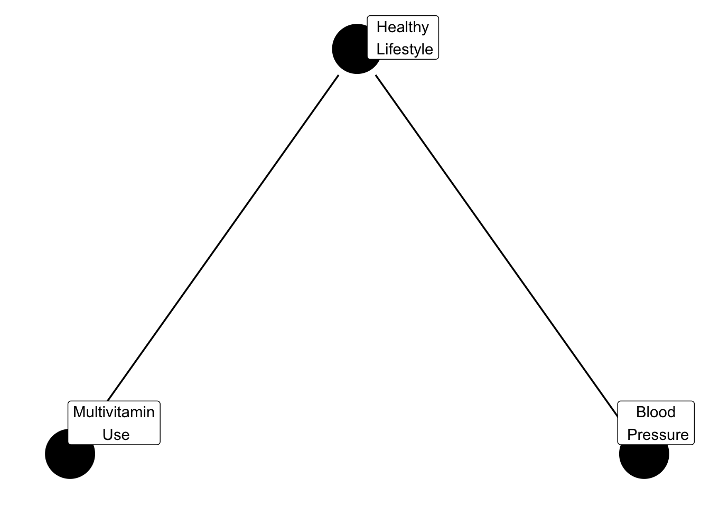

# Data Collection and Quality

We live in a world where data touch nearly every aspect of our lives: health care, online shopping, transportation, entertainment. From search engines to satellite images, from cell phones to credit cards, current technology can produce data faster than we can analyze them. 
 
This course is the beginning of your journey into the field of Statistics, a discipline whose main goal is to extract information and meaning from data. Two main stages in constructing this meaning are (1) visual exploration of the data and (2) building models to explain variation in the data. 

Because data are at the center of all of these endeavors, we will first take time to think about the collection of data and what factors can make data more or less reliable.

## What is Data?

Data is *anything* that contains information. We typically think of data being stored in spreadsheets, but it can come in many other formats such as images or collections of text (whether 280 character tweets or fictional novels). 

For example, we can take the pixels of digital images or text from one of the State of the Union addresses and transform them into a tidy, rectangular format. Below we show the top 10 words from the most recent State of the Union address given in the United States (excluding words such as "the", "and", "or", etc.).


```
## Warning: `data_frame()` is deprecated as of tibble 1.1.0.
## Please use `tibble()` instead.
## This warning is displayed once every 8 hours.
## Call `lifecycle::last_warnings()` to see where this warning was generated.
```

```
## Joining, by = "word"
```

```
## Selecting by n
```

```
## # A tibble: 11 x 2
##    word          n
##    <chr>     <int>
##  1 american     31
##  2 people       26
##  3 americans    24
##  4 tonight      23
##  5 america      18
##  6 country      15
##  7 tax          14
##  8 congress     13
##  9 home         12
## 10 family       10
## 11 world        10
```

**Tidy data** is a table with the following characteristics:

- Each row corresponds to an **observation** / **unit** / **case** (e.g., a person, classroom, country, image, word).
- Each column corresponds to a characteristic or feature or **variable** for those units (e.g. age, average classroom grade, average county income, intensity of red pixels, number of times the word "together" is used).

Variables can be either **categorical** or **quantitative**.

- **Categorical variable:** *A characteristic with values that are names of categories; the names of categories could be numbers such as with zipcodes. If the categories have a natural ordering, it may be called an ordinal variable, but we won't be distinguishing between different types of categorical variables in this class.* 

- **Quantitative variable:** *A characteristic with measured numerical values with units.*

*Note: Any quantitative variable can be converted into a categorical variable by creating categories defined by intervals or bins of values.* 

The following graphic from the book [R for Data Science](http://r4ds.had.co.nz/), by Garrett Grolemund and Hadley Wickham illustrates the features of tidy data.

 of R for Data Science](Photos/tidy.png)

The transformation process from raw data to a tidy data format is often called **feature extraction** and is not a short or easy task. In this introductory course, we will typically work with data that are already in a tidy format.

What the row represents is often referred to as the **unit of analysis**. As data analysts, it is important for us to consider what to use as the unit of analysis. For example, this may come up when we have information on both individual presidents and their speeches. Do we want to understand matters at the individual level or the speech level? Answers to these questions will depend on the context and the research questions.


## Data Context

For any data set, you should always ask yourself a few questions to provide vital **context** about that data set. 

- **Who is in the data set?** What is the observational unit? How did they end up in the data set? Were they selected randomly or were they in a particular location a particular time?
- **What is being measured or recorded on each unit?** What are the characteristics, features, or *variables* that were collected?
- **Where were they collected?** In one location? Multiple locations?
- **When was the data collected?** One point in time? Over time? If data quality degrades over time (e.g. lab specimens), we should be concerned.
- **How were they collected?** What instruments and methods used for measurement? What questions were asked and how? Online survey? By phone? In person?
- **Why were they collected?** For profit? For academic research? Are there conflicts of interest?
- **Who collected this data?** An agency, a consortium of researchers, an individual researcher?

Thinking about this data context informs us how we analyze the data, what conclusions we can draw, and whether we can generalize our conclusions to a larger population.

Many of these data context questions also hint at general considerations for threats to data quality. Threats to data quality generally arise through **sampling**, **information bias**, and **study design.**

## Sampling

When we study a phenomenon, we generally care about making a conclusion that applies to some **target population of interest** (e.g. all likely voters in the U.S., all eligible voters in the U.S., college students in Minnesota, etc.). However, we cannot feasibly collect data on that entire population (this is called a **census** and is very expensive to complete) due to financial and time constraints, so we collect a **sample** of individuals. We want our sample to be **representative** of the target population in that we want our sample to resemble the target population in the characteristics we are studying.

<div class="reflect">
<p>How is representativeness affected by our research question? Can a sample be representative for one goal but not another?</p>
</div>

When our method of selecting a sample is flawed, **sampling bias** can result, and our sample is unrepresentative of the target population. We need to be aware of how this tends to happen, and how can we avoid it.

It is first helpful to define the term **sampling frame**. A sampling frame is the complete list of individuals/units in the target population. For example, it could be a spreadsheet listing every college student that studies in Minnesota.

### Sampling Bias

The following are common ways that sampling bias can arise, and they all share the feature that a sampling frame is *NOT* used:

- **Convenience Sampling:** *Individuals that make up a convenience sample are easy to contact or to reach (e.g. you stand on a street corner and ask passerbys to answer a few questions). The people sampled will likely be systematically different than the target population.*

- **Self-Selection and Volunteer Sampling:** *Individuals that make up a sample self-select or volunteer to be in a sample  (e.g. product reviews on Amazon, individuals that call in to radio shows, blood donors, etc.). They are likely to be systematically different than the target population.*

One result of using these sampling techniques is that we can get **undercoverage** in the sample. This happens when some groups of the population are inadequately represented in the sample due to the sampling procedure. A famous example in United States history is the 1936 Literary Digest poll that completely mispredicted the presidential election. The magazine predicted a strong victory for Alfred Landon, but Franklin Delano Roosevelt ended up winning the election by a substantial margin. The survey relied on a convenience sample, drawn from telephone directories and car registration lists. In 1936, people who owned cars and telephones tended to be more affluent and leaned to the right politically (they favored Landon).

If we do not have a complete sampling frame, then we have no control over what units enter the sample because we do not even have a complete list of the units that *could* be sampled. Imagine that our target population is like a pot of soup, these forms of sampling are similar to scooping only the bits of soup that float to the top of the pot without stirring.

### Random Sampling

With a sampling frame, we can do better and hopefully avoid sampling bias by using randomization. In our soup metaphor, this amounts to mixing the soup thoroughly and dipping our spoon in random locations. 

These strategies are called **probability sampling** strategies or, more colloquially, **random sampling** strategies. In probability sampling, each unit in the sampling frame has a known, nonzero probability of being selected, and the sampling is performed with some chance device (e.g. coin flipping, random number generation). 

Some probability sampling techniques include:

**Simple Random Sampling:** *Each unit in the sampling frame has the same chance of being chosen and individuals are selected without replacement (once they have been chosen, they cannot be chosen again). With this strategy, every sample of a given size is equally likely to arise.*

**Stratified Sampling:** *The units in the sampling frame are first divided into categories/strata (e.g. age categories). Simple random sampling is then performed within each category/stratum. Why do this? Just by chance, simple random sampling might oversample young individuals. Stratifying by age first, then performing simple random sampling in these strata ensures a desired age distribution in the sample. With this strategy, you may be able to increase the precision of the estimates.*

**Cluster Sampling:** *Sometimes a sampling frame is more readily available for clusters of units rather than the units themselves. For example, a sampling frame of all hospitals in Minnesota might be more readily available than a sampling frame of all Minnesota hospital patients in a given time frame. In cluster sampling, the initial clusters are sampled with a probability sampling method (like simple random sampling or stratified sampling). All units in the sampled clusters may be chosen, or if sampling frames can be obtained for the sampled clusters, probability sampling is performed within the cluster. This strategy should only be used when a full sampling frame is unavailable or it is economically justified as this procedure generally provides less precision than the other two strategies.* 


### Nonresponse bias

Even with a random sampling method, our sample can still be unrepresentative if units in our sample do not choose to participate after they are selected. For example, if the communication method is via e-mail, individuals who do not read our e-mail may be nonresponders. If those individuals who don't participate are systematically different than those that do, this type of nonresponse bias is called **unit nonresponse bias**.

Let’s say that an individual opens up our e-mail survey. They may answer the first few questions but grow weary and skip the last questions. If those individuals who answer some but don't answer other questions are systematically different than those that do in their responses, this type of nonresponse bias is called **item nonresponse bias**.

## Information bias

Lastly, separate from sampling, bias can arise in how we record or measure observations. Some of these biases are types of cognitive biases that and others are statistical biases. Here are a few types of information biases that can occur:

- **Response bias/Self-report bias/Social desirability bias:** *Bias occurs when the recorded response does not accurately represent the true value for the individual due to wording of the question, ordering of the questions, format of response, or to increase social desirability. Most people like to present themselves in a favorable light, so they will be reluctant to admit to unsavory attitudes or characteristics (e.g. weight, income, alcohol consumption, mental illness) or illegal activities in a survey, particularly if the survey is completed in an interview setting and/or the results are not confidential. Additionally, this could arise if the possible responses do not allow for accurate reporting (e.g. [gender identity](https://www.hrc.org/resources/collecting-transgender-inclusive-gender-data-in-workplace-and-other-surveys), [race](https://www.pewsocialtrends.org/interactives/multiracial-timeline/)).* 
- **Recall bias:** *People often unintentionally make mistakes in remembering details about the past. If the study design is retrospective in that it requires units to rely on their memory, we may get bias in the information collected.* 
- **Measurement error:** *Technologies that measure variables of interest may not always be accurate and human calibration of those instruments may be off as well.* 

There are many other forms of bias, many of which are studied by cognitive and social pscyhologists. When designing questionnaires and surveys, it is important to keep these in mind. A researcher must first decide what specific information they want to collect and then figure out the best way to accurately collect that. 

## Study Design

Once we have a sample selected, data can be collected in one of two general study designs:

1. **Observational Study:** *Data is collected in such a way such that the researcher **does not** manipulate or intervene in the characteristics of the individuals. Researchers observe or record characteristics of the sample through direct measurement or through a questionnaire or survey.*

2. **Experiment:** *Data is collected in such a way such that the researcher **does** manipulate or intervene in characteristics of the individuals by randomly assigning individuals to treatment or control groups. Researchers then record characteristics of the individuals in the sample within the treatment and control groups.*

The main reason for doing an experiment is to estimate a relationship between a treatment and a response.

For example, imagine that we want to know if taking a daily multivitamin reduces systolic blood pressure. If we performed an observational study, we would select a sample (hopefully a representative one) from a population of interest and then ask whether an individual takes a daily multivitamin and then measure their blood pressure. *Would this data provide enough evidence to conclude that vitamin use causes a reduction in blood pressure?*

Individuals that take daily multivitamins may be more health-conscious, eating more fruits and vegetables and exercising more, which may be related to blood pressure. The diet and exercise would be acting as **confounding variables**, making it impossible to say for certain if vitamin use has a direct impact on blood pressure.

**Confounding Variables:** *A third variable that is a common cause for the "treatment" (e.g. multivitamin) and the "response" (e.g. blood pressure). In this case, a healthy lifestyle could be a variable that confounds the relationship between multivitamin use and blood pressure.*


```r
confounder_triangle(y= "Blood\n Pressure", 
                  z = "Healthy\n Lifestyle",
                  x= "Multivitamin\n Use") %>%
ggdag( text = FALSE, use_labels = "label") +
  theme_dag_blank()
```




<div class="reflect">
<p>For example, say we note that on days with higher ice cream sales, there are typically a higher number of pool drownings. What variable could be confounding the relationship between ice cream sales and pool drownings?</p>
</div>

In an experiment, we "manipulate" the characteristics for an individual by randomly assigning them to a treatment group. This random assignment is intended to break the relationship between any common causes and the treatment so as to try to reduce the impact of confounding. It is impossible to entirely remove the possibility of confounding, but the random assignment to a treatment helps. (Note: things can get complicated if individuals don't comply with the treatment such as take the multivitamin every single day...)

## Cause and Effect

Causal inference is the process of making a conclusion about direct cause and effect between a "treatment" and a "response". It is difficult to make causal statements based on data from an observational study due to the possible presence of confounding variables. 

There is a whole area of statistics dedicated to methods that attempt to overcome the potential confounding. We'll talk more about causal inference in (Section \@ref(dag)).

## Ethical Considerations

Ethics play a very important role in study design and data collection procedures, especially when humans and animals are the observational units. In the United States, the [Belmont Report](https://www.hhs.gov/ohrp/regulations-and-policy/belmont-report/index.html) is the main federal document that provides the "Ethical Principles and Guidelines for the Protection of Human Subjects of Research". The three fundamental ethical principles for using any human subjects for research are:

1. **Respect for persons**: This principle is about protecting the autonomy of all people and treating them with courtesy and respect and allowing for informed consent. Researchers must be truthful and conduct no deception;

2. **Beneficence**: This principle is the philosophy of "do no harm" while maximizing benefits for the research project and minimizing risks to the research subjects; and

3. **Justice**: This principle is about ensuring reasonable, non-exploitative, and well-considered procedures are administered fairly — the fair distribution of costs and benefits to potential research participants — and equally.


For a brief, limited history of ethical regulation in human research, see https://www.ncbi.nlm.nih.gov/pmc/articles/PMC3593469/. A few key moments in international history are

- [Nuremberg Code](https://www.nejm.org/doi/full/10.1056/NEJM199711133372006) (1948) in response to medical experiments in Germany performed without consent
- [Declaration of Helskinki](https://www.wma.net/what-we-do/medical-ethics/) (originated in 1964 and frequently revised) established by World Medical Association.
- The Belmont Report written in response to the Tuskegee Syphilis Study (1932 - 1972).
- [Common Rule](https://www.hhs.gov/ohrp/regulations-and-policy/regulations/common-rule/index.html) (1981) is regulatory policy which all U.S. government-funded research and nearly all U.S. academic institutions must abide.

Macalester College has an Institutional Review Board (IRB) that oversees research at Macalester that includes human participants (see: https://www.macalester.edu/irb/).

Throughout this class, we are going to stop and think about the ethical considerations of the many parts of statistical practice, ranging from data collection to model prediction. 

**Ethics** are the norms or standards for conduct that distinguish between right and wrong. In particular, we are going to consider the ethics of 

- How the data are collected
- Random assignment to treatments 
- Data storage
- Data privacy
- Data use
- Choice of sample data used for predictive modeling
- Use of predictive modeling

We are going to pay extra attention to negative consequences of the above that may disproportionately impact marginalized groups of people. 

Throughout the semester, you will be asked to think about answers to the question: "What are the ethical considerations for this data set/analysis?" Like in other disciplines, the choices we make will be biased by our life experiences. Throughout this class, let us be mindful in increasing our awareness of the real consequences caused by choices we make in Statistics.


## Chapter 1 Major Takeaways

1. Any observed data is a sample of a larger population or phenomenon. But you need to consider which population. Is it the population of interest to you? If not, then why?

2. Sampling strategies impact what type of generalizations we can make about a population. Bias occurs when there are systematic differences between observed sample data and the true population of interest due to the sampling process.

3. The data we collect many not accurately reflect the truth due to information biases caused by the data collection mechanism (instrument or survey).

4. Study design impacts what type of conclusions we can make. Confounding variables prevent us from easily making cause and effect conclusions. 

5. We need to be aware of the real and ethical consequences of our choices when working with data and building statistical models.
