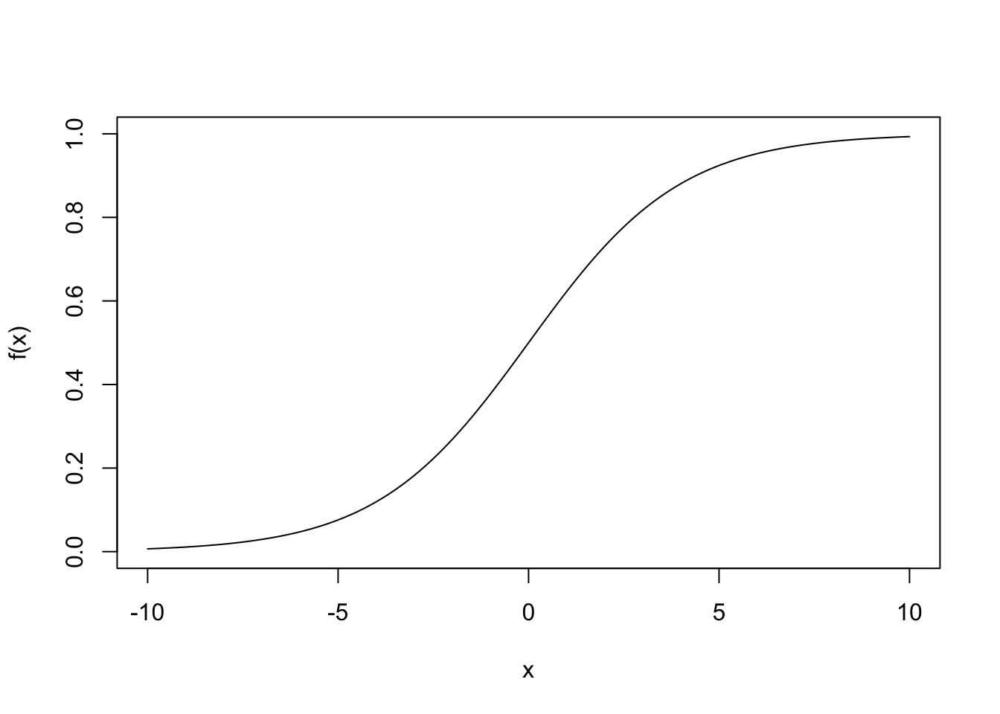
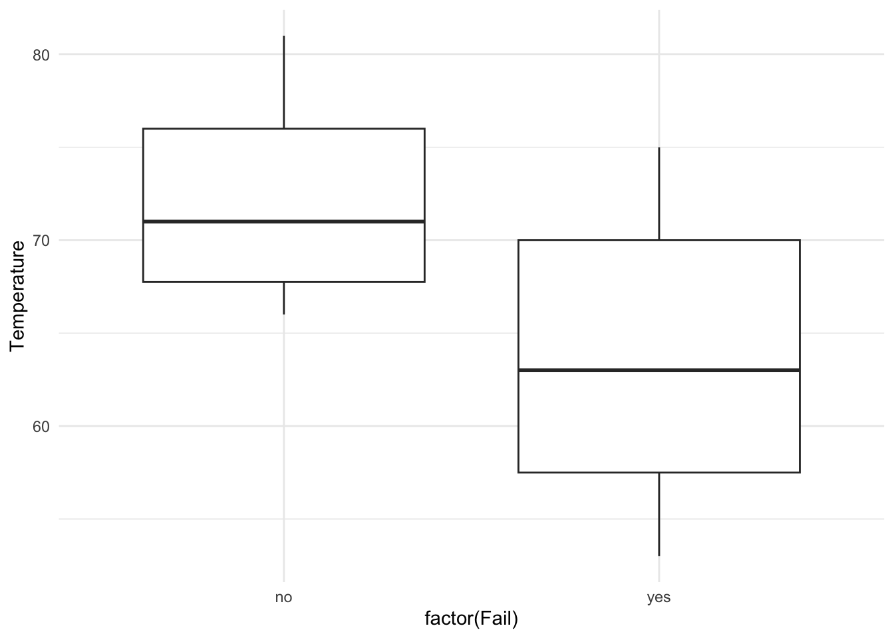
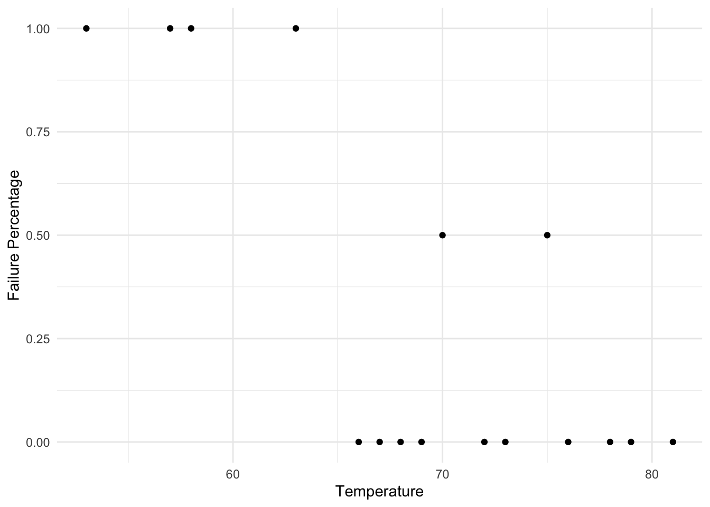
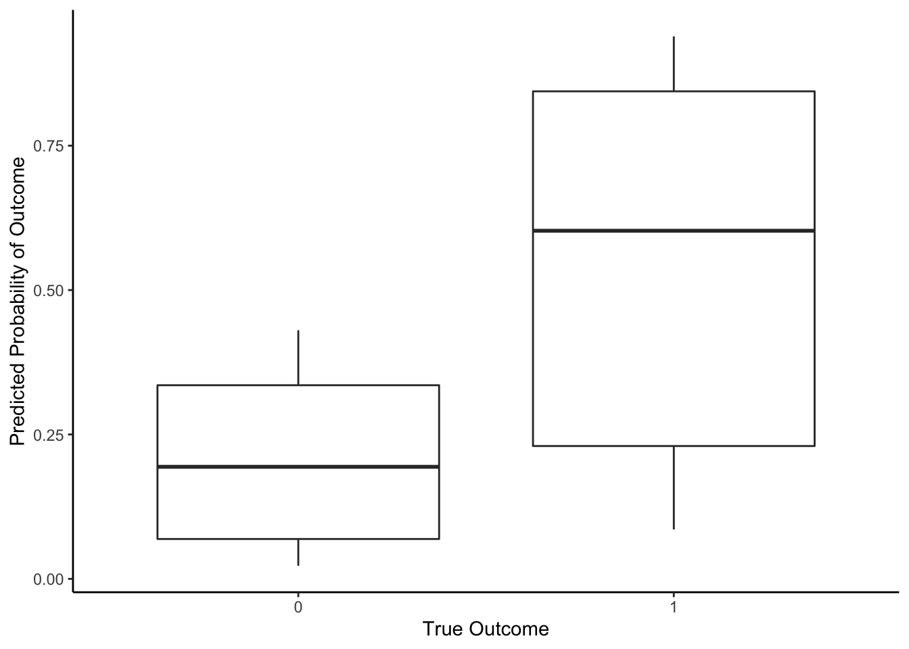
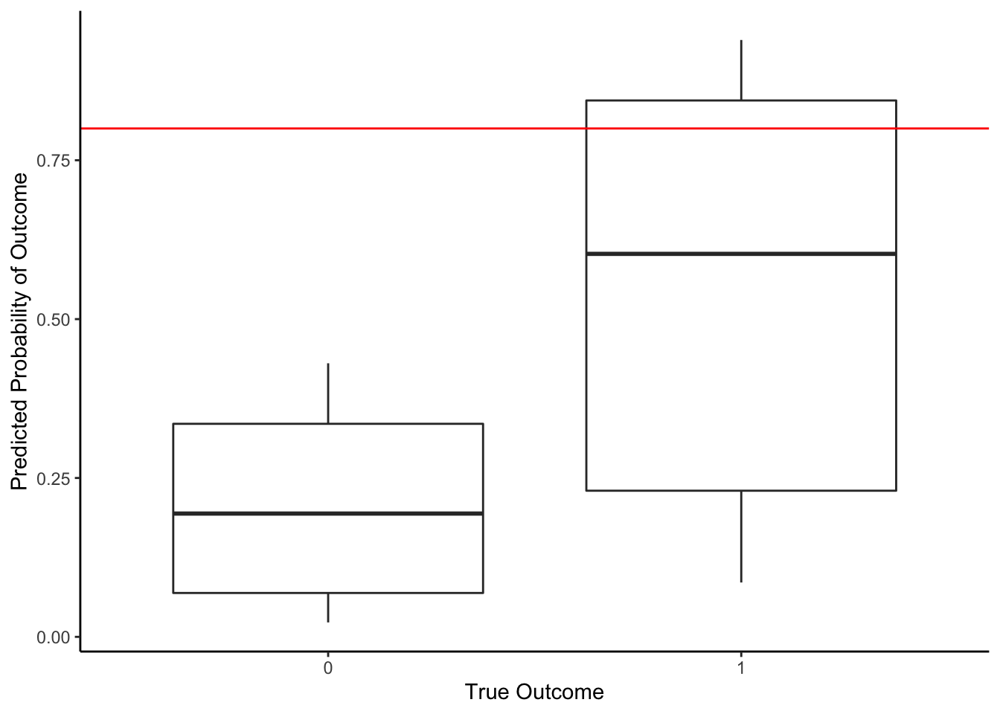
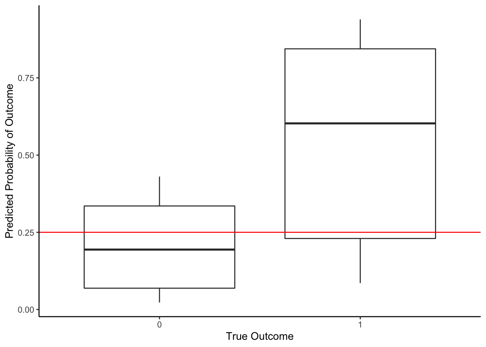

# Logistic Regression Models {#logistic}

If you want to predict a binary categorical variable (only 2 possible outcomes), the standard linear regression models don't apply. If you let the two possible outcome values be $Y=0$ and $Y=1$, you'll never get a straight line relationship with any $X$ variable. 

Throughout this section, we will refer to one outcome as "success" (denoted $Y=1$) and "failure" (denoted $Y=0$). Depending on the context of the data, the success could be a negative thing such as "heart attack" or "20 year mortality" or it could be a positive thing such as "passing a course".

We will denote $p$ to be the chance of success and $1-p$ be the chance of failure. You can think of $p$ as the expected outcome, $E[Y]$. For example, if we consider flipping a coin with 2 equally likely sides, we'd expected a one side (say Heads) 50% of the time, which is the chance of getting that side (Heads). Yes, it is not possible for $Y$ to be equal to 0.5 because in this context, $Y=0$ or $Y=1$, but the $E[Y]$ gives the relative frequency of successes in the long run. 

We want to build a model to explain why the chance of one outcome (success) may be higher for one group of people in comparison to another. 

## Logistic and Logit

Since we can't use a straight line model, we'll need to consider other mathematical functions to model the relationship between $X$ and the chance of success, $p=E[Y]$. 

The **logistic function** is an S shaped curve (sigmoid curve). For our purposes, the function will take the form

$$f(x) = \frac{1}{1 + e^{\beta_0 +\beta_1x}}$$



For any real value $x$, this function, $f(x)$, will be a value between 0 and 1. This is perfect for us since probabilities or chances should also be between 0 and 1. 

In fact, we'll let the chance of failure outcome (when $Y=0$), $1-p$, be modeled by this S function.

$$1-p = \frac{1}{1 + e^{\beta_0 +\beta_1X}}$$
<div class="mathbox">
<p>With a bit of algebra and rearranging terms, we can write this
equation in terms of <span class="math inline">\(p\)</span>, the chance
of success.</p>
<p><span class="math display">\[1-p = \frac{1}{1 + e^{\beta_0
+\beta_1X}}\]</span> <span class="math display">\[p = 1-\frac{1}{1 +
e^{\beta_0 +\beta_1X}}\]</span></p>
<p><span class="math display">\[p =
\frac{1 + e^{\beta_0 +\beta_1X}}{1 + e^{\beta_0 +\beta_1X}}-\frac{1}{1 +
e^{\beta_0 +\beta_1X}}\]</span></p>
<p><span class="math display">\[p = \frac{e^{\beta_0 +\beta_1X}}{1 +
e^{\beta_0 +\beta_1X}}\]</span></p>
</div>

Let's define one more term. The **odds** of a success is the ratio of the chance of success to the chance of failure, odds $=p/(1-p)$.

<div class="mathbox">
<p>With a bit more algebra and rearranging terms, we can write the above
model as a linear regression model.</p>
<p><span class="math display">\[p/(1-p) = \frac{e^{\beta_0 +\beta_1X}}{1
+ e^{\beta_0 +\beta_1X}}/\frac{1}{1 + e^{\beta_0 +\beta_1X}}\]</span>
<span class="math display">\[p/(1-p) = e^{\beta_0 +\beta_1X}\]</span>
<span class="math display">\[\log(p/(1-p)) = \beta_0
+\beta_1X\]</span></p>
</div>

This is a **simple logistic regression model**. On the left hand side, we have the natural log of the odds of success for a given value of $X$. The log odds is called the **logit** function. Think of this as a transformed version of our expected outcome for a given value of $X$. On the right hand side, we have a familiar linear model equation. 

$$\log\left(\frac{p}{1-p}\right) =\log\left(\hbox{Odds of Success given } X\right) = \log\left(\frac{E[Y|X]}{1-E[Y|X]}\right) = \beta_0 +\beta_1X$$

Like a linear regression model, we can extend this model to a **multiple logistic regression model** by adding additional $X$ variables,

$$\log\left(\frac{p}{1-p}\right) =\log\left(\hbox{Odds of Success given } X_1,...,X_k\right)= \log\left(\frac{E[Y|X_1,...,X_k]}{1-E[Y|X_1,...,X_k]}\right) \\ = \beta_0 +\beta_1X_1+\beta_2X_2+\beta_3X_3+\cdots +\beta_kX_k$$

## Fitting the Model

Based on observed data that includes an indicator variable for the responses ($Y=1$ for success, $Y=0$ for failure) and predictor variables, we need to find the slope coefficients, $\beta_0$,...,$\beta_k$ that best fits the data. The way we do this is through a technique called **maximum likelihood estimation**. We will not discuss the details in this class; we'll save this for an upper level statistics class such as Mathematical Statistics.

In R, we do this with the **g**eneralized **l**inear **m**odel function, `glm()`.

For a data set, let's go back in history to January 28, 1986. On this day, the U.S. space shuttle called Challenger took off and tragically exploded about one minute after the launch. After the incident, scientists ruled that the disaster was due to an o-ring seal failure. Let's look at experimental data on the o-rings prior to the fateful day.


``` r
require(vcd)
data(SpaceShuttle)

SpaceShuttle %>%
  filter(!is.na(Fail)) %>%
  ggplot(aes(x = factor(Fail), y = Temperature) )+ 
  geom_boxplot() +
  theme_minimal()
```





<div class="reflect">
<p>What are the plots above telling us about the relationship between
chance of o-ring failure and temperature?</p>
</div>


Let's fit a simple logistic regression model with one explanatory variable to predict the chance of o-ring failure (which is our "success" here -- we know it sounds morbid) based on the temperature using the experimental data. 


``` r
SpaceShuttle <- SpaceShuttle %>%
  mutate(Fail = ifelse(Fail == 'yes', 1, 0))

model.glm <- SpaceShuttle %>%
  with(glm(Fail ~ Temperature, family = binomial))

model.glm %>% 
  tidy()
```

```
## # A tibble: 2 × 5
##   term        estimate std.error statistic p.value
##   <chr>          <dbl>     <dbl>     <dbl>   <dbl>
## 1 (Intercept)   15.0       7.38       2.04  0.0415
## 2 Temperature   -0.232     0.108     -2.14  0.0320
```

Based on a logistic regression model, the predicted log odds of an o-ring failure is given by

$$\log\left(\frac{\hat{p}}{1-\hat{p}}\right) = 15.0429 -0.2322\cdot Temperature$$


## Coefficient Interpretation

Let's take a look at the estimates from the model. What do they mean?


``` r
tidy(model.glm) %>%
  select(term, estimate)
```

```
## # A tibble: 2 × 2
##   term        estimate
##   <chr>          <dbl>
## 1 (Intercept)   15.0  
## 2 Temperature   -0.232
```

The slope coefficient (-0.232) tells you how much the predicted log odds of o-ring failure increase with an increase of 1 degree  in temperature. But what does a 1 unit increase in log odds mean? We need to do a bit of algebra to get something more interpretable. 

<div class="mathbox">
<p>Our model is</p>
<p><span class="math display">\[\log\left(\frac{p}{1-p}\right) =
\log\left(\frac{E[Y|X]}{1-E[Y|X]}\right) = \beta_0
+\beta_1X\]</span></p>
<p>Imagine considering a particular value of <span
class="math inline">\(X=x\)</span> (such as temperature = <span
class="math inline">\(x\)</span>),</p>
<p><span
class="math display">\[\log\left(\frac{E[Y|X=x]}{1-E[Y|X=x]}\right) =
\beta_0 +\beta_1x\]</span></p>
<p>If we increase <span class="math inline">\(X\)</span> by 1, then we
expected a change in our outcome or chance of success, <span
class="math inline">\(E[Y|X = x+1]\)</span>,</p>
<p><span class="math display">\[\log\left(\frac{E[Y|X= x+1]}{1-E[Y|X=
x+1]}\right) = \beta_0 +\beta_1(x+1)\]</span></p>
<p>Let’s find the difference between these two equations,</p>
<p><span
class="math display">\[\log\left(\frac{E[Y|X=x+1]}{1-E[Y|X=x+1]}\right)-
\log\left(\frac{E[Y|X=x]}{1-E[Y|X=x]}\right)=  (\beta_0 +\beta_1(x+1)) -
( \beta_0 +\beta_1x)\]</span> and simplify the right hand side (we love
it when things cancel!),</p>
<p><span
class="math display">\[\log\left(\frac{E[Y|X=x+1]}{1-E[Y|X=x+1]}\right)-
\log\left(\frac{E[Y|X=x]}{1-E[Y|X=x]}\right)=  \beta_1\]</span> and then
simplify the left hand side (using our rules of logarithms),</p>
<p><span class="math display">\[\log\left(
\frac{E[Y|X=x+1]/(1-E[Y|X=x+1])}{E[Y|X=x]/(1-E[Y|X=x])}\right) =
\beta_1\]</span></p>
<p>Let’s exponentiate both sides,</p>
<p><span class="math display">\[\left(
\frac{E[Y|X=x+1]/(1-E[Y|X=x+1])}{E[Y|X=x]/(1-E[Y|X=x])}\right)=
e^{\beta_1}\]</span></p>
<p><span class="math display">\[\left( \frac{\hbox{Odds of Success when
}X=x+1}{\hbox{Odds of Success when }X=x}\right)=
e^{\beta_1}\]</span></p>
</div>

After that algebra, we find that $e^{\beta_1}$ is equal to the **odds ratio**, the ratio of the odds of success between two groups of values (those with $X=x+1$ and those with $X=x$, 1 unit apart)


When we fit the model to the o-ring experimental data, we estimate the coefficients to be $\hat{\beta}_0 = 15.04$ and $\hat{\beta}_1 = -0.232$. So the estimated odds ratio is $e^{\hat{\beta}_1} = e^{-0.232} = 0.793$ for an increase in one degree Fahrenheit in temperature (Temperature=T+1 v. Temperature=T). 


``` r
tidy(model.glm) %>%
  select(term, estimate) %>%
  mutate(estimate_exp = exp(estimate)) %>%
  mutate(estimate_exp = round(estimate_exp,3)) #round to 3 decimal places
```

```
## # A tibble: 2 × 3
##   term        estimate estimate_exp
##   <chr>          <dbl>        <dbl>
## 1 (Intercept)   15.0    3412315.   
## 2 Temperature   -0.232        0.793
```

- If a ratio is greater than 1, that means that the denominator is less than the numerator or equivalently the numerator is greater than denominator (odds of success are greater with T+1 as compared to T --> positive relationship between $X$ variable and odds of success). 

- If a ratio is less than 1, that means that the denominator is greater than the numerator or equivalently the numerator is less than denominator (odds of success are less with T+1 as compared to T --> negative relationship between $X$ variable and odds of success). 

- If the ratio is equal to one, the numerator equals the denominator (odds of success are equal for the two groups --> no relationship).


In this case, we have an odds ratio < 1 which means that the estimated odds of o-ring failure is lower for increased temperatures (in particular by increasing by 1 degree Fahrenheit). This makes sense since we saw in experimental data that the proportion of o-ring failures was lower in warmer temperatures. 

## Logistic Model Prediction

On January 28, 1986, the temperature was 26 degrees F. Let's predict the chance of "success," which is a failure of o-rings in our data context, at that temperature.  


``` r
#type = 'response' gives predicted chance, rather than predicted odds
predict(model.glm, newdata = data.frame(Temperature = 26), type = 'response') 
```

```
##         1 
## 0.9998774
```

They didn't have any experimental data testing o-rings at this low of temperatures, but even based on the data collected, we predict the chance of failure to be nearly 1 (near certainty). 

### Hard Predictions/Classifications

These predicted chances of "success" are useful to give us a sense of uncertainty in our prediction. If the chance of o-ring failure were 0.8, we would be fairly certain that a failure were likely but not absolutely. If the chance of o-ring failure were 0.01, we would be pretty certain that a failure was not likely to occur. 

But if we had to decide whether or not we should let the shuttle launch go, how high should the predicted chance be to delay the launch (even if it would cost a lot of money to delay)?

It depends. Let's look at a boxplot of **predicted probabilities** of "success" compared to the true outcomes.


``` r
model.glm %>%
  augment(type.predict = 'response') %>%
  ggplot(aes(x = factor(Fail), y = .fitted)) + 
  geom_boxplot() +
  labs(y = 'Predicted Probability of Outcome', x = 'True Outcome') +
  theme_classic()
```



If we used a threshold of 0.8, then we'd say that for any experiment with a predicted chance of o-ring failure 0.8 or greater, we'll predict that there will be o-ring failure. As with any predictions, we may make an error. With this threshold, what is our **accuracy** (# of correctly predicted/# of data points)? 


``` r
model.glm %>%
  augment(type.predict = 'response') %>%
  ggplot(aes(x = factor(Fail), y = .fitted)) + 
  geom_boxplot() +
  labs(y = 'Predicted Probability of Outcome', x = 'True Outcome') +
  geom_hline(yintercept = 0.8, color = 'red') + #threshold
  theme_classic()
```



In the table below, we see that there were 3 data points in which we correctly predicted o-ring failure (using a threshold of 0.8). There were 4 data points in which we erroneously predicted that it wouldn't fail when it actually did, and we correctly predicted no failure for 16 data points. So in total, our accuracy is (16+3)/(16+4+3) =  0.82 or 82%. 


``` r
threshold <- 0.80

model.glm %>%
  augment(type.predict ='response') %>%
  mutate(predictFail = .fitted >= threshold) %>%
  count(Fail, predictFail) %>%
  mutate(correct = (Fail == predictFail)) %>%
  group_by(Fail) %>%
  mutate(prop = n/sum(n)) #Specificity, False pos, False neg, Sensitivity 
```

```
## # A tibble: 3 × 5
## # Groups:   Fail [2]
##    Fail predictFail     n correct  prop
##   <dbl> <lgl>       <int> <lgl>   <dbl>
## 1     0 FALSE          16 TRUE    1    
## 2     1 FALSE           4 FALSE   0.571
## 3     1 TRUE            3 TRUE    0.429
```

The only errors we made were **false negatives** (predict no "success" because $\hat{p}$ is less than threshold when outcome was true "success", $Y=1$); we predicted that the o-ring wouldn't fail  but the o-rings did fail in the experiment ($Y=1$). In this data context, false negatives have real consequences on human lives because a shuttle would launch and potentially explode because we had predicted there would be no o-ring failure. 

The **false negative rate** is the number of false negatives divided by the false negatives + true positives (denominator should be total number of experiments with actual o-ring failures). With a threshold of 0.80, our false negative rate is 4/(3+4) = 0.57 = 57%. We failed to predict 57% of the o-ring failures. This is fairly high when there are lives on the line.

The **sensitivity** of a prediction model is the true positives divided by the false negatives + true positives (denominator should be total number of experiments with actual o-ring failures). It is 1-false negative rate, so the model for o-ring failures has a 1-0.57 = 0.43 or 43% sensitivity. 

A **false positive** (predict "success" because $\hat{p}$ is greater than threshold when outcome was not a "success", $Y=0$). A false positive would happen when we predicted o-ring failure when it doesn't actually happen. This would delay launch (cost \$) but have minimal impact on human lives. 

The **false positive rate** is the number of false positives divided by the false positives + true negatives (denominator should be total number of experiments with no o-ring failures). With a threshold of 0.80, our false positive rate is 0/16 = 0. We always accurately predicted the o-rings would not fail.

The **specificity** of a prediction model is the true negatives divided by the false positives + true negatives (denominator should be total number of experiments with no o-ring failures). It is 1-false positive rate, so the model for o-ring failures has a 1-0 = 1 or 100% specificity. 

<div class="mathbox">
<p>To recap,</p>
<ul>
<li><p>The <strong>accuracy</strong> is the overall percentage of
correctly predicted outcomes out of the total number of outcome
values</p></li>
<li><p>The <strong>false negative rate (FNR)</strong> is the percentage
of incorrectly predicted outcomes out of the <span
class="math inline">\(Y=1\)</span> “success” outcomes (conditional on
“success”)</p></li>
<li><p>The <strong>sensitivity</strong> is the percentage of correctly
predicted outcomes out of the <span class="math inline">\(Y=1\)</span>
“success” outcomes (conditional on “success”); 1 - FNR</p></li>
<li><p>The <strong>false positive rate (FPR)</strong> is the percentage
of incorrectly predicted outcomes out of the <span
class="math inline">\(Y=0\)</span> “failure” outcomes (conditional on
“failure” or “no success”)</p></li>
<li><p>The <strong>specificity</strong> is the percentage of correctly
predicted outcomes out of the <span class="math inline">\(Y=0\)</span>
“failure” outcomes (conditional on “failure” or “no success”); 1 -
FPR</p></li>
</ul>
</div>


What if we used a lower threshold to reduce the number of false negatives (those with very real human consequences)? Let's lower it to 0.25 so that we predict o-ring failure more easily. 

``` r
model.glm %>%
  augment(type.predict = 'response') %>%
  ggplot(aes(x = factor(Fail), y = .fitted)) + 
  geom_boxplot() +
  labs(y = 'Predicted Probability of Outcome', x = 'True Outcome') +
  geom_hline(yintercept = 0.25, color = 'red') + #threshold
  theme_classic()
```



Let's find our accuracy: (10+4)/(10+3+6+4) = 0.61. Worse than before, but let's check false negative rate: 3/(3+4) = 0.43. That's lower. But now we have a non-zero false positive rate: 6/(6+10) = 0.375. So of the experiments with no o-ring failure, we predicted incorrectly 37.5% of the time. 


``` r
threshold <- 0.25

augment(model.glm, type.predict ='response') %>%
  mutate(predictFail = .fitted >= threshold) %>%
  count(Fail, predictFail) %>%
  mutate(correct = (Fail == predictFail)) %>%
  group_by(Fail) %>%
  mutate(prop = n/sum(n)) #Specificity, False pos, False neg, Sensitivity 
```

```
## # A tibble: 4 × 5
## # Groups:   Fail [2]
##    Fail predictFail     n correct  prop
##   <dbl> <lgl>       <int> <lgl>   <dbl>
## 1     0 FALSE          10 TRUE    0.625
## 2     0 TRUE            6 FALSE   0.375
## 3     1 FALSE           3 FALSE   0.429
## 4     1 TRUE            4 TRUE    0.571
```

Where the threshold goes depends on the real consequences of making those two types of errors and needs to be made in the social and ethical context of the data. 

## Logistic Model Evaluation

In deciding whether a logistic regression model is a good and useful model, we need to consider how well it predicts the outcome. We have a few measures that we've already discussed: the accuracy, sensitivity, specificity, the false positive rate, and the false negative rate. 

In order to calculate accuracy, sensitivity, and specificity, you have to choose a threshold to deem how high a predicted probability of success needs to be to predict a success. But, **what threshold should be used?** 

The threshold directly impacts the balance of false positives and false negatives. 

- If we have a high threshold (closer to 1), we have a very high bar needed to predict a success. This makes it harder to predict a success outcome and thus, we will have fewer false positives. In fact, if our threshold is 1, we wouldn't predict any successes so we'd have zero false positives but a lot of false negatives. 
- If we have a low threshold (closer to 0), we have a lower bar to predict a success. It will be easier to predict a success and we will have many more false positives and fewer false negatives. If the threshold were 0, we would predict every unit to have a success and have zero false negative rate.

In practice, we have to consider the human consequences of each type of error (false positive and false negative) in order to determine the appropriate balance for the data context.

- For example, let's consider the real consequences of an error in a mammogram. If the procedure indicates abnormal tissue but it ends up not being breast cancer, it's a false positive; this result might lead to unnecessary tests and procedures and invoke stress and anxiety for the patient. A false negative happens with a normal mammogram when, in fact, the patient does have breast cancer and this could delay important treatment. How do you weigh the benefits of catching early stages of breast cancer with the costs of unnecessary tests and anxiety? 

- What about the consequences of false positive or false negative in advertising and sales? A business wants to predict whether a customer would buy something if it is on sale but it costs some money to send an advertisement in the mail. A false positive happens when the business predicts a customer would be enticed to make a purchase based on an advertisement but they do not; this costs money. A false negative is a missed opportunity and a missed revenue because a customer did not receive the advertisement. 

Depending on the context, we may focus on

- maximizing the overall accuracy 
- minimizing the false negative rate (maximizing sensitivity) with greater weight than false positives
- minimizing the false positive rate  (maximizing specificity) with greater weight than false negatives
- balancing the false positive and false negative rates.  

There are techniques that attempt to capture the "goodness" of fit without choosing a specific threshold, such as the ROC curve and likelihood measures (AIC and BIC -- lower is better), which you'll learn about in future statistics classes.


## Alternative Classification Models


Logistic regression is a very useful model to predict a binary outcome. However, it has its limitations. We are assuming a linear relationship between explanatory variables and the log odds of success. This is hard to check because we don't have a variable for odds that we could quickly plot. 

Other methods out there are more flexible but also more complex. Here is a list of some of the most popular classification methods. 

- Classification Trees can predict a binary outcome and choose the variables that are most important by recursively partitioning the data into groups that are more similar in terms of the outcome as well as in chosen predictor variables.

- Random Forests are an ensemble of classification tress that together are more stable than any one classification tree.

- Boosted Trees are classification trees that are sequentially created to target the errors from the last tree.

- Neural Networks are a type of classification algorithm that creates new features based on the original data that are the best predictors of the outcome. 

Take Statistical Machine Learning to learn more about these methods. But keep in mind that sometimes for a task, complex is not necessary: see https://www.huffingtonpost.com/2014/02/10/klemens-torggler-evolution-door_n_4762261.html.

## Chapter 4 Major Takeaways

Logistic regression is used to predict binary categorical outcomes based on explanatory variables.

- The benefit of using logistic regression in this setting over linear regression is that we constrain the predicted probabilities to be between 0 and 1. 
- When interpreting logistic regression models, you need to exponentiate the slope coefficients to get meaning values to interpret. The exponentiate slopes are ratios of odds of the outcome, compare two groups defined by the explanatory variable (quantitative X: groups are 1 unit apart in X; categorical X: indicator group compared to reference level).
- To evaluate the model, we consider the predicted probabilities within groups based on the true outcome. We hope that the predicted probabilities given from the model are well separated between the groups based on true outcome values.
- Additionally, to evaluate the model, we convert those probabilities to predicted outcomes by setting a threshold from which the accuracy, sensitivity, specificity, false positive rate, and false negative rate can be calculated.

