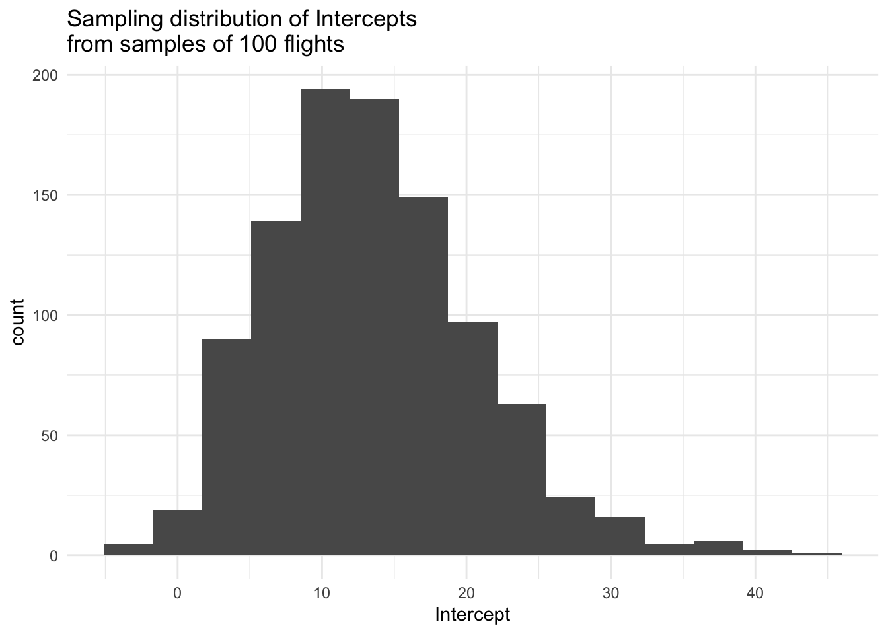
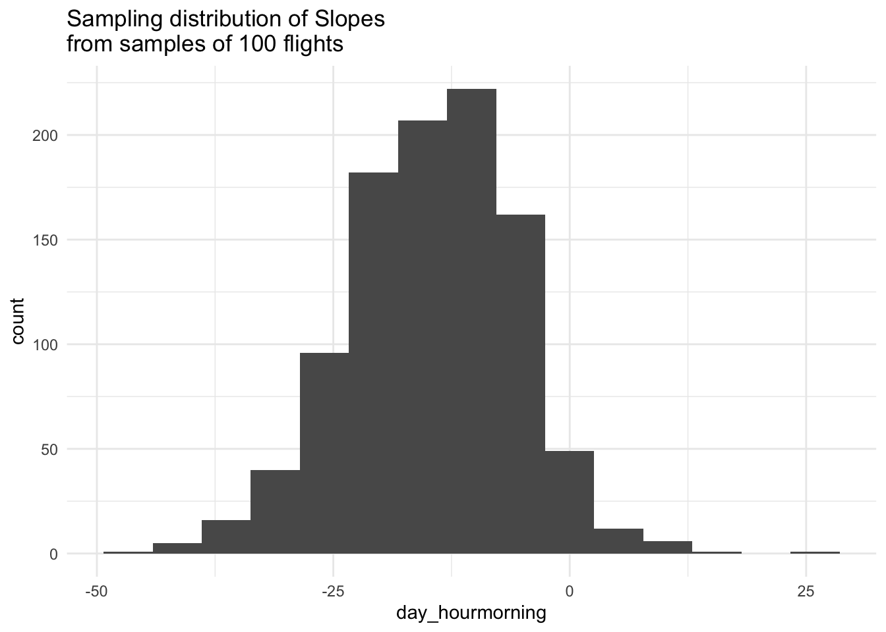
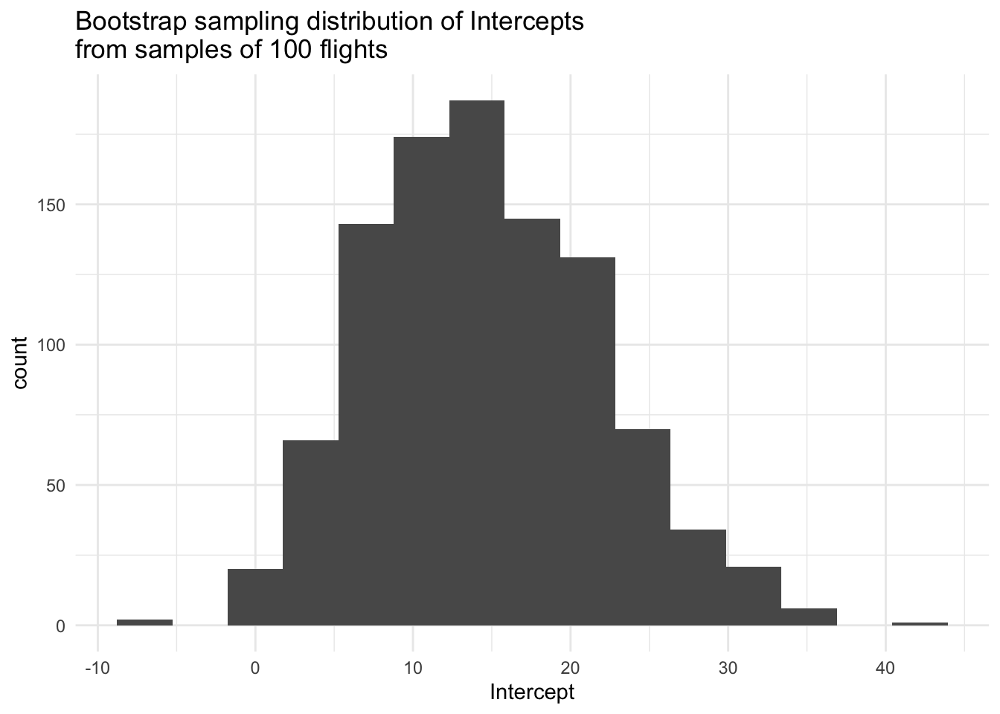
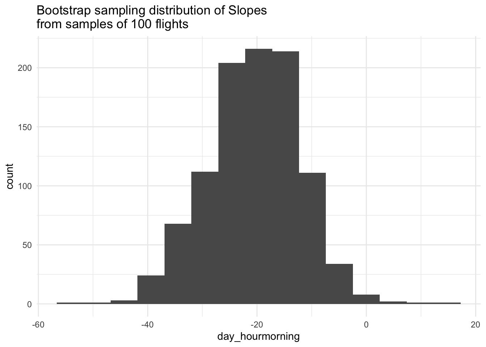
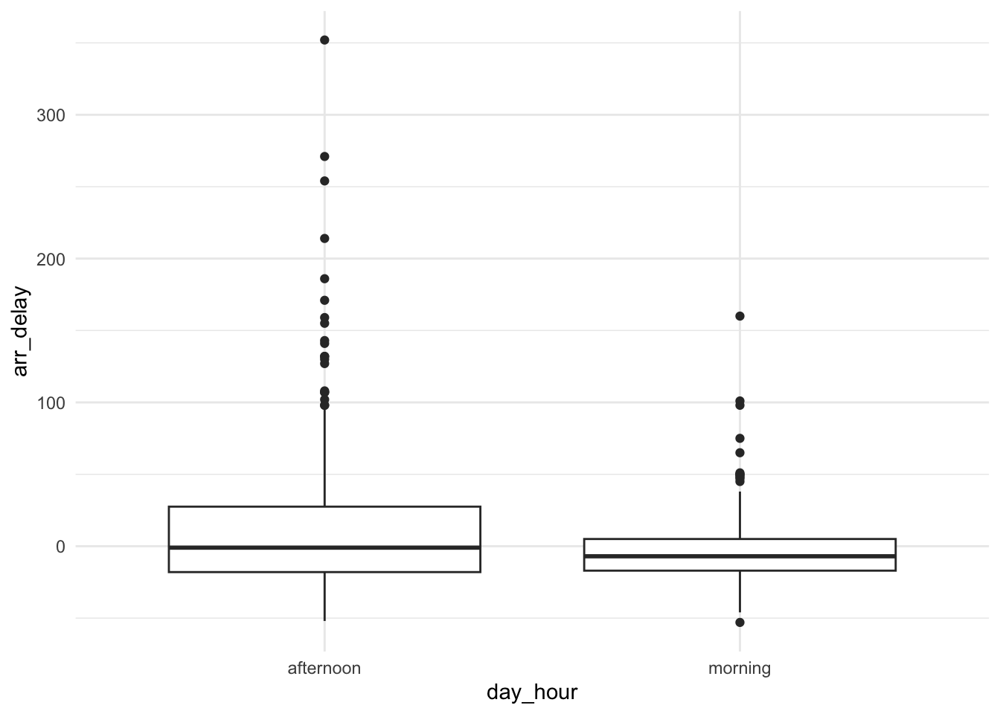
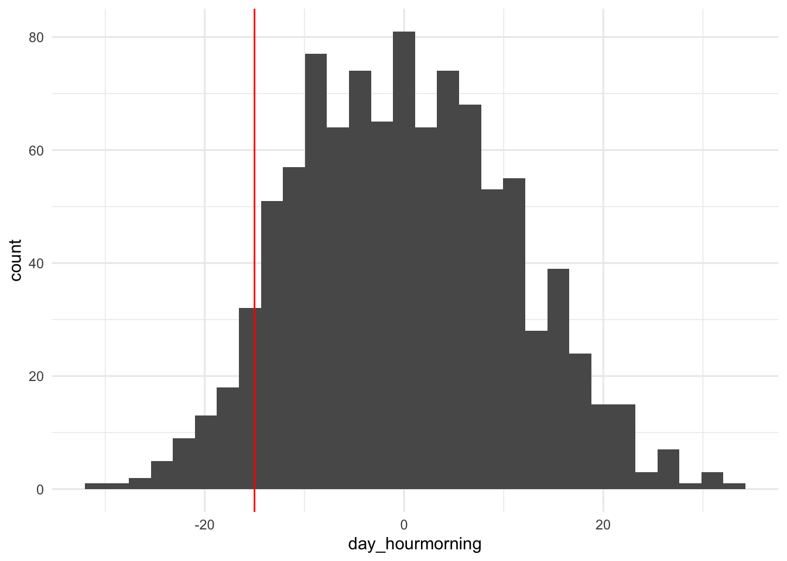

# Random Variability {#randvariability}

Up until this point, we have thought about 

1. Data collection process (sampling and study design) and Data Quality (issues of bias)
2. Data visualization (the first step of any data analysis)
3. Modeling (to explain observed variation and provide predictions)

Throughout the past three chapters, we have also sprinkled in the idea that **the sample we observe is just one random representation of the true population or phenomenon.** Therefore, any **statistic**, any numerical summary of the sample, would be an estimate the true numerical summary of the population (which we refer to as the corresponding unknown **parameter**).

## Sampling Variability

If we could repeat the random sampling process, each sample we would get would be slightly different. The composition of units/cases in the sample would differ every time. Sometimes we would randomly over-represent one group of people and another time we would randomly over-represent another group of people, just by chance. The statistic of interest (e.g. a mean, a median, a regression coefficient) that we calculate would vary between across the different samples. 

This is one type of **random variability**. The sample composition can vary, and therefore, the statistics that we calculate vary between different sample.

*The important thing to keep in mind is that we only get to see one sample, one particular composition of individuals. But we need to put this one observed sample and statistic in the context of the random variability.* 

Let's explore this concept a bit more before we formally talk about probability and chance. 

### Simulating Random Sampling from a Population

The data set that we will work with contains ALL flights leaving New York City in 2013. This data represents a full census of the target population of flights leaving NYC in a particular year. 

We'll start by creating two new variables, `season` defined as winter (Oct - March) or summer (April - Sept) and `day_hour` defined as morning (midnight to noon) or afternoon (noon to midnight).


```r
data(flights)
flights <- flights %>% 
    na.omit() %>%
    mutate(season = case_when(
      month %in% c(10:12, 1:3) ~ "winter",
      month %in% c(4:9) ~ "summer"
    )) %>% 
    mutate(day_hour = case_when(
      between(hour, 1, 12) ~ "morning",
      between(hour, 13, 24) ~ "afternoon"
    )) %>% 
    select(arr_delay, dep_delay, season, day_hour, origin, carrier)
```

Since we have the full population of flights in 2013, we could just describe the flights that happened in that year. But, having data on the full population is *very rare* in practice. Instead, we are going to use this population to illustrate sampling variability.

Let's take one random sample of 100 flights from the data set, using a simple random sampling strategy.


```r
set.seed(1234) #ensures our random sample is the same every time we run this code
flights_samp1 <- flights %>%
    sample_n(size = 100) ## Sample 100 flights randomly
```

If you were planning a trip, you may be able to choose between two flights that leave at different times of day. Do morning flights have shorter arrival delays on average than afternoon flights? If so, book the flight earlier in the day!

Let's look at whether the arrival delay (in minutes) `arr_delay` differs between the morning and the afternoon, `day_hour`, by fitting a linear regression model and looking at the estimate for `day_hourmorning`. This -20.4 minutes is the estimated difference in mean arrival delay times between morning and afternoon flights, so the delay time is less in the morning on average.   


```r
flights_samp1 %>%
    with(lm(arr_delay ~ day_hour)) %>%
    tidy()
```

```
## # A tibble: 2 x 5
##   term            estimate std.error statistic p.value
##   <chr>              <dbl>     <dbl>     <dbl>   <dbl>
## 1 (Intercept)         14.4      6.38      2.26  0.0258
## 2 day_hourmorning    -20.4     10.6      -1.92  0.0578
```

<div class="reflect">
<p>At this point, we haven’t looked at the entire population of flights from 2013. Based on one sample of 100 flights, how do you think the time of day impacts arrival delay times in the entire population?</p>
</div>

Now, let's take another random sample of 100 flights from the full population of flights.


```r
flights_samp2 <- flights %>%
    sample_n(size = 100) ## Sample 100 flights randomly

flights_samp2 %>%
    with(lm(arr_delay ~ day_hour)) %>%
    tidy()
```

```
## # A tibble: 2 x 5
##   term            estimate std.error statistic p.value
##   <chr>              <dbl>     <dbl>     <dbl>   <dbl>
## 1 (Intercept)         3.15      4.46     0.707   0.481
## 2 day_hourmorning    -2.11      6.44    -0.328   0.744
```

<div class="reflect">
<p>How does the second sample differ from the first sample? What do they have in common?</p>
</div>

We could keep the process going. Take a sample of 100 flights, fit a model, and look at the estimated regression coefficient for `day_hourmorning`. Repeat many, many times. 

We can add a little bit of code to help us simulate this sampling process 1000 times and estimate the difference in mean arrival delay between morning and afternoon for each random sample of 100 flights. 


```r
sim_data <- mosaic::do(1000)*( 
    flights %>% 
      sample_n(size = 100) %>%  # Generate samples of 100 flights
      with(lm(arr_delay ~ day_hour)) # Fit linear model
)
```

Now we have 1000 fit models, each corresponding to one random sample of 100 flights from the population. Let's summarize and visualize this simulation.


```r
# Summarize
sim_data %>% 
    summarize(
        mean_Intercept = mean(Intercept),
        mean_dayhourmorning = mean(day_hourmorning),
        sd_Intercept = sd(Intercept),
        sd_dayhourmorning = sd(day_hourmorning))
```

```
##   mean_Intercept mean_dayhourmorning sd_Intercept sd_dayhourmorning
## 1       13.45053           -14.54158     7.233256           8.87308
```

```r
# Visualize Intercepts
sim_data %>% 
    ggplot(aes(x = Intercept)) +
    geom_histogram(bins = 15) +
    labs(title = "Sampling distribution of Intercepts\nfrom samples of 100 flights") +
    theme_minimal()
```



```r
# Visualize Slopes
sim_data %>% 
    ggplot(aes(x = day_hourmorning)) +
    geom_histogram(bins = 15) +
    labs(title = "Sampling distribution of Slopes\nfrom samples of 100 flights") +
    theme_minimal()
```



These histograms approximate the **sampling distribution** of estimated intercepts and the **sampling distribution** of estimated slopes from a linear model predicting the arrival delay as a function of time of day, both of which describe the variability in the sample statistics *across all possible random samples from the population*. 

<div class="reflect">
<p>Describe the shape, center, and spread of the sampling distribution for the intercepts. Do the same for the slopes.</p>
</div>


Notice how these means of the sampling distributions are very close to the population values, below. This makes sense since we are sampling from the population so we'd expect the estimates to bounce around the true population values. 


```r
sim_data %>% # Means and standard deviations of sampling distribution
    summarize(
        mean_Intercept = mean(Intercept),
        mean_dayhourmorning = mean(day_hourmorning),
        sd_Intercept = sd(Intercept),
        sd_dayhourmorning = sd(day_hourmorning))
```

```
##   mean_Intercept mean_dayhourmorning sd_Intercept sd_dayhourmorning
## 1       13.45053           -14.54158     7.233256           8.87308
```

```r
flights %>% # Population of flights
    with(lm(arr_delay ~ day_hour)) # Fit linear model
```

```
## 
## Call:
## lm(formula = arr_delay ~ day_hour)
## 
## Coefficients:
##     (Intercept)  day_hourmorning  
##           13.42           -14.60
```


### IRL: Bootstrapping 

In real life (IRL), we don't have a full target population from which we can repeatedly draw samples. We only have one **sample** that was already drawn from the larger target population.

To get a sense of the sampling variability, we could try to mimic this process of sampling from the full target population using our best stand-in for the population: our sample. We will call the sample our "fake population" for the moment. This process of resampling our sample is called **bootstrapping**. 

We bootstrap our sample in order to 1) estimate the variability of the statistic and 2) get a range of plausible values for the true population parameter.

There are four steps to bootstrapping. They are very similar to simulating the sampling process from a population.

**1. Generate**

To generate different random samples of the same size (100 flights) from our "fake population", we have to draw sample of 100 flights WITH REPLACEMENT, meaning that we have to put a flight back into the pool after drawing them out. 

<div class="reflect">
<p>What would happen if we drew WITHOUT REPLACEMENT?</p>
</div>

**2. Calculate**

In our simulation above, we calculated the median and mean arrival delay. In theory, we could calculate any numerical summary of data (e.g. the mean, median, SD, 25th percentile, etc.)


```r
boot_data <- mosaic::do(1000)*( 
    flights_samp1 %>% # Start with the SAMPLE (not the FULL POPULATION)
      sample_frac(replace = TRUE) %>% # Generate by resampling with replacement
      with(lm(arr_delay ~ day_hour)) # Fit linear model
)
```

<div class="reflect">
<p>Notice the similarities and differences in the R code for boot_data, in which we are sampling from the sample, and sim_data, in which we are sampling from the population, above.</p>
</div>

**3. Summarize**

Let's summarize these 1000 model estimates generated from resampling (with replacement) *from our sample* (our "fake population").


```r
# Summarize
boot_data %>% 
    summarize(
        mean_Intercept = mean(Intercept),
        mean_dayhourmorning = mean(day_hourmorning),
        sd_Intercept = sd(Intercept),
        sd_dayhourmorning = sd(day_hourmorning))
```

```
##   mean_Intercept mean_dayhourmorning sd_Intercept sd_dayhourmorning
## 1       14.58742           -20.49495     7.218149           8.44133
```

Note how the mean's are very close to the original estimates from the sample, below.


```r
flights_samp1 %>%
    with(lm(arr_delay ~ day_hour)) %>%
    tidy()
```

```
## # A tibble: 2 x 5
##   term            estimate std.error statistic p.value
##   <chr>              <dbl>     <dbl>     <dbl>   <dbl>
## 1 (Intercept)         14.4      6.38      2.26  0.0258
## 2 day_hourmorning    -20.4     10.6      -1.92  0.0578
```
This is not a coincidence. Since we are resampling from our original sample, we'd expect the bootstrap estimates to bounce around the original sample estimates, *similar to how the simulated sampling distributions had means close the the population values*


Let's compare this to the summaries from the simulation of randomly sampling *from the population*.


```r
sim_data %>% 
    summarize(
        mean_Intercept = mean(Intercept),
        mean_dayhourmorning = mean(day_hourmorning),
        sd_Intercept = sd(Intercept),
        sd_dayhourmorning = sd(day_hourmorning))
```

```
##   mean_Intercept mean_dayhourmorning sd_Intercept sd_dayhourmorning
## 1       13.45053           -14.54158     7.233256           8.87308
```


The means won't be exactly the same because *the center of the bootstrap distribution is the original sample and the center of the sampling distribution is the population values*. 

But, *the standard deviations should be of roughly similar magnitude* because they are in fact trying to estimate the same thing, the **sampling variability**. 

**4. Visualize**

Let's visualize these 1000 models generated from resampling (with replacement) from our sample (our "fake population").


```r
# Visualize Intercepts
boot_data %>% 
    ggplot(aes(x = Intercept)) +
    geom_histogram(bins = 15) +
    labs(title = "Bootstrap sampling distribution of Intercepts\nfrom samples of 100 flights") +
    theme_minimal()
```



```r
# Visualize Slopes
boot_data %>% 
    ggplot(aes(x = day_hourmorning)) +
    geom_histogram(bins = 15) +
    labs(title = "Bootstrap sampling distribution of Slopes\nfrom samples of 100 flights") +
    theme_minimal()
```



Let's compare these to the visuals from the simulation from the population.


```r
# Visualize Intercepts
sim_data %>% 
    ggplot(aes(x = Intercept)) +
    geom_histogram(bins = 15) +
    labs(title = "Sampling distribution of Intercepts\nfrom samples of 100 flights") +
    theme_minimal()
```


```r
# Visualize Slopes
sim_data %>% 
    ggplot(aes(x = day_hourmorning)) +
    geom_histogram(bins = 15) +
    labs(title = "Sampling distribution of Slopes\nfrom samples of 100 flights") +
    theme_minimal()
```


The process of resampling from our sample, called **bootstrapping**, is becoming the one of main computational tools for estimating sampling variability in the field of Statistics.

<div class="reflect">
<p>How well does bootstrapping do in mimicking the simulations from the population? What could we change to improve bootstrap’s ability to mimic the simulations?</p>
</div>


This is a really important concept in Statistics! We'll come back to the ideas of sampling variability and bootstrapping throughout the rest of the course.

<div class="reflect">
<p>Based on the bootstrap sampling distribution, what would you guess the difference in mean arrival delay between morning and afternoon is in the population of flights?</p>
<p>Based on the bootstrap sampling distribution, if you had to give an interval of plausible values for the population difference, what range would you give? Why? Is a difference of 0 a plausible value?</p>
</div>

## Randomization Variability

Another source of random variation in a statistic that can arise is that of random treatment/control group assignments in an experiment. If we could repeat the randomization process in an experiment, each treatment group would be slightly different. The individual composition of the units in the treatment and control groups would differ every time. Sometimes we would randomly over-represent one group of people in the treatment group, and another time we would randomly over-represent another group of people in the treatment group, just by chance. The statistic that we calculate and compare between groups (e.g. a difference in means, a difference in medians, a regression coefficient) would change for every reshuffling of the individuals.

This is another type of **random variability**. The group composition can vary, and therefore, the statistics that we calculate vary between different randomization.

*The important thing to keep in mind is that we only get to see one sample, one particular composition of individuals. But we need to put this one observed sample and statistic in the context of the random variability.* 


### Simulating Randomization into Groups

We have been thinking about estimating the differences in mean arrival delays. But we are interested in whether there is actually a true, real difference because we need to decide whether to have this influence our decisions in booking flights. If the difference is 0, then there is no real difference between morning and afternoon flights.  

Let's use a random sample of 500 flights from the population to investigate this question using a difference approach.


```r
flights_samp500 <- flights %>% 
    sample_n(size = 500) 
```

Let's summarize and visualize the relationship between hour of the day (morning or afternoon) and the arrival delay.


```r
flights_samp500 %>%
    group_by(day_hour) %>%
    summarize(median = median(arr_delay), mean = mean(arr_delay))
```

```
## # A tibble: 2 x 3
##   day_hour  median  mean
##   <chr>      <dbl> <dbl>
## 1 afternoon     -1 12.6 
## 2 morning       -7 -2.39
```

```r
flights_samp500 %>%
    ggplot(aes(x = day_hour, y = arr_delay)) +
    geom_boxplot() +
    theme_minimal()
```



<div class="reflect">
<p>Based solely on the visual and numerical summaries, are arrival delays less in the morning than in the afternoon?</p>
</div>


We don't know the exact reason why some flights were scheduled in the morning or the afternoon and why one flight might be delayed (it's probably due to a complex combination of factors). Let's imagine that a randomization process was used to decide when particular flights were scheduled (morning or afternoon); a flip of a coin to decide morning or afternoon.

We want to compare the mean arrival delays in morning flights and in afternoon flights. 

If there were **no difference** in arrival delays between morning and afternoon flights, then it wouldn't matter whether a flight left in the morning or afternoon. That is, the `day_hour` variable would be irrelevant to the arrival delay `arr_delay`. If that were true, then we could reshuffle the values of `day_hour` and it wouldn't change our conclusions.

Wouldn't it be great if we could see how the mean arrival delays might change if we shuffled the flights between the "morning" group and "afternoon" group, randomly?

In fact, wouldn't it be great if we could look at every permutation of flights between two groups? 

### IRL: Randomization Tests

In real life, we don't often consider every possible permutation (reshuffling of group members) due to the immensely large number of permutations. However, we can randomly reshuffle flights about 1000 times to try to approximate many of those permutations. Such a procedure is called a **randomization or permutation procedure**. There are three main steps:

**1. Hypothesis**

Our **null hypothesis** (a hypothesis that is conservative/not interesting/does not elicit action) is that there is no relationship between time of day and the mean arrival delay. 

**2. Generate and Calculate**

We can generate 1000 new data sets based on randomly reshuffling the labels of `day_hour`. For each of these data sets, we calculate the difference in mean arrival delay between morning and afternoon groups. 


**3. Visualize**

The histogram below shows the histogram of differences in means if the null hypothesis were true. The vertical line shows the observed difference in means. 



<div class="reflect">
<p>Do you think that the mean arrival delay is different for morning and afternoon? Is the observed difference in means likely to have occurred if there were no relationship?</p>
</div>

We will return to the ideas of testing hypotheses later in the course.

## Chapter 5 Major Takeaways

- There are two major ways that randomness typically plays a role in the data we observe:

    1. If we randomly choose a sample from the population
    2. If we randomly assign individuals to a treatment group in an experiment

- If we do random sampling, then we need to consider how our numeric summaries (estimated slopes, estimated odds ratios) might vary if we had gotten a different sample from the population. This variation gives a sense of how uncertain we should be in making conclusions about the population from our sample. If it varies quite a lot, then we are more uncertain about the population. If it does not vary much, then we can be more certain about the information we have about the population.

    - We can get an estimate of this sample variation through bootstrapping from our sample (resampling from our sample).


- If we randomly assign individuals to a treatment group, then we need to consider how much the differences in the groups might vary if we had a different random assignment to groups.

    - We can assume there is no real difference in the groups and then reshuffle our treatment group labels to get an estimate of this random variation and then compare our observed value to those values generated from assuming no real difference in the groups.
    
    
    
