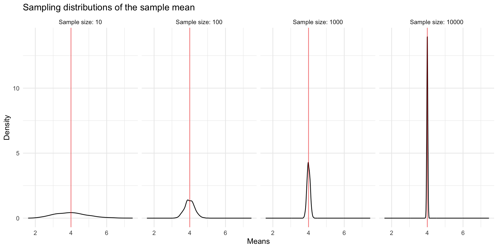

```
## 
## Attaching package: 'dplyr'
```

```
## The following objects are masked from 'package:stats':
## 
##     filter, lag
```

```
## The following objects are masked from 'package:base':
## 
##     intersect, setdiff, setequal, union
```

```
## Loading required package: xml2
```

```
## Loading required package: lattice
```

```
## Loading required package: ggformula
```

```
## Loading required package: ggstance
```

```
## 
## Attaching package: 'ggstance'
```

```
## The following objects are masked from 'package:ggplot2':
## 
##     geom_errorbarh, GeomErrorbarh
```

```
## 
## New to ggformula?  Try the tutorials: 
## 	learnr::run_tutorial("introduction", package = "ggformula")
## 	learnr::run_tutorial("refining", package = "ggformula")
```

```
## Loading required package: Matrix
```

```
## Registered S3 method overwritten by 'mosaic':
##   method                           from   
##   fortify.SpatialPolygonsDataFrame ggplot2
```

```
## 
## The 'mosaic' package masks several functions from core packages in order to add 
## additional features.  The original behavior of these functions should not be affected by this.
## 
## Note: If you use the Matrix package, be sure to load it BEFORE loading mosaic.
## 
## Have you tried the ggformula package for your plots?
```

```
## 
## Attaching package: 'mosaic'
```

```
## The following object is masked from 'package:Matrix':
## 
##     mean
```

```
## The following object is masked from 'package:ggplot2':
## 
##     stat
```

```
## The following objects are masked from 'package:dplyr':
## 
##     count, do, tally
```

```
## The following objects are masked from 'package:infer':
## 
##     prop_test, t_test
```

```
## The following objects are masked from 'package:stats':
## 
##     binom.test, cor, cor.test, cov, fivenum, IQR, median, prop.test,
##     quantile, sd, t.test, var
```

```
## The following objects are masked from 'package:base':
## 
##     max, mean, min, prod, range, sample, sum
```

# Randomness and Probability

Now that we have some intuition about random variability, we will formalize some of the concepts of probability and chance.

Recall the regression model we built to predict home price as a function of square footage and fireplaces in Section \@ref(multiple). 


```r
homes <- read.delim("http://sites.williams.edu/rdeveaux/files/2014/09/Saratoga.txt")
homes <- homes %>%
    mutate(AnyFireplace = Fireplaces > 0)
homes %>%
    ggplot(aes(x = Living.Area, y = Price, color = AnyFireplace)) + 
    geom_point(alpha = 0.25) +
    geom_smooth(method = "lm") +
    theme_minimal()
```

```
## `geom_smooth()` using formula 'y ~ x'
```


To allow for different slopes among homes with and without a fireplace, we used an interaction term between Living.Area and AnyFireplace. Based on our one sample, we observed a difference in the slopes of \$26.85 per square foot. 

But is this true for the larger population of homes in the area? Is each square foot worth exactly \$26.85 more, on average, in homes with a fireplace than in homes without a fireplace?


```r
lm.home3 <- lm(Price ~ AnyFireplace*Living.Area, data = homes)
tidy(lm.home3)
```

```
## # A tibble: 4 x 5
##   term                         estimate std.error statistic  p.value
##   <chr>                           <dbl>     <dbl>     <dbl>    <dbl>
## 1 (Intercept)                   40901.    8235.        4.97 7.47e- 7
## 2 AnyFireplaceTRUE             -37610.   11025.       -3.41 6.61e- 4
## 3 Living.Area                      92.4      5.41     17.1  1.84e-60
## 4 AnyFireplaceTRUE:Living.Area     26.9      6.46      4.16 3.38e- 5
```

Probably not. In fact, our sample is just one random sample from the larger population of homes in upstate New York. If we had gotten a slightly different sample of homes, then we would have different estimates for each of the regression coefficients. We explored this sampling variation in [Chapter 5](#randvariability) using bootstrapping.

Let's connect our goals to the terms **statistic**, **estimate**, and **parameter**. 

The interaction coefficient is a **statistic**. It (as well as the other coefficient estimates) is a numerical summary of our data that was estimated from a **sample**. The actual numerical value of the interaction coefficient in the R output is called the **estimate**. If we had a census, a full set of data on all homes in upstate New York, we could fit the same linear regression model. The coefficient estimates given to us by R would represent population **parameters** because they are computed from the whole population, rather than a sample. By understanding **how much** statistics vary from sample to sample, we can start to **quantify the amount of uncertainty** in our estimates. Because the process of obtaining a sample is a type of random process, we will spend some time discussing formal probability.

This chapter briefly discusses the theory of formal probability so that we have terminology and basic concepts to understand and discuss random events. This framework provides a way of thinking about **uncertainty**, **random variability**, and **average behavior in the long run.**

A **random process** or **random event** is any process/event whose outcome is governed by chance. It is any process/event that cannot be known with certainty. Examples range from the outcome of flipping a coin to the estimated model coefficients from randomly selected samples.

We've used the term "chances" up until now. We are now going to use "probability" as an equivalent word for "chance".

For a much more in-depth discussion of probability (calculus-based), take STAT/MATH 354 (Probability). 

## Three Types of Probability

<div class="reflect">
<p>What is the probability of rolling a 1 on a six-sided die? How do you know this? How can you justify that number?</p>
</div>

There are three types of probability.

1. **Empirical Probability:** If you could repeat a random process over and over again, you'd get a sense of the possible outcomes and their associated probabilities by calculating their relative frequency in the long run. If you repeatedly tossed a balanced die, then the relative frequency of 1's after tossing the die MANY times would be the empirical probability. If you repeatedly got a sample of 100 people, the relative frequency of estimated odds ratios below 1 would be the empirical probability of getting an odds ratio below 1. 

2. **Theoretical Probability:** If you don't have time to toss a die a million times, you could calculate probabilities based on mathematical theory and assumptions. When tossing a balanced die, you would assume that each side is equally likely to land face-up. Thus the chance of rolling a 1, is 1/6 for a six-sided die.

<div class="reflect">
<p>What is the probability that you’ll talk to someone you do not know this week? What does that number represent? How can you justify that number?</p>
</div>

3. **Subjective Probability:** If you use a number between 0 and 1 (100%) to reflect your uncertainty in an outcome (rather than based on empirical evidence or mathematical theory), then you are using subjective probability. 

In this class, we'll focus on theoretical and empirical probability. In particular, we will use computational tools to estimate empirical probabilities using simulations (such as bootstrapping and randomization tests) and mathematical tools to estimate theoretical probabilities. 

## Theoretical Probability Rules

To understand theoretical probability, we need to define a few terms and set some rules for working with probabilities (known as axioms).

The **sample space**, $S$, is the set of all possible outcomes of a random process.

- Example: If you flip two coins (each coin has one side Heads and one side Tails), then the sample space contains four possible outcomes: Heads and Heads (HH), Heads and Tails (HT), Tails and Heads (TH), and Tails and Tails (TT). That is, $S = \{HH,HT,TH,TT\}$.

A subset of outcomes is called an **event**, denoted as $A$. 

- Example: If you flip two coins, an event $A$ could be that exactly one of the coins lands Heads, $A = \{HT,TH\}$.

For events $A$ and $B$ and sample space $S$, the probability of an event $A$, notated as $P(A)$, follows the rules below:

- Rule 1: $0\leq P(A)\leq 1$ (probability has to be between 0 and 1)
- Rule 2: $P(S) = 1$ (one of the possible outcomes has to happen)
- Rule 3: $P(\text{not }A) = 1 - P(A)$ (if we know the chance of something happening, we also know the chance that it doesn't happen)
- Rule 4: $P(A\text{ or }B) = P(A) + P(B)$ if $A$ and $B$ are disjoint events.
    - $A$ and $B$ are **disjoint** if $A$ occuring prevents $B$ from occurring (they both can't happen at the same time).
- Rule 5: $P(A\text{ and }B) = P(A)\times P(B)$ if $A$ and $B$ are independent.
    - $A$ and $B$ are **independent** if $B$ occurring doesn't change the probability of $A$ occurring.
- Rule 4\*: $P(A\text{ or }B) = P(A) + P(B) - P(A\text{ and } B)$ in general
- Rule 5\*: $P(A\text{ and }B) = P(A \mid B)P(B) = P(B \mid A)P(A)$ in general
    - The **conditional probability** of A **given** that event B occurs, $P(A \mid B)$, is equal to the probability of the joint event (A and B) divided by the probability of B.
$$ P(A \mid B) = \frac{P(A \text{ and } B)}{P(B)} $$
    - Intuition: Given that $B$ happened, we focus on the subset of outcomes in $S$ in which $B$ occurs and then figure out what the chance of $A$ happening within that subset. 

For more details on theoretical probability, please see [Appendix A]. This material is optional but available for those of you who want to understand the mathematical reasoning behind the rest of the chapter.

### Diagnotic Testing and Probability

Let's start by taking a moment to consider a recent [Washington Post article](https://www.washingtonpost.com/news/posteverything/wp/2018/10/05/feature/doctors-are-surprisingly-bad-at-reading-lab-results-its-putting-us-all-at-risk/?utm_term=.73d08eefca3c) that discusses the role of probability in medical diagnostics. Before you read the whole article, consider a question.

<div class="reflect">
<p>Say that Disease X has a prevalence of 1 in 1,000 (meaning that 1 out of every 1,000 people will have it).</p>
<p>The test to detect Disease X has a false-positive rate of 5 percent (meaning that out of every 100 subjects who do not have Disease X, 5 will falsely test positive for it).</p>
<p>The test’s accuracy is 99 percent (meaning that out of every 100 who do have Disease X, 99 will correctly test positive for it).</p>
<p>If a patient’s test result comes back positive, what is the probability that this patient actually has the disease?</p>
</div>

If you said the probability is 95%, then you are wrong, but almost half of the doctors surveyed in 2014 thought exactly the same thing.

We can use the rules of probability to get a sense of what the desired probability actually is. We want to know the probability that they have the disease GIVEN that they got a positive test result, $P(D \mid +)$, where $D$ stands for disease and $+$ stands for positive test result.

Based on the definition of conditional probability, we must consider only those that got a positive test result back and look at the proportion of them that have the disease. In mathematical notation, that is equal to

$$P(D \mid +) = \frac{P(D \text{ and } +)}{P(+)}$$

What information were we given again?

- The prevalence of the disease is 1 in 1,000, so $P(D) = 1/1000$. Using Rule 3, the probability of no disease is $P(\text{no }D) = 999/1000$. In 1000 people, 1 will actually have the disease and 999 won't have the disease.

- The false-positive rate is 5 percent, so given that you don't have the disease, the probability of getting a false positive is $P(+ \mid\text{ no } D) = 0.05$. So of the 999 that don't have the disease, about $0.05\times 999 = 49.95$ (about 50) of them will get a false positive test result.

- While it is not stated directly in the Washington Post article, most medical tests have a fairly high accuracy in catching the disease. For example: $P(+ \mid D) = 0.99$. Therefore, the 1 person who actually has the disease will most likely get a positive test result back ($0.99*1 = 0.99$).

Remember that our interest is in $P(D \mid +)$. By the definition of conditional probability, we consider only those with positive test results (about 50 who are disease free and 1 who has the disease). So the probability of actually having the disease GIVEN a positive test result is about 1/51 = 0.019. This is not close to 95%!

In mathematical notation, that looks like this

\begin{align*}
P(D \mid +) &= \frac{P(D \text{ and } +)}{P(+)} &\text{Rule 5*}\\
&= \frac{P(D \text{ and } +)}{P(+ \text{ and } D) + P(+ \text{ and no } D)} &\text{2 ways you can get +}\\
&= \frac{P(+ \mid D) P(D)}{P( + \mid D) P(D) + P( + \mid \text{ no }D) P(\text{no }D)} &\text{Rule 5*}\\
&= \frac{0.99*1/1000}{0.99*1/1000 + 0.05*999/1000} &\text{Plug in values}\\
&= \frac{0.99*1}{0.99*1 + 0.05*999} &\text{Simplify and evaluate}\\
&= 0.019
\end{align*}


The third line above ($P(D \mid +) = \frac{P(+ \mid D) P(D)}{P( + \mid D) P(D) + P( + \mid \text{ no }D) P(\text{no }D)}$) is often called **Bayes' Rule**. The important idea to take from this is that what we condition on can make a big difference in the resulting probability.

Now, take some time to read the full [Washington Post article](https://www.washingtonpost.com/news/posteverything/wp/2018/10/05/feature/doctors-are-surprisingly-bad-at-reading-lab-results-its-putting-us-all-at-risk/?utm_term=.73d08eefca3c).

### Court Arguments and Probability

The concept of conditional probability also plays an important role in the judicial system in the U.S. The foundation of the judicial system is the concept of "innocent until proven guilty". Decisions are supposed to be based from a point of view of assuming that the defendant is innocent. Thus, jurors are supposed to decide the chances of seeing this evidence assuming innocence. That is, evidence is presented to jurors as the conditional probability: $P(\text{ evidence } \mid \text{ innocent })$.

Unfortunately, many prosecutors try to make the wrong argument by flipping the conditional probability, whether maliciously or due to a lack of statistical knowledge. They sometimes mistakenly try to argue that it is unlikely that a person is innocent given the evidence that is presented, $P(\text{ innocent } \mid \text{ evidence })$. 

This can be dangerous. We know that $P(\text{ evidence } \mid \text{ innocent }) \not = P(\text{ innocent } \mid \text{ evidence })$ based on the disease testing example above.  Generally, $P(A \mid B)$ is not equal to (and can be very different from) $P(B \mid A)$.

This is known as the prosecutor's fallacy. You can read more about it [here](https://en.wikipedia.org/wiki/Prosecutor%27s_fallacy).


## Random Variable

With a basic understanding of theoretical probability rules, we can introduce the most important concept from probability for our uses in this class: a random variable.

A **random variable** ($X$) is variable whose outcome (the value it takes) is governed by chance. In other words, it is a variable (something capable of taking different values) whose value is random. Examples include:

- $X =$ age of the next person to walk into the building
- $X =$ the number of dots on the side that lands face up on a balanced 6-sided die

When considering data analysis and modeling, the random variables we will be considering will be estimated regression coefficients, estimated odds ratios, etc. Why are these random variables? Because their values depend on the random samples that we draw. To establish our understanding, let's start with a simple example.

You are going to flip a fair coin 3 times (the coin has 2-sides, we'll call one side Heads and the other Tails).

- Assume there are only 2 possible outcomes and $P(\text{Heads}) = P(\text{Tails}) = 0.5$ (the coin can't land on its side).
- Below are three possible random variables based on the same random process (flipping a 2-sided coin 3 times):

- **Example 1**: $X =$ the number of heads in 3 coin flips
    - What are the possible values of $X$? 0, 1, 2, or 3.

- **Example 2**: Say you get 3 dollars for each Head
    - $Y =$ the amount of money won from 3 coin flips, $Y = 3*X$
    - The possible values of $Y$ are 0, 3, 6, or 9.

- **Example 3**: $Z =$ the number of heads on the last of the 3 coin flips
    - The possible values are 0 or 1.

What might you want to know about these random variables? In general, we'd like to know the probability model (what values it takes and the associated chances), the expected value (long-run average), and the variance (a measure of how much the values vary). Let's talk about each of these next.

## Probability Models

The **probability model** for a random variable $X$ gives the possible values of $X$ and the associated probabilities. 

- What is the probability model for $X$: the number of heads in 3 coin flips?

$P(X = 0) = P(\text{three tails}) =  0.5^3$ (using Rule 5: independence)

$P(X = 1) = P(\text{HTT or THT or TTH }) = 3*0.5^3$ (using Rule 4: disjoint events & Rule 5)

$P(X = 2) = P(\text{HHT or HTH or THH }) = 3*0.5^3$ (using Rule 4 & 5)

$P(X = 3) = P(\text{three heads}) = 0.5^3$ (using Rule 5)

- What is the probability model for $Y = 3*X$? (The total number of dollars earned when \$3 is paid for each head.)

$P(Y = 0) = P(\text{three tails}) =  0.5^3$ 

$P(Y = 3) = P(\text{HTT or THT or TTH }) = 3*0.5^3$ 

$P(Y = 6) = P(\text{HHT or HTH or THH }) = 3*0.5^3$ 

$P(Y = 9) = P(\text{three heads}) = 0.5^3$

- What about $Z$? (The number of heads on the last of the 3 coin flips)

$P(Z = 0) = P(\text{HHT or TTT or HTT or THT}) =  4*0.5^3 = 0.5$ (using Rules 4 & 5)

$P(Z = 1) = P(\text{HHH or TTH or HTH or THH}) = 4*0.5^3 = 0.5$ (using Rules 4 & 5)

For most situations in our class, we won't use the probability rules to calculate chances by hand. Rather, we will use a **named probability model** such that the we can calculate probabilities for particular values of the random variable using either:

- a **probability mass function (pmf)** (for a finite number of possible values) or 
- a **probability density function (pdf)** (for a infinite number of possible values)

### Using probability mass functions

Let's say that we are working with a random variable $X$ that represents the result of spinning the arrow on a spinner that has 3 regions labeled 1, 2, and 3. $X$ can only takes the values 1, 2, or 3. 

The **probability mass function (pmf)** for $X$ gives the probabilities that $X=1$, $X=2$, and $X=3$ which are determined by the relative areas of the regions on the spinner. The pmf for $X$ is frequently denoted as $p(x)$, which is shorthand for $P(X = x)$. Based on the construction of our spinner, the pmf can be denoted with a table like the one below:

|    $x$ |  1  |  2  |  3  |
|-------:|:---:|:---:|:---:|
| $p(x)$ | 0.4 | 0.5 | 0.1 |


The first row indicates the values that $X$ can take. The second row indicates the associated probabilities, the values of the probability mass function. Note that this row adds up to 1 because one of these 3 outcomes must happen.

We can use the pmf and the probability rules introduced earlier to calculate probabilities of different events.

**Example 1:** $P(X = 1 \text{ or } 2)$

Because the events $X = 1$ and $X = 2$ are disjoint (mutually exclusive/can't happen simultaneously), this probability is equal to $P(X = 1) + P(X = 2) = 0.4 + 0.5 = 0.9$. (Rule 4)

**Example 2:** $P(X \neq 1)$

By Rule 3, $P(X \neq 1) = 1 - P(X = 1) = 1 - 0.4 = 0.6$. Another way to arrive at this would be to see that $P(X \neq 1) = P(X = 2 \text{ or } 3) = P(X = 2) + P(X = 3) = 0.5 + 0.1$.

### Using probability density functions

When a random variable can take infinitely many values (i.e. a quantitative variable), using a probability mass function will not work because we would have to specify infinitely many probabilities. A **probability density function (pdf)** serves an analogous role to probability mass functions but works for quantitative variables that can take infinitely many values.

We have looked at density plots previously when we learned about data visualization. These were smooth curves that showed us the distribution of quantitative variable. In this class, the probability density functions that we will look at will be smooth curves. One example of a pdf for a famous named probability model (called the Normal distribution) is shown below:


There are two main ideas that you should be comfortable with when working with quantitative random variables:

1. With a quantitative random variable $X$, we are interested in the probability that $X$ falls in a certain range. Examples include $P(X > 3), P(X < -5), P(-1 < X < 1)$.
2. The calculation of such probabilities is achieved by looking at areas underneath the probability density function within that range ("the area under the curve").

The pictures below illustrate how different probability statements correspond to different areas beneath the pdf curve.


### Expected value and variance

Two important properties of a random variable $X$ are its **expected value** and **variance**.

The **expected value** of a random variable is a real number and gives a measure of the typical value that the random variable takes or the long-run average if you could repeat the random process many times. For a mathematical definition, you can look at the [probability appendix][Appendix A] in these notes. Generally speaking, an expected value is a weighted average of the values that the random variable can take, weighted by the probability of getting that value. If, for example, $X$ has a very high probability to take the value 9, then 9 will be weighed more heavily in the average.

**Why do we care about expected value?** Remember that the random variables that we will be concerned with are quantities such as estimated slopes from linear regression. This estimated slope is a (quantitative) random variable because its value depends on the random sample that we drew. Because it is a random variable, it has an associated probability density function which tells us how this estimated slope would vary across different samples of the same size. This distribution is called a **sampling distribution**, and expected value tells us the mean (center) of this distribution. When we take simple random samples from the population, the expected value is usually equal to the true target population value that we are trying to estimate from our sample. *This is a powerful idea because the statistic we compute from our one sample is, on average, a good estimate for the population parameter.*

The **variance** of a random variable is very much related to the variance of a set of numbers that was introduced as a measure of spread/variation/variability. Recall that variance as a measure of spread is approximately the average of the squared distances of each data point to the mean. The variance of a random variable follows in very much the same spirit. It gives the average squared distance of the random variable from its expected value. The variance of a random variable, like the variance of a set of numbers, measures how spread out the values of the random variable could be, but weighted according to the probability of the value. The standard deviation of a random variable is the square root of the variance. 

**Why do we care about the variance of a random variable?** The spread of the **sampling distribution** is measured by the variance of the associated random variable. If the sampling distribution is very spread out, then our estimates could differ quite a bit from sample to sample. This means that there is a lot of uncertainty in our estimate. For example, we may have estimated a slope of 3 from our linear regression model, but if we have high variance, that slope could easily have been 7 or -2 depending on the particular sample we draw. *The variance of an estimated regression slope quantifies how much our estimate could vary from sample to sample, which will allow us to give reasonable margins of error on our estimates.*

Wait! These ideas are fine in theory...but how do we actually use them? 

It turns out that many random variables that we've worked with so far are approximated well by **named probability distributions** that allow for theoretical calculations of expected value and variance. This theory means that we don't have to go out and collect random sample after sample to get a sense of sampling variability. Statistical theory gives us a way to understand/approximate how our estimates vary from sample to sample using mathematics. This process is based on **theoretical probability** rather than on bootstrapping which was giving us the same type of information but through **empirical probability** that we calculated using computational tools.


## Bernoulli/Binomial Model

There are situations in which your response of interest only has two possible outcomes: success or failure, heart disease or no heart disease, o-ring failure or no o-ring failure, etc. In the past, we used logistic regression to create a model to predict a binary response variable based on explanatory variables. For a moment, let's just consider the response itself as a random process. 

If a random process satisfies the following three conditions, then we can use the **Bernoulli Model** to understand its long-run behavior:

1. Two possible outcomes (success or failure)
2. Independent "trials" (the outcome for one unit does not depend on the outcome for any other unit)
3. P(success) = $p$ is constant (the relative frequency of success in the population that we are drawing from is constant)

If a random variable $X$ follows a Bernoulli model, $X$ denotes the number of successes (0 or 1) in the single trial that is conducted. The probability mass function is $P(X = 1) = p$ and $P(X = 0) = 1-p$. In the long run, the expected number of successes will be $p$, the variance will be $p(1-p)$, and the standard deviation will be $\sqrt{p(1-p)}$. If you have looked through the [Appendix A], you can show this mathematically using definitions. 

Let's think back to the disease testing example. Say we have a very large population where 1 in every 1000 has a particular disease ($p = 1/1000$). We could model the disease outcome from randomly drawing an individual from the population using a Bernoulli Model where $P(X = 1) = 0.001$. If we just randomly drew 1 person, we'd expect 0.001 of a person to have the disease and the spread in outcomes is $\sqrt{0.001*0.999} = 0.031$. These values don't make a lot of sense because we often sample more than one person.

Imagine we had a sample of $n$ individuals from the population. Then we are considering $n$ independent Bernoulli "trials". If we let the random variable $X$ be the count of the number of successes in a sample of size $n$, then we can use the **Binomial Model.** In this case we say that "$X$ follows a binomial distribution".

The probability mass function for the Binomial Model is

$$p(x) = P(X = x) = \frac{n!}{x!(n-x)!}p^x(1-p)^{n-x}$$

where $x$ is the number of successes in $n$ trials. In the long run, the expected number of successes will be $np$, the variance will be $np(1-p)$, and the standard deviation will be $\sqrt{np(1-p)}$. In the long run, the expected relative frequency of successes in $n$ trials will be $p$, the variance will be $\frac{p(1-p)}{n}$ and the standard deviation will be $\sqrt{\frac{p(1-p)}{n}}$. If you are working through the [Appendix A], you can show these mathematically using known properties.  

If we randomly draw 5000 people, we'd expect $0.001*5000 = 5$ people to have the disease and the spread in the count is $\sqrt{5000*0.001*0.999} = 2.23$. Let's adjust this to relative frequencies. We'd expect 0.1% (5/5000 = 0.001) of the people to have the disease and a measure of the variability in relative frequency is $\sqrt{0.001*0.999/5000} = 0.0004$.


Let's look at the probability mass function for the Binomial Model for $n = 10, p = 0.01$.


If we increase the sample size to $n = 500$, then the probability mass function looks like this.


Let's zoom in on the left hand side of this plot.


What does this look like? A Normal Model!!!


## Normal Model

We've been introduced to the Normal model already as a smooth version of a unimodal, symmetric histogram. For a quantitative random variable $X$ (whose value can be any real number), if the expected value is $\mu$ and the variance is $\sigma^2$, a Normal random variable has a probability density function of
$$f(x) =  \frac{1}{\sigma\sqrt{2\pi}}e^{-\frac{(x-\mu)^2}{2\sigma^2}}$$

For every potential value of $\mu$ and $\sigma$, there is a different function/curve. Some examples are shown below.


If a random variable $X$ is modeled with a Normal model, we also say that "$X$ follows a normal distribution" or that "$X$ is normally-distributed".

- In general, the center of the distribution is $\mu$ and the standard devation $\sigma$, the square root of the variance, determines the spread of the distribution.


- Let's consider the particular Normal model with $\mu=0$ and $\sigma=1$. This is called the **standard normal distribution**. We know that $P(-1\leq X \leq 1) = 0.68$, which is calculated as the area under the curve between -1 and 1.


```r
pnorm(1) - pnorm(-1) 
```

```
## [1] 0.6826895
```

```r
#pnorm(1) gives the area under the curve to the left of 1
#pnorm(-1) gives the area under the curve to the left of -1
```

- We know that $P(-2\leq X \leq 2) = 0.95$, calculated as the area under the curve between -2 and 2.


```r
pnorm(2) - pnorm(-2)
```

```
## [1] 0.9544997
```

- We know that $P(-3\leq X \leq 3) = 0.997$, calculated as the area under the curve between -3 and 3.


```r
pnorm(3) - pnorm(-3)
```

```
## [1] 0.9973002
```

The standard normal distribution is very convenient to work with. No matter what the long-run average $\mu$ and standard deviation $\sigma$ are for a normally-distributed random variable $X$, we can standardize the values to obtain **z-scores** by subtracting $\mu$ and dividing by $\sigma$:

$$\text{z-score} = \frac{X - \mu}{\sigma}$$


We typically denote z-scores with $Z$. It turns out that $Z$ follows a standard normal distribution. That is $\mu=0, \sigma=1$ for $Z$. This allows us to focus solely on the areas for the standard normal distribution rather than the particular normal distribution with mean $\mu$ and standard deviation $\sigma$.


**Important**: If a random variable can be modeled with a Normal model, then we know that:

- About 68% of the time, the values will be within 1 standard deviation of the expected value.
- About 95% of the time, the values will be within 2 standard deviations of the expected value.
- About 99.7% of the time, the values will be within 3 standard deviations of the expected value.

We will call this the **68-95-99.7 rule**.


## Sampling Distribution and CLT

### Sampling distributions

As we wade through the formal theory, let's remind ourselves why we need to understand randomness and the tools of formal probability.

We appreciate that our estimates will vary from sample to sample because we have different units in each sample. We care about *how much* they can vary because we want to *quantify* the amount of uncertainty in our estimates. Sure, we may use linear regression modeling to find that the estimate for an interaction coefficient is \$26.85, but how different could that estimate have been if we had obtained a different sample (of the same size)?

The **sampling ditribution** of a statistic (e.g. sampling distribution of the sample mean, of the sample median, of a regression coefficient) tells us exactly how that statistic would vary across all possible samples of a given size. For example, in our New York housing data (1728 homes), the sampling distribution for the interaction coefficient tells us exactly the distribution of interaction coefficient estimates that result from all possible samples of size 1728 *from the population of New York homes*. This distribution is centered at the true value of the population interaction coefficient (the value we would get from linear modeling if we did indeed use the full population). The spread of the distribution gives us a measure of the precision of our estimate. If the sampling distribution is very wide, then our estimate is imprecise; our estimate would vary widely from sample to sample. If the sampling distribution is very narrow, then our estimate is precise; our estimate would not vary much from sample to sample.

The emphasis on "from the population of New York homes" when defining the sampling distribution earlier is deliberate. We don't have the population, and we never will (usually)! The sampling distribution is a theoretical idea, but we wish to know what it looks like because we care about the precision of our estimate. We have done our best to estimate the center of the sampling distribution: our best guess is the sample estimate itself. For our housing data, we estimate an interaction coefficient of $26.85. This is our best guess for the center of the sampling distribution. What about the spread?

We have looked at one way to estimate the spread of the sampling distribution: bootstrapping! In bootstrapping, we pretend that our sample is the population and look at lots of different samples from this "fake population". In bootstrapping, we have essentially tried to replicate the idea of getting "all possible samples of a given size from the population".

### The Central Limit Theorem

Another powerful way to understand what the sampling distribution looks like is called the **Central Limit Theorem**. This is a famous theorem in Statistics that can be stated as follows.

**Central Limit Theorem (CLT)**: Let $X_1, X_2, \ldots, X_n$ be random variables that denote some value measured on each of $n$ units in a random sample. Let $\bar{X}_n = n^{-1}\sum_{i=1}^n X_i$ denote the sample mean of those values. Let all of the random variables $X_1, \ldots, X_n$ have the same expected value $\mu$ and variance $\sigma^2$. Then as the sample size $n$ get bigger and bigger (grows to infinity), the sample mean $\bar{X}_n$ becomes normally-distributed with mean $\mu$ (the true expected value) and variance $\sigma^2/n$.

What does the CLT tell us? It tells us that with a "sufficiently large" sample size, the sample mean is normally-distributed with a particular mean and variance. This tells us exactly what the sampling distribution is! The center and shape of the sampling distribution are given by a named probability model, the Normal distribution! Let's focus on the implications of these two parameters:

- The mean: The CLT says that for large samples the sample mean is normally distributed with mean $\mu$. $\mu$ is the actual expected value of the random variables! This tells us that the sample mean estimates the population mean correctly, on average. For example, let's say that the $X$'s are house prices, and we want to know the true population mean of house prices. The CLT tells us that, **on average**, the sample mean will be correct! Another way to say this is that the sample estimates are "unbiased": underestimates are balanced out by overestimates.
- The variance: The CLT says that for large samples the sample mean is normally distributed with variance $\sigma^2/n$. Equivalently, the standard deviation is $\sigma/\sqrt{n}$. This tells us the spread of the sampling distribution! Sample estimates are more likely to be "close to" than "far from" the population parameter $\mu$. We see that the sample size $n$ plays a key role. The larger the sample size, the smaller the spread. This matches our intuition that larger samples should generate more **precise** estimates. In practice, we estimate $\sigma$ and refer to this estimated standard deviation as the **standard error**.

**Where does the CLT come up in practice?** When we fit linear regression and logistic regression models, there were columns in the summarized output labeled "Std. Error". We have neglected to look at these columns...until NOW. With our understanding of the CLT, we can understand where this column comes from. It turns out that we can apply the CLT to see that our estimated regression coefficients (our betas) are normally-distributed. That is, the theory of the CLT allows us to approximate the sampling distributions of regression coefficients. Behind the scenes, R uses that theory to give us the Standard Error column. This column gives us an estimate of the standard deviation of the sampling distribution for that regression coefficient.

Let's visualize what is happening with the Central Limit Theorem. Below we have simulated (generated ourselves) data for a full population of cases. The distribution of values in the full population is shown below. The true population mean (expected value) is 4. Beneath, we show the sampling distributions of the sample mean for different sample sizes. We see the CLT in action. The center of the sampling distributions is the expected value 4. The sampling distributions look normally distributed, and the spread decreases with sample size. Note that the original population values do not look normally-distributed, and yet, by the CLT, the sample means are normally-distributed.



Let's look at one more example. Again, the population distribution is clearly not normally-distributed, and yet, the sample means are normally-distributed. These normal distributions are centered at the true population mean (expected value) and have smaller and smaller spread with increased sample size.


The different ways in which we think about sampling variability in Statistics are shown in the figure below.


## Z-scores and the Student's "t" distribution

Let's stop for a short story time. Back in the early 1900's, William S. Gosset was working as a quality control chemist and mathematician for Guinness Brewery in Ireland.


Source: [Wikipedia](http://upload.wikimedia.org/wikipedia/commons/thumb/4/42/William_Sealy_Gosset.jpg/240px-William_Sealy_Gosset.jpg)


His research goal was to determine how to get the best yielding barley and hops through agricultural experimentation, but the main issue that he had was that he had very small sample sizes (only a handful of farms)!

He was used the Normal distribution because the work underlying the Central Limit Theorem had already been worked out, but he noticing that there were discrepancies in his work. 


### Gosset's Work

To further investigate the issues that he was noticing, Gosset performed a simulation using data on the height and left middle finger measurements of 3000 criminals (we don't know how he got access to this data...). His simulations went as follows:

- Split the data (3000 criminals) into samples of size 4 ($n=4$)
- Estimate the mean and standard deviation of the height within each of the 750 samples 
- Look at the distribution of the *z* score heights, using the mean of the 3000 as the true population mean, $\mu$, but using $s$ in the denominator from each sample instead of the population variation, $\sigma$, of the 3000:

$$ z = \frac{\bar{x} - \mu}{s/\sqrt{4}}$$


- Does this distribution of z-scores look Normal? We can try to see more clearly by making a **Q-Q plot**, shown below.


If the z-scores follow a normal distribution, the points in the Q-Q plot should fall on a straight line. However, we see some deviation at the left and right of the plots. This indicates that the tails of our z-score distribution are thicker (more populous) than expected if they were actually normally-distributed. 

Why? With small samples, the sample standard deviation, $s$, is smaller so we tend to get larger z-scores than we'd expect if they were normally-distributed.


### Beer Helps the Field of Statistics

For the sake of making better beer, William Gosset worked out the sampling distribution of a standardized sample mean (with the *sample* standard deviation, $s$, plugged into the denominator),

$$t = \frac{\bar{x} - \mu}{s/\sqrt{n}}$$

if the histogram of the **population is unimodal and roughly symmetric** (approximately Normal). This was crucial when **sample sizes are small.** He had to publish under the pseudonym **Student** (trade secrets, etc.). Thus, the sampling distribution model that he discovered became known as **Student's model.** Later R.A. Fisher (another famous statistician) recoined it as the **Student's T model.**

### Student's T Model

- The center is always 0.
- The spread is determined by a parameter called **degrees of freedom** (for standardized means, $df = n - 1$).
- As $n\rightarrow\infty$, this model looks more like the Normal model. 


Since the Student T distribution is approximately Normal when sample sizes are large, we will typically use the Normal model. However, if sample sizes are small ($n<30$ or so), the Normal model is not appropriate. So, in those rare cases, we'll need to refer to Student's T.


## Chapter 6 Major Takeaways

- The two common ways we'll think about probability is empirical probability (imagining repeated a random process over and over again; the probability of an event is the relative frequency of that event happening) and theoretical probability (based on axioms and mathematical theory).

- Theoretical probability is based on a few axioms (rules) that should always be true. 

    - Rule 1: $0\leq P(A)\leq 1$ (probability has to be between 0 and 1)
    - Rule 2: $P(S) = 1$ (one of the possible outcomes has to happen)
    - Rule 3: $P(\text{not }A) = 1 - P(A)$ (if we know the chance of something happening, we also know the chance that it doesn't happen)
    - Rule 4: $P(A\text{ or }B) = P(A) + P(B) - P(A\text{ and } B)$ in general
    - Rule 5: $P(A\text{ and }B) = P(A \mid B)P(B) = P(B \mid A)P(A)$ in general
    
- A random variable ($X$) is a variable whose value is random.
        
    - We can write out the probability model for a random variable by listing the possible values and the associated probabilities. 
    - The expected value of a random variable $X$ is the long-run average, calculated as the sum of the values, weighted by their chances.
    - The variance of a random variable $X$ is the variability in the long-run, calculated as the long-run average of the squared deviation from the expected value. 
        
- A set of Bernoulli Trials include a sequence of random variables $X_1,....,X_n$  where the random variables $X_j$
        
    - have only two outcomes (success = 1, failure = 0)
    - are independent of each other (value of one doesn't impact the chances for the next)
    - have constant chance of success, $p$

- The sum of those random variables, $X = \sum_{j=1}^n X_j$, is a Binomial Random Variable, which reflects the count of successes

    - The probability of $X = x$ counts is $P(X = x) = \frac{n!}{x!(n-x)!} p^x(1-p)^{n-x}$
    - Expected Value of Count of Successes: $E(X) = np$
    - Variance of Count of Successes: $Var(X) = np(1-p)$
    - Expected Value of Proportion of Successes: $E(X/n) = p$
    - Variance of Proportion of Successes: $Var(X) = p(1-p)/n$
    - As $n$ increases, the variance of the proportion decreases!
    - As $n$ increases, the Binomial probabilities resemble a Normal curve!
        
- If a random variable $X$ can take any value on a number line (e.g. 1.01, 2.33333,...) and that variable has a symmetric, unimodal distribution, then we might say that it is a Normal Random Variable.
        
    - With $X$ following a standard normal distribution (mean = $\mu$ = 0, standard deviation = $\sigma$ = 1), we know that $P(-1\leq X \leq 1) = 0.68$, $P(-2\leq X \leq 2) = 0.95$, and $P(-3\leq X \leq 3) = 0.997$.
    - If $X$ follows a normal model with $\mu$ and $\sigma$, then $\frac{X-\mu}{\sigma}$ follows a standard normal distribution.
        
- A sampling distribution of a statistic tells us exactly how that statistic would vary across all possible samples of a given size.
    
    - The central limit theorem tells us that the sampling distribution of a sample mean, $\bar{X} = \frac{1}{n}\sum_{i=1}^n X_i$, is approximately Normal with mean = population mean, $\mu$, and standard deviation = population standard deviation  divided by the square root of the sample size, $\sigma/\sqrt{n}$
        

- When the sample size is small $n<30$, we need to consider William Gosset's work because $\frac{\bar{X} - \mu}{s/\sqrt{n}}$ is not quite Normally distributed!
